# twit システム企画書

---

## 目次

1. [概要](#概要)
2. [背景](#背景)
3. [課題](#課題)
4. [解決手法](#解決手法)
5. [要求と外部仕様](#要求と外部仕様)
6. [非機能要件](#非機能要件)
7. [インフラ構成要件](#インフラ構成要件)
8. [ビジネスモデルキャンバス](#ビジネスモデルキャンバス)
9. [マネタイズモデル](#マネタイズモデル)
10. [ドメイン設計](#ドメイン設計)
11. [上流図セット](#上流図セット)
12. [マイルストーンと計画](#マイルストーンと計画)
13. [付録](#付録)

---

# 概要

## 企画の要約

- 何を作るか: WitWire社のオウンドSNS twit を witwire.co.jp で提供する。社内交流SNSを基盤に、承認フローを介して社外公開とActivityPub連合、ブログ風オウンドメディア、簡易コーポレート情報を統合する。
- 誰のためか: 社内の交流参加者、運営管理者、社外の閲覧者、連合先のリモートユーザー。
- なぜ今か: WitWire社の実力とユーモアを示すPoC兼実プロダクト兼LPを早期に形にし、コーポレートサイトにSNS機能が備わる面白さと、分散型SNSの知見の深さを自然に示すため。さらに witwire.co.jp の co.jp ドメインで連合することで、信頼性の強さと話題性を同時に作りたい。
- 期待する成果: 社内の交流が活性化し、承認済みの発信が継続的に外部へ届く。WitWire SI 展開で提示できる参照実装と運用ノウハウが蓄積される。

## 目的

- 目的1: 社内交流の場を作る。雑談、趣味、アイデア共有を中心とし、心理的安全性を確保する。
- 目的2: 社内で生まれた発信を、承認フローで品質と漏洩リスクを管理しながら社外へ届ける。

## 対象範囲

- 対象: witwire.co.jp 上のtwitサービス。公開Web、認証必須Web、公開API、認証必須API、運営管理UI、ActivityPub連合。
- 境界: witwire.net の本格コーポレートサイトは別管理で別途公開予定。twit側は About と Business の簡易ページと、投稿・記事の公開表示に限定する。

## 非対象

- 非対象1: twit を WitWire プラットフォームそのもののドックフーディングとみなす運用。
- 非対象2: 業務連絡の一次手段としての利用。障害連絡、納期調整、業務指示などの公式連絡をtwitで行わない。

## 成功指標

| 指標                       |     目標値 | 計測方法               | 計測頻度 | オーナー  |
| -------------------------- | ---------: | ---------------------- | -------- | --------- |
| 社内の週間投稿数           | 週20件以上 | 投稿イベント集計       | 週次     | Admin     |
| 社内の週間アクティブ率     |    60%以上 | 週次ログインと投稿閲覧 | 週次     | Admin     |
| 公開投稿数と公開記事数     |  週3件以上 | Public生成数           | 週次     | Publisher |
| 公開承認の平均リードタイム | 24時間以内 | 申請から承認までの差分 | 週次     | Publisher |
| 連合配送成功率             |  99.0%以上 | 配送ログの成功率       | 日次     | Moderator |

## ステークホルダー

| 区分           | 組織    | 役割            | 期待                     | 意思決定             |
| -------------- | ------- | --------------- | ------------------------ | -------------------- |
| 事業オーナー   | WitWire | 企画責任        | 発信と制作事例の最大化   | 採用判断、優先度     |
| 運営           | WitWire | 管理者          | 安全で継続可能な運用     | ルール策定、停止判断 |
| 発信編集       | WitWire | Publisher       | 品質担保と承認フロー運用 | 公開可否             |
| モデレーション | WitWire | Moderator       | 健全性維持               | 削除、凍結           |
| 社内利用者     | WitWire | Member          | 楽しい交流の場           | 利用規約同意         |
| 社外閲覧者     | 外部    | Visitor         | 記事と発信の閲覧         | なし                 |
| 連合先         | 外部    | Remote instance | 連合による相互購読       | 連合可否             |

## 前提条件

- ドメインは witwire.co.jp。
- BEはGolang。
- FEはSvelteKitで構築。
- 公開部分は原則SSR。認証部分は原則CSR。
- backend は単一の Gin app として扱い、公開リソースは `/api/*`、認証必須リソースは `/api/app/*`、frontend は単一の SvelteKit app 内で公開ルートと認証ルートを分離し、認証ルートは `/app/*` 配下に配置する。
- DBはAWS RDS PostgreSQL（db.t4g.micro）。
- キャッシュはValkey（EC2 t4g.smallに同居）。
- 検索はAWS OpenSearch（t4g.small.search）。
- オブジェクト保存はCloudflare R2。
- エッジはCloudflare CDN and WAF。ルーティング補助にCloudflare Workers。
- BEサーバーはAWS EC2 t4g.small。
- メール送信はAWS SESのSMTPを利用する。

## 制約

- 社内交流SNSは社内交流が目的であり、業務連絡目的では利用してはならない。
- Circleは社内交流SNS限定機能とし、Circle内の内容は外に出さない。
- PublicはWeb公開とActivityPub連合が一体であり、連合の有無をユーザーが選択しない。
- Publicにできるのは承認済みコンテンツのみ。投稿者本人は承認できない。
- ActivityPub連合はMisskey完全互換を正とし、Misskey互換ゆえのMastodon互換とする。
- Public以外は連合させない。
- 連合対象のポスト、引用、リアクションは公開許可済み絵文字のみ使用できる。

## リスクと対策

| リスク             | 影響               | 発生確率 | 兆候                       | 予防策                                           | 代替策                         | オーナー  |
| ------------------ | ------------------ | -------- | -------------------------- | ------------------------------------------------ | ------------------------------ | --------- |
| 社内情報の誤公開   | 信頼失墜           | M        | 公開申請の増加、差し戻し増 | Circle外部化不可、承認制、公開互換バリデーション | 公開停止、該当投稿の撤回と周知 | Admin     |
| 業務連絡に使われる | 重要連絡の逸失     | M        | 障害連絡が投稿される       | 投稿画面で注意喚起、ガイド整備、モデレーション   | 公式連絡手段へ誘導、投稿削除   | Moderator |
| 連合トラブル       | ブロック、到達不良 | M        | 配送失敗増、苦情           | Misskey互換のwire徹底、レート制限、リトライ制御  | 特定インスタンスの配送停止     | Moderator |
| なりすまし、荒らし | 運用負荷増         | M        | 通報増、スパム増           | Guest制限、レート制限、WAF、凍結機能             | 一時閉鎖、招待制へ切替         | Admin     |
| 検索負荷増大       | 体験悪化           | M        | p95悪化                    | OpenSearch設計、インデックス最適化               | 一時的に検索機能制限           | Tech      |

---

# 背景

## 現状

- 現状の業務とシステム: 社内はチャットやドキュメントで連絡は可能だが、雑談や遊びの場が分断されがち。社外発信は複数SNSやブログに散らばり、承認や品質担保の導線が弱い。
- 現場で起きていること: 発信のネタは社内で生まれるが、外部に出すまでに摩擦がある。内容の取り違えや誤送信の懸念で発信が止まる。

## 発端

- きっかけ: WitWire社の実力とユーモアを示す、PoC兼実プロダクト兼LPが欲しいという発想から始まる。
- 着想: コーポレートサイトにSNS機能が備わっていたら面白く、分散型SNSに対して高度な知見があるという強みを自然に表現できる。
- 連合の狙い: witwire.co.jp の co.jp ドメインで連合したら、信頼性最強で面白いという文脈を作れる。
- 方針: witwire.net のコーポレートサイトとは別に、witwire.co.jp 上に社内交流と社外発信をつなぐオウンドSNS（twit）を設計する。
- 補足: witwire.net の別コーポレートサイトは別途公開予定であり、twitはそれを置き換えるものではない。

## 期待される価値

- 価値1: 社内交流の活性化。雑談と創発を増やし、文化を育てる。
- 価値2: 発信の継続性。承認フローで安全性を担保しながら、社外へ発信を流し続ける。

---

# 課題

## 課題一覧

| 課題ID | 課題                               | 具体例                   | 根本原因                       | 影響範囲 | 重要度 | 優先度 |
| ------ | ---------------------------------- | ------------------------ | ------------------------------ | -------- | ------ | ------ |
| P-001  | 社内交流の場が分断される           | 雑談が複数ツールに散る   | 目的別に場がなく、保存性も弱い | 社内     | H      | P1     |
| P-002  | 社外発信の品質と安全が担保しにくい | 誤投稿が怖くて止まる     | 承認導線と権限がない           | 社外     | H      | P1     |
| P-003  | ブログとSNSが分断される            | 記事と短文が別管理       | コンテンツ基盤が別             | 社内外   | M      | P2     |
| P-004  | 連合互換の実装差で壊れやすい       | 絵文字リアクションが欠落 | 方言対応が不足                 | 連合     | M      | P1     |
| P-005  | Circleを誤って公開するリスク       | サークル内の話題が漏れる | モデルが同一で状態変換可能     | 社内外   | H      | P1     |
| P-006  | 業務連絡が混入して混乱する         | 障害連絡が流れる         | 目的の不一致                   | 社内     | M      | P1     |

## 課題の因果

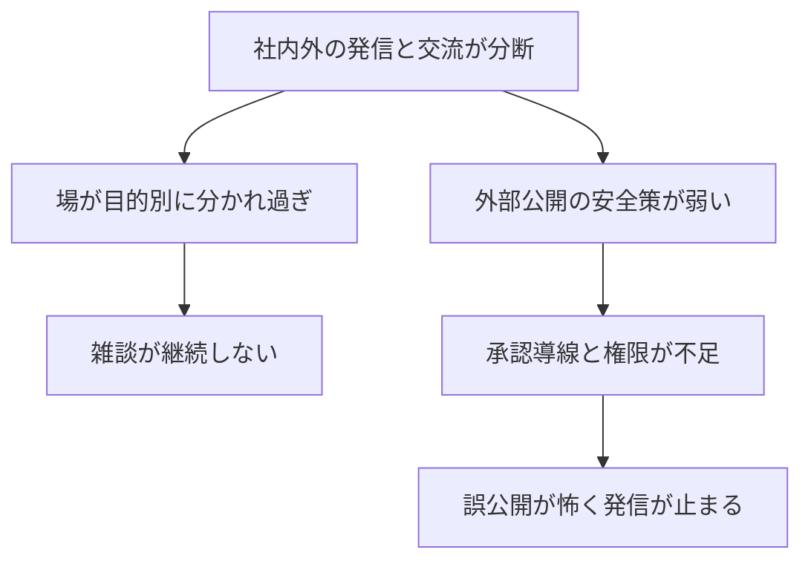

---

# 解決手法

## 方針

- 方針1: 社内交流を基盤に据える。CircleとDMを備え、交流の体験を優先する。
- 方針2: 社外公開は承認フローで一元化する。PublicはWeb公開と連合を必ず同時に成立させる。
- 方針3: Circleは社内限定に固定し、外部化を設計で不可能にする。
- 方針4: ActivityPubはMisskey互換を正とし、Misskey拡張を実装の基準にする。

## 解決策一覧

| 解決策ID | 解決策                           | 対象課題ID  | アプローチ                                         | 期待効果   | 副作用     | 依存               | 実装難度 |
| -------- | -------------------------------- | ----------- | -------------------------------------------------- | ---------- | ---------- | ------------------ | -------- |
| S-001    | 社内交流SNSの実装                | P-001       | Twitter基本機能とCircleとDM                        | 交流の定着 | 運用負荷   | 認証基盤           | H        |
| S-002    | GuestからMemberへの昇格フロー    | P-001,P-006 | 初期はGuestで制限、承認で昇格                      | 安全な導入 | 承認工数   | 管理UI             | M        |
| S-003    | 公開申請と承認の共通フロー       | P-002,P-003 | PublishRequestで公開版を生成                       | 安全な発信 | 遅延       | Publisher運用      | H        |
| S-004    | Circle外部化を禁止する分離モデル | P-005       | Circleスコープは公開版生成不可                     | 漏洩防止   | 柔軟性低下 | ドメイン設計       | M        |
| S-005    | Misskey互換のActivityPub実装     | P-004       | リアクションと引用とsource方言対応                 | 連合安定   | 仕様追従   | フェデレーション層 | H        |
| S-006    | ブログとSNSの統合表示            | P-003       | Markdown記事と特殊コンポーネント、ハッシュタグ連携 | 発信効率化 | 表現差     | レンダラー         | M        |
| S-007    | 業務連絡禁止のガードレール       | P-006       | UI注意喚起、ガイド、モデレーション                 | 混乱抑制   | 反発       | 運用               | L        |

## 代替案と比較

| 案  | 概要                 | メリット   | デメリット                      | コスト | リスク | 採用可否 | 不採用理由                        |
| --- | -------------------- | ---------- | ------------------------------- | -----: | ------ | -------- | --------------------------------- |
| 案A | 既存SNS運用のみ      | 実装不要   | 管理不能、分断継続              |     低 | 高     | No       | 目的を満たさない                  |
| 案B | Mastodon単体をホスト | 連合は早い | 社内交流と承認が弱い            |     中 | 中     | No       | Circleや承認が要件未達            |
| 案C | Misskey単体をホスト  | 方言互換   | 公開と非公開の分離、SSR要件が難 |     中 | 中     | No       | パッケージ分離と公開SSRが合わない |
| 案D | twitを自社実装       | 要件通り   | 実装コスト                      |     高 | 中     | Yes      | 制作事例価値も含め採用            |

---

# 要求と外部仕様

## 対象ユーザーと利用シーン

| ユーザー種別 | 目的                   | 主要シーン                               | 頻度 | 重要度 |
| ------------ | ---------------------- | ---------------------------------------- | ---- | ------ |
| Visitor      | 公開TLと公開記事の閲覧 | 公開TL、記事一覧、Businessページ         | 中   | H      |
| Guest        | 社内交流の試用         | 閲覧中心、限定投稿                       | 中   | M      |
| Member       | 社内交流               | 投稿、リプライ、リアクション、DM、Circle | 高   | H      |
| CircleMember | サークル内交流         | サークルTL、サークル記事                 | 中   | H      |
| Publisher    | 社外発信運用           | 公開申請レビュー、承認、差し戻し         | 中   | H      |
| Moderator    | 健全性維持             | 通報対応、削除、凍結                     | 低   | H      |
| Admin        | 運営と設定             | ロール管理、Business編集、制限設定       | 低   | H      |
| Remote actor | 連合で相互購読         | フォロー、受信、リアクション             | 中   | M      |

## 主要ユースケース一覧

| UC     | ユースケース               | 主語            | ゴール                     | 成功条件             | 失敗条件                 | 優先度 |
| ------ | -------------------------- | --------------- | -------------------------- | -------------------- | ------------------------ | ------ |
| UC-001 | 社内で投稿する             | Member          | 投稿が社内TLに表示         | 権限と制限を満たす   | 禁止語やレート制限       | P1     |
| UC-002 | サークルを作成し参加する   | Member          | サークル交流が成立         | サークルTLが見える   | 参加拒否、招待失敗       | P1     |
| UC-003 | DMを送受信する             | Member          | 1対1またはグループ会話     | 受信者が閲覧できる   | ブロック、制限           | P1     |
| UC-004 | ゲストを承認しMemberへ昇格 | Admin           | ゲストが本登録             | ロール付与と制限解除 | 承認者不在               | P1     |
| UC-005 | 公開申請を出す             | Member          | Public化の申請             | 申請がキューに入る   | Circle投稿など不正申請   | P1     |
| UC-006 | 公開申請を承認する         | Publisher       | 公開版が生成され外部へ出る | Web公開と連合が成立  | 互換バリデーション不合格 | P1     |
| UC-007 | 公開TLを閲覧する           | Visitor         | 会社の発信を読む           | ローカルPublicが表示 | レート制限               | P1     |
| UC-008 | ActivityPubでフォローする  | Remote actor    | 会社アカウントを購読       | inbox/outboxが機能   | 署名検証失敗             | P1     |
| UC-009 | Businessページを編集する   | Admin           | 表示コンテンツ更新         | 公開ページへ反映     | 画像欠落                 | P2     |
| UC-010 | 検索する                   | Member, Visitor | 投稿や記事を探す           | 結果が返る           | インデックス遅延         | P2     |

## 機能要件

| 要件ID | 要件                           | 根拠             | 優先度 | 受入条件                               |
| ------ | ------------------------------ | ---------------- | ------ | -------------------------------------- |
| FR-001 | 投稿、リポスト、引用、リプライ | Twitter基本機能  | P1     | 作成、表示、削除が可能                 |
| FR-002 | リアクションとカスタム絵文字   | 交流体験         | P1     | 絵文字の追加と表示が可能               |
| FR-003 | フォロー、フォロワー、リスト   | 閲覧体験         | P1     | タイムラインが生成される               |
| FR-004 | 検索                           | 運用と閲覧       | P2     | 投稿と記事を検索できる                 |
| FR-005 | DM                             | 社内交流         | P1     | 送受信と通知が機能                     |
| FR-006 | Circle                         | サークル内交流   | P1     | サークルTLとサークル記事が使える       |
| FR-007 | Circle外部化禁止               | 漏洩防止         | P1     | 公開申請ができず、公開APIから参照不可  |
| FR-008 | GuestからMember昇格            | 安全導入         | P1     | 承認後に制限が解除される               |
| FR-009 | ロールと権限                   | 承認と運用       | P1     | Publisher, Moderator, Admin などが機能 |
| FR-010 | 公開申請と承認                 | 社外発信         | P1     | 投稿者以外が承認しPublic生成           |
| FR-011 | PublicはWeb公開と連合を一体化  | 方針             | P1     | Public生成でWeb表示と連合配送が自動    |
| FR-012 | Public互換バリデーション       | 連合安全         | P1     | 非公開絵文字が含まれたら差し戻し       |
| FR-013 | ActivityPub Misskey互換        | 連合要件         | P1     | リアクション、引用、本文sourceが互換   |
| FR-014 | 未認証UIで公開TL閲覧           | 社外閲覧         | P1     | ローカルPublicのみ表示                 |
| FR-015 | ブログ記事機能                 | オウンドメディア | P1     | MarkdownとMermaidがレンダリング        |
| FR-016 | 特殊コンポーネントで表現       | オウンドメディア | P2     | 記事内で指定コンポーネントが使える     |
| FR-017 | Businessページでタグ連動表示   | コーポレート     | P2     | 指定タグの投稿TLと記事カード表示       |
| FR-018 | 公開はローカルのみ表示         | コーポレート     | P1     | 連合由来は混ぜない                     |
| FR-019 | 社内交流SNSは業務連絡用途禁止  | ガードレール     | P1     | 注意喚起、ガイド、違反対応が可能       |

## 外部インタフェース

### API と画面の境界

- 公開API: 公開TL、公開プロフィール、公開記事、Business用カード、ActivityPub公開エンドポイント。
- 内部API: 認証必須。社内TL、社内投稿、Circle、DM、申請と承認、運営設定。
- UI の責務: 公開UIはSEOと閲覧体験を重視しSSR。内部UIは操作性重視でCSR。

#### 画面パス方針

| 区分     | 代表パス例                                                                 | 備考                                                              |
| -------- | -------------------------------------------------------------------------- | ----------------------------------------------------------------- |
| 公開画面 | `/timeline`, `/posts/{id}`, `/articles`, `/articles/{slug}`, `/business`   | Visitor 向け。公開リソースを表示し、`/app/*` 配下へは置かない。   |
| 認証画面 | `/app/timeline`, `/app/posts/*`, `/app/dm`, `/app/circles`, `/app/admin/*` | Member/Publisher/Admin 向け。認証必須画面は `/app/*` 配下に置く。 |

- 同じドメイン語でも、公開表示と認証必須画面で表示リンクを分けてよい。例: 公開TLは `/timeline`、社内TLは `/app/timeline`。
- 同じドメイン語でも、公開リソースと認証必須リソースで API を分けてよい。例: 公開投稿は `/api/posts/{id}`、社内投稿操作は `/api/app/posts`。

### 主要API契約（抜粋）

#### 公開API

| エンドポイント           | 目的                   | 入力               | 出力                      | 認証 | 認可 | キャッシュ      | レート制限 |
| ------------------------ | ---------------------- | ------------------ | ------------------------- | ---- | ---- | --------------- | ---------- |
| GET /api/timeline        | 公開TL取得             | limit, cursor, tag | posts, next_cursor        | 不要 | なし | CDNキャッシュ可 | あり       |
| GET /api/posts/{id}      | 公開投稿詳細           | id                 | post                      | 不要 | なし | CDNキャッシュ可 | あり       |
| GET /api/articles        | 公開記事一覧           | limit, cursor, tag | articles, next_cursor     | 不要 | なし | CDNキャッシュ可 | あり       |
| GET /api/articles/{slug} | 公開記事詳細           | slug               | article                   | 不要 | なし | CDNキャッシュ可 | あり       |
| GET /api/business        | Businessページ用データ | なし               | products, works, featured | 不要 | なし | CDNキャッシュ可 | あり       |

#### ActivityPub（Misskey互換）

| エンドポイント              | 目的                  | 入力         | 出力                         | 認証     | 認可             | キャッシュ      | レート制限 |
| --------------------------- | --------------------- | ------------ | ---------------------------- | -------- | ---------------- | --------------- | ---------- |
| GET /.well-known/webfinger  | アカウント発見        | resource     | JRD                          | 不要     | なし             | CDNキャッシュ可 | あり       |
| GET /users/{name}           | ActorのHTML/JSON提供  | Accept       | HTML or ActivityStreams JSON | 不要     | なし             | CDNキャッシュ可 | あり       |
| GET /users/{name}/outbox    | 公開outbox取得        | page, min_id | OrderedCollectionPage        | 不要     | なし             | CDNキャッシュ可 | あり       |
| POST /users/{name}/inbox    | リモートから受信      | Activity     | 202/4xx                      | 署名検証 | ローカルポリシー | キャッシュ不可  | 厳しめ     |
| GET /users/{name}/followers | followersコレクション | page         | collection                   | 不要     | なし             | CDNキャッシュ可 | あり       |

#### 内部API

| エンドポイント                             | 目的                 | 入力                         | 出力                      | 認証 | 認可      | 冪等性 | 備考                                |
| ------------------------------------------ | -------------------- | ---------------------------- | ------------------------- | ---- | --------- | ------ | ----------------------------------- |
| GET /api/app/timeline                      | 社内TL取得           | limit, cursor                | posts, next_cursor        | 必須 | Member    | あり   | PublicとCircle外の社内投稿          |
| GET /api/app/posts/{id}                    | 社内投稿詳細         | id                           | post                      | 必須 | Member    | あり   | 権限外 audience は参照不可          |
| GET /api/app/dm/threads                    | DMスレッド一覧       | cursor                       | threads, next_cursor      | 必須 | Member    | あり   | 自分が所属するスレッドのみ          |
| GET /api/app/dm/threads/{id}/messages      | DMメッセージ取得     | id, cursor                   | messages, next_cursor     | 必須 | Member    | あり   | 参加者以外は参照不可                |
| GET /api/app/circles                       | サークル一覧         | cursor                       | circles, next_cursor      | 必須 | Member    | あり   | 所属・参加可能サークルを返す        |
| GET /api/app/circles/{id}/timeline         | サークルTL取得       | id, cursor                   | posts, next_cursor        | 必須 | Member    | あり   | 非所属者は参照不可                  |
| GET /api/app/publish-requests              | 公開申請一覧         | status, cursor               | requests, next_cursor     | 必須 | Member    | あり   | Memberは自分分、Publisherは審査対象 |
| GET /api/app/admin/business                | Business編集用データ | なし                         | products, works, featured | 必須 | Admin     | あり   | 編集画面初期表示用                  |
| POST /api/app/posts                        | 社内投稿作成         | content, audience, circle_id | post                      | 必須 | Member    | 任意   | audience=circleは社内限定           |
| POST /api/app/posts/{id}/reply             | 返信                 | content                      | post                      | 必須 | Member    | 任意   | 返信先がPublicでもCircle返信は不可  |
| POST /api/app/reactions                    | リアクション付与     | post_id, emoji               | reaction                  | 必須 | Member    | 任意   | Public申請対象の絵文字制約あり      |
| POST /api/app/dm/messages                  | DM送信               | thread_id, content           | message                   | 必須 | Member    | 任意   | DMは非連合                          |
| POST /api/app/circles                      | サークル作成         | name, slug                   | circle                    | 必須 | Member    | 任意   | 外部化不可                          |
| POST /api/app/circles/{id}/join            | 参加                 | なし                         | membership                | 必須 | Member    | 任意   | 招待制の拡張余地                    |
| POST /api/app/publish-requests             | 公開申請             | content_type, content_id     | request                   | 必須 | Member    | あり   | Circleスコープは拒否                |
| POST /api/app/publish-requests/{id}/review | 承認/差し戻し        | action, reason               | request                   | 必須 | Publisher | あり   | 投稿者本人は拒否                    |
| POST /api/app/admin/guests/{id}/approve    | Guest昇格            | role_bindings                | account                   | 必須 | Admin     | あり   | Guest→Member                        |
| PUT /api/app/admin/business                | Business編集         | products, works, featured    | business                  | 必須 | Admin     | あり   | 公開ページへ反映                    |

### 主要イベント（内部・非同期）

| イベント名               | 発火条件         | ペイロード（主要）           | 消費者                     | 配信保証      | 重複処理             | 備考                                   |
| ------------------------ | ---------------- | ---------------------------- | -------------------------- | ------------- | -------------------- | -------------------------------------- |
| PostCreated              | 社内投稿作成     | post_id, author_id, audience | TL生成、通知、検索         | at-least-once | event_idで冪等       | Circle投稿は公開処理に流さない         |
| ReactionCreated          | リアクション付与 | reaction_id, post_id, emoji  | 通知、集計                 | at-least-once | reaction_idで冪等    | Public対象の絵文字制約は申請時に再検証 |
| ArticleUpserted          | 記事作成/更新    | article_id, scope            | レンダリング、検索         | at-least-once | article_id+revで冪等 | scope=circleは外部化不可               |
| PublishRequestSubmitted  | 公開申請作成     | request_id, content_ref      | 承認キュー                 | at-least-once | request_idで冪等     | 互換バリデーションは作成時に実施       |
| PublishRequestApproved   | 承認             | request_id, reviewer_id      | 公開版生成                 | at-least-once | request_idで冪等     | PublicはWeb公開と連合が一体            |
| PublishedCreated         | 公開版生成       | published_id, ap_object_id   | 公開インデックス、連合投入 | at-least-once | published_idで冪等   | 生成はPublishingコンテキスト内で完結   |
| FederationDeliveryQueued | 連合配送投入     | delivery_id, inbox_url       | 配送ワーカー               | at-least-once | delivery_idで冪等    | リトライは指数バックオフ               |
| FederationDeliveryFailed | 配送失敗         | delivery_id, last_error      | アラート、抑止             | at-least-once | delivery_idで冪等    | 一定回数で停止し手動対応               |
| GuestApproved            | Guest→Member     | account_id, granted_roles    | 権限反映、通知             | at-least-once | account_id+tsで冪等  | 管理者承認のみ                         |
| BusinessContentUpdated   | Business編集     | business_rev                 | 公開キャッシュ更新         | at-least-once | revで冪等            | 公開UIで即時反映                       |

| 項目       | 内容                                                                                             |
| ---------- | ------------------------------------------------------------------------------------------------ |
| イベント名 | `ContextActionV1` 形式で命名し、破壊的変更時のみ版を更新                                         |
| 発火条件   | 永続化完了後に outbox へ記録し、非同期配送で発火                                                 |
| ペイロード | `event_id`, `event_type`, `schema_version`, `occurred_at`, `aggregate_id`, `actor_id`, `payload` |
| 配信保証   | `at-least-once`                                                                                  |
| 重複処理   | `event_id` をキーに consumer 側で冪等化                                                          |
| 互換性     | `schema_version` で後方互換を維持し、破壊的変更は新イベントを追加                                |

---

# 非機能要件

| 分類         | 要件             | 目標                                                               | 根拠         | 計測     | 例             |
| ------------ | ---------------- | ------------------------------------------------------------------ | ------------ | -------- | -------------- |
| 性能         | 公開TL表示       | p95 800 ms 以下                                                    | 体験         | APM      | p95 800 ms     |
| 性能         | 内部投稿の作成   | p95 500 ms 以下                                                    | 体験         | APM      | p95 500 ms     |
| 可用性       | 公開閲覧         | 月間99.9%以上                                                      | 発信継続     | 監視     | 月間99.9%      |
| 可用性       | 内部利用         | 月間99.5%以上                                                      | 交流継続     | 監視     | 月間99.5%      |
| セキュリティ | 認証必須領域保護 | OIDCとセッション保護                                               | 不正利用防止 | 監査     | MFA推奨        |
| セキュリティ | 権限管理         | 役割ベース認可                                                     | 承認運用     | 監査     | RBAC           |
| セキュリティ | 公開防御         | WAFとレート制限                                                    | 荒らし対策   | WAFログ  | BOT対策        |
| 運用         | SLOとアラート    | 可用性、p95、配送失敗率の閾値超過を5分以内に通知                   | 継続運用     | 監視     | エラー率       |
| 保守性       | 画面とAPIの境界  | frontend は `/app/*`、backend は `/api/app/*` で認証必須領域を分離 | 安全性       | CI       | 依存関係検査   |
| 法務         | 利用規約とガイド | 内部と外部を明記                                                   | 混乱防止     | レビュー | 禁止用途を明記 |

---

# インフラ構成要件

## 前提

- 運用主体: WitWire社
- 予算レンジ: 初期30万円以内、運用月額12万〜18万円
- 対象環境: Dev, Stg, Prod
- クラウド前提: Cloudflareをエッジ、AWSをアプリとデータ基盤。

## 構成要件一覧

| 区分         | 要件                 | 目標値や条件                                                              | 根拠           | 検証方法     |
| ------------ | -------------------- | ------------------------------------------------------------------------- | -------------- | ------------ |
| リージョン   | AWS配置              | ap-northeast-1 東京リージョン                                             | レイテンシ     | 疎通とp95    |
| 可用性       | エッジ冗長           | Cloudflare前段                                                            | 単一障害点削減 | 障害訓練     |
| スケール     | リソースアップで対応 | EC2 t4g.small / RDS db.t4g.micro / OpenSearch t4g.small.search を適宜増強 | シンプル運用   | 負荷試験     |
| ネットワーク | 公開と内部の分離     | 単一backend内で `/api/*` と `/api/app/*` を経路分離                       | 誤公開防止     | ペンテスト   |
| 認証認可     | 内部は認証必須       | GuestとMemberとRBAC                                                       | 安全運用       | 監査         |
| 暗号化       | TLS終端              | Cloudflare                                                                | 標準           | TLS検証      |
| 監視         | ログとメトリクス     | Cloudflare、アプリ、DB、連合配送を統合し90日保持                          | 運用           | 監視ダッシュ |
| バックアップ | DBバックアップ       | PITR 7日、日次スナップショット35日保持                                    | 復旧           | リストア訓練 |
| DR           | 重要データ復旧       | RPO 24時間、RTO 8時間                                                     | 事業継続       | 訓練         |
| コスト上限   | 月額上限             | 月額20万円以内                                                            | 予算           | 月次レビュー |

## インフラ構成図

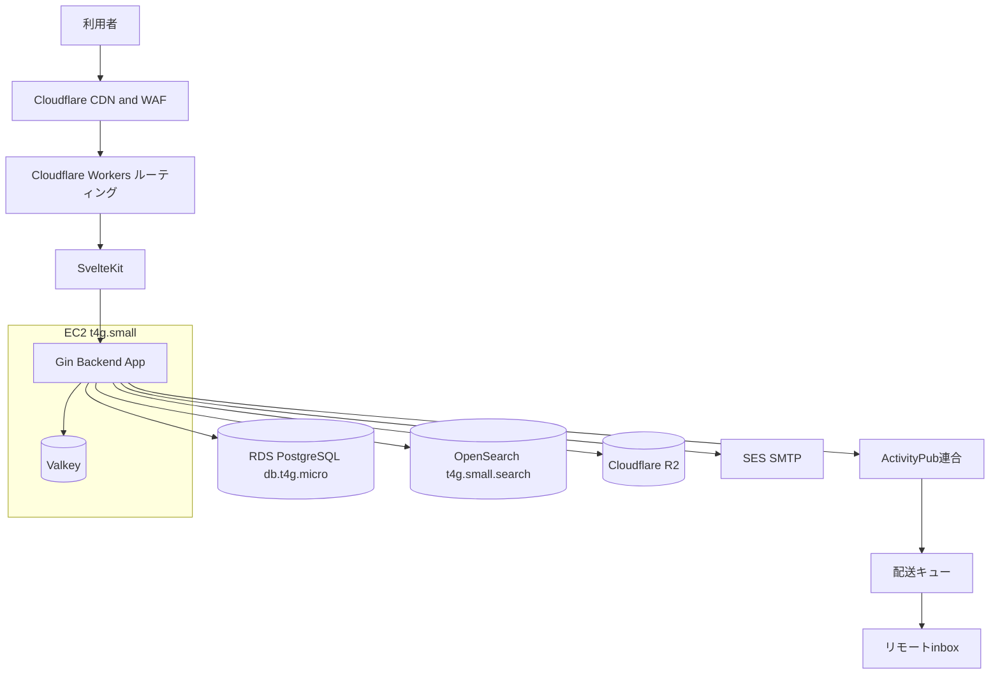

## 環境分離

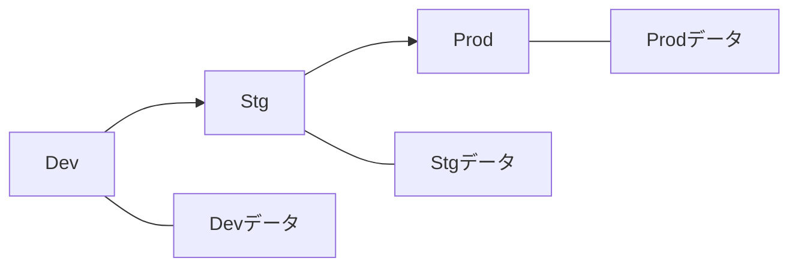

---

# ビジネスモデルキャンバス

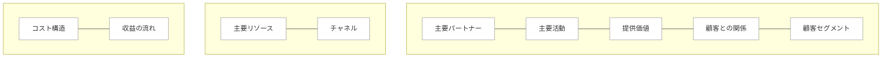

- 主要パートナー: Cloudflare、VPS事業者、ドメイン管理、外部連合インスタンス。
- 主要活動: 社内交流の運用、承認運用、記事制作、モデレーション、連合互換の保守。
- 提供価値: 社内の交流体験、承認付き社外発信、オウンドメディアの統合、制作事例としての再利用。
- 顧客との関係: 社内はコミュニティ運用、社外は公開閲覧と連合、問い合わせ導線。
- 顧客セグメント: 社内メンバー、社外の潜在顧客、連合圏の観測者。
- 主要リソース: 実装と運用ノウハウ、コンテンツ、モデレーション体制。
- チャネル: witwire.co.jp 公開、連合タイムライン、記事、問い合わせ。
- コスト構造: インフラ、開発、運用、モデレーション。
- 収益の流れ: 直接課金ではなくSI案件獲得のリード、採用広報の効果。

---

# マネタイズモデル

## 収益源

| 収益源           | 課金単位 |              価格 | 課金タイミング | 解約条件 | 返金     | 例                       |
| ---------------- | -------- | ----------------: | -------------- | -------- | -------- | ------------------------ |
| SI案件のリード   | 案件     |  500万〜1,200万円 | 受注時         | 該当なし | 該当なし | twitを制作事例として提示 |
| 採用広報の効率化 | 採用     | 80万〜150万円相当 | 年次           | 該当なし | 該当なし | 記事と発信で応募増       |

## ユニットエコノミクス

| 指標 | 定義                 |        現状 |          目標 | 根拠                                             |
| ---- | -------------------- | ----------: | ------------: | ------------------------------------------------ |
| CAC  | SI獲得に必要な獲得費 |  試算30万円 |    20万円以下 | オウンド流入と連合露出を主軸にし有料獲得を抑える |
| LTV  | SI受注と継続の期待値 | 試算900万円 | 1,200万円以上 | 初期構築と保守12か月の合計を基準にする           |
| 粗利 | SI粗利率             |     試算55% |       65%以上 | テンプレート再利用と運用標準化で改善する         |

---

# ドメイン設計

## ユビキタス言語

| 用語           | 定義                        | 同義語の扱い       | 禁止表現 | 例文                        | 所属コンテキスト |
| -------------- | --------------------------- | ------------------ | -------- | --------------------------- | ---------------- |
| twit           | witwire.co.jp のオウンドSNS | なし               | なし     | twitで社内交流する          | Core             |
| Member         | 社内交流SNSの本登録ユーザー | 社員と同義にしない | 社員     | Memberは交流のために参加    | Identity         |
| Guest          | 参加直後の制限ユーザー      | なし               | 仮会員   | Guestは承認でMemberへ昇格   | Identity         |
| Circle         | 社内限定の小コミュニティ    | 外部コミュニティ   | サーバー | Circleの内容は外に出さない  | Circle           |
| Post           | 短文投稿                    | Note               | つぶやき | Postを投稿する              | Social           |
| Article        | 記事投稿                    | ブログ             | コラム   | Articleを書く               | Media            |
| PublishRequest | 外部公開申請                | 公開申請           | なし     | PublishRequestを提出する    | Publishing       |
| PublishedPost  | 公開用に生成された投稿      | PublicPost         | なし     | PublishedPostが公開TLに出る | Publishing       |
| Public         | Web公開と連合の状態         | 連合公開           | なし     | Publicは承認後に成立        | Publishing       |
| Reaction       | 絵文字リアクション          | Like               | いいね   | Reactionを付ける            | Social           |

## 境界づけられたコンテキスト

| コンテキスト | 目的                      | 主要データ                | 外部依存           | 統合方式         |
| ------------ | ------------------------- | ------------------------- | ------------------ | ---------------- |
| Identity     | 認証、GuestとMember、RBAC | Account, Role             | OIDC, SMTP         | 内部API          |
| Social       | 社内投稿とタイムライン    | Post, Follow, List        | Valkey, OpenSearch | 内部API          |
| Circle       | サークル運用              | Circle, Membership        | なし               | 内部API          |
| Media        | 記事とレンダリング        | Article, Assets           | R2                 | 内部APIと公開API |
| Publishing   | 承認と公開版生成          | PublishRequest, Published | なし               | 公開APIと連合    |
| Federation   | Misskey互換ActivityPub    | Actor, Inbox, Outbox      | リモート           | 公開API          |
| Corporate    | AboutとBusiness           | Business, Works           | なし               | 公開API          |

### コンテキストマップ

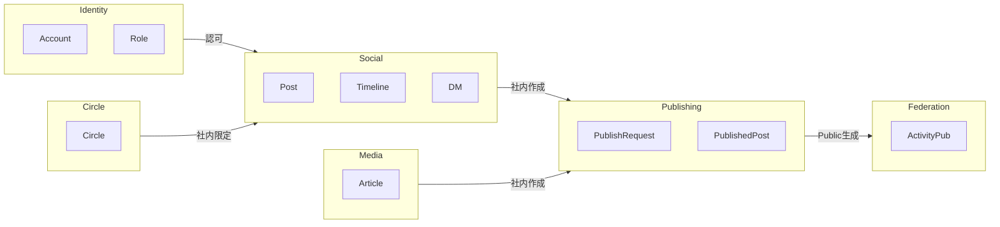

## 概念ドメインモデル

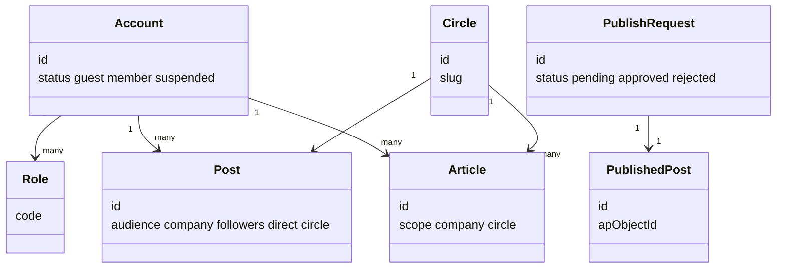

## 業務ルール

| ルールID | ルール                                                              | 例                                       | 例外                                             | 受入条件                                                         |
| -------- | ------------------------------------------------------------------- | ---------------------------------------- | ------------------------------------------------ | ---------------------------------------------------------------- |
| BR-001   | 社内交流SNSは社内交流を目的とし、業務連絡目的では利用してはならない | 障害連絡、納期調整、業務指示を投稿しない | 緊急の一次周知は許容し、後続で公式連絡手段へ移管 | ガイド明記、投稿画面で注意喚起、違反投稿をモデレーターが削除可能 |
| BR-002   | Circle内の内容は外に出さない                                        | Circle投稿は公開申請不可                 | なし                                             | Circleスコープは公開版生成が不可能                               |
| BR-003   | PublicはWeb公開と連合が一体                                         | Public化で必ず連合配送                   | なし                                             | Public生成時に配送キューへ投入                                   |
| BR-004   | 投稿者本人は承認できない                                            | 自己承認禁止                             | なし                                             | 承認APIで拒否                                                    |
| BR-005   | Public以外は連合しない                                              | Internalは連合しない                     | なし                                             | outboxはPublicのみ返す                                           |
| BR-006   | 連合対象は公開許可済み絵文字のみ                                    | 非公開絵文字は差し戻し                   | なし                                             | 申請バリデーションで拒否                                         |

## 概念データモデル

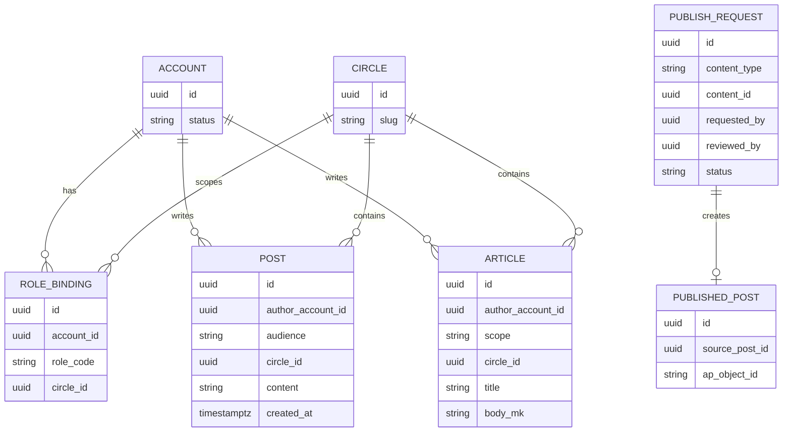

---

# 上流図セット

ここは上流で必要になりやすい図を網羅する。
twitの主要ユースケースごとに、外部から観測できる振る舞いと運用手順を図で固定する。

## システムコンテキスト図

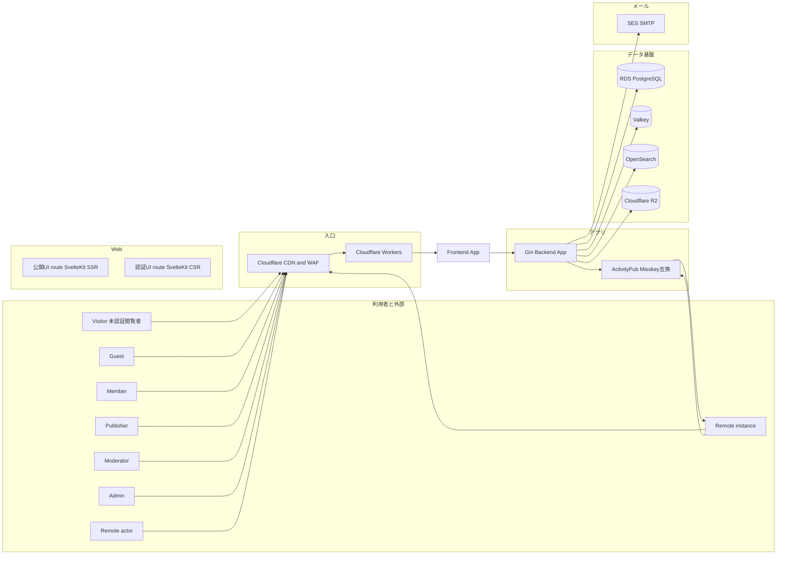

## 信頼境界とパッケージ境界

公開と非公開は同一ドメインでも信頼境界を分ける。
公開側はPublished系のみ参照し、CircleやDMなど社内限定データへ到達できない。

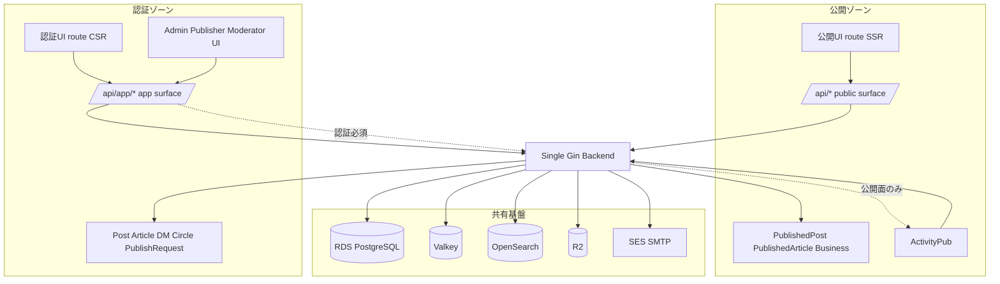

## ユースケース図

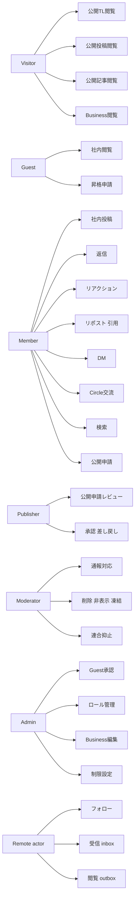

## ユーザーフロー図

### 社内投稿

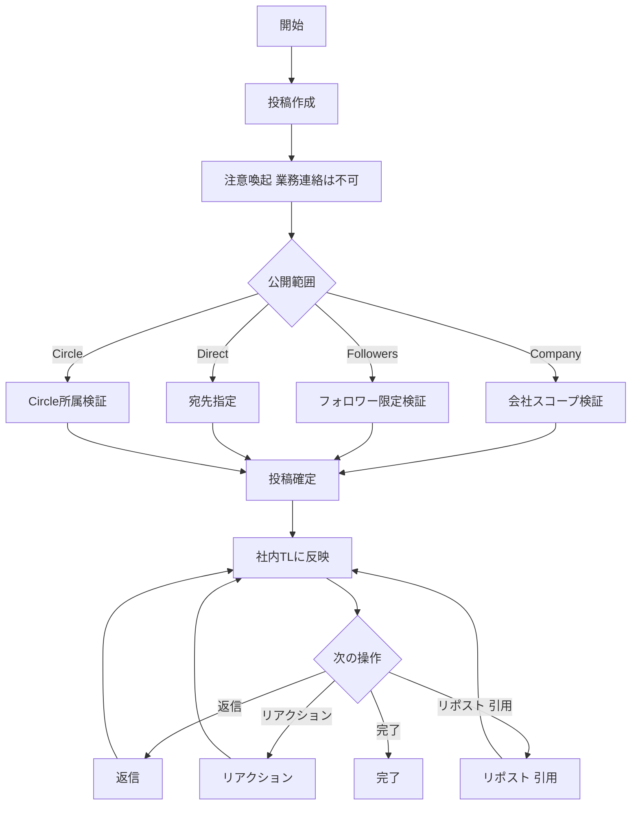

### Circle

Circleは社内限定。外部化も連合も不可。

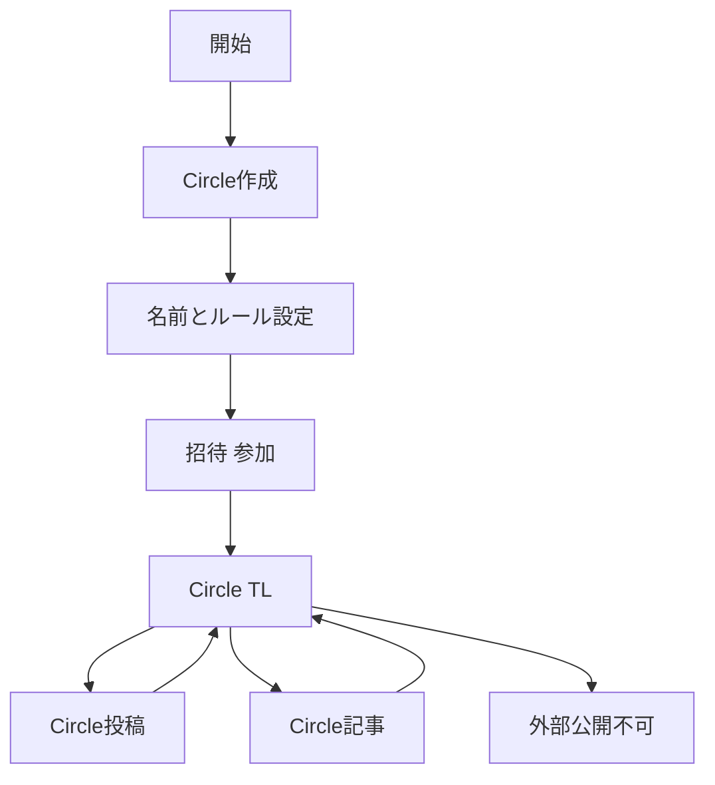

### DM

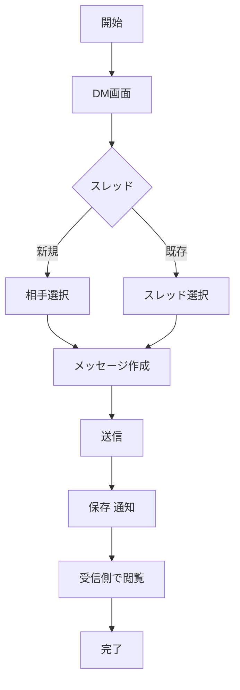

### Guest参加と昇格

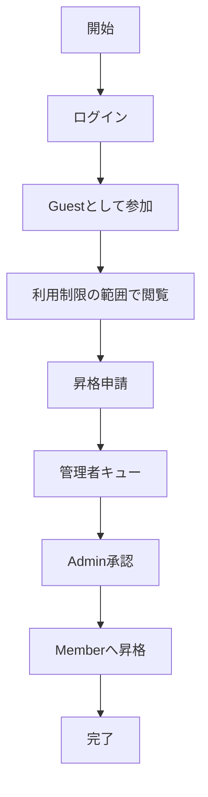

### 公開閲覧

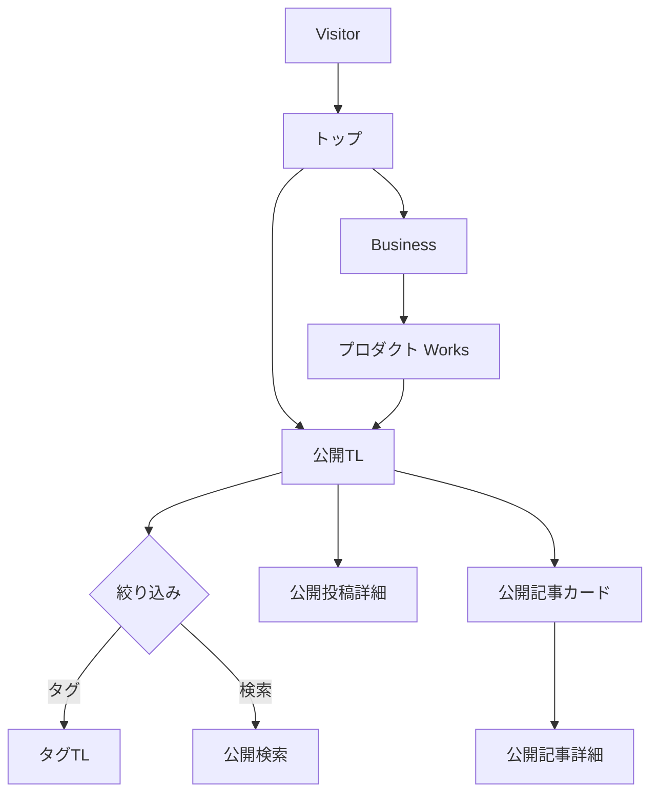

### 公開申請と承認

CompanyスコープのPostとArticleのみ申請できる。
Circleスコープは申請できない。
PublicはWeb公開と連合が一体であり、ユーザーは連合の有無を選択しない。

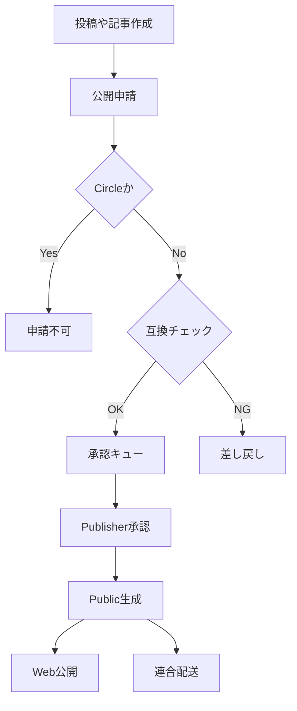

### 通報とモデレーション

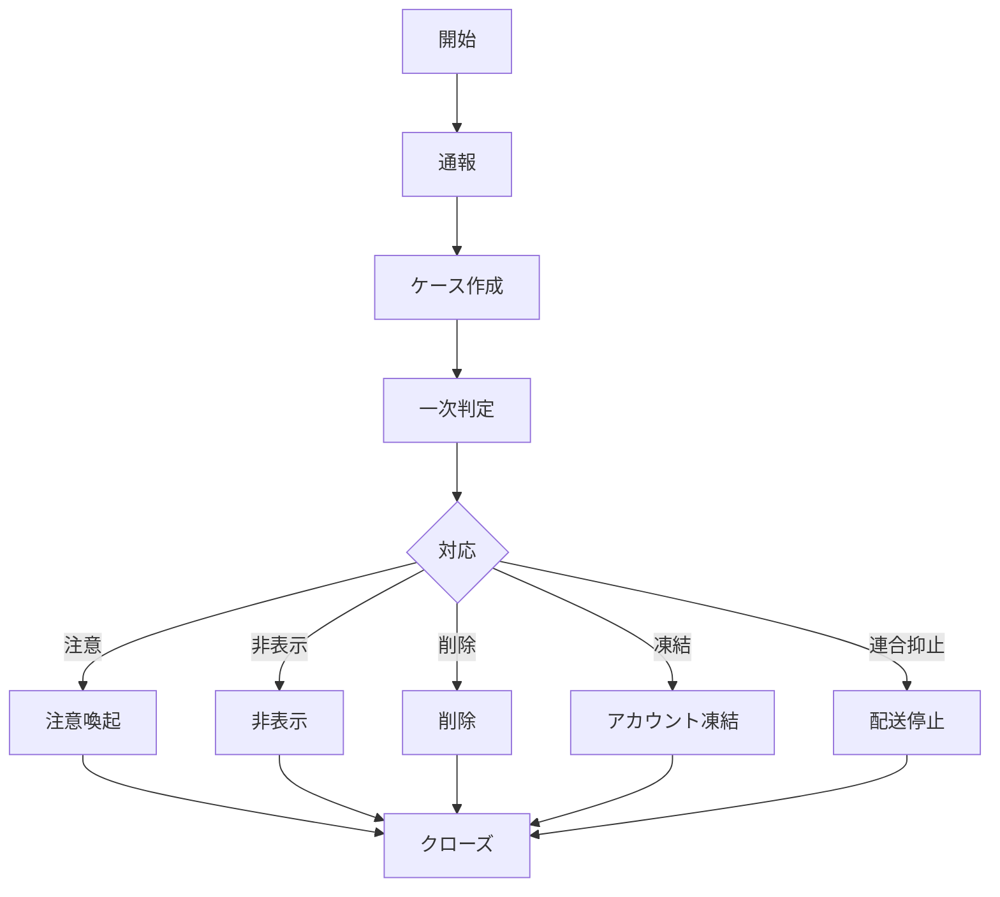

### Business編集

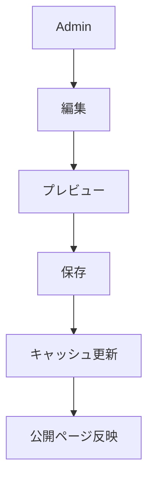

### ActivityPub フォロー

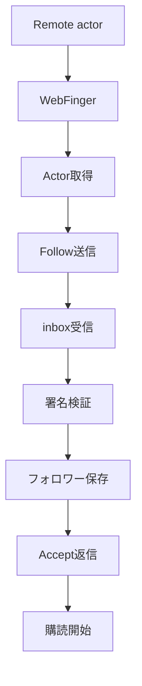

## 業務フロー図

### 承認運用

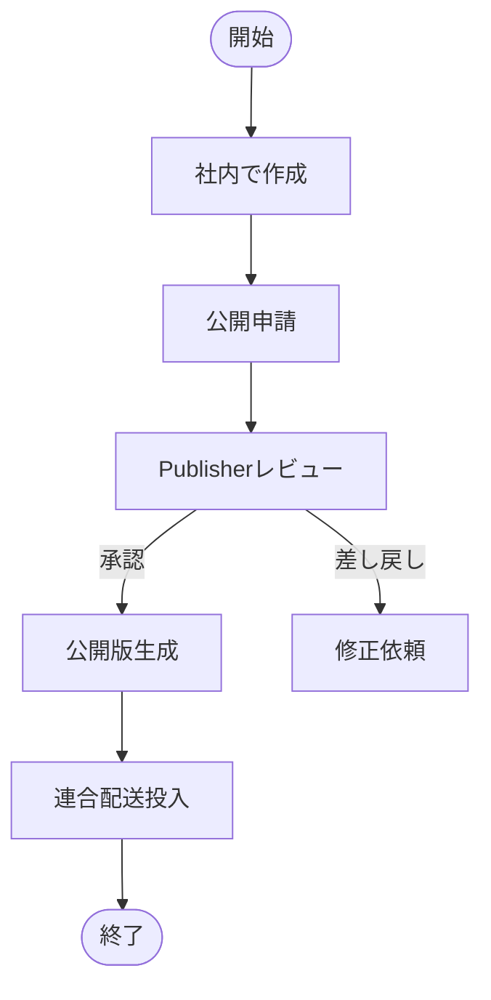

### 通報対応

```mermaid
flowchart TB
  Start([開始]) --> Intake[通報受付]
  Intake --> Check[証跡確認]
  Check --> Decide{判断}
  Decide -->|軽微| Warn[注意]
  Decide -->|重大| Action[非表示 削除 凍結]
  Decide -->|連合問題| FedStop[配送停止]
  Warn --> Record[記録]
  Action --> Record
  FedStop --> Record
  Record --> Close[クローズ]
  Close --> End([終了])
```

### 連合配送ワーカー

```mermaid
flowchart TB
  Q[配送キュー] --> Pick[取り出し]
  Pick --> Sign[署名生成]
  Sign --> Send[POST inbox]
  Send --> Res{結果}
  Res -->|成功| Sent[送信済み]
  Res -->|失敗| Retry{再試行回数}
  Retry -->|残あり| Backoff[バックオフ]
  Backoff --> Q
  Retry -->|上限| Dead[停止と通知]
```

### 受信アクティビティ処理

```mermaid
flowchart TB
  In[受信 inbox] --> Verify[署名検証]
  Verify --> Parse[パース]
  Parse --> Dedup[重複排除]
  Dedup --> Route{種別}
  Route -->|Follow| F1[フォロワー更新]
  Route -->|Create Note| C1[投稿として取り込み]
  Route -->|Like| L1[リアクションとして取り込み]
  Route -->|Undo| U1[取り消し反映]
  Route -->|その他| Skip[無視 または保留]
  F1 --> Store[保存]
  C1 --> Store
  L1 --> Store
  U1 --> Store
  Store --> Notify[通知 更新]
```

## シーケンス図

### 社内投稿作成

```mermaid
sequenceDiagram
  participant U as Member
  participant UI as 認証UI
  participant API as 内部API
  participant DB as RDS
  participant C as Valkey
  participant S as OpenSearch

  U->>UI: 投稿作成
  UI->>API: POST /api/app/posts
  API->>API: 権限と範囲を検証
  API->>DB: Post保存
  API->>C: TLキャッシュ更新
  API->>S: インデックス更新
  API-->>UI: 作成結果
  UI-->>U: TL反映
```

### Circle投稿作成

```mermaid
sequenceDiagram
  participant U as Member
  participant UI as 認証UI
  participant API as 内部API
  participant DB as RDS

  U->>UI: Circle投稿
  UI->>API: POST /api/app/posts audience=circle
  API->>API: Circle所属を検証
  API->>DB: Circle Post保存
  API-->>UI: 作成結果
  UI-->>U: Circle TL反映
  Note over API: Circle投稿は公開申請不可
```

### DM送信

```mermaid
sequenceDiagram
  participant U as Member
  participant UI as 認証UI
  participant API as 内部API
  participant DB as RDS
  participant N as 通知

  U->>UI: メッセージ作成
  UI->>API: POST /api/app/dm/messages
  API->>API: 宛先とブロックを検証
  API->>DB: メッセージ保存
  API->>N: 受信者へ通知
  API-->>UI: 送信結果
  UI-->>U: 送信済み表示
```

### 公開申請と承認から連合配送

```mermaid
sequenceDiagram
  participant M as Member
  participant UI as 認証UI
  participant I as 内部API
  participant P as Publishing
  participant A as 公開API
  participant Q as 配送キュー
  participant W as 配送ワーカー
  participant R as Remote inbox

  M->>UI: 公開申請
  UI->>I: POST /api/app/publish-requests
  I->>P: 互換バリデーション
  P-->>I: OKまたはNG
  I-->>UI: 申請結果

  Note over P: Publisherがレビュー

  UI->>I: POST /api/app/publish-requests/{id}/review approve
  I->>P: 承認
  P->>A: Published生成
  A->>Q: 配送投入
  Q->>W: 取り出し
  W->>R: 署名付きPOST
  R-->>W: 受領
  W-->>A: 成否記録
```

### 公開TL SSR

```mermaid
sequenceDiagram
  participant V as Visitor
  participant CF as Cloudflare
  participant FE as 公開UI SSR
  participant API as 公開API
  participant DB as RDS
  participant C as Valkey

  V->>CF: GET /timeline
  CF->>FE: SSRリクエスト
  FE->>API: GET /api/timeline
  API->>C: キャッシュ参照
  alt cache hit
    C-->>API: timeline
  else cache miss
    API->>DB: Published参照
    DB-->>API: timeline
    API->>C: キャッシュ更新
  end
  API-->>FE: timeline
  FE-->>CF: HTML
  CF-->>V: HTML
```

### ActivityPub フォロー処理

```mermaid
sequenceDiagram
  participant RI as Remote instance
  participant WF as WebFinger
  participant AP as ActivityPub
  participant DB as RDS

  RI->>WF: GET /.well-known/webfinger
  WF-->>RI: JRD
  RI->>AP: GET /users/{name}
  AP-->>RI: Actor
  RI->>AP: POST /users/{name}/inbox Follow
  AP->>AP: 署名検証
  AP->>DB: Follower保存
  AP-->>RI: 202
  AP->>RI: Accept送信
```

### ActivityPub リアクション受信

Misskey互換のLikeを優先し、通常のLikeは既定のリアクションとして扱う。

```mermaid
sequenceDiagram
  participant RI as Remote instance
  participant AP as ActivityPub inbox
  participant DB as RDS
  participant N as 通知

  RI->>AP: POST inbox Like
  AP->>AP: 署名検証
  AP->>AP: _misskey_reactionを解釈
  AP->>DB: Reaction保存
  AP->>N: 通知
  AP-->>RI: 202
```

### Business編集とキャッシュ更新

```mermaid
sequenceDiagram
  participant A as Admin
  participant UI as 認証UI
  participant API as 内部API
  participant DB as RDS
  participant CF as Cloudflare

  A->>UI: Business編集
  UI->>API: PUT /api/app/admin/business
  API->>DB: 保存
  API->>CF: キャッシュ更新
  API-->>UI: 完了
```

## 状態遷移図

### Account

```mermaid
stateDiagram-v2
  [*] --> Guest
  Guest --> Member : approve
  Guest --> Suspended : suspend
  Member --> Suspended : suspend
  Suspended --> Member : reinstate
  Member --> [*] : delete
```

### CircleMembership

```mermaid
stateDiagram-v2
  [*] --> Invited
  Invited --> Active : accept
  Invited --> Left : decline
  Active --> Left : leave
  Active --> Banned : ban
  Banned --> [*]
  Left --> [*]
```

### Post

Postは社内原本。Public化はPublished生成であり、Postの状態変換ではない。

```mermaid
stateDiagram-v2
  [*] --> Active
  Active --> Active : edit
  Active --> Deleted : delete
  Deleted --> [*]
```

### PublishRequest

```mermaid
stateDiagram-v2
  [*] --> Pending
  Pending --> Approved : approve
  Pending --> Rejected : reject
  Pending --> Cancelled : cancel
  Approved --> [*]
  Rejected --> [*]
  Cancelled --> [*]
```

### FederationDelivery

```mermaid
stateDiagram-v2
  [*] --> Queued
  Queued --> Sending : pick
  Sending --> Sent : success
  Sending --> FailedRetry : failure
  FailedRetry --> Queued : retry
  FailedRetry --> Dead : giveup
  Sent --> [*]
  Dead --> [*]
```

### ModerationCase

```mermaid
stateDiagram-v2
  [*] --> Open
  Open --> InReview : triage
  InReview --> Actioned : decide
  Actioned --> Closed : record
  Closed --> Reopened : new_evidence
  Reopened --> InReview
  Closed --> [*]
```

### DMThread

```mermaid
stateDiagram-v2
  [*] --> Active
  Active --> Archived : archive
  Archived --> Active : reopen
  Active --> Deleted : delete
  Deleted --> [*]
```

## 主要データの流れ

### 社内書き込み

```mermaid
flowchart TB
  UI[認証UI] --> APPPATH[/api/app/*]
  APPPATH --> BE[Gin Backend App]
  BE --> RDS[(RDS)]
  BE --> VK[(Valkey)]
  BE --> OS[(OpenSearch)]
  BE --> Notif[通知]
  BE --> Audit[監査ログ]
```

### 公開読み取り

```mermaid
flowchart TB
  V[Visitor] --> PUBROUTE[公開UI route SSR]
  PUBROUTE --> PUBPATH[/api/*]
  PUBPATH --> BE[Gin Backend App]
  BE --> VK[(Valkey)]
  BE --> RDS[(RDS Published系)]
  BE --> OS[(OpenSearch)]
  BE --> R2[(R2)]
```

### 公開版生成と連合

```mermaid
flowchart TB
  APPPATH[/api/app/*] --> BE[Gin Backend App]
  BE --> PR[PublishRequest]
  PR --> Review[Publisher承認]
  Review --> Gen[Published生成]
  Gen --> PUBPATH[/api/*]
  PUBPATH --> BE
  BE --> Q[配送キュー]
  Q --> W[配送ワーカー]
  W --> Remote[Remote inbox]
```

### 連合受信

```mermaid
flowchart TB
  Remote[Remote instance] --> Inbox[inbox]
  Inbox --> Verify[署名検証]
  Verify --> Map[Misskey互換解釈]
  Map --> Store[保存]
  Store --> Update[通知と集計]
```

---

# マイルストーンと計画

## マイルストーン

| マイルストーン | ゴール               | 完了条件                              | 期日       | 依存         | オーナー  |
| -------------- | -------------------- | ------------------------------------- | ---------- | ------------ | --------- |
| M1             | 公開面の骨格         | 公開UIと公開APIの疎通                 | 2026-04-15 | ドメイン確定 | Tech      |
| M2             | 社内交流の成立       | 投稿、TL、DM、Circleが使える          | 2026-05-13 | M1           | Tech      |
| M3             | GuestとRBAC          | Guest導入、承認でMember化、管理UI     | 2026-05-27 | M2           | Admin     |
| M4             | 公開申請と公開版生成 | PublishRequestと承認とWeb公開         | 2026-06-03 | M3           | Publisher |
| M5             | Misskey互換連合      | Actor, inbox/outbox, リアクション互換 | 2026-06-24 | M4           | Tech      |
| M6             | ブログとBusiness     | 記事公開とBusinessタグ表示            | 2026-06-17 | M4           | Tech      |
| M7             | 運用整備             | ガイド、通報、監視、バックアップ      | 2026-06-17 | M2           | Admin     |

## スコープ分割

```mermaid
mindmap
  root((twit))
    フェーズ1
      公開UI骨格
      公開TL
      AboutとBusiness
    フェーズ2
      社内投稿
      DM
      Circle
    フェーズ3
      Guest
      RBAC
      管理UI
    フェーズ4
      公開申請
      承認
      Public生成
    フェーズ5
      Misskey互換連合
      リアクション
      引用
    フェーズ6
      ブログ特殊コンポーネント
      検索最適化
```

## スケジュール

```mermaid
gantt
  title 計画
  dateFormat  YYYY-MM-DD
  axisFormat  %m/%d

  section 企画
  要件確定 :a1, 2026-03-04, 14d
  仕様合意 :a2, after a1, 7d

  section 実装
  公開骨格 :b1, 2026-03-25, 21d
  社内交流 :b2, after b1, 28d
  承認と公開 :b3, after b2, 21d
  連合 :b4, after b3, 21d

  section 品質
  結合テスト :c1, after b4, 14d
  受入 :c2, after c1, 7d

  section リリース
  本番展開 :d1, after c2, 3d
```

## 体制と責任

| 領域           | Responsible | Accountable | Consulted | Informed |
| -------------- | ----------- | ----------- | --------- | -------- |
| 要件           | Product     | Owner       | Tech      | All      |
| 設計           | Tech        | Tech Lead   | Security  | All      |
| 実装           | Tech        | Tech Lead   | Owner     | All      |
| 運用           | Admin       | Owner       | Tech      | All      |
| 承認運用       | Publisher   | Owner       | Moderator | All      |
| モデレーション | Moderator   | Owner       | Publisher | All      |

## コスト計画

| 区分     | 内容                               |             見積 | 根拠 | 変動要因     |
| -------- | ---------------------------------- | ---------------: | ---- | ------------ |
| 人件費   | 設計と実装と運用                   |          480万円 | 工数 | 機能追加     |
| インフラ | VPS、Cloudflare、OpenSearch        | 月額12万〜18万円 | 予算 | トラフィック |
| 外注     | デザインまたはセキュリティレビュー |     50万〜80万円 | 見積 | スコープ     |

---

# 付録

## 未決事項

| 論点                         | 影響     | 期限       | 決定者    | 状態 |
| ---------------------------- | -------- | ---------- | --------- | ---- |
| OIDCの採用先                 | 認証設計 | 2026-03-14 | Admin     | Open |
| 連合の署名実装範囲           | 互換性   | 2026-03-18 | Tech      | Open |
| ブログ特殊コンポーネント仕様 | 表現力   | 2026-03-21 | Product   | Open |
| レート制限の具体値           | 運用     | 2026-03-18 | Moderator | Open |
| SLOと目標値                  | 運用     | 2026-03-14 | Admin     | Open |

## 変更履歴

| 日付       | バージョン | 変更内容 | 変更者  |
| ---------- | ---------- | -------- | ------- |
| 2026-03-04 | 0.1        | 初版作成 | ChatGPT |

## 参考リンク

ActivityPub
https://www.w3.org/TR/activitypub/

ActivityStreams
https://www.w3.org/TR/activitystreams-core/

Misskey拡張名前空間
https://misskey-hub.net/ns/

Misskeyリアクション仕様
https://misskey-hub.net/en/docs/for-users/features/reaction/

Cloudflare Next.js on Workers
https://developers.cloudflare.com/workers/framework-guides/web-apps/nextjs/

SvelteKit adapter-cloudflare
https://svelte.dev/docs/kit/adapter-cloudflare
