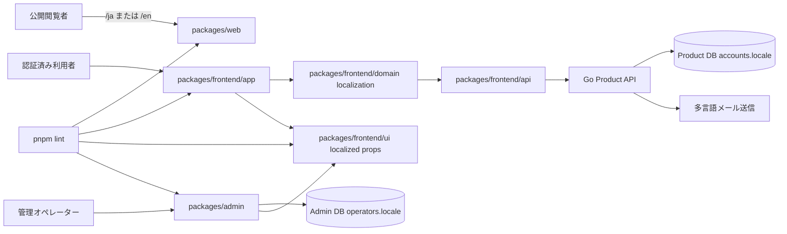
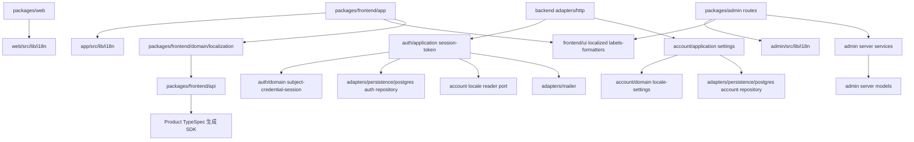
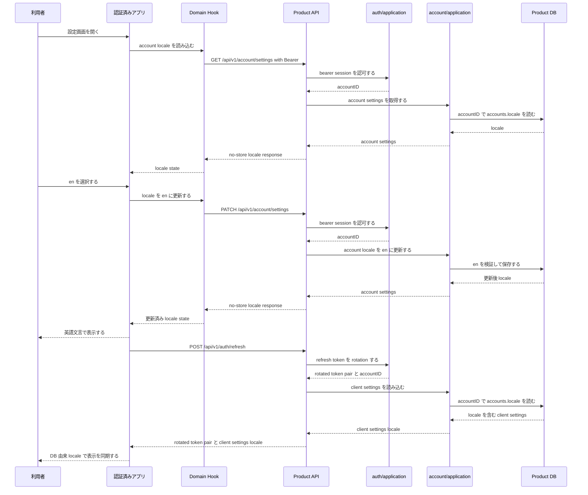
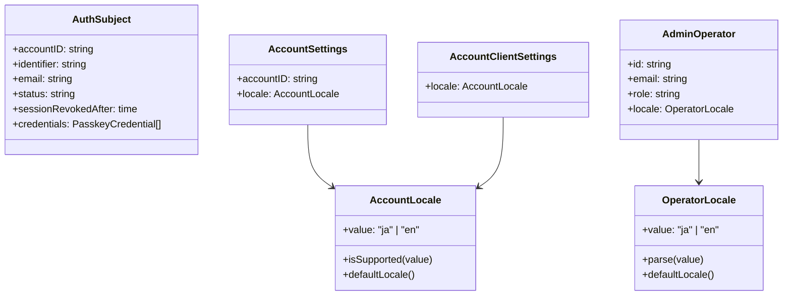
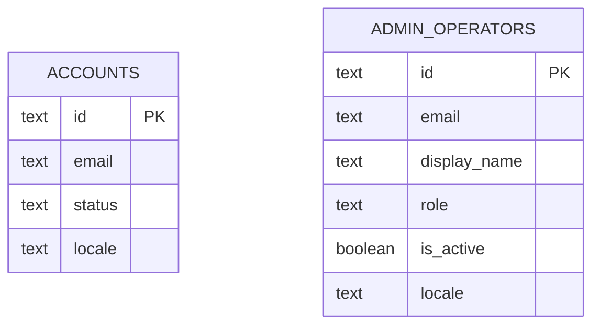
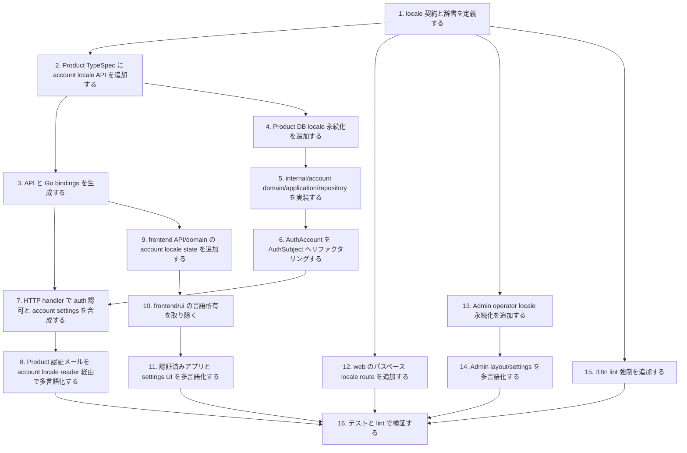

## Scope

この設計は `localization-fe` と `localization-be` の仕様を実装するための構成を定義する。表示言語は初期対応として `ja` と `en` に固定する。公開 Web は URL、認証済みアプリは Product account、Admin Console は Admin operator を言語選択の正とする。

### In Scope

- `packages/web` の `/ja` と `/en` による公開ページ表示、`/` から対応ロケール URL への誘導、公開ページメタデータのローカライズ。
- `packages/frontend/app` と `packages/frontend/domain` のアカウント言語取得、更新、代替言語、設定 UI、認証済み画面文言の辞書化。
- `packages/frontend/ui` の reusable component から固定言語文言と固定 locale formatter を排除し、呼び出し側から localized labels / formatters を注入する境界整備。
- `packages/admin` のオペレーター言語読み込み、設定 UI、Admin layout data、Admin 認証前代替言語、Admin 文言の辞書化。
- Product API のアカウント言語設定取得・更新、TypeSpec 契約、Product DB 永続化、Clean Architecture に基づく `internal/account` 実装、生成物更新。
- Product 認証メールの保存済みアカウント言語による件名・本文選択。
- Admin DB の operator locale 永続化と本人更新処理。
- 対象パッケージに対する i18n lint 強制と辞書キー整合チェック。

### Out of Scope

- `ja` と `en` 以外のロケール追加。
- ユーザー作成時の言語選択 UI。
- 翻訳管理 SaaS、外部翻訳管理、機械翻訳連携。
- Admin から Product account の locale を代理変更する機能。
- 画面ワイヤーフレーム作成。既存の navigation、settings form、locale selector の構成を流用し、情報設計を変える新規画面パターンを導入しないため、本設計では個別 wireframe artifact を要件化しない。

## Assumptions / Dependencies

- TypeSpec は `packages/typespec/main.tsp` を契約の正とし、`pnpm gen` で OpenAPI、frontend SDK、Go bindings を生成する。
- TypeSpec は Product API 契約だけを表し、Admin operator locale、Admin BFF `/api/admin/**`、Admin UI 用 locale symbols を含めない。
- Product API の account locale model は `AccountLocale` / `AccountClientSettings` のように account 所有を名前で明示し、Admin operator locale と共有しない。
- Product API の認証済みエンドポイントは `/api/v1/*` 配下かつ BearerAuth 必須である。
- Product DB migration は `packages/backend/db/migrations/**` に置き、`AutoMigrate` は使用しない。
- Admin DB migration は `packages/admin/prisma/admin/migrations/**` と Prisma Migrate で管理する。
- Product BE は Clean Architecture を徹底し、account locale / account settings / client settings を `packages/backend/internal/account` の domain/application/repository port が所有する。
- `packages/backend/internal/auth` は本人確認、session、token、passkey/recovery 認証フローだけを所有し、locale 値オブジェクトや account settings mutation を持たない。
- `packages/backend/internal/auth` の Product account aggregate と誤読される `AuthAccount` / `AuthAccountRepository` は廃止し、認証主体だけを表す `AuthSubject` / `AuthSubjectRepository` へ置き換える。
- HTTP adapter は `auth` で bearer session を認可して得た account ID を `account` use case へ渡し、account settings response と refresh client settings response を application 境界で合成する。
- `packages/frontend/app` は API を直接呼ばず、`packages/frontend/domain -> packages/frontend/api` の依存方向を維持する。
- `packages/frontend/domain` は Product account settings API 協調だけを担当し、`localStorage`、browser/OS language、DOM globals による端末 fallback を所有しない。
- `packages/frontend/ui` は app/admin の表示言語、固定文言、固定 date/time locale を所有せず、localized props と formatter を呼び出し側から受け取る。
- `packages/web` は公開面として `@www-template/domain` と `@www-template/api` に依存しない。
- `packages/admin` は SvelteKit server routes と server load を持つため、operator locale は server hook と layout load で読み込める。Admin operator locale は Admin package-local symbols で扱い、Product TypeSpec/generated SDK/Product account locale model を import しない。
- 標準検証は `pnpm gen`、`pnpm check:codegen`、`pnpm lint`、`pnpm test:run` を使用する。

## Impacted Areas

- Product API 契約: Product account 専用 locale settings model、認証済み route、refresh response の account-owned client settings locale。Admin operator locale は含めない。
- Product DB: `accounts.locale` column、対応 locale 制約、既定値。
- Go backend: `internal/account` domain/application/repository port、`internal/auth` の認可・token 境界、HTTP strict handler、localized mailer。
- Frontend API client: 生成 SDK と wrapper method。
- Frontend domain: account locale state hook、domain state/types。API wrapper は `packages/frontend/api` に閉じる。
- Frontend app: settings 画面、layout 文言、auth/protected 文言、localStorage 優先 fallback、browser/OS locale resolver。
- Frontend UI: reusable component の localized label props、aria label props、date/time formatter props。
- Public web: locale route、辞書、metadata、root 誘導。
- Admin DB: `admin.operators.locale` column と Prisma model。
- Admin server: operator model、locals、layout data、profile/settings action。
- lint/tooling: ハードコード文言検知と辞書網羅性チェック。
- tests: Go、Vitest、Playwright、lint guard。

## Directory Tree

```text
www-template
├─ package.json
├─ eslint.config.js
├─ scripts
│  └─ i18n
│     └─ check-locales.ts
├─ packages
│  ├─ typespec
│  │  ├─ main.tsp
│  │  ├─ src
│  │  │  ├─ models
│  │  │  │  └─ localization.tsp
│  │  │  └─ routes
│  │  │     └─ v1
│  │  │        └─ account_settings.tsp
│  │  └─ openapi
│  │     └─ openapi.json
│  ├─ backend
│  │  ├─ db
│  │  │  └─ migrations
│  │  │     ├─ 000007_add_account_locale.up.sql
│  │  │     └─ 000007_add_account_locale.down.sql
│  │  └─ internal
│  │     ├─ adapters
│  │     │  ├─ http
│  │     │  │  ├─ router.go
│  │     │  │  └─ account_settings_test.go
│  │     │  ├─ mailer
│  │     │  │  ├─ account_recovery_sender.go
│  │     │  │  ├─ localized_messages.go
│  │     │  │  └─ account_recovery_sender_test.go
│  │     │  └─ persistence
│  │     │     └─ postgres
│  │     │        ├─ account_settings_repository.go
│  │     │        ├─ account_settings_repository_test.go
│  │     │        ├─ auth_subject_repository.go
│  │     │        └─ auth_subject_repository_test.go
│  │     ├─ account
│  │     │  ├─ application
│  │     │  │  ├─ client_settings.go
│  │     │  │  ├─ contracts.go
│  │     │  │  └─ settings_service.go
│  │     │  └─ domain
│  │     │     ├─ account_settings.go
│  │     │     ├─ locale.go
│  │     │     └─ locale_test.go
│  │     ├─ auth
│  │     │  ├─ application
│  │     │  │  ├─ auth_contracts.go
│  │     │  │  ├─ auth_service.go
│  │     │  │  ├─ token_service.go
│  │     │  │  └─ auth_service_test.go
│  │     │  └─ domain
│  │     │     ├─ auth_subject.go
│  │     │     └─ auth_subject_test.go
│  │     └─ generated
│  │        └─ openapi
│  │           └─ openapi.gen.go
│  ├─ frontend
│  │  ├─ api
│  │  │  └─ src
│  │  │     ├─ api
│  │  │     │  └─ client.ts
│  │  │     ├─ generated
│  │  │     │  └─ client.ts
│  │  │     └─ sdk.ts
│  │  ├─ domain
│  │  │  ├─ package.json
│  │  │  └─ src
│  │  │     ├─ index.ts
│  │  │     └─ localization
│  │  │        ├─ hook.svelte.ts
│  │  │        ├─ index.ts
│  │  │        ├─ state.ts
│  │  │        └─ types.ts
│  │  ├─ ui
│  │  │  └─ src
│  │  │     └─ components
│  │  │        └─ device-manager
│  │  │           └─ device-manager.svelte
│  │  └─ app
│  │     └─ src
│  │        ├─ lib
│  │        │  └─ i18n
│  │        │     ├─ index.ts
│  │        │     └─ messages.ts
│  │        └─ routes
│  │           ├─ +layout.svelte
│  │           ├─ login
│  │           │  └─ +page.svelte
│  │           └─ (protected)
│  │              ├─ +layout.svelte
│  │              ├─ +page.svelte
│  │              └─ settings
│  │                 └─ +page.svelte
│  ├─ web
│  │  └─ src
│  │     ├─ lib
│  │     │  └─ i18n.ts
│  │     └─ routes
│  │        ├─ +layout.svelte
│  │        ├─ +page.ts
│  │        └─ [locale]
│  │           └─ +page.svelte
│  └─ admin
│     ├─ prisma
│     │  └─ admin
│     │     ├─ schema.prisma
│     │     └─ migrations
│     │        └─ 000002_add_operator_locale
│     │           └─ migration.sql
│     └─ src
│        ├─ app.d.ts
│        ├─ hooks.server.ts
│        ├─ lib
│        │  ├─ i18n
│        │  │  ├─ index.ts
│        │  │  └─ messages.ts
│        │  └─ server
│        │     ├─ models
│        │     │  ├─ operator_locale.ts
│        │     │  ├─ operators.ts
│        │     │  └─ types.ts
│        │     └─ services
│        │        └─ operators
│        │           └─ locale.ts
│        └─ routes
│           ├─ +layout.server.ts
│           ├─ +layout.svelte
│           └─ settings
│              ├─ +page.server.ts
│              └─ +page.svelte
└─ tests
   └─ i18n-lint.test.ts
```

## New / Changed Files

| Type | File                                                                                     | Change                                                                                                                                          |
| ---- | ---------------------------------------------------------------------------------------- | ----------------------------------------------------------------------------------------------------------------------------------------------- |
| 更新 | `package.json`                                                                           | 標準 `pnpm lint` に i18n lint を組み込む。                                                                                                      |
| 更新 | `eslint.config.js`                                                                       | 対象 UI ソース向けの多言語境界ルールを追加する。                                                                                                |
| 追加 | `scripts/i18n/check-locales.ts`                                                          | `ja` と `en` の辞書キー網羅性を検証する。                                                                                                       |
| 更新 | `packages/typespec/main.tsp`                                                             | localization model と account settings route を読み込む。                                                                                       |
| 追加 | `packages/typespec/src/models/localization.tsp`                                          | Product API 専用の `AccountLocale`、`AccountClientSettings`、account locale request/response model を定義し、Admin operator locale を含めない。 |
| 追加 | `packages/typespec/src/routes/v1/account_settings.tsp`                                   | 認証済み account locale 取得・更新操作と refresh response の account-owned client settings locale を定義する。                                  |
| 生成 | `packages/typespec/openapi/openapi.json`                                                 | OpenAPI 契約を再生成する。                                                                                                                      |
| 追加 | `packages/backend/db/migrations/000007_add_account_locale.up.sql`                        | Product account locale column と制約を追加する。                                                                                                |
| 追加 | `packages/backend/db/migrations/000007_add_account_locale.down.sql`                      | Product account locale column を削除する。                                                                                                      |
| 追加 | `packages/backend/internal/account/domain/locale.go`                                     | Product account locale 値オブジェクト、検証、既定値を定義する。                                                                                 |
| 追加 | `packages/backend/internal/account/domain/account_settings.go`                           | Account settings と client settings の domain DTO を定義する。                                                                                  |
| 追加 | `packages/backend/internal/account/application/contracts.go`                             | Account settings repository port と client settings reader port を定義する。                                                                    |
| 追加 | `packages/backend/internal/account/application/settings_service.go`                      | current account locale の取得・更新ユースケースを実装する。                                                                                     |
| 追加 | `packages/backend/internal/account/application/client_settings.go`                       | refresh response 用の DB 由来 client settings 読み込みを実装する。                                                                              |
| 削除 | `packages/backend/internal/auth/domain/auth_account.go`                                  | Product account aggregate と誤読される AuthAccount model を廃止し、後方互換 accessor も残さない。                                               |
| 追加 | `packages/backend/internal/auth/domain/auth_subject.go`                                  | 認証主体を表す AuthSubject を定義し、account ID、identifier、email、status、session revoked boundary、passkey credential だけを保持する。       |
| 更新 | `packages/backend/internal/auth/application/auth_contracts.go`                           | AuthAccountRepository を AuthSubjectRepository に置き換え、locale mutation、client settings DTO、account settings DTO を除去する。              |
| 更新 | `packages/backend/internal/auth/application/auth_service.go`                             | recovery/device-link delivery と完了メールでは account locale reader port から得た locale だけを使う。                                          |
| 更新 | `packages/backend/internal/auth/application/token_service.go`                            | refresh は token rotation と認証状態検証だけを担当し、client settings は response 合成側に渡す。                                                |
| 追加 | `packages/backend/internal/adapters/persistence/postgres/account_settings_repository.go` | `accounts.locale` の読み書きと client settings 読み込みを account repository adapter として実装する。                                           |
| 削除 | `packages/backend/internal/adapters/persistence/postgres/auth_account_repository.go`     | AuthAccount 命名の repository adapter を廃止する。                                                                                              |
| 追加 | `packages/backend/internal/adapters/persistence/postgres/auth_subject_repository.go`     | auth 用 repository として認証に必要な account status / passkey だけを復元し、locale column は読み込まない。                                     |
| 更新 | `packages/backend/internal/adapters/http/router.go`                                      | Auth で本人認可し、Account service へ account ID を渡して settings/refresh response を合成する。                                                |
| 更新 | `packages/backend/internal/adapters/mailer/account_recovery_sender.go`                   | account locale reader 経由の locale 文字列からメール文面を選択する。                                                                            |
| 追加 | `packages/backend/internal/adapters/mailer/localized_messages.go`                        | 認証メールの日本語・英語テンプレートを定義する。                                                                                                |
| 生成 | `packages/backend/internal/generated/openapi/openapi.gen.go`                             | Go OpenAPI bindings を再生成する。                                                                                                              |
| 生成 | `packages/frontend/api/src/generated/client.ts`                                          | frontend API client を再生成する。                                                                                                              |
| 更新 | `packages/frontend/api/src/sdk.ts`                                                       | account locale SDK method を公開する。                                                                                                          |
| 更新 | `packages/frontend/api/src/api/client.ts`                                                | 既存の API wrapper 集約点に `accountSettingsApi` を追加する。新しい feature-specific wrapper file は作らない。                                  |
| 更新 | `packages/frontend/domain/package.json`                                                  | localization domain entrypoint を公開する。                                                                                                     |
| 更新 | `packages/frontend/domain/src/index.ts`                                                  | localization hook/types を再公開する。                                                                                                          |
| 追加 | `packages/frontend/domain/src/localization/*`                                            | account locale の state、hook、型、index を追加する。API wrapper file、端末 fallback、DOM/localStorage は持たない。                             |
| 更新 | `packages/frontend/ui/src/components/device-manager/device-manager.svelte`               | 固定日本語文言と固定 `ja-JP` formatter を取り除き、localized label、aria label、date/time formatter props を受け取る。                          |
| 追加 | `packages/frontend/app/src/lib/i18n/*`                                                   | app 用 `ja` / `en` 辞書、localStorage 優先 fallback、browser/OS locale resolver を追加する。                                                    |
| 更新 | `packages/frontend/app/src/routes/**`                                                    | login、protected layout、overview、settings を辞書文言に置き換え、UI component へ localized labels/formatters を渡す。                          |
| 追加 | `packages/web/src/lib/i18n.ts`                                                           | public web の locale、辞書、validator を定義する。                                                                                              |
| 更新 | `packages/web/src/routes/**`                                                             | `/` 誘導、`/[locale]` 表示、公開 navigation を実装する。                                                                                        |
| 更新 | `packages/admin/prisma/admin/schema.prisma`                                              | operator locale field を追加する。                                                                                                              |
| 追加 | `packages/admin/prisma/admin/migrations/000002_add_operator_locale/migration.sql`        | operator locale の既定値と制約を永続化する。                                                                                                    |
| 更新 | `packages/admin/src/app.d.ts`                                                            | `App.Locals.operator` に locale を追加する。                                                                                                    |
| 更新 | `packages/admin/src/hooks.server.ts`                                                     | 認証済み operator context に locale を読み込む。                                                                                                |
| 追加 | `packages/admin/src/lib/i18n/*`                                                          | Admin 用 `ja` / `en` 辞書と resolver を追加する。                                                                                               |
| 追加 | `packages/admin/src/lib/server/models/operator_locale.ts`                                | Admin package-local の OperatorLocale 型、parser、validator を定義し、Product TypeSpec/generated SDK を import しない。                         |
| 更新 | `packages/admin/src/lib/server/models/*`                                                 | Operator 型と Prisma mapping に locale を追加する。                                                                                             |
| 追加 | `packages/admin/src/lib/server/services/operators/locale.ts`                             | 認証済み本人の operator locale 更新を実装する。                                                                                                 |
| 更新 | `packages/admin/src/routes/+layout.*`                                                    | layout data と画面表示へ operator locale を渡し、Admin 辞書から navigation を生成する。                                                         |
| 更新 | `packages/admin/src/routes/settings/+page.*`                                             | operator locale 設定 UI と action を追加し、Product API locale 型を使わない。                                                                   |
| 追加 | `tests/i18n-lint.test.ts`                                                                | i18n lint と辞書網羅性チェックの挙動を検証する。                                                                                                |

## System Diagram



## Package Diagram



## Sequence Diagram



## UI Wireframes

N/A - existing navigation, settings form, and locale selector patterns cover this change, so no separate wireframe artifact is required.

## Domain Model Diagram



## ER Diagram



## Package-Level Design

### Package List

| Package                                                   | Purpose / Responsibility                                                  | Public API                                           | Dependencies                                        |
| --------------------------------------------------------- | ------------------------------------------------------------------------- | ---------------------------------------------------- | --------------------------------------------------- |
| `packages/web`                                            | 公開 URL ロケール選択と公開辞書                                           | `/ja`、`/en`、`/`                                    | `@www-template/ui`                                  |
| `packages/frontend/app`                                   | 認証済み UI と設定画面の多言語表示                                        | Svelte routes                                        | `@www-template/domain`、`@www-template/ui`          |
| `packages/frontend/domain`                                | account locale state と domain use case。API wrapper は所有しない         | `useAccountLocalization`                             | `@www-template/api` の public wrapper               |
| `packages/frontend/ui`                                    | 再利用 UI の構造と表示 primitive。言語は所有しない                        | localized label / formatter props                    | なし、または UI 内部 primitive                      |
| `packages/frontend/api`                                   | 型付き API wrapper の集約。account settings も既存 `client.ts` に追加する | `accountSettingsApi`                                 | 生成 SDK                                            |
| `packages/typespec`                                       | Product API account locale 契約                                           | AccountLocale models/routes                          | TypeSpec emitters                                   |
| `packages/backend/internal/account`                       | Product account locale、account settings、client settings                 | Account settings service、client settings reader     | account domain、PostgreSQL port                     |
| `packages/backend/internal/auth`                          | 本人確認、session、token、passkey/recovery 認証フロー                     | AuthService、TokenService                            | auth domain、Valkey、account status reader          |
| `packages/backend/internal/adapters/http`                 | Product API の transport と use case 合成                                 | generated strict handler                             | auth/application、account/application、生成 OpenAPI |
| `packages/backend/internal/adapters/persistence/postgres` | Product account/auth 永続化 adapter                                       | account settings repository、auth subject repository | PostgreSQL、account/auth domain                     |
| `packages/backend/internal/adapters/mailer`               | locale-aware 認証メール送信                                               | AccountRecoverySender                                | SMTP、account locale string                         |
| `packages/admin`                                          | operator locale 永続化と Admin 多言語 UI                                  | server load/action、Prisma model                     | Admin DB、`@www-template/ui`                        |
| `scripts/i18n`                                            | 辞書網羅性検証                                                            | `check-locales.ts`                                   | Node/tsx                                            |

### Details

#### `packages/web`

- 責務: Product API に依存せず、公開 URL のロケール選択と公開辞書を管理する。
- 公開入口: SvelteKit routes `/`、`/ja`、`/en`。
- 主なデータ: `PublicLocale`、公開辞書、route params。
- 主な流れ: root route で対応ロケール URL に誘導し、`[locale]` page で params を検証して辞書文言を表示する。
- エラー処理: 未対応ロケールは翻訳済みページとして扱わない。
- テスト: `LOCALIZATION-FE-S001` から `LOCALIZATION-FE-S003` を Playwright と unit test で確認する。

#### `packages/frontend/domain`

- 責務: 認証済み account locale state と domain use case を管理する。HTTP/generated SDK の wrapper file は所有しない。
- 公開入口: `useAccountLocalization(): { data, actions }` と locale 型。
- 主なデータ: locale union、account settings state、load/update result。
- 主な流れ: auth session 由来の Authorization header を受け取り、`@www-template/api` の既存 `client.ts` から公開される `accountSettingsApi` を呼び出して state を更新し、エラーを domain state に正規化する。
- 禁止事項: `account_settings_api.ts` や `account_settings.ts` などの新規 feature-specific API wrapper file、generated SDK の直接 import、`localStorage`、browser/OS language、DOM globals、UI component import、直接 `fetch` を使わない。端末 fallback は app が所有する。
- エラー処理: unauthenticated、expired、suspended は既存 auth 導線と整合させ、検証エラーは汎用表示にする。
- テスト: `LOCALIZATION-FE-S004` から `LOCALIZATION-FE-S006` の state 挙動を Vitest で確認し、domain/API 配置境界は `ARCH-FE-DOMAIN-API-BOUNDARY` source guard で確認する。

#### `packages/frontend/api`

- 責務: generated SDK を Product frontend 向けの安定した API package wrapper に変換する。既存アーキテクチャに従い wrapper は `src/api/client.ts` に集約する。
- 公開入口: `accountSettingsApi`、account locale SDK methods、API package の既存 `api/client.ts` / `api/index.ts` / `sdk.ts` exports。
- 主なデータ: generated account settings request/response、account-owned client settings DTO。
- 主な流れ: TypeSpec 生成 SDK の account settings 操作を既存 `client.ts` に追加し、domain へは `@www-template/api` の public wrapper だけを公開する。
- 禁止事項: `src/api/account_settings.ts` のような feature-specific wrapper file を作らない。app/domain に generated SDK import や package-local `*_api.ts` wrapper を要求しない。
- テスト: API wrapper unit test と `ARCH-FE-DOMAIN-API-BOUNDARY` guard で domain に API wrapper が増えないこと、API package が既存集約構造を維持することを確認する。

#### `packages/frontend/ui`

- 責務: reusable component の構造、slot、interaction primitive を提供し、言語・辞書・account/admin 文脈を所有しない。
- 公開入口: `DeviceManager` など reusable components の localized label / formatter props。
- 主なデータ: 呼び出し側から渡される label object、aria label builder、date/time formatter function。
- 主な流れ: app/Admin が現在 locale に応じた辞書文言と formatter を作り、UI component は渡された値だけを描画する。
- 禁止事項: 固定日本語、固定英語、固定 `ja-JP` / `en-US` formatter、Product API/domain/Admin server への依存を持たない。
- テスト: `ARCH-FE-UI-LOCALIZED-PROPS` と i18n lint で UI package が表示言語を所有しないことを確認する。

#### `packages/frontend/app`

- 責務: 認証前と認証後の app 文言を辞書から表示し、account locale 設定画面を提供する。
- 公開入口: `/login`、protected root、protected `/settings`。
- 主なデータ: app 辞書、locale resolver、settings form state。
- 主な流れ: 認証前は `localStorage` の対応 locale を優先し、存在しない場合はアクセス時の browser/OS language を `ja` / `en` へ解決する。protected layout は account locale を読み込み、settings は locale 更新後に表示文言を切り替える。refresh 成功後は DB 由来 account-owned client settings locale を正として表示状態を置き換える。`frontend/ui` component へは現在 locale から作った label と formatter を渡す。
- エラー処理: locale 更新失敗はローカライズ済み汎用エラーとして表示する。
- テスト: component test と Playwright で `LOCALIZATION-FE-S004`、`LOCALIZATION-FE-S005`、`LOCALIZATION-FE-S006` を確認する。

#### `packages/backend/internal/account`

- 責務: Product account locale、account settings、refresh response 用 client settings を所有する。auth の本人確認や token rotation は所有しない。
- 公開入口: `SettingsService.Get`、`SettingsService.Update`、`ClientSettingsService.Load`、account settings repository port。
- 主なデータ: account-owned `Locale`、`AccountSettings`、`ClientSettings`、account locale repository port。
- 主な流れ: HTTP adapter から受け取った認可済み accountID で locale を取得・更新し、refresh response 用 client settings を DB から読み込む。
- エラー処理: 未対応 locale は mutation なしで拒否し、存在しない account や永続化不整合は fail-closed で application error に変換する。
- テスト: Account domain/application/repository test と package boundary test で `LOCALIZATION-BE-S001` から `LOCALIZATION-BE-S005`、`LOCALIZATION-BE-S008`、`LOCALIZATION-BE-S013`、`ARCH-BE-ACCOUNT-AUTH-BOUNDARY`、`ARCH-BE-REFRESH-COMPOSITION` を確認する。

#### `packages/typespec`

- 責務: Product API の account locale contract だけを定義する。Admin Console と Admin operator locale は扱わない。
- 公開入口: `AccountLocale`、`AccountClientSettings`、`AccountSettingsResponse`、`UpdateAccountSettingsRequest`、`/api/v1/account/settings`。
- 主なデータ: Product account locale enum、refresh response に合成される account-owned client settings。
- 主な流れ: TypeSpec source を変更し、`pnpm gen` で OpenAPI、frontend SDK、Go bindings を同期する。
- 禁止事項: `OperatorLocale`、Admin operator settings、`/api/admin/**`、Admin BFF symbols を Product TypeSpec/generated artifacts に含めない。
- テスト: `ARCH-BE-PRODUCT-API-CONTRACT`、`pnpm gen`、`pnpm check:codegen`、OpenAPI lint で確認する。

#### `packages/backend/internal/auth`

- 責務: 本人確認、bearer session 認可、token rotation、passkey/recovery/device-link 認証フローを所有する。locale 値オブジェクト、account settings mutation、client settings DTO は所有しない。
- 公開入口: `AuthService`、`TokenService`、auth domain subject、auth subject repository/status reader ports。
- 主なデータ: `AuthSubject`、passkey credential、session metadata、refresh token record、account status / session revoked boundary。
- 主な流れ: bearer session を検証して accountID を返し、refresh token を rotation して token pair と accountID を返す。client settings locale は HTTP adapter が account application から読み込んで response に合成する。
- エラー処理: 未認証、期限切れ、停止中 account、token theft は既存 auth failure に合わせる。
- テスト: Auth service/token test で `AuthSubject` が Product account 設定を持たないこと、refresh token rotation、suspended/revoked 判定を確認する。

#### `packages/backend/internal/adapters/http`

- 責務: generated strict handler として transport 入出力を扱い、auth application と account application を application 境界で合成する。
- 公開入口: `GetAccountSettings`、`UpdateAccountSettings`、`RefreshToken` handler。
- 主な流れ: account settings endpoint は auth で bearer session を認可し、account service へ accountID と request locale を渡す。refresh endpoint は auth で token rotation を完了し、account service で client settings を読み込んで response を組み立てる。
- テスト: HTTP test で `LOCALIZATION-BE-S001` から `LOCALIZATION-BE-S004`、`LOCALIZATION-BE-S013` を確認する。

#### `packages/backend/internal/adapters/mailer`

- 責務: account locale string に基づいて認証メール文面を選択し、SMTP transport へ渡す。locale の所有や更新は行わない。
- 公開入口: `AccountRecoverySender`。
- テスト: Mailer test で `LOCALIZATION-BE-S006` と `LOCALIZATION-BE-S007` を確認する。

#### `packages/admin`

- 責務: Admin operator locale の保存、読み込み、本人更新、Admin UI 文言表示を管理する。
- 公開入口: layout load data、settings load/action、Prisma `AdminOperator.locale`。
- 主なデータ: Admin package-local `OperatorLocale`、`Operator.locale`、`App.Locals.operator.locale`、Admin 辞書。
- 主な流れ: hook が session を検証して operator locale を読み込み、layout と settings へ渡し、settings action が本人 locale だけを更新する。
- 禁止事項: operator locale のために Product TypeSpec/generated SDK、`@www-template/api`、Product account locale model を import しない。
- エラー処理: 更新時の未対応 locale は form error とし、保存値を変更しない。DB から未知 locale が読めた場合は既定値へ黙って丸めず fail-closed にする。
- テスト: Admin service/server/component test で `LOCALIZATION-BE-S009` から `LOCALIZATION-BE-S012`、`ARCH-ADMIN-LOCALE-INDEPENDENCE`、`LOCALIZATION-FE-S007` から `LOCALIZATION-FE-S009` を確認する。

#### `scripts/i18n` と `eslint.config.js`

- 責務: 対象 UI ソースの辞書経由表示、UI label contract、辞書キー網羅性を標準 lint で強制する。
- 公開入口: `pnpm lint`。
- 主なデータ: 対応 locale 一覧、辞書 key path、UI label contract、許可する literal pattern。
- 主な流れ: ESLint がユーザー向け直書き文言と固定 formatter locale を検出し、辞書検証 script が `ja` と `en` の key 差分を検出する。
- エラー処理: file、key、欠落 locale を表示して失敗する。
- テスト: `tests/i18n-lint.test.ts` で `ARCH-I18N-LITERAL-GUARD` と `ARCH-I18N-DICTIONARY-COVERAGE` を確認する。

## Implementation Plan



## Test Plan

### User Acceptance Test (Manual)

| UAT ID                      | Related Requirement                               | Spec Summary                              | Customer Problem Summary                         | Steps                                                    | Expected Behavior                                                   |
| --------------------------- | ------------------------------------------------- | ----------------------------------------- | ------------------------------------------------ | -------------------------------------------------------- | ------------------------------------------------------------------- |
| UAT-LOCALIZATION-FE-HAP-001 | LOCALIZATION-FE-R001 public path locale           | 公開 Web が `/ja` と `/en` を提供する。   | 共有リンクの言語を固定したい。                   | `/`、`/ja`、`/en` を開く。                               | `/` は対応ロケールへ到達し、各 locale page は対応言語で表示される。 |
| UAT-LOCALIZATION-FE-HAP-002 | LOCALIZATION-FE-R002 authenticated account locale | アプリは保存済み account locale を使う。  | 端末ごとの再設定を避けたい。                     | ログイン後に言語を英語へ変更し、別セッションで開く。     | 認証済みアプリが英語で表示される。                                  |
| UAT-LOCALIZATION-FE-HAP-003 | LOCALIZATION-FE-R003 Admin operator locale        | Admin は保存済み operator locale を使う。 | 管理操作の言語を端末間で安定させたい。           | Admin にログインし、自分の言語を変更して再読み込みする。 | Admin navigation と settings が選択言語で表示される。               |
| UAT-LOCALIZATION-BE-HAP-001 | LOCALIZATION-BE-R002 localized mail               | 認証メールは account locale を使う。      | ログイン不能時のメールを理解できる言語にしたい。 | account locale を英語にして recovery を依頼する。        | 復旧メールの件名と本文が英語になる。                                |

### E2E Test (Playwright)

| E2E ID                      | Playwright Test Name                                                       | Related Scenario     | Category | Summary                                                              | Steps (Playwright)                                               | Expected Behavior                                          |
| --------------------------- | -------------------------------------------------------------------------- | -------------------- | -------- | -------------------------------------------------------------------- | ---------------------------------------------------------------- | ---------------------------------------------------------- |
| E2E-LOCALIZATION-FE-HAP-001 | `[LOCALIZATION-FE-S001] 公開 root は対応ロケールへ到達する`                | LOCALIZATION-FE-S001 | HAP      | 公開 root の誘導を確認する。                                         | `/` を開く。                                                     | `ja` または `en` の URL/内容へ解決される。                 |
| E2E-LOCALIZATION-FE-HAP-002 | `[LOCALIZATION-FE-S002] 公開ロケールページはロケール別文言を表示する`      | LOCALIZATION-FE-S002 | HAP      | `/ja` と `/en` の表示差分を確認する。                                | `/ja` と `/en` を順に開く。                                      | 各ページで対応する見出しと metadata が表示される。         |
| E2E-LOCALIZATION-FE-HAP-003 | `[LOCALIZATION-FE-S005] account locale 更新でアプリ文言が切り替わる`       | LOCALIZATION-FE-S005 | HAP      | 設定更新後の文言切り替えを確認する。                                 | 認証後に settings で `en` を選択する。                           | 成功表示と navigation が英語になる。                       |
| E2E-LOCALIZATION-FE-HAP-004 | `[LOCALIZATION-FE-S008] operator locale 更新で Admin 文言が切り替わる`     | LOCALIZATION-FE-S008 | HAP      | Admin 設定更新後の文言切り替えを確認する。                           | Admin 認証後に settings で `en` を選択する。                     | Admin layout/settings が英語になる。                       |
| E2E-LOCALIZATION-FE-HAP-005 | `[LOCALIZATION-FE-S012] refresh 後に DB client settings locale を表示する` | LOCALIZATION-FE-S012 | HAP      | 未ログイン fallback から保存済み account locale への同期を確認する。 | fallback `ja` の状態で refresh response が `locale: en` を返す。 | 認証済み app の navigation と heading が英語へ切り替わる。 |

### Integration Test (Endpoint)

| IT ID                       | Test Name                                                                                    | Genre | Category | Summary                                        | Steps (Test)                                                                       | Expected Behavior                                                                                                    |
| --------------------------- | -------------------------------------------------------------------------------------------- | ----- | -------- | ---------------------------------------------- | ---------------------------------------------------------------------------------- | -------------------------------------------------------------------------------------------------------------------- |
| IT-LOCALIZATION-BE-HAP-001  | `[LOCALIZATION-BE-S001] account locale get は現在値を返す`                                   | be    | HAP      | 認証済み account の locale 取得を確認する。    | locale `ja` の account と bearer を作り GET settings を呼ぶ。                      | 200 no-store response に `locale: ja` が含まれる。                                                                   |
| IT-LOCALIZATION-BE-HAP-002  | `[LOCALIZATION-BE-S002] account locale patch は locale を保存する`                           | be    | HAP      | 認証済み account の locale 更新を確認する。    | locale `ja` の account で PATCH `en` を呼ぶ。                                      | DB と response が `en` になる。                                                                                      |
| IT-LOCALIZATION-BE-ERR-001  | `[LOCALIZATION-BE-S003] 未対応 account locale は拒否される`                                  | be    | ERR      | 未対応 locale で変更されないことを確認する。   | 未対応 locale で PATCH する。                                                      | error response となり DB locale は変化しない。                                                                       |
| IT-LOCALIZATION-BE-SEC-001  | `[LOCALIZATION-BE-S004] 未認証 account locale request は拒否される`                          | be    | SEC      | bearer 必須を確認する。                        | bearer なしで account locale API を呼ぶ。                                          | auth failure となり永続値は変化しない。                                                                              |
| IT-LOCALIZATION-BE-HAP-003  | `[LOCALIZATION-BE-S010] operator は自分の locale を更新できる`                               | be    | HAP      | Admin operator locale 更新を確認する。         | operator 認証後、自分の locale 更新 action を送る。                                | 自分の record だけが更新される。                                                                                     |
| IT-LOCALIZATION-BE-HAP-004  | `[LOCALIZATION-BE-S013] refresh は DB client settings locale を返す`                         | be    | HAP      | refresh response の locale 同期を確認する。    | locale `en` の account で refresh を呼ぶ。                                         | token pair と client settings `locale: en` が返る。                                                                  |
| IT-LOCALIZATION-BE-ARCH-001 | `[ARCH-BE-REFRESH-COMPOSITION] refresh は auth と account を境界で合成する`                  | be    | ARCH     | refresh の Clean Architecture 境界を確認する。 | refresh handler と service 境界を検査する。                                        | auth は token rotation、account は client settings 読み込みだけを担当する。                                          |
| IT-LOCALIZATION-BE-ARCH-002 | `[ARCH-BE-AUTH-SUBJECT] AuthSubject は Product account aggregate ではない`                   | be    | ARCH     | auth domain 命名と所有境界を確認する。         | auth domain/application と postgres auth repository の public symbols を検査する。 | `AuthAccount` / `AuthAccountRepository` は残らず、`AuthSubject` / `AuthSubjectRepository` が認証主体だけを扱う。     |
| IT-LOCALIZATION-BE-ARCH-003 | `[ARCH-BE-PRODUCT-API-CONTRACT] Product TypeSpec は Admin locale を含まない`                 | be    | ARCH     | Product API contract 境界を確認する。          | TypeSpec/OpenAPI/generated SDK の symbols と paths を検査する。                    | Product API contract は AccountLocale/AccountClientSettings だけを含み、Admin locale と `/api/admin/**` を含まない。 |
| IT-LOCALIZATION-BE-ARCH-004 | `[ARCH-ADMIN-LOCALE-INDEPENDENCE] Admin operator locale は Product API 契約から独立している` | be    | ARCH     | Admin locale 境界を確認する。                  | `packages/admin` の locale imports と symbols を検査する。                         | Admin は Product TypeSpec/generated SDK/Product account locale model を operator locale に使わない。                 |

### Unit/Component Test (UT)

| UT ID                       | Test Name                                                                                   | Package                        | Category | Summary                                           | Steps (Test)                                                                                                                               | Expected Behavior                                                                                                                                      |
| --------------------------- | ------------------------------------------------------------------------------------------- | ------------------------------ | -------- | ------------------------------------------------- | ------------------------------------------------------------------------------------------------------------------------------------------ | ------------------------------------------------------------------------------------------------------------------------------------------------------ |
| UT-LOCALIZATION-FE-HAP-001  | `[LOCALIZATION-FE-S004] account locale state は保存済み locale を保持し app 表示へ反映する` | frontend/domain + frontend/app | HAP      | domain hook と app 表示の読み込み結果を確認する。 | API mock が `en` を返す状態で load action と protected layout を描画する。                                                                 | data locale が `en` になり、navigation、heading、操作 label が英語になる。                                                                             |
| UT-LOCALIZATION-FE-HAP-002  | `[LOCALIZATION-FE-S006] login は localStorage または system locale で表示する`              | frontend/app                   | HAP      | 認証前画面の fallback 表示を確認する。            | 認証 state なしで login route を描画し、localStorage locale と browser/OS locale の両方を検証する。                                        | 端末保存 locale が優先され、存在しない場合は system locale の文言が表示され、account settings API は呼ばれない。                                       |
| UT-LOCALIZATION-FE-HAP-003  | `[LOCALIZATION-FE-S007] Admin layout は operator locale を使う`                             | admin                          | HAP      | layout data の locale 反映を確認する。            | `locale: en` の layout data で描画する。                                                                                                   | Admin navigation label が英語になる。                                                                                                                  |
| UT-LOCALIZATION-FE-ARCH-000 | `[ARCH-FE-DOMAIN-API-BOUNDARY] Domain localization は API wrapper を所有しない`             | frontend/domain + frontend/api | ARCH     | frontend domain/API の配置境界を確認する。        | `packages/frontend/domain/src/localization` の file 名と imports、`packages/frontend/api/src/api/client.ts` の wrapper export を検査する。 | account settings API wrapper は既存 `client.ts` にあり、domain localization は hook/state/types/index だけを持ち、generated SDK を直接 import しない。 |
| UT-LOCALIZATION-FE-ARCH-001 | `[ARCH-FE-UI-LOCALIZED-PROPS] reusable UI は表示言語を所有しない`                           | frontend/ui                    | ARCH     | UI package の言語所有排除を確認する。             | DeviceManager などに label object と formatter を渡して描画し、source guard で固定文言/固定 locale を検査する。                            | UI component は渡された labels/formatter だけを表示し、固定日本語、固定英語、固定 `ja-JP` / `en-US` を持たない。                                       |
| UT-LOCALIZATION-FE-REG-001  | `[ARCH-I18N-LITERAL-GUARD] 未翻訳 UI literal は lint で失敗する`                            | tooling                        | REG      | ハードコード文言検知を確認する。                  | 直書き文言 fixture に lint rule を実行する。                                                                                               | 違反が報告される。                                                                                                                                     |
| UT-LOCALIZATION-FE-REG-002  | `[ARCH-I18N-DICTIONARY-COVERAGE] 辞書欠落 key は検証で失敗する`                             | tooling                        | REG      | 辞書網羅性を確認する。                            | `en` key が欠けた fixture で locale check を実行する。                                                                                     | 欠落 key path が報告される。                                                                                                                           |
| UT-LOCALIZATION-BE-HAP-001  | `[LOCALIZATION-BE-S006] recovery email は account locale を使う`                            | backend/mailer                 | HAP      | メールテンプレート選択を確認する。                | locale `en` の delivery で message を生成する。                                                                                            | 件名と本文が英語になり token は log に出ない。                                                                                                         |
| UT-LOCALIZATION-BE-BND-001  | `[LOCALIZATION-BE-S008] 不正 Product locale は拒否される`                                   | backend/domain                 | BND      | locale validation を確認する。                    | 未対応 locale を検証する。                                                                                                                 | domain または persistence が拒否する。                                                                                                                 |
| UT-LOCALIZATION-BE-ARCH-001 | `[ARCH-BE-ACCOUNT-AUTH-BOUNDARY] locale domain は account に所属する`                       | backend/account + backend/auth | ARCH     | account/auth の package boundary を確認する。     | package/import 境界テストまたは grep guard で auth 配下の locale/account settings 所有を検査する。                                         | locale 値オブジェクト、settings use case、client settings DTO は account 配下にあり、auth 配下に存在しない。                                           |
| UT-LOCALIZATION-BE-ARCH-002 | `[ARCH-BE-AUTH-SUBJECT] auth subject は account settings を持たない`                        | backend/auth                   | ARCH     | auth subject のドメイン意味を確認する。           | AuthSubject の constructor/accessor と repository port を検査する。                                                                        | AuthSubject は認証に必要な ID、identifier、email、status、session revoked boundary、passkey credential だけを公開する。                                |

## Rollback / Migration

- Product DB rollback は `000007_add_account_locale.down.sql` で `accounts.locale` を削除する。locale は preference data のため、rollback 後は保存済み設定を失い、代替言語に戻る。
- Admin DB rollback は Prisma migration rollback、または `admin.operators.locale` を削除する rollback SQL で行う。locale は preference data のため、保存済み operator 設定を失う。
- 契約 rollback は TypeSpec の locale route/model を戻し、`pnpm gen` で OpenAPI、frontend SDK、Go bindings を再生成する。
- アプリケーション rollback は locale UI、API wrapper、メール文面選択、lint 強制をまとめて戻し、生成 symbol や lint rule の不整合を残さない。

## Release Procedure

- TypeSpec 変更後に `pnpm gen` を実行する。
- `pnpm check:codegen` で生成物の整合を確認する。
- 各環境で `pnpm db:migrate:product` により Product DB migration を適用する。
- 各環境で `pnpm prisma:admin:migrate:deploy` により Admin DB migration を適用する。
- `pnpm lint` を実行し、i18n lint を含めて検証する。
- `pnpm test:run` を実行する。
- リリース前に `pnpm build` を実行する。
- 非本番環境で `/ja`、`/en`、認証済みアプリ設定、Admin 設定、復旧メール言語を smoke test する。

## Acceptance Criteria

- 公開 Web が `/ja` と `/en` で locale 別文言と metadata を表示し、`/` が対応ロケールへ到達する。
- 認証済みアプリが domain/API 境界を守って account locale を読み書きし、app route から Product API を直接 import しない。
- account settings API wrapper は既存 `packages/frontend/api/src/api/client.ts` に存在し、`packages/frontend/domain/src/localization` は API wrapper file と generated SDK import を持たない。
- Product TypeSpec/generated SDK が Product account locale だけを表し、Admin operator locale や `/api/admin/**` を含まない。
- `packages/frontend/ui` が表示言語や固定 formatter locale を所有せず、app/Admin から localized labels/formatters を受け取る。
- Product API が未対応 locale と未認証 locale request を拒否し、永続値を変更しない。
- Product BE で account locale、account settings、client settings が `internal/account` に所属し、`internal/auth` は locale/account settings を所有しない。
- Product BE の auth domain は `AuthSubject` を認証主体として使い、`AuthAccount` / `AuthAccountRepository` 命名と後方互換 accessor を残さない。
- Product 認証メールが保存済み account locale から日本語または英語文面を選ぶ。
- Admin Console が operator locale を server context に読み込み、認証済み本人だけが自分の locale を更新できる。Admin operator locale は Admin package-local で、Product TypeSpec/generated SDK を参照しない。
- 標準 `pnpm lint` が未翻訳のユーザー向け UI 文言と対応ロケール辞書の欠落 key で失敗する。
- `pnpm gen`、`pnpm check:codegen`、`pnpm lint`、`pnpm test:run` が通る。

## Open Issues

なし。初期対応ロケールと永続化の所有者は、`ja` / `en`、Product account locale、Admin operator locale に固定する。
