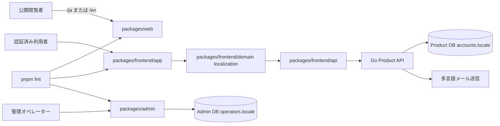
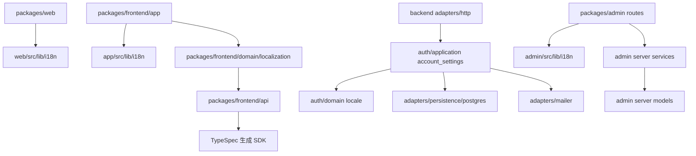
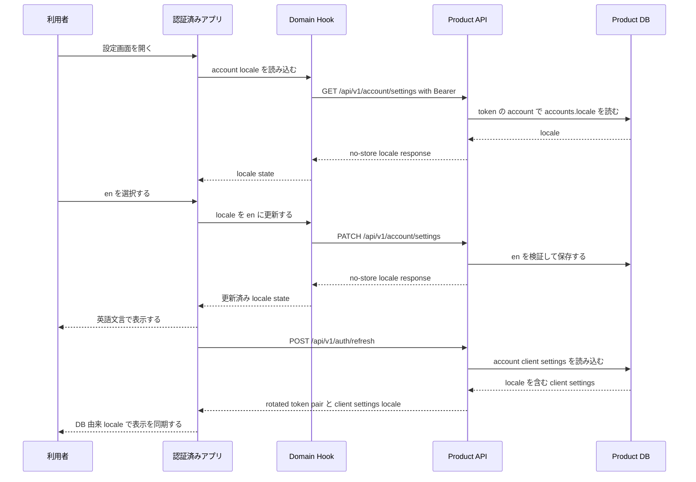
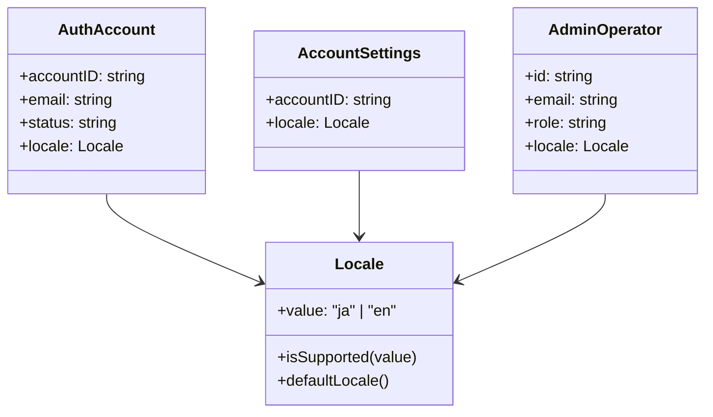
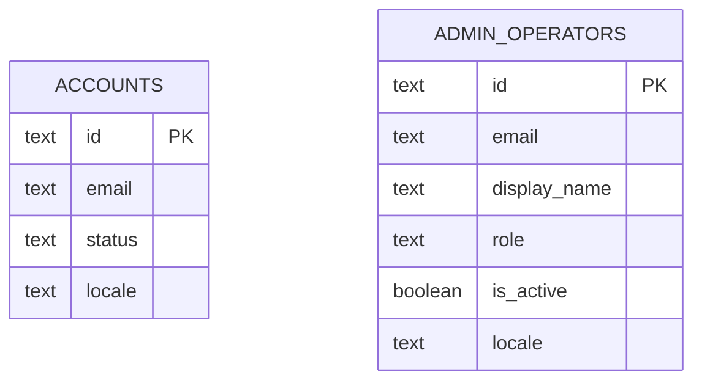
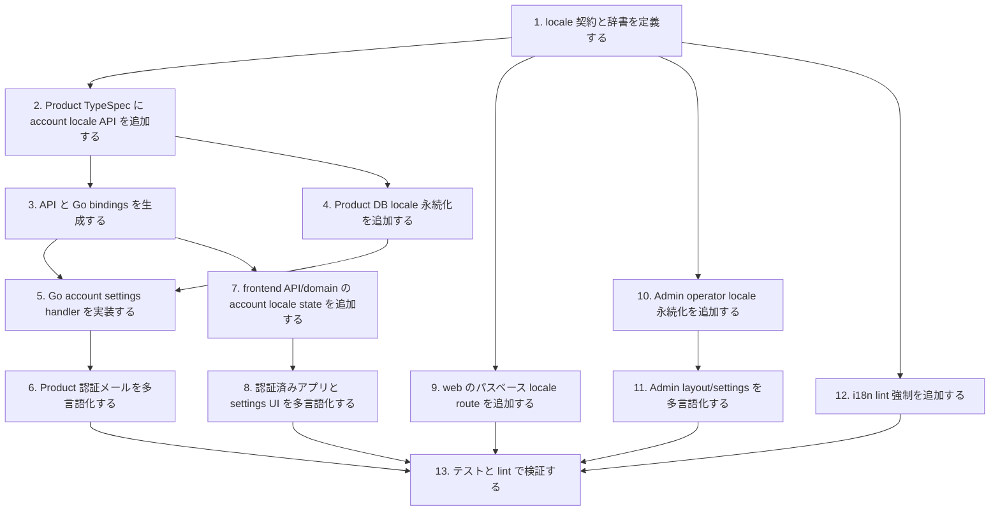

## Scope

この設計は `localization-fe` と `localization-be` の仕様を実装するための構成を定義する。表示言語は初期対応として `ja` と `en` に固定する。公開 Web は URL、認証済みアプリは Product account、Admin Console は Admin operator を言語選択の正とする。

### In Scope

- `packages/web` の `/ja` と `/en` による公開ページ表示、`/` から対応ロケール URL への誘導、公開ページメタデータのローカライズ。
- `packages/frontend/app` と `packages/frontend/domain` のアカウント言語取得、更新、代替言語、設定 UI、認証済み画面文言の辞書化。
- `packages/admin` のオペレーター言語読み込み、設定 UI、Admin layout data、Admin 認証前代替言語、Admin 文言の辞書化。
- Product API のアカウント言語設定取得・更新、TypeSpec 契約、Product DB 永続化、Go 実装、生成物更新。
- Product 認証メールの保存済みアカウント言語による件名・本文選択。
- Admin DB の operator locale 永続化と本人更新処理。
- 対象パッケージに対する i18n lint 強制と辞書キー整合チェック。

### Out of Scope

- `ja` と `en` 以外のロケール追加。
- ユーザー作成時の言語選択 UI。
- 翻訳管理 SaaS、外部翻訳管理、機械翻訳連携。
- Admin から Product account の locale を代理変更する機能。
- 画面ワイヤーフレーム作成。既存の navigation、settings form、locale selector の構成を流用し、情報設計を変える新規画面パターンを導入しないため、本設計では個別 wireframe artifact を要件化しない。

## Assumptions / Dependencies

- TypeSpec は `packages/typespec/main.tsp` を契約の正とし、`pnpm gen` で OpenAPI、frontend SDK、Go bindings を生成する。
- Product API の認証済みエンドポイントは `/api/v1/*` 配下かつ BearerAuth 必須である。
- Product DB migration は `packages/backend/db/migrations/**` に置き、`AutoMigrate` は使用しない。
- Admin DB migration は `packages/admin/prisma/admin/migrations/**` と Prisma Migrate で管理する。
- `packages/frontend/app` は API を直接呼ばず、`packages/frontend/domain -> packages/frontend/api` の依存方向を維持する。
- `packages/web` は公開面として `@www-template/domain` と `@www-template/api` に依存しない。
- `packages/admin` は SvelteKit server routes と server load を持つため、operator locale は server hook と layout load で読み込める。
- 標準検証は `pnpm gen`、`pnpm check:codegen`、`pnpm lint`、`pnpm test:run` を使用する。

## Impacted Areas

- Product API 契約: account locale settings model、認証済み route、refresh response の client settings locale。
- Product DB: `accounts.locale` column、対応 locale 制約、既定値。
- Go backend: domain model、repository、application use case、HTTP strict handler、localized mailer。
- Frontend API client: 生成 SDK と wrapper method。
- Frontend domain: locale state hook、account settings API wrapper、辞書型。
- Frontend app: settings 画面、layout 文言、auth/protected 文言、localStorage 優先 fallback、browser/OS locale resolver。
- Public web: locale route、辞書、metadata、root 誘導。
- Admin DB: `admin.operators.locale` column と Prisma model。
- Admin server: operator model、locals、layout data、profile/settings action。
- lint/tooling: ハードコード文言検知と辞書網羅性チェック。
- tests: Go、Vitest、Playwright、lint guard。

## Directory Tree

```text
www-template
├─ package.json
├─ eslint.config.js
├─ scripts
│  └─ i18n
│     └─ check-locales.ts
├─ packages
│  ├─ typespec
│  │  ├─ main.tsp
│  │  ├─ src
│  │  │  ├─ models
│  │  │  │  └─ localization.tsp
│  │  │  └─ routes
│  │  │     └─ v1
│  │  │        └─ account_settings.tsp
│  │  └─ openapi
│  │     └─ openapi.json
│  ├─ backend
│  │  ├─ db
│  │  │  └─ migrations
│  │  │     ├─ 000007_add_account_locale.up.sql
│  │  │     └─ 000007_add_account_locale.down.sql
│  │  └─ internal
│  │     ├─ adapters
│  │     │  ├─ http
│  │     │  │  ├─ router.go
│  │     │  │  └─ account_settings_test.go
│  │     │  ├─ mailer
│  │     │  │  ├─ account_recovery_sender.go
│  │     │  │  ├─ localized_messages.go
│  │     │  │  └─ account_recovery_sender_test.go
│  │     │  └─ persistence
│  │     │     └─ postgres
│  │     │        ├─ auth_account_repository.go
│  │     │        └─ auth_account_repository_test.go
│  │     ├─ auth
│  │     │  ├─ application
│  │     │  │  ├─ account_settings.go
│  │     │  │  ├─ auth_contracts.go
│  │     │  │  ├─ auth_service.go
│  │     │  │  └─ auth_service_test.go
│  │     │  └─ domain
│  │     │     ├─ auth_account.go
│  │     │     ├─ locale.go
│  │     │     └─ auth_account_test.go
│  │     └─ generated
│  │        └─ openapi
│  │           └─ openapi.gen.go
│  ├─ frontend
│  │  ├─ api
│  │  │  └─ src
│  │  │     ├─ api
│  │  │     │  └─ client.ts
│  │  │     ├─ generated
│  │  │     │  └─ client.ts
│  │  │     └─ sdk.ts
│  │  ├─ domain
│  │  │  ├─ package.json
│  │  │  └─ src
│  │  │     ├─ index.ts
│  │  │     └─ localization
│  │  │        ├─ account_settings_api.ts
│  │  │        ├─ hook.svelte.ts
│  │  │        ├─ index.ts
│  │  │        └─ types.ts
│  │  └─ app
│  │     └─ src
│  │        ├─ lib
│  │        │  └─ i18n
│  │        │     ├─ index.ts
│  │        │     └─ messages.ts
│  │        └─ routes
│  │           ├─ +layout.svelte
│  │           ├─ login
│  │           │  └─ +page.svelte
│  │           └─ (protected)
│  │              ├─ +layout.svelte
│  │              ├─ +page.svelte
│  │              └─ settings
│  │                 └─ +page.svelte
│  ├─ web
│  │  └─ src
│  │     ├─ lib
│  │     │  └─ i18n.ts
│  │     └─ routes
│  │        ├─ +layout.svelte
│  │        ├─ +page.ts
│  │        └─ [locale]
│  │           └─ +page.svelte
│  └─ admin
│     ├─ prisma
│     │  └─ admin
│     │     ├─ schema.prisma
│     │     └─ migrations
│     │        └─ 000002_add_operator_locale
│     │           └─ migration.sql
│     └─ src
│        ├─ app.d.ts
│        ├─ hooks.server.ts
│        ├─ lib
│        │  ├─ i18n
│        │  │  ├─ index.ts
│        │  │  └─ messages.ts
│        │  └─ server
│        │     ├─ models
│        │     │  ├─ operators.ts
│        │     │  └─ types.ts
│        │     └─ services
│        │        └─ operators
│        │           └─ locale.ts
│        └─ routes
│           ├─ +layout.server.ts
│           ├─ +layout.svelte
│           └─ settings
│              ├─ +page.server.ts
│              └─ +page.svelte
└─ tests
   └─ i18n-lint.test.ts
```

## New / Changed Files

| Type | File                                                                                 | Change                                                                                                    |
| ---- | ------------------------------------------------------------------------------------ | --------------------------------------------------------------------------------------------------------- |
| 更新 | `package.json`                                                                       | 標準 `pnpm lint` に i18n lint を組み込む。                                                                |
| 更新 | `eslint.config.js`                                                                   | 対象 UI ソース向けの多言語境界ルールを追加する。                                                          |
| 追加 | `scripts/i18n/check-locales.ts`                                                      | `ja` と `en` の辞書キー網羅性を検証する。                                                                 |
| 更新 | `packages/typespec/main.tsp`                                                         | localization model と account settings route を読み込む。                                                 |
| 追加 | `packages/typespec/src/models/localization.tsp`                                      | 対応 locale enum と account locale request/response model を定義する。                                    |
| 追加 | `packages/typespec/src/routes/v1/account_settings.tsp`                               | 認証済み account locale 取得・更新操作と refresh response の client settings locale を定義する。          |
| 生成 | `packages/typespec/openapi/openapi.json`                                             | OpenAPI 契約を再生成する。                                                                                |
| 追加 | `packages/backend/db/migrations/000007_add_account_locale.up.sql`                    | Product account locale column と制約を追加する。                                                          |
| 追加 | `packages/backend/db/migrations/000007_add_account_locale.down.sql`                  | Product account locale column を削除する。                                                                |
| 追加 | `packages/backend/internal/auth/domain/locale.go`                                    | domain 用 locale 検証と既定値を定義する。                                                                 |
| 更新 | `packages/backend/internal/auth/domain/auth_account.go`                              | AuthAccount に locale と accessor を追加する。                                                            |
| 追加 | `packages/backend/internal/auth/application/account_settings.go`                     | current account locale の取得・更新ユースケースを実装する。                                               |
| 更新 | `packages/backend/internal/auth/application/auth_contracts.go`                       | account locale DTO と repository method を追加する。                                                      |
| 更新 | `packages/backend/internal/auth/application/auth_service.go`                         | recovery/device-link delivery、完了メール、refresh response の client settings へ account locale を渡す。 |
| 更新 | `packages/backend/internal/adapters/persistence/postgres/auth_account_repository.go` | `accounts.locale` の読み書きを実装する。                                                                  |
| 更新 | `packages/backend/internal/adapters/http/router.go`                                  | 生成 handler に対応する account locale HTTP 実装を追加する。                                              |
| 更新 | `packages/backend/internal/adapters/mailer/account_recovery_sender.go`               | delivery/account locale からメール文面を選択する。                                                        |
| 追加 | `packages/backend/internal/adapters/mailer/localized_messages.go`                    | 認証メールの日本語・英語テンプレートを定義する。                                                          |
| 生成 | `packages/backend/internal/generated/openapi/openapi.gen.go`                         | Go OpenAPI bindings を再生成する。                                                                        |
| 生成 | `packages/frontend/api/src/generated/client.ts`                                      | frontend API client を再生成する。                                                                        |
| 更新 | `packages/frontend/api/src/sdk.ts`                                                   | account locale SDK method を公開する。                                                                    |
| 更新 | `packages/frontend/api/src/api/client.ts`                                            | account settings wrapper method を追加する。                                                              |
| 更新 | `packages/frontend/domain/package.json`                                              | localization domain entrypoint を公開する。                                                               |
| 更新 | `packages/frontend/domain/src/index.ts`                                              | localization hook/types を再公開する。                                                                    |
| 追加 | `packages/frontend/domain/src/localization/*`                                        | account locale の API wrapper、state hook、型、index を追加する。                                         |
| 追加 | `packages/frontend/app/src/lib/i18n/*`                                               | app 用 `ja` / `en` 辞書、localStorage 優先 fallback、browser/OS locale resolver を追加する。              |
| 更新 | `packages/frontend/app/src/routes/**`                                                | login、protected layout、overview、settings を辞書文言に置き換える。                                      |
| 追加 | `packages/web/src/lib/i18n.ts`                                                       | public web の locale、辞書、validator を定義する。                                                        |
| 更新 | `packages/web/src/routes/**`                                                         | `/` 誘導、`/[locale]` 表示、公開 navigation を実装する。                                                  |
| 更新 | `packages/admin/prisma/admin/schema.prisma`                                          | operator locale field を追加する。                                                                        |
| 追加 | `packages/admin/prisma/admin/migrations/000002_add_operator_locale/migration.sql`    | operator locale の既定値と制約を永続化する。                                                              |
| 更新 | `packages/admin/src/app.d.ts`                                                        | `App.Locals.operator` に locale を追加する。                                                              |
| 更新 | `packages/admin/src/hooks.server.ts`                                                 | 認証済み operator context に locale を読み込む。                                                          |
| 追加 | `packages/admin/src/lib/i18n/*`                                                      | Admin 用 `ja` / `en` 辞書と resolver を追加する。                                                         |
| 更新 | `packages/admin/src/lib/server/models/*`                                             | Operator 型と Prisma mapping に locale を追加する。                                                       |
| 追加 | `packages/admin/src/lib/server/services/operators/locale.ts`                         | 認証済み本人の operator locale 更新を実装する。                                                           |
| 更新 | `packages/admin/src/routes/+layout.*`                                                | layout data と画面表示へ operator locale を渡す。                                                         |
| 更新 | `packages/admin/src/routes/settings/+page.*`                                         | operator locale 設定 UI と action を追加する。                                                            |
| 追加 | `tests/i18n-lint.test.ts`                                                            | i18n lint と辞書網羅性チェックの挙動を検証する。                                                          |

## System Diagram



## Package Diagram



## Sequence Diagram



## UI Wireframes

N/A - existing navigation, settings form, and locale selector patterns cover this change, so no separate wireframe artifact is required.

## Domain Model Diagram



## ER Diagram



## Package-Level Design

### Package List

| Package                    | Purpose / Responsibility                 | Public API                           | Dependencies                               |
| -------------------------- | ---------------------------------------- | ------------------------------------ | ------------------------------------------ |
| `packages/web`             | 公開 URL ロケール選択と公開辞書          | `/ja`、`/en`、`/`                    | `@www-template/ui`                         |
| `packages/frontend/app`    | 認証済み UI と設定画面の多言語表示       | Svelte routes                        | `@www-template/domain`、`@www-template/ui` |
| `packages/frontend/domain` | account locale state と API 協調         | `useAccountLocalization`             | `@www-template/api`                        |
| `packages/frontend/api`    | 型付き account settings API wrapper      | `accountSettingsApi`                 | 生成 SDK                                   |
| `packages/typespec`        | Product API locale 契約                  | locale models/routes                 | TypeSpec emitters                          |
| `packages/backend`         | Product locale 永続化、API、メール選択   | Go handler/usecase/repository/mailer | PostgreSQL、生成 OpenAPI                   |
| `packages/admin`           | operator locale 永続化と Admin 多言語 UI | server load/action、Prisma model     | Admin DB、`@www-template/ui`               |
| `scripts/i18n`             | 辞書網羅性検証                           | `check-locales.ts`                   | Node/tsx                                   |

### Details

#### `packages/web`

- 責務: Product API に依存せず、公開 URL のロケール選択と公開辞書を管理する。
- 公開入口: SvelteKit routes `/`、`/ja`、`/en`。
- 主なデータ: `SupportedLocale`、公開辞書、route params。
- 主な流れ: root route で対応ロケール URL に誘導し、`[locale]` page で params を検証して辞書文言を表示する。
- エラー処理: 未対応ロケールは翻訳済みページとして扱わない。
- テスト: `LOCALIZATION-FE-S001` から `LOCALIZATION-FE-S003` を Playwright と unit test で確認する。

#### `packages/frontend/domain`

- 責務: 認証済み account locale state と API 呼び出しの協調を管理する。
- 公開入口: `useAccountLocalization(): { data, actions }` と locale 型。
- 主なデータ: locale union、account settings state、load/update result。
- 主な流れ: auth session から Authorization header を作り、account locale を取得・更新し、エラーを正規化する。
- エラー処理: unauthenticated、expired、suspended は既存 auth 導線と整合させ、検証エラーは汎用表示にする。
- テスト: `LOCALIZATION-FE-S004` から `LOCALIZATION-FE-S006` の state 挙動を Vitest で確認する。

#### `packages/frontend/app`

- 責務: 認証前と認証後の app 文言を辞書から表示し、account locale 設定画面を提供する。
- 公開入口: `/login`、protected root、protected `/settings`。
- 主なデータ: app 辞書、locale resolver、settings form state。
- 主な流れ: 認証前は `localStorage` の対応 locale を優先し、存在しない場合はアクセス時の browser/OS language を `ja` / `en` へ解決する。protected layout は account locale を読み込み、settings は locale 更新後に表示文言を切り替える。refresh 成功後は DB 由来 client settings locale を正として表示状態を置き換える。
- エラー処理: locale 更新失敗はローカライズ済み汎用エラーとして表示する。
- テスト: component test と Playwright で `LOCALIZATION-FE-S004`、`LOCALIZATION-FE-S005`、`LOCALIZATION-FE-S006` を確認する。

#### `packages/backend`

- 責務: Product account locale の検証、永続化、API 提供、メール文言選択を管理する。
- 公開入口: account locale read/update の generated strict handler、locale-aware mail sender。
- 主なデータ: `Locale`、account settings DTO、`AuthAccount.Locale()`。
- 主な流れ: bearer session 認可、account lookup、locale read/update、no-store response、recovery/device-link メールの文言選択。
- エラー処理: 未対応 locale は mutation なしで拒否し、未認証・期限切れ・停止中は既存 auth failure に合わせる。
- テスト: Go HTTP、repository、mailer test で `LOCALIZATION-BE-S001` から `LOCALIZATION-BE-S008` を確認する。

#### `packages/admin`

- 責務: Admin operator locale の保存、読み込み、本人更新、Admin UI 文言表示を管理する。
- 公開入口: layout load data、settings load/action、Prisma `AdminOperator.locale`。
- 主なデータ: `Operator.locale`、`App.Locals.operator.locale`、Admin 辞書。
- 主な流れ: hook が session を検証して operator locale を読み込み、layout と settings へ渡し、settings action が本人 locale だけを更新する。
- エラー処理: 未対応 locale は form error とし、保存値を変更しない。
- テスト: Admin service/server/component test で `LOCALIZATION-BE-S009` から `LOCALIZATION-BE-S012` と `LOCALIZATION-FE-S007` から `LOCALIZATION-FE-S009` を確認する。

#### `scripts/i18n` と `eslint.config.js`

- 責務: 対象 UI ソースの辞書経由表示と辞書キー網羅性を標準 lint で強制する。
- 公開入口: `pnpm lint`。
- 主なデータ: 対応 locale 一覧、辞書 key path、許可する literal pattern。
- 主な流れ: ESLint がユーザー向け直書き文言を検出し、辞書検証 script が `ja` と `en` の key 差分を検出する。
- エラー処理: file、key、欠落 locale を表示して失敗する。
- テスト: `tests/i18n-lint.test.ts` で `LOCALIZATION-FE-S010` と `LOCALIZATION-FE-S011` を確認する。

## Implementation Plan



## Test Plan

### User Acceptance Test (Manual)

| UAT ID                      | Related Requirement                               | Spec Summary                              | Customer Problem Summary                         | Steps                                                    | Expected Behavior                                                   |
| --------------------------- | ------------------------------------------------- | ----------------------------------------- | ------------------------------------------------ | -------------------------------------------------------- | ------------------------------------------------------------------- |
| UAT-LOCALIZATION-FE-HAP-001 | LOCALIZATION-FE-R001 public path locale           | 公開 Web が `/ja` と `/en` を提供する。   | 共有リンクの言語を固定したい。                   | `/`、`/ja`、`/en` を開く。                               | `/` は対応ロケールへ到達し、各 locale page は対応言語で表示される。 |
| UAT-LOCALIZATION-FE-HAP-002 | LOCALIZATION-FE-R002 authenticated account locale | アプリは保存済み account locale を使う。  | 端末ごとの再設定を避けたい。                     | ログイン後に言語を英語へ変更し、別セッションで開く。     | 認証済みアプリが英語で表示される。                                  |
| UAT-LOCALIZATION-FE-HAP-003 | LOCALIZATION-FE-R003 Admin operator locale        | Admin は保存済み operator locale を使う。 | 管理操作の言語を端末間で安定させたい。           | Admin にログインし、自分の言語を変更して再読み込みする。 | Admin navigation と settings が選択言語で表示される。               |
| UAT-LOCALIZATION-BE-HAP-001 | LOCALIZATION-BE-R002 localized mail               | 認証メールは account locale を使う。      | ログイン不能時のメールを理解できる言語にしたい。 | account locale を英語にして recovery を依頼する。        | 復旧メールの件名と本文が英語になる。                                |

### E2E Test (Playwright)

| E2E ID                      | Playwright Test Name                                                       | Related Scenario     | Category | Summary                                                              | Steps (Playwright)                                               | Expected Behavior                                          |
| --------------------------- | -------------------------------------------------------------------------- | -------------------- | -------- | -------------------------------------------------------------------- | ---------------------------------------------------------------- | ---------------------------------------------------------- |
| E2E-LOCALIZATION-FE-HAP-001 | `[LOCALIZATION-FE-S001] 公開 root は対応ロケールへ到達する`                | LOCALIZATION-FE-S001 | HAP      | 公開 root の誘導を確認する。                                         | `/` を開く。                                                     | `ja` または `en` の URL/内容へ解決される。                 |
| E2E-LOCALIZATION-FE-HAP-002 | `[LOCALIZATION-FE-S002] 公開ロケールページはロケール別文言を表示する`      | LOCALIZATION-FE-S002 | HAP      | `/ja` と `/en` の表示差分を確認する。                                | `/ja` と `/en` を順に開く。                                      | 各ページで対応する見出しと metadata が表示される。         |
| E2E-LOCALIZATION-FE-HAP-003 | `[LOCALIZATION-FE-S005] account locale 更新でアプリ文言が切り替わる`       | LOCALIZATION-FE-S005 | HAP      | 設定更新後の文言切り替えを確認する。                                 | 認証後に settings で `en` を選択する。                           | 成功表示と navigation が英語になる。                       |
| E2E-LOCALIZATION-FE-HAP-004 | `[LOCALIZATION-FE-S008] operator locale 更新で Admin 文言が切り替わる`     | LOCALIZATION-FE-S008 | HAP      | Admin 設定更新後の文言切り替えを確認する。                           | Admin 認証後に settings で `en` を選択する。                     | Admin layout/settings が英語になる。                       |
| E2E-LOCALIZATION-FE-HAP-005 | `[LOCALIZATION-FE-S012] refresh 後に DB client settings locale を表示する` | LOCALIZATION-FE-S012 | HAP      | 未ログイン fallback から保存済み account locale への同期を確認する。 | fallback `ja` の状態で refresh response が `locale: en` を返す。 | 認証済み app の navigation と heading が英語へ切り替わる。 |

### Integration Test (Endpoint)

| IT ID                      | Test Name                                                            | Genre | Category | Summary                                      | Steps (Test)                                                  | Expected Behavior                                   |
| -------------------------- | -------------------------------------------------------------------- | ----- | -------- | -------------------------------------------- | ------------------------------------------------------------- | --------------------------------------------------- |
| IT-LOCALIZATION-BE-HAP-001 | `[LOCALIZATION-BE-S001] account locale get は現在値を返す`           | be    | HAP      | 認証済み account の locale 取得を確認する。  | locale `ja` の account と bearer を作り GET settings を呼ぶ。 | 200 no-store response に `locale: ja` が含まれる。  |
| IT-LOCALIZATION-BE-HAP-002 | `[LOCALIZATION-BE-S002] account locale patch は locale を保存する`   | be    | HAP      | 認証済み account の locale 更新を確認する。  | locale `ja` の account で PATCH `en` を呼ぶ。                 | DB と response が `en` になる。                     |
| IT-LOCALIZATION-BE-ERR-001 | `[LOCALIZATION-BE-S003] 未対応 account locale は拒否される`          | be    | ERR      | 未対応 locale で変更されないことを確認する。 | 未対応 locale で PATCH する。                                 | error response となり DB locale は変化しない。      |
| IT-LOCALIZATION-BE-SEC-001 | `[LOCALIZATION-BE-S004] 未認証 account locale request は拒否される`  | be    | SEC      | bearer 必須を確認する。                      | bearer なしで account locale API を呼ぶ。                     | auth failure となり永続値は変化しない。             |
| IT-LOCALIZATION-BE-HAP-003 | `[LOCALIZATION-BE-S010] operator は自分の locale を更新できる`       | be    | HAP      | Admin operator locale 更新を確認する。       | operator 認証後、自分の locale 更新 action を送る。           | 自分の record だけが更新される。                    |
| IT-LOCALIZATION-BE-HAP-004 | `[LOCALIZATION-BE-S013] refresh は DB client settings locale を返す` | be    | HAP      | refresh response の locale 同期を確認する。  | locale `en` の account で refresh を呼ぶ。                    | token pair と client settings `locale: en` が返る。 |

### Unit/Component Test (UT)

| UT ID                      | Test Name                                                                                   | Package                        | Category | Summary                                           | Steps (Test)                                                                                        | Expected Behavior                                                                                                |
| -------------------------- | ------------------------------------------------------------------------------------------- | ------------------------------ | -------- | ------------------------------------------------- | --------------------------------------------------------------------------------------------------- | ---------------------------------------------------------------------------------------------------------------- |
| UT-LOCALIZATION-FE-HAP-001 | `[LOCALIZATION-FE-S004] account locale state は保存済み locale を保持し app 表示へ反映する` | frontend/domain + frontend/app | HAP      | domain hook と app 表示の読み込み結果を確認する。 | API mock が `en` を返す状態で load action と protected layout を描画する。                          | data locale が `en` になり、navigation、heading、操作 label が英語になる。                                       |
| UT-LOCALIZATION-FE-HAP-002 | `[LOCALIZATION-FE-S006] login は localStorage または system locale で表示する`              | frontend/app                   | HAP      | 認証前画面の fallback 表示を確認する。            | 認証 state なしで login route を描画し、localStorage locale と browser/OS locale の両方を検証する。 | 端末保存 locale が優先され、存在しない場合は system locale の文言が表示され、account settings API は呼ばれない。 |
| UT-LOCALIZATION-FE-HAP-003 | `[LOCALIZATION-FE-S007] Admin layout は operator locale を使う`                             | admin                          | HAP      | layout data の locale 反映を確認する。            | `locale: en` の layout data で描画する。                                                            | Admin navigation label が英語になる。                                                                            |
| UT-LOCALIZATION-FE-REG-001 | `[LOCALIZATION-FE-S010] 未翻訳 UI literal は lint で失敗する`                               | tooling                        | REG      | ハードコード文言検知を確認する。                  | 直書き文言 fixture に lint rule を実行する。                                                        | 違反が報告される。                                                                                               |
| UT-LOCALIZATION-FE-REG-002 | `[LOCALIZATION-FE-S011] 辞書欠落 key は検証で失敗する`                                      | tooling                        | REG      | 辞書網羅性を確認する。                            | `en` key が欠けた fixture で locale check を実行する。                                              | 欠落 key path が報告される。                                                                                     |
| UT-LOCALIZATION-BE-HAP-001 | `[LOCALIZATION-BE-S006] recovery email は account locale を使う`                            | backend/mailer                 | HAP      | メールテンプレート選択を確認する。                | locale `en` の delivery で message を生成する。                                                     | 件名と本文が英語になり token は log に出ない。                                                                   |
| UT-LOCALIZATION-BE-BND-001 | `[LOCALIZATION-BE-S008] 不正 Product locale は拒否される`                                   | backend/domain                 | BND      | locale validation を確認する。                    | 未対応 locale を検証する。                                                                          | domain または persistence が拒否する。                                                                           |

## Rollback / Migration

- Product DB rollback は `000007_add_account_locale.down.sql` で `accounts.locale` を削除する。locale は preference data のため、rollback 後は保存済み設定を失い、代替言語に戻る。
- Admin DB rollback は Prisma migration rollback、または `admin.operators.locale` を削除する rollback SQL で行う。locale は preference data のため、保存済み operator 設定を失う。
- 契約 rollback は TypeSpec の locale route/model を戻し、`pnpm gen` で OpenAPI、frontend SDK、Go bindings を再生成する。
- アプリケーション rollback は locale UI、API wrapper、メール文面選択、lint 強制をまとめて戻し、生成 symbol や lint rule の不整合を残さない。

## Release Procedure

- TypeSpec 変更後に `pnpm gen` を実行する。
- `pnpm check:codegen` で生成物の整合を確認する。
- 各環境で `pnpm db:migrate:product` により Product DB migration を適用する。
- 各環境で `pnpm prisma:admin:migrate:deploy` により Admin DB migration を適用する。
- `pnpm lint` を実行し、i18n lint を含めて検証する。
- `pnpm test:run` を実行する。
- リリース前に `pnpm build` を実行する。
- 非本番環境で `/ja`、`/en`、認証済みアプリ設定、Admin 設定、復旧メール言語を smoke test する。

## Acceptance Criteria

- 公開 Web が `/ja` と `/en` で locale 別文言と metadata を表示し、`/` が対応ロケールへ到達する。
- 認証済みアプリが domain/API 境界を守って account locale を読み書きし、app route から Product API を直接 import しない。
- Product API が未対応 locale と未認証 locale request を拒否し、永続値を変更しない。
- Product 認証メールが保存済み account locale から日本語または英語文面を選ぶ。
- Admin Console が operator locale を server context に読み込み、認証済み本人だけが自分の locale を更新できる。
- 標準 `pnpm lint` が未翻訳のユーザー向け UI 文言と対応ロケール辞書の欠落 key で失敗する。
- `pnpm gen`、`pnpm check:codegen`、`pnpm lint`、`pnpm test:run` が通る。

## Open Issues

なし。初期対応ロケールと永続化の所有者は、`ja` / `en`、Product account locale、Admin operator locale に固定する。
