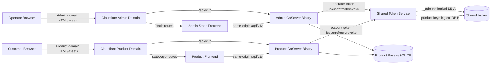
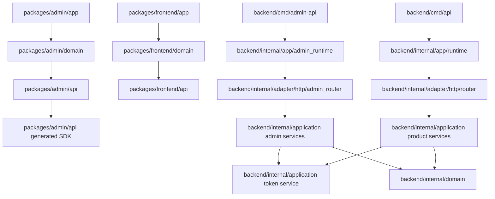
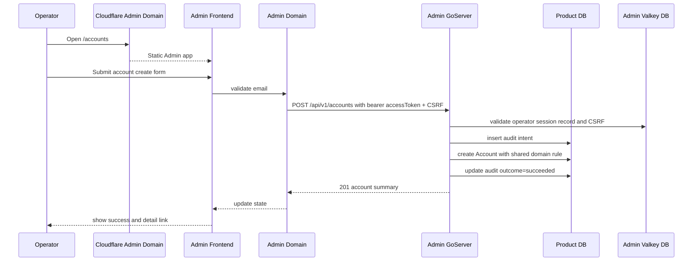
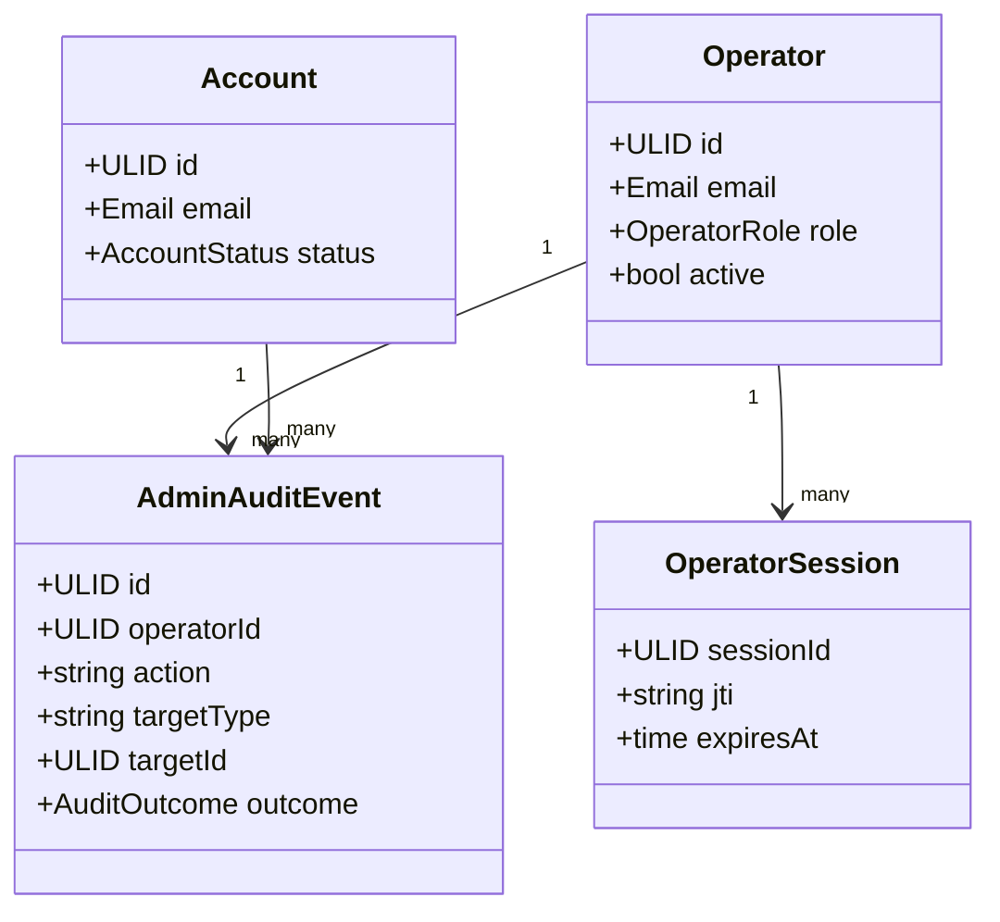
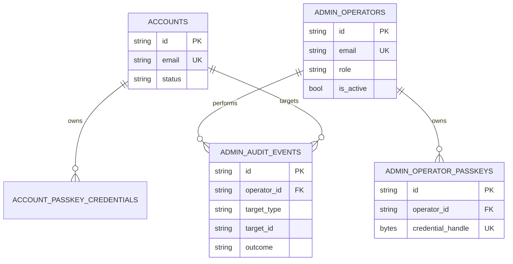
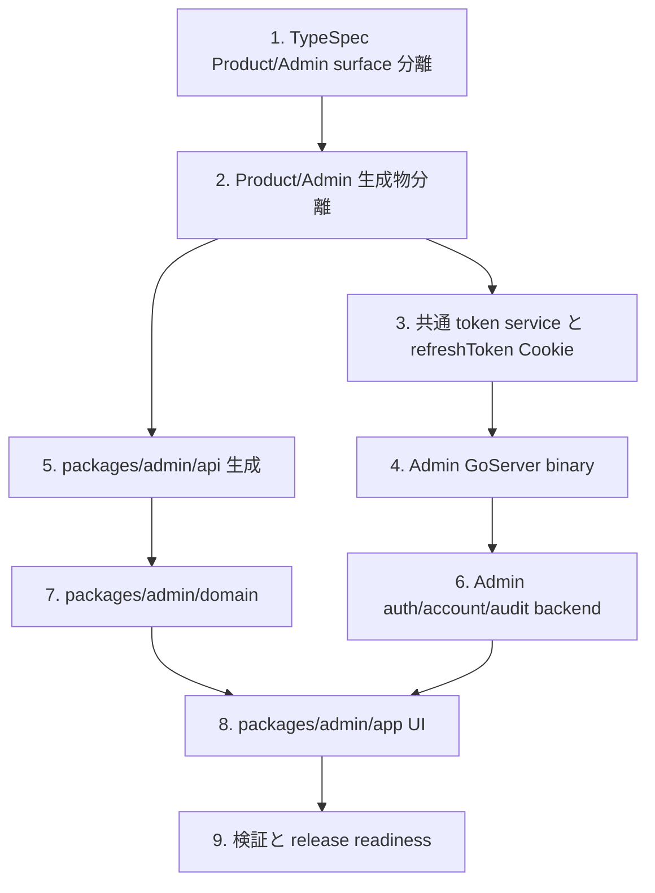

## Scope

この設計は、Admin backend 責務を `packages/admin` から Go backend の Admin 専用 binary へ移し、Admin frontend を `packages/admin/app -> packages/admin/domain -> packages/admin/api` の静的 client として再構成する。Admin frontend と Admin backend は同一 Admin ドメインでホストし、Cloudflare が静的 frontend と GoServer の `/api/v1/*` を振り分ける。Product と Admin の境界は path ではなく、別ドメイン、別 binary、別 OpenAPI、別 SDK、別 Go bindings で分離する。

### In Scope

- `api-contract-be`: Product / Admin surface を TypeSpec と生成物で分離する。
- `admin-console-fe`: `packages/admin/app -> packages/admin/domain -> packages/admin/api` の静的 client 構造と Account 作成 UI を追加する。
- `admin-console-be`: Admin 専用 Go binary、Product DB 内 Admin schema、Admin account creation、Admin audit intent/outcome を実装する。
- `admin-auth-fe`: 静的 Admin UI から same-origin `/api/v1/*` の Admin backend auth API を利用する。
- `admin-auth-be`: Admin auth API、operator session middleware、Origin / CSRF / same-site cookie、Admin Valkey logical DB 分離を実装する。
- `auth-be`: Product account 認証と Admin operator 認証で再利用する accessToken / refreshToken service、refreshToken Cookie 発行・rotation・revoke、TTL validation を実装する。
- `auth-fe`: Product frontend の refreshToken 保持を browser-readable storage から HttpOnly Cookie 前提に変更し、accessToken のみを browser-readable session state として扱う。
- Repository rules: `/api/v1/*` path policy を維持しつつ、Product/Admin surface 分離を AGENTS、CODING_STANDARDS、CONTRIBUTING、lint/codegen policy に反映する。

### Out of Scope

- Product user 向け signup UX の追加。
- 顧客初回 passkey 登録メール配送の新規実装。
- Admin UI の全面 redesign。
- Admin audit OpenSearch 検索基盤の刷新。

## Assumptions / Dependencies

- Admin frontend と Admin backend は同一 Admin ドメインで提供され、Cloudflare が `/api/v1/*` を Admin GoServer へ、それ以外を静的 frontend へルーティングする。
- Product frontend と Product backend も Product ドメインで同様に提供されるが、Admin ドメインとは一致しない。
- Product/Admin はどちらも `/api/v1/*` path policy を使うため、TypeSpec service、OpenAPI artifact、SDK package、Go bindings、binary registration が分離境界になる。
- Product account 認証ドメインと Admin operator 認証ドメインは同じ token service を再利用するが、identity claim、session state、Valkey logical DB、key prefix は混同しない。
- Product/Admin どちらも accessToken は bearer token として browser-readable memory state に置き、refreshToken は `HttpOnly; Secure; SameSite=Lax; Path=/` Cookie として server が発行・rotation・revoke する。
- Product DB migration は `packages/backend/db/migrations/**` と既存 `pnpm migrate:*` script を使う。
- Admin TypeScript SDK は `packages/admin/api` に閉じ、`packages/frontend/api` には生成しない。
- Verification command は `pnpm gen`、`pnpm check`、`pnpm lint`、`pnpm test:run`、`pnpm build`、必要に応じて `pnpm test:e2e` を使用する。

## Impacted Areas

- API contract: TypeSpec service split、Product/Admin OpenAPI、surface contamination check、SDK / Go bindings generation。
- Backend: Admin binary、Admin router、共通 token service、operator auth middleware、Origin / CSRF、refreshToken Cookie、Admin account handlers、Admin audit service、Product DB migration、Valkey config validation。
- Admin frontend: static build、`packages/admin/app`、`packages/admin/domain`、`packages/admin/api`、Account 作成 UI、auth flow、lint boundary。
- DB: Product DB 内 Admin-owned schema、operator / passkey / audit persistence、Account creation audit、least-privilege roles。
- Security: Product/Admin domain separation、same-origin Admin API、Product bearer token rejection on Admin API、refreshToken browser-readable storage 排除、no-store、security headers、generated artifact isolation。
- Operations: Cloudflare route rules、Product/Admin binary deployment、Product/Admin generated artifact drift check、monitoring labels。

## Directory Tree

```text
www-template
├─ AGENTS.md
├─ CODING_STANDARDS.md
├─ CONTRIBUTING.md
├─ eslint.config.js
├─ package.json
├─ packages
│  ├─ typespec
│  │  ├─ main.tsp
│  │  ├─ package.json
│  │  ├─ tspconfig.yaml
│  │  ├─ src/services/product.tsp
│  │  ├─ src/services/admin.tsp
│  │  ├─ src/routes/admin-v1/_namespace.tsp
│  │  ├─ src/routes/admin-v1/accounts.tsp
│  │  ├─ src/routes/admin-v1/auth.tsp
│  │  ├─ openapi/openapi.json
│  │  └─ openapi/admin.openapi.json
│  ├─ backend
│  │  ├─ cmd/api/main.go
│  │  ├─ cmd/admin-api/main.go
│  │  ├─ db/migrations/000000_admin_schema.up.sql
│  │  ├─ db/migrations/000000_admin_schema.down.sql
│  │  ├─ internal/generated/openapi/openapi.gen.go
│  │  ├─ internal/generated/adminopenapi/openapi.gen.go
│  │  ├─ internal/app/runtime.go
│  │  ├─ internal/app/admin_runtime.go
│  │  ├─ internal/adapter/http/router.go
│  │  ├─ internal/adapter/http/admin_router.go
│  │  ├─ internal/adapter/http/admin_auth.go
│  │  ├─ internal/adapter/http/admin_accounts.go
│  │  ├─ internal/application/admin_account_service.go
│  │  ├─ internal/application/admin_audit_service.go
│  │  ├─ internal/adapter/postgres/admin_repository.go
│  │  ├─ internal/adapter/valkey/admin_store.go
│  │  └─ internal/platform/config/types.go
│  └─ admin
│     ├─ package.json
│     ├─ svelte.config.js
│     ├─ app/src/routes/accounts/+page.svelte
│     ├─ app/src/routes/accounts/[id]/+page.svelte
│     ├─ app/src/routes/login/+page.svelte
│     ├─ app/src/routes/operator-setup/+page.svelte
│     ├─ app/src/lib/components/accounts/AccountCreateForm.svelte
│     ├─ domain/src/accounts.ts
│     ├─ domain/src/auth.ts
│     ├─ api/orval.config.ts
│     ├─ api/src/client.ts
│     └─ api/src/generated/client.ts
└─ scripts
   ├─ codegen/check.sh
   └─ go/gen-backend.sh
```

## New / Changed Files

| Type   | File                                                                      | Change                                                                                                              |
| ------ | ------------------------------------------------------------------------- | ------------------------------------------------------------------------------------------------------------------- |
| Update | `AGENTS.md`                                                               | Admin ownership、`/api/v1/*` surface 分離、`packages/admin/app/domain/api` を反映する。                             |
| Update | `CODING_STANDARDS.md`                                                     | Product/Admin とも `/api/v1/*` を使い、origin と生成物で分離する policy を追加する。                                |
| Update | `CONTRIBUTING.md`                                                         | Product/Admin の生成物、binary、Cloudflare route 前提を更新する。                                                   |
| Update | `eslint.config.js`                                                        | Admin app/domain/api layer、Product SDK import 禁止、server-only file 禁止を追加する。                              |
| Update | `package.json`                                                            | `pnpm gen`、`pnpm check`、`pnpm lint`、`pnpm build:server` が Admin surface を扱うようにする。                      |
| Update | `packages/typespec/main.tsp`                                              | Product/Admin service entrypoint を分ける。                                                                         |
| Update | `packages/typespec/package.json`                                          | Product/Admin OpenAPI generation と lint scripts を分離する。                                                       |
| Update | `packages/typespec/tspconfig.yaml`                                        | surface 別 emit 設定を追加する。                                                                                    |
| Add    | `packages/typespec/src/services/product.tsp`                              | Product service metadata と server を定義する。                                                                     |
| Add    | `packages/typespec/src/services/admin.tsp`                                | Admin service metadata と Admin server を定義する。                                                                 |
| Add    | `packages/typespec/src/routes/admin-v1/_namespace.tsp`                    | Admin `/api/v1` namespace を定義する。                                                                              |
| Add    | `packages/typespec/src/routes/admin-v1/accounts.tsp`                      | Admin account operations を定義する。                                                                               |
| Add    | `packages/typespec/src/routes/admin-v1/auth.tsp`                          | Admin auth operations を定義する。                                                                                  |
| Add    | `packages/typespec/openapi/admin.openapi.json`                            | Admin OpenAPI generated artifact を追加する。                                                                       |
| Update | `scripts/go/gen-backend.sh`                                               | Product/Admin Go bindings を別 package に生成する。                                                                 |
| Update | `scripts/codegen/check.sh`                                                | Product/Admin artifacts の drift と contamination を検証する。                                                      |
| Add    | `packages/backend/cmd/admin-api/main.go`                                  | Admin API binary entrypoint を追加する。                                                                            |
| Add    | `packages/backend/internal/generated/adminopenapi/openapi.gen.go`         | Admin Go server bindings を追加する。                                                                               |
| Add    | `packages/backend/internal/app/admin_runtime.go`                          | Admin runtime composition を追加する。                                                                              |
| Add    | `packages/backend/internal/adapter/http/admin_router.go`                  | Admin `/api/v1/*` router と middleware chain を追加する。                                                           |
| Add    | `packages/backend/internal/adapter/http/admin_auth.go`                    | Admin auth handlers と middleware を追加する。                                                                      |
| Add    | `packages/backend/internal/adapter/http/admin_accounts.go`                | Admin account handlers を追加する。                                                                                 |
| Update | `packages/backend/internal/adapter/http/auth.go`                          | Product auth response を accessToken body + refreshToken Cookie model に変更する。                                  |
| Add    | `packages/backend/internal/adapter/http/auth_cookie.go`                   | Product/Admin 共通の refreshToken Cookie 発行・削除 helper を追加する。                                             |
| Add    | `packages/backend/internal/application/token_service.go`                  | Product account と Admin operator で共有する accessToken / refreshToken 発行・rotation・revoke service を追加する。 |
| Add    | `packages/backend/internal/application/admin_account_service.go`          | Account domain rule を共有する Admin account use case を追加する。                                                  |
| Add    | `packages/backend/internal/application/admin_audit_service.go`            | Admin audit intent/outcome を追加する。                                                                             |
| Add    | `packages/backend/internal/adapter/postgres/admin_repository.go`          | Product DB 内 Admin schema repository を追加する。                                                                  |
| Add    | `packages/backend/internal/adapter/valkey/admin_store.go`                 | Admin logical DB / `admin:*` prefix store を追加する。                                                              |
| Add    | `packages/backend/db/migrations/000000_admin_schema.up.sql`               | Admin schema migration を追加する。                                                                                 |
| Add    | `packages/backend/db/migrations/000000_admin_schema.down.sql`             | Admin schema rollback migration を追加する。                                                                        |
| Update | `packages/admin/package.json`                                             | server-only dependencies と Prisma scripts を削除し、app/domain/api scripts を整理する。                            |
| Update | `packages/admin/svelte.config.js`                                         | static frontend build に変更する。                                                                                  |
| Add    | `packages/admin/api/orval.config.ts`                                      | Admin SDK を package-local に生成する。                                                                             |
| Add    | `packages/admin/api/src/client.ts`                                        | same-origin `/api/v1/*` wrapper、CSRF、request ID、Product domain rejection を扱う。                                |
| Add    | `packages/admin/api/src/generated/client.ts`                              | Admin generated SDK を package-local に保持する。                                                                   |
| Add    | `packages/admin/domain/src/accounts.ts`                                   | Account list/detail/create domain state と validation を扱う。                                                      |
| Add    | `packages/admin/domain/src/auth.ts`                                       | Admin auth flow、current operator、logout、CSRF state を扱う。                                                      |
| Update | `packages/frontend/domain/src/auth/**`                                    | Product refreshToken を browser-readable state から除外し、Cookie refresh 前提へ変更する。                          |
| Update | `packages/frontend/app/src/**`                                            | Product auth UI の session state 表示と refresh/logout 処理を accessToken-only state 前提へ変更する。               |
| Add    | `packages/admin/app/src/lib/components/accounts/AccountCreateForm.svelte` | Account 作成フォームを追加する。                                                                                    |
| Update | `packages/admin/app/src/routes/accounts/+page.svelte`                     | Account 作成 action と domain state に接続する。                                                                    |
| Update | `packages/admin/app/src/routes/login/+page.svelte`                        | same-origin Admin auth API に接続する。                                                                             |
| Delete | `packages/admin/src/lib/server/**`                                        | server-only ownership を削除する。                                                                                  |
| Delete | `packages/admin/src/routes/api/**`                                        | package-local BFF を削除する。                                                                                      |
| Delete | `packages/admin/src/routes/**/+page.server.ts`                            | SvelteKit server load/actions を削除する。                                                                          |

## System Diagram



## Package Diagram



## Sequence Diagram



## UI Wireframes

N/A — wireframe not yet generated

## Domain Model Diagram



## ER Diagram



## Package-Level Design

### Package List

| Package                          | Purpose / Responsibility                           | Public API                                | Dependencies                      |
| -------------------------------- | -------------------------------------------------- | ----------------------------------------- | --------------------------------- |
| `packages/typespec`              | Product/Admin contract surface と shared model     | `pnpm gen:openapi`、Product/Admin OpenAPI | TypeSpec emitters                 |
| `packages/admin/api`             | Admin package-local SDK と same-origin API wrapper | Admin SDK wrapper                         | Admin OpenAPI                     |
| `packages/admin/domain`          | Admin frontend domain state                        | account/auth domain functions             | `packages/admin/api`              |
| `packages/admin/app`             | Static Admin Svelte app                            | routes/components                         | `packages/admin/domain`, UI, i18n |
| `packages/backend/cmd/admin-api` | Admin GoServer binary                              | Admin `/api/v1/*`                         | Admin runtime                     |
| `packages/backend/cmd/api`       | Product GoServer binary                            | Product `/api/v1/*`                       | Product runtime                   |

### Details

#### packages/typespec

- Purpose / Responsibility: Product と Admin を別 service として表現し、shared model だけを再利用する。
- Public API: Product OpenAPI と Admin OpenAPI。
- Key Data Structures: Account ID、error response、pagination、Admin account creation DTO、Admin auth DTO。
- Key Flows: `pnpm gen` が Product/Admin OpenAPI、Product/Admin SDK、Product/Admin Go bindings を生成する。
- Dependencies: TypeSpec core / OpenAPI emitter。
- Error Handling: Product artifact に Admin operation が混入した場合は codegen check で失敗する。
- Testing Strategy: `API-CONTRACT-BE-S001` から `API-CONTRACT-BE-S007` を artifact scan と import-boundary test で検証する。
- Non-Functional: deterministic generation を維持する。
- Performance: build-time only。
- Security: path ではなく surface artifact と origin で Admin/Product を分離する。

#### packages/backend

- Purpose / Responsibility: Product API と Admin API を別 binary として構成し、Account domain を一元化する。
- Public API: Product domain の `/api/v1/*`、Admin domain の `/api/v1/*`。
- Key Data Structures: Account、Operator、OperatorSession、AdminAuditEvent、CSRF binding、Product/Admin refreshToken state、Admin Valkey record。
- Key Flows: Product login は account accessToken と refreshToken Cookie を発行する。Admin login は operator accessToken と refreshToken Cookie を同じ token service で発行する。Admin request は Origin、operator accessToken、operator session、CSRF、RBAC、audit intent、domain mutation、audit outcome の順に処理する。
- Dependencies: generated Product/Admin Go bindings、PostgreSQL、Valkey。
- Error Handling: validation は 400、duplicate は 409、RBAC は 403、session failure は 401/403、audit intent failure は fail-close 5xx。
- Testing Strategy: route isolation、account creation、audit failure、Product/Admin token Cookie、Valkey DB validation、Origin/CSRF を `pnpm test:server` で検証する。
- Non-Functional: Product/Admin runtime で metrics label を分ける。
- Performance: Account creation は単一 transaction と audit write に限定する。
- Security: Product bearer token は Admin API で認可せず、refreshToken は Product/Admin とも browser-readable storage に露出しない。

#### packages/admin

- Purpose / Responsibility: Static Admin frontend、operator UX、client-side validation、domain state、same-origin Admin API 呼び出し。
- Public API: `/login`、`/operator-setup`、`/accounts`、`/accounts/[id]`、AccountCreateForm、domain functions。
- Key Data Structures: AccountCreateInput、AccountSummary、CurrentOperator、OperatorAccessTokenState、AdminApiError、CsrfState。
- Key Flows: login は operator accessToken を memory state に保持し、refreshToken Cookie は Admin backend に委ねる。protected page は current operator verification、account create は domain validation 後に `/api/v1/accounts` を呼ぶ。
- Dependencies: `@www-template/ui`、`@www-template/i18n`、`packages/admin/api`。
- Error Handling: duplicate / RBAC / network failure を UI message に map し、入力を保持する。
- Testing Strategy: component test、layer lint、Playwright。
- Non-Functional: HTML no-store、hashed assets cacheable。
- Performance: duplicate submit を in-flight state で防止する。
- Security: Product SDK、server route、DB client、Prisma、Valkey、OpenSearch、WebAuthn server package、browser-readable refreshToken を禁止する。

## Implementation Plan



## Test Plan

### User Acceptance Test (Manual)

| UAT ID                       | Related Requirement                | Spec Summary                                               | Customer Problem Summary                              | Steps                                                           | Expected Behavior                                                  |
| ---------------------------- | ---------------------------------- | ---------------------------------------------------------- | ----------------------------------------------------- | --------------------------------------------------------------- | ------------------------------------------------------------------ |
| UAT-ADMIN-CONSOLE-FE-HAP-001 | ADMIN-CONSOLE-FE-R003 Account 作成 | Admin から顧客 account を作成する                          | 運営者が導入・サポート時に安全に account を作成したい | Admin に login、Accounts、Create、email 入力、送信、detail 確認 | 成功 message、active account、passkey count 0、audit succeeded     |
| UAT-ADMIN-AUTH-FE-SEC-001    | ADMIN-AUTH-FE-R002 protected route | 未認証 direct access で protected content を表示しない     | 認証前に顧客情報を露出しない                          | Cookie なしで `/accounts` を開く                                | Account data は表示されず login へ誘導される                       |
| UAT-API-CONTRACT-BE-REG-001  | API-CONTRACT-BE-R001 surface 分離  | Product artifact に Admin operation がない                 | Product SDK から Admin operation に到達させない       | `pnpm gen` 後に Product artifacts を確認                        | Admin tag/operation/export が存在しない                            |
| UAT-AUTH-FE-SEC-001          | AUTH-FE-R006 refreshToken Cookie   | Product login 後も refreshToken を JavaScript から読めない | XSS 時の token 窃取リスクを下げたい                   | Product login、storage と auth state を確認                     | accessToken のみ memory state にあり refreshToken 平文は存在しない |

### E2E Test (Playwright)

| E2E ID                       | Playwright Test Name                                                                    | Related Scenario      | Category | Summary                 | Steps (Playwright)                               | Expected Behavior                           |
| ---------------------------- | --------------------------------------------------------------------------------------- | --------------------- | -------- | ----------------------- | ------------------------------------------------ | ------------------------------------------- |
| E2E-ADMIN-CONSOLE-FE-HAP-001 | `[ADMIN-CONSOLE-FE-S043] Operator creates customer account`                             | ADMIN-CONSOLE-FE-S043 | HAP      | account 作成 happy path | login、Accounts、email 入力、submit、detail link | success と detail が表示される              |
| E2E-ADMIN-CONSOLE-FE-BND-001 | `[ADMIN-CONSOLE-FE-S044] Invalid email is not submitted`                                | ADMIN-CONSOLE-FE-S044 | BND      | client validation       | invalid email submit、network 監視               | request は送信されない                      |
| E2E-ADMIN-CONSOLE-FE-ERR-001 | `[ADMIN-CONSOLE-FE-S045] Duplicate email preserves form`                                | ADMIN-CONSOLE-FE-S045 | ERR      | duplicate error         | 既存 email を submit                             | error と入力保持                            |
| E2E-ADMIN-AUTH-FE-SEC-001    | `[ADMIN-AUTH-FE-S030] Protected content hidden without session`                         | ADMIN-AUTH-FE-S030    | SEC      | protected route guard   | cookie clear、`/accounts` open                   | protected data は出ない                     |
| E2E-ADMIN-AUTH-FE-SEC-002    | `[ADMIN-AUTH-FE-S033] Operator login stores only accessToken in browser-readable state` | ADMIN-AUTH-FE-S033    | SEC      | operator token storage  | login、storage と domain state を確認            | refreshToken 平文は存在しない               |
| E2E-ADMIN-AUTH-FE-HAP-001    | `[ADMIN-AUTH-FE-S035] Admin refresh uses HttpOnly Cookie`                               | ADMIN-AUTH-FE-S035    | HAP      | operator refresh        | accessToken expiry を進めて protected API        | refresh 後に新 accessToken で継続           |
| E2E-ADMIN-CONSOLE-FE-SEC-001 | `[ADMIN-CONSOLE-FE-S046] Admin frontend domain differs from Product frontend domain`    | ADMIN-CONSOLE-FE-S046 | SEC      | domain separation       | deployment config を読み取る                     | Admin domain と Product domain が一致しない |

### Integration Test (Endpoint)

| IT ID                        | Test Name                                                                               | Genre | Category | Summary                    | Steps (Test)                                                                  | Expected Behavior                                    |
| ---------------------------- | --------------------------------------------------------------------------------------- | ----- | -------- | -------------------------- | ----------------------------------------------------------------------------- | ---------------------------------------------------- |
| IT-API-CONTRACT-BE-REG-001   | `[API-CONTRACT-BE-S001] Product OpenAPI excludes admin operations`                      | be    | REG      | Product artifact isolation | Product OpenAPI/SDK/bindings scan                                             | Admin operation がない                               |
| IT-API-CONTRACT-BE-REG-002   | `[API-CONTRACT-BE-S002] Admin OpenAPI excludes product operations`                      | be    | REG      | Admin artifact isolation   | Admin OpenAPI/SDK/bindings scan                                               | Product operation がない                             |
| IT-API-CONTRACT-BE-REG-003   | `[API-CONTRACT-BE-S003] Surface server URLs are separated`                              | be    | REG      | server URL separation      | Product/Admin OpenAPI servers 確認                                            | Product/Admin domain が分かれる                      |
| IT-API-CONTRACT-BE-SEC-001   | `[API-CONTRACT-BE-S004] Shared model import does not add routes`                        | be    | SEC      | shared model isolation     | fixture compile                                                               | 余計な route が増えない                              |
| IT-API-CONTRACT-BE-SEC-002   | `[API-CONTRACT-BE-S005] Product surface cannot import admin namespace`                  | be    | SEC      | namespace boundary         | lint fixture                                                                  | violation で失敗                                     |
| IT-API-CONTRACT-BE-REG-004   | `[API-CONTRACT-BE-S006] Product artifact with admin operation fails check`              | be    | REG      | contamination check        | contaminated fixture                                                          | check が失敗                                         |
| IT-API-CONTRACT-BE-SEC-003   | `[API-CONTRACT-BE-S007] Product binary cannot import admin bindings`                    | be    | SEC      | bindings boundary          | import violation fixture                                                      | lint/build が失敗                                    |
| IT-ADMIN-CONSOLE-BE-SEC-001  | `[ADMIN-CONSOLE-BE-S056] Product binary does not register admin operations`             | be    | SEC      | route isolation            | Product runtime に Admin operation request                                    | Admin handler は実行されない                         |
| IT-ADMIN-CONSOLE-BE-SEC-002  | `[ADMIN-CONSOLE-BE-S057] Admin binary does not register product operations`             | be    | SEC      | route isolation            | Admin runtime に Product operation request                                    | Product handler は実行されない                       |
| IT-ADMIN-CONSOLE-BE-SEC-003  | `[ADMIN-CONSOLE-BE-S058] Product bearer token rejected by Admin API`                    | be    | SEC      | auth boundary              | Product bearer token で Admin operation                                       | reject                                               |
| IT-ADMIN-CONSOLE-BE-HAP-001  | `[ADMIN-CONSOLE-BE-S062] Admin API creates customer account`                            | be    | HAP      | account create             | Admin session で POST `/api/v1/accounts`                                      | active account と audit succeeded                    |
| IT-ADMIN-CONSOLE-BE-ERR-001  | `[ADMIN-CONSOLE-BE-S063] Duplicate email returns 409`                                   | be    | ERR      | duplicate guard            | 同一 email POST                                                               | 409 と failed audit                                  |
| IT-ADMIN-CONSOLE-BE-PERM-001 | `[ADMIN-CONSOLE-BE-S064] Unauthorized operator cannot create account`                   | be    | PERM     | RBAC                       | viewer で POST                                                                | 403                                                  |
| IT-ADMIN-CONSOLE-BE-SEC-004  | `[ADMIN-CONSOLE-BE-S059] Admin schema exists in Product DB`                             | be    | SEC      | migration                  | migration 後 schema 確認                                                      | Admin schema exists                                  |
| IT-ADMIN-CONSOLE-BE-SEC-005  | `[ADMIN-CONSOLE-BE-S060] Product runtime role cannot read Admin schema`                 | be    | SEC      | privilege                  | Product role で SELECT                                                        | permission denied                                    |
| IT-ADMIN-CONSOLE-BE-REG-001  | `[ADMIN-CONSOLE-BE-S061] Admin package ORM migration is not used`                       | be    | REG      | migration ownership        | scripts/package 確認                                                          | Admin Prisma migration がない                        |
| IT-ADMIN-CONSOLE-BE-HAP-002  | `[ADMIN-CONSOLE-BE-S067] Admin account creation shares Account domain rule`             | be    | HAP      | domain reuse               | invalid/normalized email cases                                                | Product と同じ validation                            |
| IT-ADMIN-CONSOLE-BE-ERR-002  | `[ADMIN-CONSOLE-BE-S065] Audit intent failure prevents mutation`                        | be    | ERR      | audit fail-close           | audit insert error                                                            | account not created                                  |
| IT-ADMIN-CONSOLE-BE-ERR-003  | `[ADMIN-CONSOLE-BE-S066] Account creation failure records failed audit outcome`         | be    | ERR      | failed audit               | domain validation error                                                       | failed outcome                                       |
| IT-ADMIN-AUTH-BE-SEC-001     | `[ADMIN-AUTH-BE-S056] Product host does not serve Admin login API`                      | be    | SEC      | host separation            | Product domain `/api/v1/auth/passkey/start` with Admin operation expectations | Admin handler 不実行                                 |
| IT-ADMIN-AUTH-BE-SEC-002     | `[ADMIN-AUTH-BE-S057] Admin middleware validates operator accessToken`                  | be    | SEC      | middleware                 | valid operator accessToken                                                    | context set                                          |
| IT-ADMIN-AUTH-BE-SEC-003     | `[ADMIN-AUTH-BE-S058] Product bearer token is not Admin session`                        | be    | SEC      | auth boundary              | Product bearer token                                                          | reject                                               |
| IT-ADMIN-AUTH-BE-SEC-004     | `[ADMIN-AUTH-BE-S059] Disallowed Origin rejected`                                       | be    | SEC      | Origin                     | non-Admin Origin mutation                                                     | 403                                                  |
| IT-ADMIN-AUTH-BE-SEC-005     | `[ADMIN-AUTH-BE-S060] CSRF mismatch rejected`                                           | be    | SEC      | CSRF                       | mismatched token                                                              | 403                                                  |
| IT-ADMIN-AUTH-BE-HAP-001     | `[ADMIN-AUTH-BE-S061] Pre-auth passkey start validates Origin without session CSRF`     | be    | HAP      | pre-auth                   | same-origin passkey start                                                     | proceeds                                             |
| IT-ADMIN-AUTH-BE-SEC-006     | `[ADMIN-AUTH-BE-S062] Same Valkey DB fails startup`                                     | be    | SEC      | Valkey boundary            | same DB config                                                                | startup fails                                        |
| IT-ADMIN-AUTH-BE-SEC-007     | `[ADMIN-AUTH-BE-S063] Admin backend only writes admin-prefixed keys`                    | be    | SEC      | key prefix                 | create challenge                                                              | `admin:*` key                                        |
| IT-ADMIN-AUTH-BE-SEC-008     | `[ADMIN-AUTH-BE-S064] Admin refreshToken Cookie uses SameSite=Lax`                      | be    | SEC      | cookie                     | login response                                                                | cookie attributes match                              |
| IT-ADMIN-AUTH-BE-SEC-009     | `[ADMIN-AUTH-BE-S065] Insecure production cookie rejected`                              | be    | SEC      | config                     | insecure prod config                                                          | startup fails                                        |
| IT-ADMIN-AUTH-BE-SEC-010     | `[ADMIN-AUTH-BE-S066] Admin API response has security headers`                          | be    | SEC      | headers                    | current operator response                                                     | security headers present                             |
| IT-AUTH-BE-SEC-001           | `[AUTH-BE-S060] Product passkey login returns accessToken body and refreshToken Cookie` | be    | SEC      | Product token issue        | Product passkey finish                                                        | body excludes refreshToken and Cookie is secure      |
| IT-AUTH-BE-SEC-002           | `[AUTH-BE-S061] Admin operator login uses shared token service in operator domain`      | be    | SEC      | shared token service       | Admin operator login                                                          | operator token state is separate from account state  |
| IT-AUTH-BE-HAP-001           | `[AUTH-BE-S062] refresh rotates Cookie refreshToken`                                    | be    | HAP      | refresh rotation           | POST refresh with Cookie                                                      | old token consumed, new accessToken body, new Cookie |
| IT-AUTH-BE-SEC-003           | `[AUTH-BE-S063] browser-readable refreshToken is not issued`                            | be    | SEC      | leak prevention            | inspect body/log/trace                                                        | refreshToken plaintext absent                        |
| IT-AUTH-BE-SEC-004           | `[AUTH-BE-S064] refreshToken Cookie lifetime does not exceed server TTL`                | be    | SEC      | TTL                        | login with TTL config                                                         | Cookie lifetime <= server state TTL                  |
| IT-AUTH-BE-SEC-005           | `[AUTH-BE-S065] Product and Admin use same TTL validation`                              | be    | SEC      | config validation          | invalid TTL in each binary                                                    | both fail-close                                      |
| IT-AUTH-BE-HAP-002           | `[AUTH-BE-S066] multi-session refresh rotates only target session`                      | be    | HAP      | multi session              | refresh account A with account B present                                      | account B remains active                             |

### Unit/Component Test (UT)

| UT ID                        | Test Name                                                                               | Package           | Category | Summary               | Steps (Test)                 | Expected Behavior                              |
| ---------------------------- | --------------------------------------------------------------------------------------- | ----------------- | -------- | --------------------- | ---------------------------- | ---------------------------------------------- |
| UT-ADMIN-CONSOLE-FE-SEC-001  | `[ADMIN-CONSOLE-FE-S038] Admin app direct API import fails`                             | packages/admin    | SEC      | layer lint            | violation fixture            | lint fails                                     |
| UT-ADMIN-CONSOLE-FE-SEC-002  | `[ADMIN-CONSOLE-FE-S039] Server-only module fails`                                      | packages/admin    | SEC      | server prohibition    | server file fixture          | lint fails                                     |
| UT-ADMIN-CONSOLE-FE-HAP-001  | `[ADMIN-CONSOLE-FE-S040] Domain uses Admin api layer`                                   | packages/admin    | HAP      | domain/api dependency | import graph test            | only admin/api used                            |
| UT-ADMIN-CONSOLE-FE-SEC-003  | `[ADMIN-CONSOLE-FE-S041] Admin API uses same-origin api/v1`                             | packages/admin    | SEC      | API wrapper           | build request                | same-origin `/api/v1/*`                        |
| UT-ADMIN-CONSOLE-FE-SEC-004  | `[ADMIN-CONSOLE-FE-S042] Product domain is rejected`                                    | packages/admin    | SEC      | API wrapper           | Product domain config        | request rejected                               |
| UT-ADMIN-CONSOLE-FE-BND-001  | `[ADMIN-CONSOLE-FE-S044] AccountCreateForm validates email`                             | packages/admin    | BND      | component validation  | invalid email submit         | no request                                     |
| UT-ADMIN-AUTH-FE-HAP-001     | `[ADMIN-AUTH-FE-S027] Login UI calls Admin backend auth API`                            | packages/admin    | HAP      | auth API call         | start login                  | same-origin Admin API called                   |
| UT-ADMIN-AUTH-FE-SEC-001     | `[ADMIN-AUTH-FE-S028] Product auth SDK is not used`                                     | packages/admin    | SEC      | import boundary       | import graph                 | Product SDK absent                             |
| UT-ADMIN-AUTH-FE-ERR-001     | `[ADMIN-AUTH-FE-S029] Setup token error is non-revealing`                               | packages/admin    | ERR      | error mapping         | map invalid/expired/consumed | same message                                   |
| UT-ADMIN-AUTH-FE-SEC-002     | `[ADMIN-AUTH-FE-S031] UI role controls do not replace backend authorization`            | packages/admin    | SEC      | UI/RBAC separation    | viewer state render          | UI hides action and backend still checked      |
| UT-ADMIN-AUTH-FE-SEC-003     | `[ADMIN-AUTH-FE-S032] Admin HTML is no-store`                                           | packages/admin    | SEC      | cache headers         | route response config        | no-store semantics                             |
| UT-ADMIN-AUTH-FE-SEC-004     | `[ADMIN-AUTH-FE-S033] Operator login stores only accessToken in browser-readable state` | packages/admin    | SEC      | token storage         | login response mapping       | refreshToken absent from state/storage         |
| UT-ADMIN-AUTH-FE-SEC-005     | `[ADMIN-AUTH-FE-S034] Protected route uses operator accessToken for verification`       | packages/admin    | SEC      | protected route       | current operator request     | Authorization header is used                   |
| UT-ADMIN-AUTH-FE-HAP-002     | `[ADMIN-AUTH-FE-S035] Admin refresh uses HttpOnly Cookie`                               | packages/admin    | HAP      | refresh               | expired accessToken          | credentials refresh updates accessToken        |
| UT-AUTH-FE-SEC-001           | `[AUTH-FE-S046] refreshToken is not stored in browser-readable storage`                 | packages/frontend | SEC      | Product token storage | login/refresh mapping        | refreshToken absent from state/storage         |
| UT-AUTH-FE-HAP-001           | `[AUTH-FE-S045] Expiring accessToken refreshes via Cookie`                              | packages/frontend | HAP      | Product refresh       | expiring accessToken         | credentials refresh then API call              |
| UT-AUTH-FE-HAP-002           | `[AUTH-FE-S047] refresh failure expires only target session`                            | packages/frontend | HAP      | multi session         | one refresh fails            | other sessions remain                          |
| UT-AUTH-FE-HAP-003           | `[AUTH-FE-S048] login adds accessToken session without refreshToken`                    | packages/frontend | HAP      | session list          | second login                 | accessToken session added without refreshToken |
| UT-AUTH-FE-HAP-004           | `[AUTH-FE-S049] account switch changes bearer accessToken`                              | packages/frontend | HAP      | account switch        | select account B             | bearer uses account B                          |
| UT-AUTH-FE-HAP-005           | `[AUTH-FE-S050] logout requests Cookie revoke for target session`                       | packages/frontend | HAP      | logout                | logout account A             | state removed and revoke called                |
| UT-ADMIN-CONSOLE-BE-PERM-001 | `[ADMIN-CONSOLE-BE-S068] Admin and operator have accounts:create`                       | packages/backend  | PERM     | permission map        | evaluate roles               | true                                           |
| UT-ADMIN-CONSOLE-BE-PERM-002 | `[ADMIN-CONSOLE-BE-S069] Viewer lacks accounts:create`                                  | packages/backend  | PERM     | permission map        | evaluate viewer              | false                                          |
| UT-ADMIN-CONSOLE-BE-SEC-001  | `[ADMIN-CONSOLE-BE-S070] Product binary importing admin bindings fails`                 | packages/backend  | SEC      | import boundary       | violation fixture            | lint fails                                     |

## Rollback / Migration

- Contract rollback: release 前なら TypeSpec surface split と generated artifacts を同時に戻す。
- DB rollback: production data 作成前のみ Admin schema down migration を適用できる。audit/operator data が存在する場合は破棄せず export / retain 方針を決める。
- Runtime rollback: Cloudflare Admin domain の `/api/v1/*` route を Admin GoServer へ流さない設定に戻し、Admin static frontend も停止する。
- Frontend rollback: Admin static artifact は対応する Admin backend とだけ組み合わせる。Product domain へ向けない。

## Release Procedure

- `pnpm gen` を実行し、Product/Admin OpenAPI、Product SDK、Admin package-local SDK、Product/Admin Go bindings を更新する。
- `pnpm check:codegen` を実行し、drift と surface contamination を解消する。
- `pnpm check` を実行する。
- `pnpm lint` を実行する。
- `pnpm test:run` を実行する。
- Product DB に backend migration を適用する。
- Product account auth の refreshToken Cookie migration を Product domain へ deploy し、browser-readable refreshToken を発行しないことを確認する。
- Admin GoServer binary を deploy し、Cloudflare Admin domain の `/api/v1/*` を Admin GoServer へ route する。
- Admin static frontend を同じ Admin domain に deploy する。
- Product domain で Admin operation が到達不能、Admin domain で Product operation が到達不能、Product artifacts に Admin operation がないことを確認する。

## Acceptance Criteria

- Product generated OpenAPI / SDK / Go bindings contain no Admin operation。
- Admin generated OpenAPI / package-local SDK / Go bindings contain no Product operation。
- Product API binary does not register Admin operations。
- Admin API binary does not register Product operations。
- Admin frontend and Admin backend are hosted on the same Admin domain, with Cloudflare routing `/api/v1/*` to Admin GoServer。
- `packages/admin` has `app -> domain -> api` and no BFF, `+page.server.ts`, `$lib/server`, Prisma, Valkey, OpenSearch, WebAuthn server runtime dependency。
- Admin account creation succeeds for authorized operator, rejects duplicate email with 409, rejects unauthorized operator with 403, and records audit outcome。
- Admin and Product Valkey URLs point to the same infrastructure with different logical DB numbers; Admin backend fails closed otherwise。
- Product account auth and Admin operator auth share the accessToken / refreshToken service while keeping account and operator identity domains separate。
- Product/Admin refreshToken is only issued as `HttpOnly; Secure; SameSite=Lax; Path=/` Cookie and is never returned in response body or browser-readable storage。

## Open Issues

N/A — 現時点の決定は反映済み。追加で顧客初回 passkey 登録メールを扱う場合は別 change とする。
