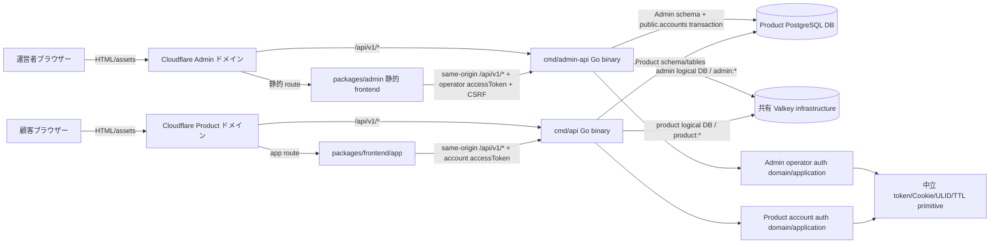
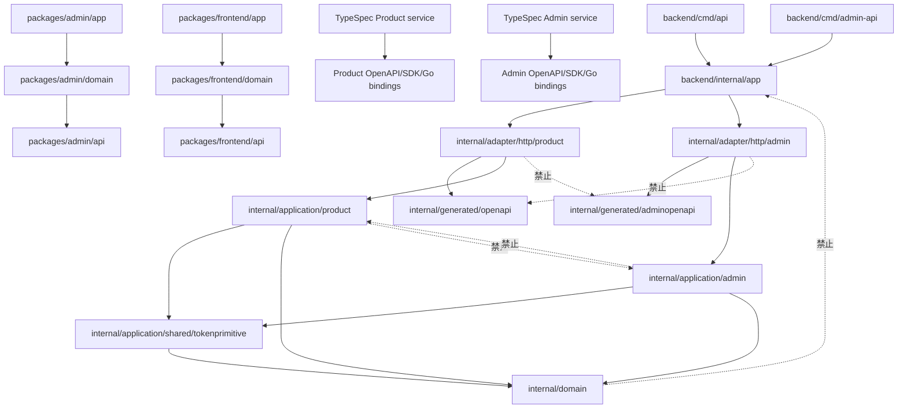
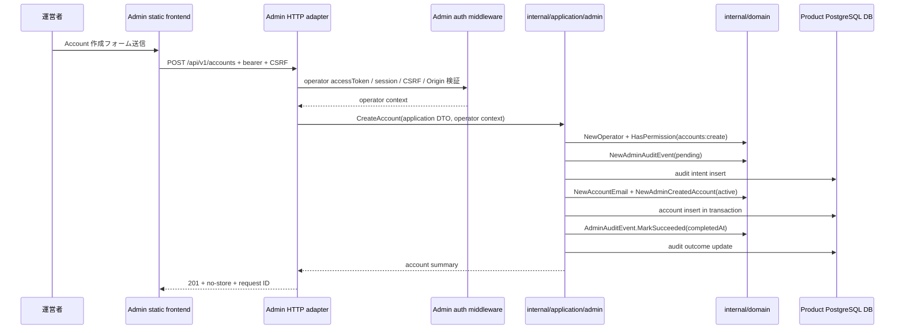
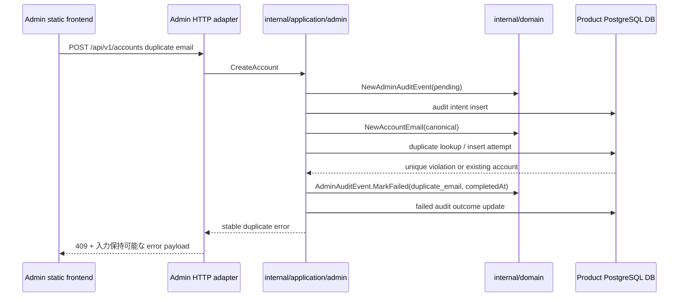
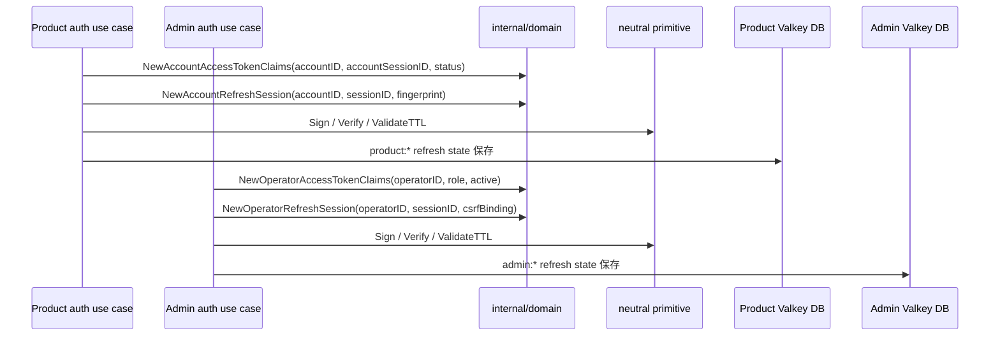
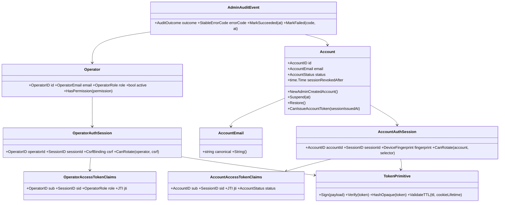
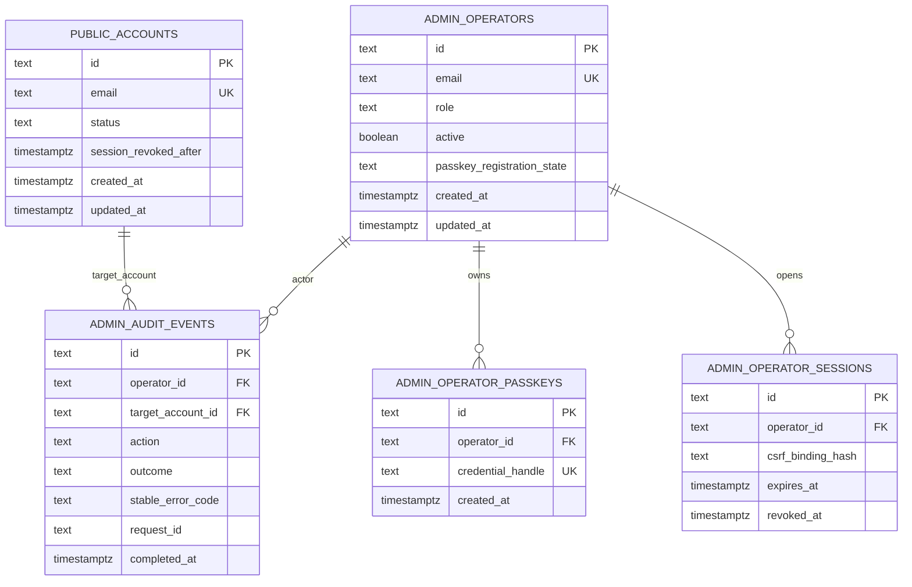
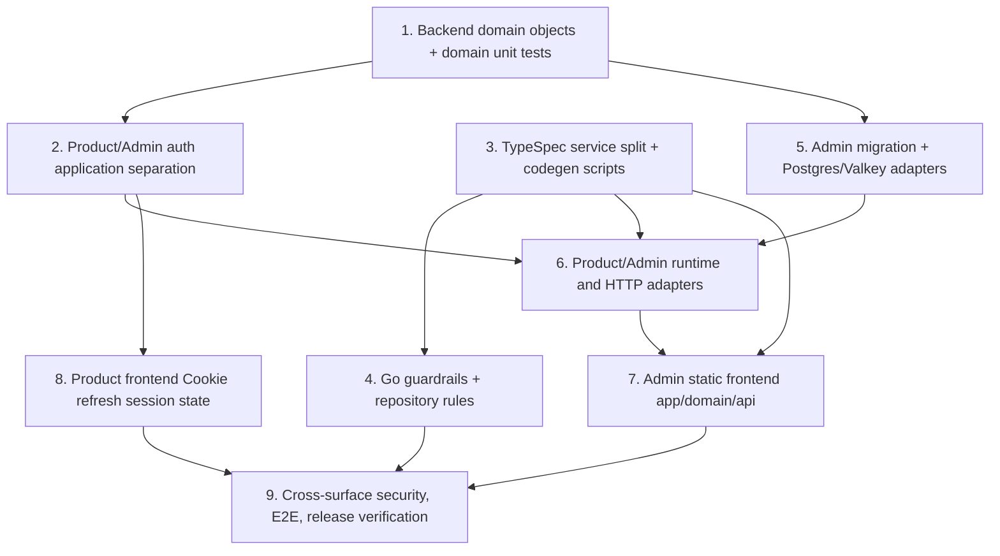

## Scope

この文書は、承認済み delta spec を実装へ移すための設計である。Product と Admin はどちらも `/api/v1/*` を使うが、別ドメイン、別 Go binary、別 TypeSpec service、別 OpenAPI、別 SDK、別 Go bindings、別 frontend package、別 application package、別 auth domain type で分離する。

Product authentication と Admin authentication は別ドメインである。Product `account` auth は Product account login / session、account status / suspension、Product accessToken claims、Product refreshToken session state、Product account validation を所有する。Admin `operator` auth は operator login / session、role / active state、Admin accessToken claims、Admin refreshToken session state、Admin CSRF / RBAC 連携、operator validation を所有する。共有できるものは token signing/verifying primitive、Cookie 属性 helper、ULID/JTI validation、TTL validation など、account / operator の意味を持たない中立 primitive だけに限定する。

### In Scope

- `api-contract-be`: Product/Admin TypeSpec service 分離、surface 別 OpenAPI / SDK / Go bindings 生成、surface contamination check、shared model module の route 非混入境界。
- `admin-console-be`: Admin API binary、Admin account creation、Admin-owned schema、audit intent/outcome、RBAC、Product/Admin adapter namespace 分離、`packages/backend/internal/domain/**` の concrete domain object と unit tests。
- `admin-auth-be`: Admin operator auth endpoint、operator session middleware、Origin / CSRF、Admin refreshToken Cookie、Admin Valkey logical DB / `admin:*` key prefix、security headers。
- `auth-be`: Product account auth と Admin operator auth の domain/application 分離、Product refreshToken Cookie model、中立 primitive、TTL、multi-session refresh。
- `admin-console-fe`: `packages/admin/app -> packages/admin/domain -> packages/admin/api` の静的 client、Account 作成 UI、same-origin Admin API wrapper、server-only/BFF/DB 依存排除。
- `admin-auth-fe`: passkey login、operator setup、protected route verification、Admin refresh、no-store 配信前提の静的 Admin auth UI。
- `auth-fe`: Product frontend の accessToken-only browser-readable state、HttpOnly Cookie refresh、複数 account session 切替。
- Repository guardrails: `AGENTS.md`、`CODING_STANDARDS.md`、`CONTRIBUTING.md`、ESLint / Go guardrails / codegen check / migration pair check を Product/Admin surface 分離へ更新する。

### Out of Scope

- 課金、通知、検索ランキング、コンテンツ投稿など、上記 Spec Units に含まれない Product feature の追加。
- Admin 以外の新しい運営 surface や `/api/admin/*` の復活。Admin も Product も `/api/v1/*` を使用し、origin / binary / artifact で分離する。
- refreshToken を response body、localStorage、sessionStorage、IndexedDB、URL、telemetry、log に置く代替案。これは該当 specs の禁止事項と矛盾するため採用しない。

## Assumptions / Dependencies

- `openspec/config.yaml` の Spec -> Test contract に従い、全 Scenario ID は `*-S###` 形式で、automated test title は `[SCENARIO-ID]` を含める。
- API contract の正は `packages/typespec/main.tsp` であり、生成は `pnpm gen`、drift 検証は `pnpm check:codegen` で行う。生成物は手編集しない。
- 現在の backend migration は `000001` から `000006` まで存在するため、Admin schema migration は `000007_create_admin_schema.up.sql` / `000007_create_admin_schema.down.sql` とする。
- Backend Clean Architecture は `cmd/* -> internal/app -> internal/adapter/* + internal/application/* + internal/platform/* -> internal/domain` を守る。GORM は `internal/adapter/postgres/**` のみ、generated OpenAPI bindings は該当 HTTP adapter のみが import する。
- `packages/admin` は静的 frontend に変更される。SvelteKit server route、server load/actions、`$lib/server`、Prisma、Valkey、OpenSearch、WebAuthn server library は runtime responsibility から除外する。
- Admin frontend と Admin backend は同一 Admin ドメインで配信され、Cloudflare が `/api/v1/*` を Admin GoServer へ、それ以外を Admin static frontend へ振り分ける。Product host と Admin host は一致しない。
- Product/Admin refreshToken Cookie は `HttpOnly; Secure; SameSite=Lax; Path=/` を維持し、server-side refresh state TTL を超える Cookie lifetime を設定しない。

## Impacted Areas

- API contract / codegen: TypeSpec service split、Product/Admin OpenAPI、surface-specific SDK / Go bindings、path policy、server URL、shared models、drift / contamination check。
- Backend domain: AccountEmail、Account lifecycle、Operator、OperatorAuthSession、AccountAuthSession、AdminAuditEvent、TokenPrimitive、domain error、Scenario ID 付き domain tests。
- Backend application: Product account auth、Admin operator auth、Admin account creation、audit、RBAC、neutral tokenprimitive wrapper、ports。
- Backend adapters/runtime: `cmd/api`、`cmd/admin-api`、`internal/app` runtime、Product/Admin HTTP adapter、Postgres adapter、Valkey store、security headers、Origin / CSRF、cookie helper。
- DB / migration: Admin-owned schema、operator / passkey / audit tables、least-privilege DB roles、migration pair rollback。
- Frontend/Admin: Admin static app/domain/api layers、login/operator-setup/accounts routes、same-origin API wrapper、server-only deletion、lint boundaries。
- Frontend/Product: Product auth domain hooks/state、accessToken refresh flow、multi-session state、refreshToken browser-readable storage 排除。
- Repository enforcement: ESLint boundaries、Go guardrails、codegen check、migration verification、OpenAPI lint、docs/rules。
- Security/Observability: no-store、CSP/HSTS/referrer/X-Content-Type-Options/frame prevention、request ID、audit correlation、refreshToken secret redaction、Product/Admin Valkey namespace isolation。

## Directory Tree

```text
www-template
├─ AGENTS.md
├─ CODING_STANDARDS.md
├─ CONTRIBUTING.md
├─ eslint.config.js
├─ package.json
├─ scripts
│  ├─ codegen/check.sh
│  ├─ go/gen-backend.sh
│  └─ hooks/verify-staged-migrations.sh
├─ packages
│  ├─ typespec
│  │  ├─ main.tsp
│  │  ├─ package.json
│  │  ├─ tspconfig.yaml
│  │  ├─ src/common/errors.tsp
│  │  ├─ src/models/account.tsp
│  │  ├─ src/models/auth.tsp
│  │  ├─ src/models/admin_operator.tsp
│  │  ├─ src/models/admin_audit.tsp
│  │  ├─ src/routes/v1/_namespace.tsp
│  │  ├─ src/routes/v1/auth.tsp
│  │  ├─ src/routes/admin-v1/_namespace.tsp
│  │  ├─ src/routes/admin-v1/accounts.tsp
│  │  ├─ src/routes/admin-v1/auth.tsp
│  │  ├─ openapi/openapi.json
│  │  └─ openapi/admin.openapi.json
│  ├─ frontend
│  │  ├─ api/src/generated/client.ts
│  │  └─ domain/src/hooks/auth/useAccountSessions.svelte.ts
│  ├─ admin
│  │  ├─ package.json
│  │  ├─ app/package.json
│  │  ├─ app/svelte.config.js
│  │  ├─ app/vite.config.ts
│  │  ├─ app/src/routes/login/+page.svelte
│  │  ├─ app/src/routes/operator-setup/+page.svelte
│  │  ├─ app/src/routes/accounts/+page.svelte
│  │  ├─ app/src/routes/accounts/[id]/+page.svelte
│  │  ├─ api/package.json
│  │  ├─ api/orval.config.ts
│  │  ├─ api/src/client.ts
│  │  ├─ api/src/generated/client.ts
│  │  ├─ domain/package.json
│  │  ├─ domain/src/auth.ts
│  │  ├─ domain/src/accounts.ts
│  │  ├─ domain/src/operators.ts
│  │  ├─ src/lib/server/services/accounts/search.ts
│  │  ├─ src/lib/server/services/accounts/detail.ts
│  │  ├─ src/lib/server/services/accounts/suspend.ts
│  │  ├─ src/lib/server/services/accounts/restore.ts
│  │  ├─ src/lib/server/services/auth/routes.ts
│  │  ├─ src/lib/server/models/accounts.ts
│  │  ├─ src/routes/accounts/+page.server.ts
│  │  ├─ src/routes/login/+page.server.ts
│  │  ├─ src/routes/operator-setup/+page.server.ts
│  │  ├─ src/routes/api/admin/auth/passkey/start/+server.ts
│  │  └─ prisma/admin/schema.prisma
│  └─ backend
│     ├─ cmd/api/main.go
│     ├─ cmd/admin-api/main.go
│     ├─ db/migrations/000007_create_admin_schema.up.sql
│     ├─ db/migrations/000007_create_admin_schema.down.sql
│     ├─ internal/app/runtime.go
│     ├─ internal/app/admin_runtime.go
│     ├─ internal/generated/openapi/openapi.gen.go
│     ├─ internal/generated/adminopenapi/openapi.gen.go
│     ├─ internal/domain/account.go
│     ├─ internal/domain/account_email.go
│     ├─ internal/domain/account_lifecycle.go
│     ├─ internal/domain/account_auth.go
│     ├─ internal/domain/account_auth_session.go
│     ├─ internal/domain/operator.go
│     ├─ internal/domain/operator_auth.go
│     ├─ internal/domain/operator_auth_session.go
│     ├─ internal/domain/admin_audit_event.go
│     ├─ internal/domain/token_primitive.go
│     ├─ internal/domain/account_lifecycle_test.go
│     ├─ internal/domain/operator_test.go
│     ├─ internal/domain/operator_auth_session_test.go
│     ├─ internal/domain/admin_audit_event_test.go
│     ├─ internal/domain/token_primitive_test.go
│     ├─ internal/application/product/auth/service.go
│     ├─ internal/application/product/auth/refresh.go
│     ├─ internal/application/admin/auth/service.go
│     ├─ internal/application/admin/auth/refresh.go
│     ├─ internal/application/admin/account_creation_service.go
│     ├─ internal/application/admin/operator_service.go
│     ├─ internal/application/admin/audit_service.go
│     ├─ internal/application/shared/tokenprimitive/ttl.go
│     ├─ internal/application/shared/tokenprimitive/signer.go
│     ├─ internal/adapter/http/product/router.go
│     ├─ internal/adapter/http/admin/router.go
│     ├─ internal/adapter/http/admin/accounts.go
│     ├─ internal/adapter/http/admin/auth.go
│     ├─ internal/adapter/http/shared/cookie.go
│     ├─ internal/adapter/postgres/product/account_repository.go
│     ├─ internal/adapter/postgres/admin/account_repository.go
│     ├─ internal/adapter/postgres/admin/audit_repository.go
│     ├─ internal/adapter/mailer/admin_setup_token_delivery.go
│     ├─ internal/adapter/valkey/product/account_session_store.go
│     ├─ internal/adapter/valkey/admin/operator_session_store.go
│     ├─ internal/adapter/http/router_test.go
│     ├─ internal/adapter/http/openapi_contract_test.go
│     ├─ internal/app/runtime_test.go
│     └─ tools/analyzers/cmd/guardrails/main.go
```

## New / Changed Files

| Type       | File                                                                        | Change                                                                                                                                 |
| ---------- | --------------------------------------------------------------------------- | -------------------------------------------------------------------------------------------------------------------------------------- |
| Update     | `AGENTS.md`                                                                 | Admin/Product とも `/api/v1/*` を使い、origin / binary / generated artifact で分離する repository rule に更新する。                    |
| Update     | `CODING_STANDARDS.md`                                                       | Admin Go binary、Admin generated bindings、Admin SDK package、Admin static frontend の enforced boundary を追加する。                  |
| Update     | `CONTRIBUTING.md`                                                           | Admin surface の contract/codegen/migration/verification 手順を contributor flow に追加する。                                          |
| Update     | `eslint.config.js`                                                          | `packages/admin/app -> packages/admin/domain -> packages/admin/api`、server-only 禁止、Product/Admin SDK cross import 禁止を強制する。 |
| Update     | `package.json`                                                              | `pnpm gen`、`pnpm check:codegen`、`pnpm lint`、`pnpm build` が Admin surface を含むよう script graph を更新する。                      |
| Update     | `scripts/codegen/check.sh`                                                  | Product/Admin OpenAPI・SDK・Go bindings の drift と operation/tag/export 混入を検査する。                                              |
| Update     | `scripts/go/gen-backend.sh`                                                 | Product/Admin Go bindings を別 package へ生成する。                                                                                    |
| Update     | `scripts/hooks/verify-staged-migrations.sh`                                 | `000007_create_admin_schema` pair と migration naming policy を検証する。                                                              |
| Update     | `packages/typespec/main.tsp`                                                | Product/Admin service と shared model import の entrypoint を定義する。                                                                |
| Update     | `packages/typespec/package.json`                                            | Product/Admin OpenAPI 生成 script と lint対象を追加する。                                                                              |
| Update     | `packages/typespec/tspconfig.yaml`                                          | Product/Admin artifact 出力を分離する emitter 設定に更新する。                                                                         |
| Update     | `packages/typespec/src/common/errors.tsp`                                   | Product/Admin 共通 error envelope、request ID、validation error model を surface 非依存に保つ。                                        |
| Add/Update | `packages/typespec/src/models/account.tsp`                                  | Admin account creation response と Product account shared model を route 非依存 model として定義する。                                 |
| Update     | `packages/typespec/src/models/auth.tsp`                                     | Product account accessToken/session response と refresh response を HttpOnly Cookie 前提へ更新する。                                   |
| Add        | `packages/typespec/src/models/admin_operator.tsp`                           | Operator、role、active state、session metadata、CSRF metadata の Admin model を追加する。                                              |
| Add        | `packages/typespec/src/models/admin_audit.tsp`                              | Admin audit event/outcome/error code/correlation model を追加する。                                                                    |
| Update     | `packages/typespec/src/routes/v1/_namespace.tsp`                            | Product route namespace が Admin route namespace を import しない構成にする。                                                          |
| Update     | `packages/typespec/src/routes/v1/auth.tsp`                                  | Product refresh/login/logout contract を Cookie refreshToken model に更新する。                                                        |
| Add        | `packages/typespec/src/routes/admin-v1/_namespace.tsp`                      | Admin route namespace を Product route namespace から独立して定義する。                                                                |
| Add        | `packages/typespec/src/routes/admin-v1/accounts.tsp`                        | Admin account search/detail/create endpoints を Admin service に追加する。                                                             |
| Add        | `packages/typespec/src/routes/admin-v1/auth.tsp`                            | Admin passkey login/operator setup/current/refresh/logout endpoints を Admin service に追加する。                                      |
| Generated  | `packages/typespec/openapi/openapi.json`                                    | `pnpm gen` により Product operations のみを含む OpenAPI に更新される。                                                                 |
| Generated  | `packages/typespec/openapi/admin.openapi.json`                              | `pnpm gen` により Admin operations のみを含む OpenAPI として生成される。                                                               |
| Generated  | `packages/frontend/api/src/generated/client.ts`                             | `pnpm gen` により Product SDK のみを含む生成物へ更新される。                                                                           |
| Update     | `packages/frontend/domain/src/hooks/auth/useAccountSessions.svelte.ts`      | Product refreshToken を保持せず、accessToken/session metadata と Cookie refresh flow だけを扱う。                                      |
| Update     | `packages/admin/package.json`                                               | workspace root package として `app` / `domain` / `api` の scripts と依存を束ね、server runtime dependencies を排除する。               |
| Add        | `packages/admin/app/package.json`                                           | Admin static frontend app package を定義し、`packages/admin/domain` と UI/i18n だけへ依存させる。                                      |
| Add        | `packages/admin/app/svelte.config.js`                                       | static adapter / CSR 前提に合わせ、server rendering 前提を外す。                                                                       |
| Add        | `packages/admin/app/vite.config.ts`                                         | Admin static build、test、alias、domain import 境界を設定する。                                                                        |
| Add/Move   | `packages/admin/app/src/routes/login/+page.svelte`                          | Admin domain auth flow 経由の passkey login UI に変更する。                                                                            |
| Add/Move   | `packages/admin/app/src/routes/operator-setup/+page.svelte`                 | setup token を永続保存せず Admin backend operator setup API を呼ぶ UI に変更する。                                                     |
| Add/Move   | `packages/admin/app/src/routes/accounts/+page.svelte`                       | Account 一覧、作成 form、validation、duplicate/error 表示、detail navigation を追加する。                                              |
| Add/Move   | `packages/admin/app/src/routes/accounts/[id]/+page.svelte`                  | 作成済み account の email/status/passkey count/作成日時を表示する。                                                                    |
| Add        | `packages/admin/api/package.json`                                           | Admin package-local SDK package を定義し、Product SDK へ依存しない。                                                                   |
| Add        | `packages/admin/api/orval.config.ts`                                        | Admin OpenAPI から Admin SDK だけを生成する設定を追加する。                                                                            |
| Add        | `packages/admin/api/src/client.ts`                                          | same-origin `/api/v1/*` のみを許可する Admin SDK wrapper を追加する。                                                                  |
| Generated  | `packages/admin/api/src/generated/client.ts`                                | `pnpm gen` により Admin SDK のみを含む package-local 生成物として作成される。                                                          |
| Add        | `packages/admin/domain/package.json`                                        | Admin frontend domain package を定義し、`packages/admin/api` のみに API 依存を閉じる。                                                 |
| Add        | `packages/admin/domain/src/auth.ts`                                         | operator login/current/refresh/logout state orchestration を提供する。                                                                 |
| Add        | `packages/admin/domain/src/accounts.ts`                                     | account search/detail/create orchestration と UI 用 error mapping を提供する。                                                         |
| Add        | `packages/admin/domain/src/operators.ts`                                    | current operator role/permission presentation state を提供し、backend authorization の代替にはしない。                                 |
| Delete     | `packages/admin/src/lib/server/services/accounts/search.ts`                 | Backend account search responsibility を Go Admin API へ移すため削除する。                                                             |
| Delete     | `packages/admin/src/lib/server/services/accounts/detail.ts`                 | Backend account detail responsibility を Go Admin API へ移すため削除する。                                                             |
| Delete     | `packages/admin/src/lib/server/services/accounts/suspend.ts`                | Account lifecycle mutation を Go backend domain/application へ移すため削除する。                                                       |
| Delete     | `packages/admin/src/lib/server/services/accounts/restore.ts`                | Account lifecycle mutation を Go backend domain/application へ移すため削除する。                                                       |
| Delete     | `packages/admin/src/lib/server/services/auth/routes.ts`                     | package-local BFF auth route composition を Go Admin API へ移すため削除する。                                                          |
| Delete     | `packages/admin/src/lib/server/models/accounts.ts`                          | Prisma-backed Account model を Go Postgres adapter へ移すため削除する。                                                                |
| Delete     | `packages/admin/src/routes/accounts/+page.server.ts`                        | static frontend 化のため server load/action を削除する。                                                                               |
| Delete     | `packages/admin/src/routes/login/+page.server.ts`                           | login BFF を Admin backend auth API へ移すため削除する。                                                                               |
| Delete     | `packages/admin/src/routes/operator-setup/+page.server.ts`                  | setup BFF を Admin backend auth API へ移すため削除する。                                                                               |
| Delete     | `packages/admin/src/routes/api/admin/auth/passkey/start/+server.ts`         | `/api/admin/*` BFF を廃止し、Go Admin `/api/v1/*` を使用する。                                                                         |
| Delete     | `packages/admin/prisma/admin/schema.prisma`                                 | Admin persistence は backend migration と Postgres adapter で管理するため削除する。                                                    |
| Update     | `packages/backend/cmd/api/main.go`                                          | Product runtime だけを起動し、Admin handlers/bindings を register しない。                                                             |
| Add        | `packages/backend/cmd/admin-api/main.go`                                    | Admin API binary entrypoint を追加する。                                                                                               |
| Add        | `packages/backend/db/migrations/000007_create_admin_schema.up.sql`          | Admin-owned schema、operator、operator passkey、audit tables、least-privilege grants を作成する。                                      |
| Add        | `packages/backend/db/migrations/000007_create_admin_schema.down.sql`        | Admin-owned schema と grants を安全に戻す rollback SQL を提供する。                                                                    |
| Update     | `packages/backend/internal/app/runtime.go`                                  | Product runtime composition を Product-only adapters/bindings に限定する。                                                             |
| Add        | `packages/backend/internal/app/admin_runtime.go`                            | Admin runtime composition、config validation、Admin adapters、security middleware を組み立てる。                                       |
| Generated  | `packages/backend/internal/generated/openapi/openapi.gen.go`                | `pnpm gen` により Product bindings のみを含む生成物へ更新される。                                                                      |
| Generated  | `packages/backend/internal/generated/adminopenapi/openapi.gen.go`           | `pnpm gen` により Admin bindings のみを含む生成物として作成される。                                                                    |
| Update     | `packages/backend/internal/domain/account.go`                               | Account root に AccountEmail/status/sessionRevokedAfter を接続する。                                                                   |
| Add        | `packages/backend/internal/domain/account_email.go`                         | email 正規化、形式検証、canonical string、domain error を実装する。                                                                    |
| Add        | `packages/backend/internal/domain/account_lifecycle.go`                     | active/suspended、Admin 作成初期状態、Suspend/Restore、session revoke boundary を実装する。                                            |
| Update     | `packages/backend/internal/domain/account_auth.go`                          | Product AccountAuth projection を status/sessionRevokedAfter と整合させる。                                                            |
| Add        | `packages/backend/internal/domain/account_auth_session.go`                  | Product accessToken claims、refresh session、eligibility を Product account 固有型で実装する。                                         |
| Add        | `packages/backend/internal/domain/operator.go`                              | OperatorID/email/role/active/passkey registration/permission invariant を実装する。                                                    |
| Add        | `packages/backend/internal/domain/operator_auth.go`                         | Admin operator auth claim/value object を実装する。                                                                                    |
| Add        | `packages/backend/internal/domain/operator_auth_session.go`                 | Admin refresh session、CSRF binding、role/active snapshot eligibility を実装する。                                                     |
| Add        | `packages/backend/internal/domain/admin_audit_event.go`                     | pending/succeeded/failed transition と stable error code rule を実装する。                                                             |
| Add        | `packages/backend/internal/domain/token_primitive.go`                       | signer/verifier、opaque hash、ULID/JTI、TTL value の中立 primitive だけを実装する。                                                    |
| Add        | `packages/backend/internal/domain/account_lifecycle_test.go`                | `[ADMIN-CONSOLE-BE-S077]`、`[AUTH-BE-S069]` の domain unit tests を追加する。                                                          |
| Add        | `packages/backend/internal/domain/operator_test.go`                         | `[ADMIN-CONSOLE-BE-S078]` の role/active/permission unit tests を追加する。                                                            |
| Add        | `packages/backend/internal/domain/operator_auth_session_test.go`            | `[AUTH-BE-S070]` の CSRF/active/session eligibility unit tests を追加する。                                                            |
| Add        | `packages/backend/internal/domain/admin_audit_event_test.go`                | `[ADMIN-CONSOLE-BE-S079]` の audit transition unit tests を追加する。                                                                  |
| Add        | `packages/backend/internal/domain/token_primitive_test.go`                  | `[AUTH-BE-S068]` の中立 primitive unit/static tests を追加する。                                                                       |
| Add        | `packages/backend/internal/application/product/auth/service.go`             | Product account login/session validation use cases を Product domain object で実装する。                                               |
| Add        | `packages/backend/internal/application/product/auth/refresh.go`             | Product refresh rotation、session selector、Cookie binding orchestration を実装する。                                                  |
| Add        | `packages/backend/internal/application/admin/auth/service.go`               | Admin operator login/current/logout/CSRF use cases を Admin domain object で実装する。                                                 |
| Add        | `packages/backend/internal/application/admin/auth/refresh.go`               | Admin operator refresh rotation、CSRF binding、Valkey namespace orchestration を実装する。                                             |
| Add        | `packages/backend/internal/application/admin/account_creation_service.go`   | AccountEmail、Account lifecycle、Operator、AuditEvent を使う account creation use case を実装する。                                    |
| Add        | `packages/backend/internal/application/admin/operator_service.go`           | Operator creation、setup token hash/expiry、secure delivery port、token reissue guard を実装する。                                     |
| Add        | `packages/backend/internal/application/admin/audit_service.go`              | mutation intent/outcome と stable error mapping を application boundary に実装する。                                                   |
| Add        | `packages/backend/internal/application/shared/tokenprimitive/ttl.go`        | Product/Admin 共通の中立 TTL validation と Cookie lifetime validation を実装する。                                                     |
| Add        | `packages/backend/internal/application/shared/tokenprimitive/signer.go`     | domain meaning を持たない signer/verifier wrapper を実装する。                                                                         |
| Add        | `packages/backend/internal/adapter/http/product/router.go`                  | Product routes と Product bindings だけを register する。                                                                              |
| Add        | `packages/backend/internal/adapter/http/admin/router.go`                    | Admin `/api/v1/*` routes、security headers、Origin/CSRF middleware を register する。                                                  |
| Add        | `packages/backend/internal/adapter/http/admin/accounts.go`                  | Admin account transport DTO を application DTO へ変換し、domain rule を handler に置かない。                                           |
| Add        | `packages/backend/internal/adapter/http/admin/auth.go`                      | Admin passkey/current/refresh/logout/operator setup handlers を Admin auth use case へ接続する。                                       |
| Add        | `packages/backend/internal/adapter/http/shared/cookie.go`                   | Cookie 属性生成だけを担う中立 helper を追加する。                                                                                      |
| Add        | `packages/backend/internal/adapter/postgres/product/account_repository.go`  | Product Account repository を Product namespace に閉じる。                                                                             |
| Add        | `packages/backend/internal/adapter/postgres/admin/account_repository.go`    | Admin account creation transaction と Product Account root access を application port として実装する。                                 |
| Add        | `packages/backend/internal/adapter/postgres/admin/audit_repository.go`      | Admin audit intent/outcome persistence を実装する。                                                                                    |
| Add        | `packages/backend/internal/adapter/mailer/admin_setup_token_delivery.go`    | setup token の backend-owned secure delivery port 実装を追加し、平文 token を response body に返さない。                               |
| Add        | `packages/backend/internal/adapter/valkey/product/account_session_store.go` | Product `product:*` refresh/session namespace を実装する。                                                                             |
| Add        | `packages/backend/internal/adapter/valkey/admin/operator_session_store.go`  | Admin logical DB と `admin:*` namespace を実装する。                                                                                   |
| Update     | `packages/backend/internal/adapter/http/router_test.go`                     | Product/Admin runtime route registration と public/protected route policy を検証する。                                                 |
| Update     | `packages/backend/internal/adapter/http/openapi_contract_test.go`           | Product/Admin OpenAPI bearer/security declaration と contamination を検証する。                                                        |
| Update     | `packages/backend/internal/app/runtime_test.go`                             | Product/Admin config fail-close、token/cookie/Valkey DB validation を検証する。                                                        |
| Update     | `packages/backend/tools/analyzers/cmd/guardrails/main.go`                   | Go file placement、import boundary、generated binding import、application cross import、domain purity、migration naming を強制する。   |

## System Diagram



## Package Diagram



### Dependency / Clean Architecture Boundary Diagram

```mermaid
flowchart LR
  Cmd[cmd/api, cmd/admin-api] --> Runtime[internal/app]
  Runtime --> HTTP[internal/adapter/http/product|admin|shared]
  Runtime --> Persistence[internal/adapter/postgres|valkey/product|admin]
  Runtime --> Application[internal/application/product|admin|shared]
  HTTP --> Application
  Persistence --> Application
  Application --> Domain[internal/domain]
  Domain --> Stdlib[Go stdlib only]
  HTTP -.禁止.-> Persistence
  Domain -.禁止.-> Generated[internal/generated]
  Domain -.禁止.-> Platform[internal/platform]
  Application -.禁止.-> AdapterTypes[adapter/Gin/GORM/generated types]
```

## Sequence Diagram

### Admin account creation happy path



### Admin account creation negative path



### Product account auth and Admin operator auth separation



## UI Wireframes

N/A — wireframe not yet generated。`openspec/changes/admin-backend-architecture-account-creation/**/*.wireframe.html` を確認したが、wireframe skill の出力は存在しないため、template 指示に従って iframe は埋め込まない。

## Domain Model Diagram



## ER Diagram



## Package-Level Design

### Package List

| Package                                                       | Purpose / Responsibility                                                                                 | Public API                                     | Dependencies                                                      |
| ------------------------------------------------------------- | -------------------------------------------------------------------------------------------------------- | ---------------------------------------------- | ----------------------------------------------------------------- |
| `packages/typespec`                                           | Product/Admin service surface と shared schema model を定義する。                                        | `main.tsp`、Product/Admin OpenAPI emit scripts | TypeSpec emitters、Spectral                                       |
| `packages/frontend/domain`                                    | Product account sessions の browser state と refresh orchestration を担う。                              | `useAccountSessions`                           | `packages/frontend/api`                                           |
| `packages/admin/api`                                          | Admin package-local SDK と same-origin wrapper を提供する。                                              | `createAdminApiClient`、generated Admin SDK    | Admin OpenAPI generated client                                    |
| `packages/admin/domain`                                       | Admin auth/accounts/operators state orchestration を担う。                                               | `auth.ts`、`accounts.ts`、`operators.ts`       | `packages/admin/api`                                              |
| `packages/admin/app`                                          | 静的 Admin UI routes/components を提供する。                                                             | `/login`、`/operator-setup`、`/accounts`       | `packages/admin/domain`、`@www-template/ui`、`@www-template/i18n` |
| `packages/backend/internal/domain`                            | Account、Operator、Audit、Product AccountAuth、Admin OperatorAuth、中立 primitive の不変条件を所有する。 | constructors、methods、domain errors           | stdlib と同 package 型                                            |
| `packages/backend/internal/application/product/auth`          | Product account login/refresh/revoke/session validation を組み立てる。                                   | application DTO/use cases                      | `internal/domain`、shared tokenprimitive                          |
| `packages/backend/internal/application/admin/auth`            | Admin operator login/refresh/current/logout/CSRF を組み立てる。                                          | application DTO/use cases                      | `internal/domain`、shared tokenprimitive                          |
| `packages/backend/internal/application/admin`                 | account creation、audit、RBAC を組み立てる。                                                             | application DTO/use cases/ports                | `internal/domain`                                                 |
| `packages/backend/internal/application/shared/tokenprimitive` | signer/TTL/Cookie lifetime など中立 helper を提供する。                                                  | `ValidateTTL`、`Sign`、`Verify`                | `internal/domain` neutral types                                   |
| `packages/backend/internal/adapter/http/admin`                | Admin transport DTO、Origin/CSRF/security headers、Admin bindings 接続を担う。                           | Admin `/api/v1/*` handlers/router              | Admin generated bindings、Admin application                       |
| `packages/backend/internal/adapter/http/product`              | Product transport DTO と Product bindings 接続を担う。                                                   | Product `/api/v1/*` handlers/router            | Product generated bindings、Product application                   |
| `packages/backend/internal/adapter/postgres/admin`            | Admin schema と Account root transaction を application ports として実装する。                           | repository implementations                     | GORM/Postgres、application ports                                  |
| `packages/backend/internal/adapter/valkey/admin`              | Admin operator session/challenge/rate-limit state を `admin:*` namespace に保存する。                    | store implementations                          | Valkey、application ports                                         |
| `packages/backend/cmd/admin-api`                              | Admin API binary entrypoint。                                                                            | executable main                                | `internal/app`                                                    |

### Details

#### `packages/typespec`

- Purpose / Responsibility: Product と Admin の route surface を別 service として定義し、Account など shared model は route decorator を持たない module に置く。
- Public API: `main.tsp`、`src/routes/v1/**`、`src/routes/admin-v1/**`、Product/Admin OpenAPI emit scripts。
- Key Data Structures: Account summary、Admin operator/session、Admin audit event、shared error/pagination/request ID model。
- Key Flows: source update -> `pnpm gen` -> Product/Admin OpenAPI -> Product/Admin SDK / Go bindings -> `pnpm check:codegen` contamination check。
- Dependencies: TypeSpec、OpenAPI emitter、Spectral。server route 実装から OpenAPI を逆生成しない。
- Error Handling: validation error schema と stable error code を shared model とし、surface ごとの response に含める。
- Testing Strategy: `API-CONTRACT-BE-S001`〜`API-CONTRACT-BE-S009` を OpenAPI lint、codegen drift、import-boundary tests で確認する。
- Non-Functional: artifact 名と package boundary に surface 名を含め、CI で drift を検出する。
- Performance: contract generation は CI 内で完了できる粒度に保ち、fixture contamination check を script 化する。
- Security: Admin operation が Product artifact に混入した場合は `pnpm check:codegen` と lint を失敗させる。

#### `packages/backend/internal/domain`

- Purpose / Responsibility: Account/Operator/Audit/AuthSession/TokenPrimitive の不変条件を concrete type と constructor/method で所有する。
- Public API: `NewAccountEmail`、`NewAdminCreatedAccount`、`Operator.HasPermission`、`NewAdminAuditEvent`、`MarkSucceeded`、`MarkFailed`、`NewAccountRefreshSession`、`NewOperatorRefreshSession`、`ValidateTokenTTL`。
- Key Data Structures: `AccountEmail`、`AccountStatus`、`OperatorRole`、`AdminAuditEvent`、`AccountAccessTokenClaims`、`OperatorAccessTokenClaims`、`CsrfBinding`、`TokenTTL`。
- Key Flows: application DTO -> domain constructor/method -> domain error or immutable value -> repository/application decision。
- Dependencies: stdlib と同一 `domain` package 型のみ。adapter、application、generated、platform、Gin、GORM、Valkey、config、logger、clock source を import しない。
- Error Handling: domain errors は `errors.Is` で判定可能にし、application が stable error code / HTTP status へ変換する。
- Testing Strategy: `ADMIN-CONSOLE-BE-S077`〜`S080`、`AUTH-BE-S068`〜`S070` を unit/static tests で検証する。
- Non-Functional: domain logic は deterministic にし、時刻は application から値として渡す。
- Performance: email canonicalization / permission map / token eligibility は allocation と I/O を持たない pure function に保つ。
- Security: Product AccountAuth と Admin OperatorAuth を別型にし、`identityDomain` switch で claim/session を切り替えない。

#### `packages/backend/internal/application/product/auth`

- Purpose / Responsibility: Product account login、refresh rotation、revoke、session validation を Product account domain object だけで組み立てる。
- Public API: `LoginWithPasskey`、`RefreshAccountSession`、`RevokeAccountSession`、`ValidateAccountBearer` と application DTO。
- Key Data Structures: Product application DTO、Account session selector、accessToken response、Cookie command。
- Key Flows: passkey verified account -> AccountAuth eligibility -> neutral Sign/TTL -> Product Valkey `product:*` refresh state -> accessToken body + refreshToken Set-Cookie。
- Dependencies: `internal/domain`、`internal/application/shared/tokenprimitive`、application ports。Admin application/domain を import しない。
- Error Handling: suspended/revoked/expired/selector mismatch は stable auth errors へ変換し、refreshToken 平文は error/log/trace に出さない。
- Testing Strategy: `AUTH-BE-S060`、`S062`〜`S066`、`S069`、`S071` を use case tests と import-boundary tests で検証する。
- Non-Functional: refresh rotation は旧 token 原子消費と新 token 保存を同一 store operation として扱う。
- Performance: Valkey lookup は対象 session key のみに限定し、multi-session でも全 scan しない。
- Security: refreshToken は response body に含めず `HttpOnly; Secure; SameSite=Lax; Path=/` Cookie だけで扱う。

#### `packages/backend/internal/application/admin/auth`

- Purpose / Responsibility: Admin operator login、refresh、current operator、logout、CSRF validation、setup token flow を Admin operator domain object で組み立てる。
- Public API: `StartOperatorPasskey`、`FinishOperatorPasskey`、`RefreshOperatorSession`、`ValidateOperatorMutation`、`LogoutOperator`。
- Key Data Structures: Operator session DTO、CSRF binding、operator accessToken response、Admin cookie command。
- Key Flows: operator credential verified -> OperatorAuth eligibility -> CSRF binding -> neutral Sign/TTL -> Admin Valkey `admin:*` state -> accessToken body + refreshToken Cookie。
- Dependencies: `internal/domain`、shared tokenprimitive、Admin auth ports。Product account auth application/domain を import しない。
- Error Handling: inactive、CSRF mismatch、Origin mismatch、Valkey namespace mismatch、insecure cookie は fail-close error へ変換する。
- Testing Strategy: `ADMIN-AUTH-BE-S056`〜`S066`、`AUTH-BE-S061`、`S070`、`S072` を endpoint/use case/config tests で検証する。
- Non-Functional: all auth/account/audit responses は no-store と security headers を持つ。
- Performance: challenge/session/rate-limit key は prefix lookup で O(1) にする。
- Security: Admin operator token claims は Product account ID/status/session を持たず、Product bearer token を Admin session として扱わない。

#### `packages/backend/internal/application/admin`

- Purpose / Responsibility: Admin account creation、audit intent/outcome、RBAC を application boundary に置く。
- Public API: `CreateAccount`、`RecordAuditIntent`、`CompleteAudit`、`AuthorizeOperator` と ports。
- Key Data Structures: `CreateAccountInput`、`AccountSummary`、`OperatorContext`、`AuditCommand`、repository ports。
- Key Flows: operator context -> `Operator.HasPermission` -> audit intent -> `AccountEmail` + `NewAdminCreatedAccount` -> DB transaction -> audit outcome -> response。
- Dependencies: `internal/domain` と ports。adapter/GORM/generated/Gin 型を public API に含めない。
- Error Handling: duplicate email は 409 stable error、permission は 403、audit intent failure は mutation 前 fail-close、mutation failure は failed audit outcome。
- Testing Strategy: `ADMIN-CONSOLE-BE-S062`〜`S069`、`S073`、`S074` を integration/use case/static tests で検証する。
- Non-Functional: request ID を audit event と response に関連付ける。
- Performance: duplicate lookup と insert は unique constraint を併用し、race condition を stable duplicate error に畳む。
- Security: RBAC は UI 表示ではなく backend application use case で必ず評価する。

#### `packages/backend/internal/adapter/http/admin`

- Purpose / Responsibility: Admin `/api/v1/*` transport、generated binding 実装、Origin/CSRF/security headers、DTO 変換を担う。
- Public API: Admin router/handler registration。
- Key Data Structures: generated request/response DTO、application DTO、operator request context。
- Key Flows: HTTP request -> Origin/security middleware -> bearer/session/CSRF validation -> application use case -> generated response DTO。
- Dependencies: Admin generated bindings、Admin application、platform logger/config。Postgres/Valkey adapters を直接 import しない。
- Error Handling: domain/application errors を stable HTTP problem response に変換し、PII/token secret を隠す。
- Testing Strategy: `ADMIN-CONSOLE-BE-S056`〜`S058`、`ADMIN-AUTH-BE-S056`〜`S066`、`API-CONTRACT-BE-S008` を router/endpoint/import tests で検証する。
- Non-Functional: no-store、CSP/HSTS/referrer/X-Content-Type-Options/frame prevention を全 Admin response に適用する。
- Performance: middleware は request ごとの Valkey read を最小化し、current operator cache は token lifetime と整合させる。
- Security: Product bearer token、Product generated bindings、Product application use case は Admin HTTP adapter に入れない。

#### `packages/backend/internal/adapter/postgres/admin` and `packages/backend/internal/adapter/valkey/admin`

- Purpose / Responsibility: Admin schema persistence、Admin account repository の `public.accounts` / `public.account_settings` 最小列 access、Admin auth/session store を application ports として実装する。
- Public API: repository/store constructors と port implementations。
- Key Data Structures: DB row structs、transaction handle、Valkey key builder、session state record。
- Key Flows: application port call -> GORM/Postgres transaction or Valkey command -> domain/application DTO へ復元。
- Dependencies: adapter 層内の GORM/Postgres/Valkey、application ports、domain value objects。
- Error Handling: unique violation、permission denied、transaction failure、Valkey namespace mismatch を stable application errors へ変換する。
- Testing Strategy: `ADMIN-CONSOLE-BE-S059`〜`S061`、`S071`、`S076`、`ADMIN-AUTH-BE-S062`〜`S063` を migration/integration/config tests で検証する。
- Non-Functional: least-privilege DB role は Admin-owned schema に加え、Admin account repository transaction が必要とする `public.accounts` の email SELECT / Account root INSERT 列と `public.account_settings` の account_id SELECT / account_id INSERT / locale・updated_at UPDATE 列だけに限定し、request ID audit correlation を維持する。
- Performance: account creation は single transaction、audit query は indexed columns (`operator_id`, `target_account_id`, `created_at`) を使う。
- Security: Product runtime role は Admin schema を参照できず、Admin Valkey store は `admin:*` prefix 以外を書かない。

#### `packages/admin/api`

- Purpose / Responsibility: Admin generated SDK を package-local に閉じ、same-origin `/api/v1/*` だけを呼ぶ wrapper を提供する。
- Public API: `createAdminApiClient`、typed account/auth methods。
- Key Data Structures: generated Admin DTO、request ID/CSRF header config、typed error union。
- Key Flows: domain call -> wrapper URL validation -> generated SDK call -> normalized result/error。
- Dependencies: `packages/admin/api/src/generated/client.ts` のみ。Product SDK を import しない。
- Error Handling: validation/duplicate/permission/session errors を domain が扱いやすい typed error に変換する。
- Testing Strategy: `ADMIN-CONSOLE-FE-S041`、`S042`、`API-CONTRACT-BE-S009` を unit/lint tests で検証する。
- Non-Functional: request ID header を必ず付け、refreshToken は JS-visible state に入れない。
- Performance: base URL は same-origin relative path に固定し、runtime domain validation は定数時間で行う。
- Security: Product domain URL と `/api/admin/*` を拒否する。

#### `packages/admin/domain`

- Purpose / Responsibility: Admin auth/account/operator state と API orchestration を提供し、UI と generated SDK を分離する。
- Public API: auth/account/operator functions or hooks。
- Key Data Structures: operator session metadata、CSRF token state、account form state、typed display errors。
- Key Flows: UI event -> domain validation -> Admin api wrapper -> state update -> UI result。
- Dependencies: `packages/admin/api`。DB client、server-only module、Product SDK を import しない。
- Error Handling: duplicate email は入力保持、setup token error は秘匿的 message、permission/session error は login誘導または action disabled state に変換する。
- Testing Strategy: `ADMIN-CONSOLE-FE-S040`、`S043`〜`S045`、`ADMIN-AUTH-FE-S027`〜`S035` を component/unit tests で検証する。
- Non-Functional: state は memory 中心とし、refreshToken 平文を永続 storage に置かない。
- Performance: form validation は送信前に同期実行し、不要な network request を防ぐ。
- Security: UI role controls は backend authorization の代替にしない。

#### `packages/admin/app`

- Purpose / Responsibility: Static Admin Svelte UI routes を表示し、domain actions だけを呼ぶ。
- Public API: `/login`、`/operator-setup`、`/accounts`、`/accounts/[id]` routes。
- Key Data Structures: Svelte component props/state、form input、display model。
- Key Flows: route load -> current operator verification -> protected content display -> account create/detail flow。
- Dependencies: `packages/admin/domain`、`@www-template/ui`、`@www-template/i18n`。generated SDK、server-only、DB packages を直接使わない。
- Error Handling: form validation、generic setup token error、duplicate email display、session expiry redirect。
- Testing Strategy: `ADMIN-CONSOLE-FE-S038`〜`S046`、`ADMIN-AUTH-FE-S027`〜`S035` を Svelte/Vitest/Playwright tests で検証する。
- Non-Functional: Admin HTML は no-store、hashed assets は長期 cache 可能。
- Performance: static frontend として build し、server load/action 依存を持たない。
- Security: browser WebAuthn は browser API だけを使い、server-side WebAuthn library を package runtime から排除する。

## Implementation Plan



設計上の順序は domain first、application next、contract/codegen と guardrails、adapter/runtime/persistence、frontend、最後に統合検証である。TypeSpec と生成物は application/adapter 実装の入力境界になるため、domain/application の責務を固定した後に surface split を行い、`pnpm gen` で Product/Admin の artifact を作る。

## Test Plan

### User Acceptance Test (Manual)

| UAT ID                       | Related Requirement                                                                 | Spec Summary                                                                 | Customer Problem Summary                                                        | Steps                                                                                               | Expected Behavior                                                                                             |
| ---------------------------- | ----------------------------------------------------------------------------------- | ---------------------------------------------------------------------------- | ------------------------------------------------------------------------------- | --------------------------------------------------------------------------------------------------- | ------------------------------------------------------------------------------------------------------------- |
| UAT-ADMIN-CONSOLE-FE-HAP-001 | ADMIN-CONSOLE-FE-R002 オペレーターは Admin Console から顧客アカウントを作成できる   | Admin UI から account を作成し、detail で確認する。                          | 導入・サポート時に運営者が安全に顧客 account を作成したい。                     | Admin host に operator で loginし、Accounts で `customer@example.com` を作成し、detail へ移動する。 | 成功 message、email/status/passkey count/作成日時、detail link が表示される。                                 |
| UAT-ADMIN-CONSOLE-FE-ERR-002 | ADMIN-CONSOLE-FE-R002 オペレーターは Admin Console から顧客アカウントを作成できる   | invalid/duplicate email の user-facing error を確認する。                    | 入力ミスや重複で作業内容を失うと運営効率と信頼が下がる。                        | invalid email を送信し、次に既存 email を送信する。                                                 | invalid は request 未送信、duplicate は入力保持と理解できる error を表示する。                                |
| UAT-ADMIN-AUTH-FE-SEC-003    | ADMIN-AUTH-FE-R001 オペレーターは passkey でログインする                            | operator login が Admin backend を使い refreshToken を JS state に置かない。 | Admin 認証 secret が frontend storage に残ると強権限 session が盗まれる。       | `/login` で passkey loginし、devtools storage と app state を確認する。                             | accessToken/session metadata のみ browser-readable で、refreshToken 平文は存在しない。                        |
| UAT-ADMIN-AUTH-FE-BND-004    | ADMIN-AUTH-FE-R002 未認証アクセスはログイン画面へリダイレクトする                   | protected content が session 不在で表示されない。                            | 静的 frontend でも未認証者に顧客情報を見せてはならない。                        | 未認証状態で `/accounts` に直接アクセスする。                                                       | account data は表示されず login へ誘導される。                                                                |
| UAT-API-CONTRACT-BE-SEC-005  | API-CONTRACT-BE-R001 API surface は service ごとに分離生成される                    | Product artifact に Admin operation がないことを確認する。                   | Product SDK から強権限 Admin operation が見えると誤用・攻撃面が増える。         | `pnpm gen` 後に Product OpenAPI/SDK/Go bindings と Admin artifact を比較する。                      | Product artifact には Admin operation がなく、Admin artifact には Product operation がない。                  |
| UAT-ADMIN-CONSOLE-BE-SEC-006 | ADMIN-CONSOLE-BE-R001 Admin 管理 API は Admin 専用 backend surface でのみ公開される | Product host から Admin API が到達不能であることを確認する。                 | Product host で Admin operation が露出すると顧客向け面に強権限 API が混入する。 | Product host へ `POST /api/v1/accounts`、Admin host へ Product-only route を送る。                  | それぞれ別 surface の handler は実行されず 404 または host-level reject になる。                              |
| UAT-AUTH-BE-SEC-007          | AUTH-BE-R001 パスキー認証は bearer 互換 application session を発行・失効する        | Product/Admin refreshToken が HttpOnly Cookie であり body に出ない。         | XSS 時の token 窃取と domain 混同を避ける必要がある。                           | Product login/Admin login/refresh の response body、Set-Cookie、storage、logs を確認する。          | refreshToken は `HttpOnly; Secure; SameSite=Lax; Path=/` Cookie のみで、body/storage/log/trace に存在しない。 |
| UAT-ADMIN-CONSOLE-BE-REG-008 | ADMIN-CONSOLE-BE-R004 Admin Database Schema                                         | `000007_create_admin_schema` apply/rollback を確認する。                     | migration が壊れると Admin schema と Product account 整合性が崩れる。           | staging DB で up/down を実行し、schema/tables/roles/grants を確認する。                             | up で Admin schema が作成され、down で安全に戻り、Product runtime role は Admin schema にアクセスできない。   |
| UAT-AUTH-FE-HAP-009          | AUTH-FE-R002 クライアントは複数アカウントのセッションを同時に保持・切り替えできる   | Product account A/B の切替と logout 影響範囲を確認する。                     | 複数 account 利用者は切替時に他 account session を壊したくない。                | account A login、account B login、B へ切替、A logout を実行する。                                   | bearer は選択中 account に変わり、A logout 後も B session は維持される。                                      |
| UAT-ADMIN-AUTH-BE-SEC-010    | ADMIN-AUTH-BE-R002 Admin mutation route は CSRF と Origin を検証する                | Origin / CSRF rejection を確認する。                                         | Admin mutation は cross-site request から守られる必要がある。                   | allowed でない Origin、別 session CSRF、pre-auth passkey start を順に試す。                         | mutation は 403、pre-auth start は Origin/rate limit を検証して session CSRF 不在だけでは拒否しない。         |

### E2E Test (Playwright)

| E2E ID                       | Playwright Test Name                                                                    | Related Scenario      | Category | Summary                                              | Steps (Playwright)                                                         | Expected Behavior                                                                  |
| ---------------------------- | --------------------------------------------------------------------------------------- | --------------------- | -------- | ---------------------------------------------------- | -------------------------------------------------------------------------- | ---------------------------------------------------------------------------------- |
| E2E-ADMIN-CONSOLE-FE-HAP-001 | `[ADMIN-CONSOLE-FE-S043] Operator creates customer account`                             | ADMIN-CONSOLE-FE-S043 | HAP      | Admin UI account creation happy path。               | login fixture -> `/accounts` -> email入力 -> submit -> detail link click。 | success message と detail data が表示される。                                      |
| E2E-ADMIN-CONSOLE-FE-BND-002 | `[ADMIN-CONSOLE-FE-S044] Invalid email is not submitted`                                | ADMIN-CONSOLE-FE-S044 | BND      | client validation negative path。                    | `/accounts` で invalid email を送信し network request を監視。             | validation error が表示され、Admin API request は発生しない。                      |
| E2E-ADMIN-CONSOLE-FE-ERR-003 | `[ADMIN-CONSOLE-FE-S045] Duplicate email keeps form input`                              | ADMIN-CONSOLE-FE-S045 | ERR      | duplicate email error display。                      | 既存 email を送信し 409 fixture を返す。                                   | duplicate error と入力保持を確認する。                                             |
| E2E-ADMIN-CONSOLE-FE-SEC-004 | `[ADMIN-CONSOLE-FE-S041] Admin API uses same-origin api v1`                             | ADMIN-CONSOLE-FE-S041 | SEC      | Admin wrapper URL を監視する。                       | API call を route interception で確認。                                    | request は same-origin `/api/v1/*` のみ。                                          |
| E2E-ADMIN-CONSOLE-FE-SEC-005 | `[ADMIN-CONSOLE-FE-S046] Admin frontend domain differs from Product frontend domain`    | ADMIN-CONSOLE-FE-S046 | SEC      | deployment config の domain 分離を確認する。         | Admin/Product baseURL fixture を読み込む。                                 | Admin domain と Product domain が一致しない。                                      |
| E2E-ADMIN-AUTH-FE-HAP-006    | `[ADMIN-AUTH-FE-S027] Login UI calls Admin backend auth API`                            | ADMIN-AUTH-FE-S027    | HAP      | passkey login が Admin API を呼ぶ。                  | `/login` -> passkey start/finish mock -> state確認。                       | package-local BFF ではなく `/api/v1/auth/passkey/*` を呼ぶ。                       |
| E2E-ADMIN-AUTH-FE-SEC-007    | `[ADMIN-AUTH-FE-S030] Unauthenticated accounts route hides protected content`           | ADMIN-AUTH-FE-S030    | SEC      | protected route unauthenticated guard。              | storage/session 空で `/accounts` へ直接アクセス。                          | account data を表示せず login へ誘導。                                             |
| E2E-ADMIN-AUTH-FE-PERM-008   | `[ADMIN-AUTH-FE-S031] UI role controls do not replace backend authorization`            | ADMIN-AUTH-FE-S031    | PERM     | viewer role UI と backend 403 を確認。               | viewer current operator fixture -> create action visibility/API attempt。  | UI は作成 action を抑制し、API は 403 を返す。                                     |
| E2E-ADMIN-AUTH-FE-SEC-009    | `[ADMIN-AUTH-FE-S033] Operator login stores only accessToken in browser-readable state` | ADMIN-AUTH-FE-S033    | SEC      | refreshToken storage 排除。                          | login 後 memory/localStorage/sessionStorage/URL を検査。                   | refreshToken 平文は存在しない。                                                    |
| E2E-ADMIN-AUTH-FE-HAP-010    | `[ADMIN-AUTH-FE-S034] Protected route verifies operator accessToken`                    | ADMIN-AUTH-FE-S034    | HAP      | current operator check 後に protected content 表示。 | accessToken fixture -> `/accounts` -> current API interception。           | bearer current API 成功後だけ content 表示。                                       |
| E2E-ADMIN-AUTH-FE-HAP-011    | `[ADMIN-AUTH-FE-S035] Admin refresh uses HttpOnly Cookie`                               | ADMIN-AUTH-FE-S035    | HAP      | accessToken 期限切れ前 refresh。                     | expiring token fixture -> protected API -> refresh route確認。             | credentials 付き refresh 後、新 accessToken で再試行。                             |
| E2E-ADMIN-AUTH-FE-SEC-012    | `[ADMIN-AUTH-FE-S032] Admin HTML is no-store`                                           | ADMIN-AUTH-FE-S032    | SEC      | Admin HTML cache header。                            | Admin route response headers を確認。                                      | no-store semantics がある。                                                        |
| E2E-ADMIN-AUTH-FE-ERR-013    | `[ADMIN-AUTH-FE-S029] Setup token error is non-enumerating`                             | ADMIN-AUTH-FE-S029    | ERR      | setup token error secrecy。                          | `/operator-setup` で invalid/expired/consumed fixtures。                   | 区別できない汎用 error を表示する。                                                |
| E2E-ADMIN-AUTH-FE-ERR-021    | `[ADMIN-AUTH-FE-S036] Admin refresh failure hides protected content`                    | ADMIN-AUTH-FE-S036    | ERR      | session expiry protected content guard。             | expired accessToken + refresh 401 fixture で `/accounts` を開く。          | protected content 非表示、state cleanup、login誘導。                               |
| E2E-ADMIN-AUTH-FE-SEC-022    | `[ADMIN-AUTH-FE-S037] Session expiry reason is not exposed`                             | ADMIN-AUTH-FE-S037    | SEC      | non-enumerating session expiry UI。                  | expired/revoked/inactive current operator fixtures。                       | 詳細理由を区別しない generic guidance。                                            |
| E2E-ADMIN-AUTH-FE-HAP-023    | `[ADMIN-AUTH-FE-S038] Static setup UI creates first admin through Admin backend`        | ADMIN-AUTH-FE-S038    | HAP      | initial setup static UI。                            | `/setup` -> setup start/finish mock -> state/storage 検査。                | `/api/v1/auth/setup/*` 呼び出し、accessToken memory state、refreshToken 平文なし。 |
| E2E-ADMIN-AUTH-FE-BND-024    | `[ADMIN-AUTH-FE-S039] Setup form is hidden when operator exists`                        | ADMIN-AUTH-FE-S039    | BND      | setup existing operator guard。                      | operator existing setup state fixture で `/setup`。                        | setup form 非表示、login 誘導。                                                    |
| E2E-ADMIN-AUTH-FE-BND-025    | `[ADMIN-AUTH-FE-S040] Bootstrap secret input is hidden when gate is disabled`           | ADMIN-AUTH-FE-S040    | BND      | bootstrap gate unavailable UI。                      | bootstrap disabled/expired fixture で `/setup`。                           | secret input 非表示、generic unavailable state。                                   |
| E2E-AUTH-FE-HAP-014          | `[AUTH-FE-S045] Expiring accessToken refreshes via Cookie`                              | AUTH-FE-S045          | HAP      | Product accessToken pre-refresh。                    | Product app expiring token -> protected API call。                         | refresh -> new accessToken -> original API success。                               |
| E2E-AUTH-FE-SEC-015          | `[AUTH-FE-S046] Refresh token is absent from browser-readable storage`                  | AUTH-FE-S046          | SEC      | Product refreshToken storage 排除。                  | login/refresh 後 storage と URL を検査。                                   | refreshToken 平文なし、accessToken/session metadata のみ。                         |
| E2E-AUTH-FE-ERR-016          | `[AUTH-FE-S047] Refresh failure expires only target session`                            | AUTH-FE-S047          | ERR      | 複数 session の一部 refresh failure。                | A/B session fixture -> A refresh 失敗。                                    | A だけ失効扱い、B は維持。                                                         |
| E2E-AUTH-FE-HAP-017          | `[AUTH-FE-S048] Login adds accessToken session without refreshToken`                    | AUTH-FE-S048          | HAP      | 複数 login state 追加。                              | account A login -> account B login。                                       | B session 追加、refreshToken 平文なし。                                            |
| E2E-AUTH-FE-HAP-018          | `[AUTH-FE-S049] Account switch changes bearer accessToken`                              | AUTH-FE-S049          | HAP      | active account switch。                              | A/B state -> B select -> API call。                                        | Authorization bearer が B token になる。                                           |
| E2E-AUTH-FE-HAP-019          | `[AUTH-FE-S050] Logout requests Cookie revoke for target session`                       | AUTH-FE-S050          | HAP      | logout target isolation。                            | A/B state -> A logout。                                                    | A accessToken 削除、server revoke call、B 維持。                                   |
| E2E-ADMIN-CONSOLE-FE-SEC-020 | `[ADMIN-CONSOLE-FE-S042] Admin API rejects Product domain`                              | ADMIN-CONSOLE-FE-S042 | SEC      | Product domain misconfig rejection。                 | Admin API wrapper に Product domain を設定する fixture。                   | request 未送信で設定不備 error。                                                   |

### Integration Test (Endpoint)

| IT ID                        | Test Name                                                                                    | Genre | Category | Summary                                                                         | Steps (Test)                                                                                     | Expected Behavior                                                                                                               |
| ---------------------------- | -------------------------------------------------------------------------------------------- | ----- | -------- | ------------------------------------------------------------------------------- | ------------------------------------------------------------------------------------------------ | ------------------------------------------------------------------------------------------------------------------------------- |
| IT-API-CONTRACT-BE-SEC-001   | `[API-CONTRACT-BE-S001] Product OpenAPI excludes Admin operations`                           | be    | SEC      | Product artifact contamination check。                                          | `pnpm gen` 後 Product OpenAPI/SDK/Go bindings を走査。                                           | Admin operationId/tag/export が存在しない。                                                                                     |
| IT-API-CONTRACT-BE-SEC-002   | `[API-CONTRACT-BE-S002] Admin OpenAPI excludes Product operations`                           | be    | SEC      | Admin artifact contamination check。                                            | Admin OpenAPI/SDK/Go bindings を走査。                                                           | Product operationId/tag/export が存在しない。                                                                                   |
| IT-API-CONTRACT-BE-BND-003   | `[API-CONTRACT-BE-S003] Surface server URLs are separated`                                   | be    | BND      | servers separation。                                                            | Product/Admin OpenAPI `servers` を比較。                                                         | Product/Admin backend host が分かれる。                                                                                         |
| IT-API-CONTRACT-BE-BND-004   | `[API-CONTRACT-BE-S004] Shared model import does not add routes`                             | be    | BND      | shared model route non-contamination。                                          | Admin surface が shared Account model を import する fixture で生成。                            | Product route は Admin OpenAPI に出ない。                                                                                       |
| IT-API-CONTRACT-BE-BND-005   | `[API-CONTRACT-BE-S005] Product surface cannot import Admin route namespace`                 | be    | BND      | TypeSpec import boundary。                                                      | Product source に Admin namespace import fixture を置いて lint。                                 | surface boundary violation で失敗。                                                                                             |
| IT-API-CONTRACT-BE-SEC-006   | `[API-CONTRACT-BE-S006] Product artifact with Admin operation fails check`                   | be    | SEC      | contamination fixture。                                                         | Product artifact に Admin tag fixture を混入して check。                                         | `pnpm check:codegen` が失敗。                                                                                                   |
| IT-API-CONTRACT-BE-BND-007   | `[API-CONTRACT-BE-S007] Binary bindings are limited per surface`                             | be    | BND      | binary generated binding boundary。                                             | Product binary に Admin binding import fixture。                                                 | backend lint/build boundary check が失敗。                                                                                      |
| IT-API-CONTRACT-BE-BND-008   | `[API-CONTRACT-BE-S008] Admin bindings are imported only by Admin HTTP adapter`              | be    | BND      | Admin generated import graph。                                                  | `internal/app/application/domain/product` の import graph を検査。                               | Admin bindings import があれば失敗。                                                                                            |
| IT-API-CONTRACT-BE-BND-009   | `[API-CONTRACT-BE-S009] Product and Admin SDK packages stay separated`                       | fe/be | BND      | frontend SDK package boundary。                                                 | ESLint boundaries で cross import fixture を検査。                                               | `packages/frontend/**` と `packages/admin/**` の SDK cross import が失敗。                                                      |
| IT-ADMIN-CONSOLE-BE-SEC-010  | `[ADMIN-CONSOLE-BE-S056] Product binary does not register Admin routes`                      | be    | SEC      | Product runtime route table。                                                   | Product router に Admin account path を送る。                                                    | Admin handler は実行されず 404/reject。                                                                                         |
| IT-ADMIN-CONSOLE-BE-SEC-011  | `[ADMIN-CONSOLE-BE-S057] Admin binary does not register Product routes`                      | be    | SEC      | Admin runtime route table。                                                     | Admin router に Product sessions path を送る。                                                   | Product handler は実行されず 404/reject。                                                                                       |
| IT-ADMIN-CONSOLE-BE-SEC-012  | `[ADMIN-CONSOLE-BE-S058] Product bearer token is not authorized for Admin API`               | be    | SEC      | Product token rejection。                                                       | Product bearer だけで Admin account search。                                                     | 401/403、Product auth へ委譲しない。                                                                                            |
| IT-ADMIN-CONSOLE-BE-HAP-013  | `[ADMIN-CONSOLE-BE-S062] Admin API creates customer account`                                 | be    | HAP      | account creation happy path。                                                   | authorized operator + valid email -> POST `/api/v1/accounts`。                                   | 201、active account、succeeded audit。                                                                                          |
| IT-ADMIN-CONSOLE-BE-ERR-014  | `[ADMIN-CONSOLE-BE-S063] Duplicate email does not create account`                            | be    | ERR      | duplicate email。                                                               | existing email -> POST。                                                                         | 409、追加なし、failed audit。                                                                                                   |
| IT-ADMIN-CONSOLE-BE-PERM-015 | `[ADMIN-CONSOLE-BE-S064] Operator without permission cannot create account`                  | be    | PERM     | RBAC denial。                                                                   | viewer operator -> POST。                                                                        | 403、account/audit target state unchanged。                                                                                     |
| IT-ADMIN-CONSOLE-BE-REG-016  | `[ADMIN-CONSOLE-BE-S059] Admin schema exists in backend migration`                           | be    | REG      | migration up state。                                                            | `000007` up 適用後 schema/table を確認。                                                         | Admin-owned schema/tables が存在。                                                                                              |
| IT-ADMIN-CONSOLE-BE-REG-017  | `[ADMIN-CONSOLE-BE-S071] Admin schema migration uses next backend version`                   | be    | REG      | migration filename/pair。                                                       | migration directory を検査。                                                                     | `000007_create_admin_schema.up.sql/down.sql` pair、zero-only prefix 不在。                                                      |
| IT-ADMIN-CONSOLE-BE-REG-052  | `[ADMIN-CONSOLE-BE-S081] Admin schema migration runs only through backend migration system`  | be    | REG      | backend migration system 集約。                                                 | DB migration command policy と migration directory を検査。                                      | `000007_create_admin_schema.*.sql` だけを使用し、`packages/admin/prisma/**` migration は使用されない。                          |
| IT-ADMIN-CONSOLE-BE-REG-053  | `[ADMIN-CONSOLE-BE-S082] Admin schema migration rollback satisfies pair policy`              | be    | REG      | migration rollback pair。                                                       | `000007` up 後に 1 step rollback を実行。                                                        | Admin schema grants と Admin repository 用の public table 列 grants が戻り、Product `public.accounts` は保持される。            |
| IT-ADMIN-CONSOLE-BE-SEC-018  | `[ADMIN-CONSOLE-BE-S060] Product runtime role cannot access Admin schema`                    | be    | SEC      | DB role least privilege。                                                       | Product runtime role で Admin audit SELECT。                                                     | permission denied。                                                                                                             |
| IT-ADMIN-CONSOLE-BE-BND-019  | `[ADMIN-CONSOLE-BE-S067] Admin account creation shares Account domain rules`                 | be    | BND      | domain rule sharing。                                                           | Admin account creation use case の duplicate/canonical behavior を Product rule と比較。         | 同一 Account domain validation を通る。                                                                                         |
| IT-ADMIN-CONSOLE-BE-ERR-020  | `[ADMIN-CONSOLE-BE-S065] Audit intent failure prevents mutation`                             | be    | ERR      | audit intent fail-close。                                                       | audit insert failure fixture -> create。                                                         | account 未作成、fail-close error。                                                                                              |
| IT-ADMIN-CONSOLE-BE-ERR-021  | `[ADMIN-CONSOLE-BE-S066] Account creation failure records failed audit`                      | be    | ERR      | failed audit outcome。                                                          | domain validation failure fixture。                                                              | failed outcome、stable error code、completed timestamp。                                                                        |
| IT-ADMIN-CONSOLE-BE-REG-022  | `[ADMIN-CONSOLE-BE-S061] Admin package ORM migration is not used`                            | be    | REG      | Prisma migration exclusion。                                                    | migration command policy と DB migrations を確認。                                               | backend migration system のみ対象。                                                                                             |
| IT-ADMIN-CONSOLE-BE-PERM-023 | `[ADMIN-CONSOLE-BE-S068] Admin and operator roles can create accounts`                       | be    | PERM     | RBAC allow roles。                                                              | admin/operator roles で authorization use case。                                                 | `accounts:create` true。                                                                                                        |
| IT-ADMIN-CONSOLE-BE-PERM-024 | `[ADMIN-CONSOLE-BE-S069] Viewer role cannot create accounts`                                 | be    | PERM     | RBAC deny role。                                                                | viewer role で authorization use case。                                                          | `accounts:create` false。                                                                                                       |
| IT-ADMIN-CONSOLE-BE-BND-025  | `[ADMIN-CONSOLE-BE-S070] Product binary import of Admin bindings fails`                      | be    | BND      | generated import boundary。                                                     | Product binary import fixture。                                                                  | lint 失敗。                                                                                                                     |
| IT-ADMIN-CONSOLE-BE-BND-026  | `[ADMIN-CONSOLE-BE-S072] Admin HTTP adapter cannot import persistence adapter`               | be    | BND      | adapter boundary。                                                              | import graph を検査。                                                                            | HTTP->postgres/valkey 直 import で失敗。                                                                                        |
| IT-ADMIN-CONSOLE-BE-BND-027  | `[ADMIN-CONSOLE-BE-S073] Application ports expose no adapter or generated types`             | be    | BND      | port purity。                                                                   | application ports の type graph を検査。                                                         | adapter/GORM/Gin/generated 型があれば失敗。                                                                                     |
| IT-ADMIN-CONSOLE-BE-BND-028  | `[ADMIN-CONSOLE-BE-S074] Account invariants stay in concrete domain objects`                 | be    | BND      | domain bypass detection。                                                       | handler/repository inline validation fixture。                                                   | lint/static test が失敗。                                                                                                       |
| IT-ADMIN-CONSOLE-BE-BND-029  | `[ADMIN-CONSOLE-BE-S075] Product and Admin applications do not cross-import`                 | be    | BND      | application boundary。                                                          | import graph を検査。                                                                            | cross import があれば失敗。                                                                                                     |
| IT-ADMIN-CONSOLE-BE-BND-030  | `[ADMIN-CONSOLE-BE-S076] Persistence/session adapter namespace is separated`                 | be    | BND      | DB/Valkey namespace。                                                           | adapter init config を検査。                                                                     | Admin schema/admin:\* と Product namespace が分離。                                                                             |
| IT-ADMIN-CONSOLE-BE-BND-054  | `[ADMIN-CONSOLE-BE-S083] Out-of-range limit is rejected by Admin backend`                    | be    | BND      | account search pagination validation。                                          | `limit=0` で Admin account search API を呼ぶ。                                                   | 400 stable validation error、repository query 未実行。                                                                          |
| IT-ADMIN-CONSOLE-BE-SEC-055  | `[ADMIN-CONSOLE-BE-S084] Unsafe raw query is rejected by lint or integration test`           | be    | SEC      | SQL construction boundary。                                                     | unsafe raw SQL/string concatenation fixture を検査。                                             | lint または integration test が失敗。                                                                                           |
| IT-ADMIN-CONSOLE-BE-HAP-056  | `[ADMIN-CONSOLE-BE-S085] Admin audit event is projected to OpenSearch by Go backend`         | be    | HAP      | audit search projection。                                                       | saved audit event を indexing adapter で処理。                                                   | Admin audit prefix にのみ document 作成、`packages/admin` は OpenSearch client 不使用。                                         |
| IT-ADMIN-CONSOLE-BE-SEC-057  | `[ADMIN-CONSOLE-BE-S086] OpenSearch namespace collision fails startup`                       | be    | SEC      | OpenSearch prefix separation。                                                  | Admin audit prefix と Product domain prefix を同一/包含関係にする。                              | Admin backend runtime validation が fail-close。                                                                                |
| IT-ADMIN-CONSOLE-BE-ERR-058  | `[ADMIN-CONSOLE-BE-S087] OpenSearch indexing failure is observable without undoing mutation` | be    | ERR      | indexing failure handling。                                                     | DB mutation 成功後に OpenSearch failure fixture。                                                | mutation result 維持、warning/metric/retry marker 記録。                                                                        |
| IT-ADMIN-CONSOLE-BE-SEC-059  | `[ADMIN-CONSOLE-BE-S088] Admin source secret literal fails lint`                             | be    | SEC      | secret literal scan。                                                           | DB URL/token/key/password literal fixture を lint/security scan。                                | violation で失敗。                                                                                                              |
| IT-ADMIN-CONSOLE-BE-SEC-060  | `[ADMIN-CONSOLE-BE-S089] Admin Svelte unsafe HTML injection fails lint`                      | fe    | SEC      | XSS lint boundary。                                                             | `packages/admin/app` `.svelte` unsafe HTML fixture。                                             | lint 失敗。                                                                                                                     |
| IT-ADMIN-CONSOLE-BE-SEC-061  | `[ADMIN-CONSOLE-BE-S090] Admin backend unsafe SQL construction fails lint`                   | be    | SEC      | SQL injection lint boundary。                                                   | Admin repository unsafe raw SQL fixture。                                                        | lint または integration test が失敗。                                                                                           |
| IT-ADMIN-AUTH-BE-SEC-031     | `[ADMIN-AUTH-BE-S056] Product host does not expose Admin login API`                          | be    | SEC      | 同一 relative path でも host/artifact/operation contract が違うことを検証する。 | Admin operator auth contract の request を Product host の `/api/v1/auth/passkey/start` に送る。 | Admin handler、Admin generated binding、Admin Valkey namespace、Admin operator domain、Admin audit side effect は実行されない。 |
| IT-ADMIN-AUTH-BE-HAP-032     | `[ADMIN-AUTH-BE-S057] Admin middleware sets operator context`                                | be    | HAP      | session middleware。                                                            | valid operator accessToken/session -> protected Admin API。                                      | operator/role/session/CSRF context 設定。                                                                                       |
| IT-ADMIN-AUTH-BE-SEC-033     | `[ADMIN-AUTH-BE-S058] Product bearer token is not Admin auth session`                        | be    | SEC      | Product token rejection。                                                       | Product bearer で protected Admin auth API。                                                     | operator session 不在で拒否。                                                                                                   |
| IT-ADMIN-AUTH-BE-SEC-034     | `[ADMIN-AUTH-BE-S059] Disallowed Origin is rejected for Admin mutation`                      | be    | SEC      | Origin rejection。                                                              | disallowed Origin で mutation。                                                                  | 403、mutation 不実行。                                                                                                          |
| IT-ADMIN-AUTH-BE-SEC-035     | `[ADMIN-AUTH-BE-S060] CSRF token mismatch rejects mutation`                                  | be    | SEC      | CSRF binding。                                                                  | mismatched CSRF + valid token。                                                                  | 403、mutation 不実行。                                                                                                          |
| IT-ADMIN-AUTH-BE-SEC-036     | `[ADMIN-AUTH-BE-S061] Pre-auth passkey start validates Origin without session CSRF`          | be    | SEC      | pre-auth exception。                                                            | no bearer/CSRF + allowed Origin -> passkey start。                                               | session CSRF 不在だけでは拒否しない。                                                                                           |
| IT-ADMIN-AUTH-BE-SEC-037     | `[ADMIN-AUTH-BE-S062] Admin and Product Valkey DB collision fails startup`                   | be    | SEC      | Valkey logical DB fail-close。                                                  | same logical DB config で Admin runtime 起動。                                                   | startup failure。                                                                                                               |
| IT-ADMIN-AUTH-BE-BND-038     | `[ADMIN-AUTH-BE-S063] Admin backend writes only admin-prefixed keys`                         | be    | BND      | Valkey key prefix。                                                             | challenge/session write 後 key scan fixture。                                                    | `admin:*` のみ、Product prefix 不使用。                                                                                         |
| IT-ADMIN-AUTH-BE-SEC-039     | `[ADMIN-AUTH-BE-S064] Admin refreshToken Cookie has SameSite Lax and Secure`                 | be    | SEC      | Admin cookie attributes。                                                       | Admin login response `Set-Cookie` 確認。                                                         | `HttpOnly; Secure; SameSite=Lax; Path=/`、body に refreshToken なし。                                                           |
| IT-ADMIN-AUTH-BE-SEC-040     | `[ADMIN-AUTH-BE-S065] Insecure production cookie is rejected`                                | be    | SEC      | cookie config fail-close。                                                      | production + Secure disabled config。                                                            | startup failure。                                                                                                               |
| IT-ADMIN-AUTH-BE-SEC-041     | `[ADMIN-AUTH-BE-S066] Admin API response includes security headers`                          | be    | SEC      | security headers。                                                              | `/api/v1/auth/current` response headers。                                                        | no-store と browser hardening headers。                                                                                         |
| IT-ADMIN-AUTH-BE-HAP-056     | `[ADMIN-AUTH-BE-S067] Registered passkeys are listed by Admin backend`                       | be    | HAP      | operator passkey list。                                                         | valid operator accessToken/session/CSRF で `/api/v1/auth/passkeys` を呼ぶ。                      | 自 operator の credentials が返り、Product auth と BFF route は使用されない。                                                   |
| IT-ADMIN-AUTH-BE-ERR-057     | `[ADMIN-AUTH-BE-S068] Last passkey deletion is rejected by Admin operator auth domain`       | be    | ERR      | last credential protection。                                                    | 1 credential operator で DELETE `/api/v1/auth/passkeys/{id}`。                                   | domain/application が拒否し credential は保持。                                                                                 |
| IT-ADMIN-AUTH-BE-HAP-058     | `[ADMIN-AUTH-BE-S069] Admin backend creates first admin when zero operators exist`           | be    | HAP      | initial setup happy path。                                                      | valid bootstrap config で setup start/finish。                                                   | role=`admin` operator/passkey 作成、accessToken body、refreshToken Cookie。                                                     |
| IT-ADMIN-AUTH-BE-SEC-059     | `[ADMIN-AUTH-BE-S070] Bootstrap secret plaintext is absent from observable outputs`          | be    | SEC      | bootstrap secret leakage。                                                      | setup success/failure の DB/audit/log/trace/body/error を検査。                                  | secret 平文なし。                                                                                                               |
| IT-ADMIN-AUTH-BE-HAP-060     | `[ADMIN-AUTH-BE-S071] Added operator registers first passkey with setup token`               | be    | HAP      | additional operator setup。                                                     | valid setup token で operator-setup start/finish。                                               | credential 登録、token hash/expiry 消費、Admin session 発行。                                                                   |
| IT-ADMIN-AUTH-BE-ERR-061     | `[ADMIN-AUTH-BE-S072] Setup token errors are non-revealing`                                  | be    | ERR      | setup token error secrecy。                                                     | invalid/expired/consumed/registered token variants。                                             | 同一 stable error、challenge 未発行。                                                                                           |
| IT-ADMIN-AUTH-BE-SEC-062     | `[ADMIN-AUTH-BE-S073] Admin assertion without user verification is rejected`                 | be    | SEC      | WebAuthn user verification rejection。                                          | userVerification=false assertion で Admin finish。                                               | Admin OperatorAuth domain/application が session 発行を拒否。                                                                   |
| IT-ADMIN-AUTH-BE-HAP-063     | `[ADMIN-AUTH-BE-S074] Admin assertion with user verification issues operator session`        | be    | HAP      | WebAuthn user verification success。                                            | userVerification=true assertion で Admin finish。                                                | operator accessToken body と Admin refreshToken Cookie。                                                                        |
| IT-ADMIN-AUTH-BE-HAP-064     | `[ADMIN-AUTH-BE-S075] Admin operator credential is stored and used for verification`         | be    | HAP      | credential verification data。                                                  | saved public_key/sign_count で Admin login finish。                                              | repository data を assertion verification に使用。                                                                              |
| IT-ADMIN-AUTH-BE-SEC-065     | `[ADMIN-AUTH-BE-S076] Decreased sign_count is rejected as replay attack`                     | be    | SEC      | replay detection。                                                              | saved sign_count=10、assertion sign_count=8。                                                    | session 不発行、stable auth error。                                                                                             |
| IT-ADMIN-AUTH-BE-ERR-066     | `[ADMIN-AUTH-BE-S077] Duplicate credential_handle registration is rejected`                  | be    | ERR      | duplicate credential。                                                          | existing credential_handle で別 operator registration。                                          | 409、credential 未追加。                                                                                                        |
| IT-ADMIN-CONSOLE-BE-SEC-067  | `[ADMIN-CONSOLE-BE-S091] Operator creation response excludes setup token plaintext`          | be    | SEC      | setup token no plaintext response。                                             | createOperator success response と DB/audit/log/trace/error を検査。                             | operator summary、delivery status、audit correlation ID のみ、secret 平文なし。                                                 |
| IT-ADMIN-CONSOLE-BE-ERR-068  | `[ADMIN-CONSOLE-BE-S092] Setup token delivery failure records failed audit outcome`          | be    | ERR      | setup token delivery failure。                                                  | secure delivery port failure fixture。                                                           | stable error、failed audit outcome、secret 非露出。                                                                             |
| IT-ADMIN-CONSOLE-BE-ERR-069  | `[ADMIN-CONSOLE-BE-S093] Setup token rotation is rejected for operator with passkey`         | be    | ERR      | setup token reissue guard。                                                     | passkey registered operator に token reissue。                                                   | domain/application decision で拒否、token hash 不変。                                                                           |
| IT-AUTH-BE-HAP-042           | `[AUTH-BE-S060] Product passkey login returns accessToken body and refreshToken Cookie`      | be    | HAP      | Product login Cookie model。                                                    | valid passkey finish。                                                                           | accessToken/session body、refreshToken Cookie、body refreshToken なし。                                                         |
| IT-AUTH-BE-HAP-043           | `[AUTH-BE-S061] Admin operator login uses Admin operator auth domain`                        | be    | HAP      | Admin operator auth separation。                                                | valid operator finish。                                                                          | operator token/session、Admin Valkey、Product account auth 不使用。                                                             |
| IT-AUTH-BE-BND-044           | `[AUTH-BE-S067] Product and Admin auth domains are not collapsed into one switch`            | be    | BND      | no identityDomain switch。                                                      | auth implementation static/import scan。                                                         | single shared token service switch 不在。                                                                                       |
| IT-AUTH-BE-HAP-045           | `[AUTH-BE-S062] Refresh rotates Cookie refreshToken`                                         | be    | HAP      | refresh rotation。                                                              | valid refresh Cookie -> refresh endpoint。                                                       | old token consumed、新 accessToken body、新 refreshToken Cookie。                                                               |
| IT-AUTH-BE-SEC-046           | `[AUTH-BE-S063] Browser-readable refreshToken is never issued`                               | be    | SEC      | secret leakage check。                                                          | login/refresh/recovery/operator login response/log/trace/error 検査。                            | refreshToken 平文なし。                                                                                                         |
| IT-AUTH-BE-SEC-047           | `[AUTH-BE-S064] RefreshToken Cookie lifetime does not exceed server TTL`                     | be    | SEC      | TTL/cookie consistency。                                                        | TTL=30d config で login/refresh。                                                                | Cookie Max-Age/Expires <= server TTL。                                                                                          |
| IT-AUTH-BE-BND-048           | `[AUTH-BE-S065] Product and Admin share neutral TTL validation`                              | be    | BND      | shared neutral TTL helper。                                                     | invalid TTL で Product/Admin runtime validation。                                                | 同じ rule で fail-close、domain decision なし。                                                                                 |
| IT-AUTH-BE-HAP-049           | `[AUTH-BE-S066] Multi-session refresh rotates only target session`                           | be    | HAP      | Product multi-session isolation。                                               | A/B sessions -> A selector refresh。                                                             | A のみ rotation、B 維持。                                                                                                       |
| IT-AUTH-BE-BND-050           | `[AUTH-BE-S071] Product auth application does not import Admin auth application`             | be    | BND      | Product auth import boundary。                                                  | import graph 検査。                                                                              | violation で失敗。                                                                                                              |
| IT-AUTH-BE-BND-051           | `[AUTH-BE-S072] Admin auth application does not import Product auth application`             | be    | BND      | Admin auth import boundary。                                                    | import graph 検査。                                                                              | violation で失敗。                                                                                                              |

### Unit/Component Test (UT)

| UT ID                        | Test Name                                                                               | Package                            | Category | Summary                               | Steps (Test)                                                  | Expected Behavior                                                         |
| ---------------------------- | --------------------------------------------------------------------------------------- | ---------------------------------- | -------- | ------------------------------------- | ------------------------------------------------------------- | ------------------------------------------------------------------------- |
| UT-ADMIN-CONSOLE-BE-BND-001  | `[ADMIN-CONSOLE-BE-S077] AccountEmail and lifecycle constructors validate invariants`   | `packages/backend/internal/domain` | BND      | AccountEmail/lifecycle domain unit。  | Arrange email/status/session times -> constructors/methods。  | canonical email、active 初期状態、suspend/restore、session revoke 境界。  |
| UT-ADMIN-CONSOLE-BE-PERM-002 | `[ADMIN-CONSOLE-BE-S078] Operator role and active state control permission`             | `packages/backend/internal/domain` | PERM     | Operator permission matrix。          | admin/operator/viewer/inactive/passkey states を評価。        | admin/operator active のみ `accounts:create` true。                       |
| UT-ADMIN-CONSOLE-BE-ERR-003  | `[ADMIN-CONSOLE-BE-S079] AdminAuditEvent rejects invalid outcome transitions`           | `packages/backend/internal/domain` | ERR      | audit transition unit。               | pending->success/fail、二重完了、missing code/time。          | valid transition のみ成功、invalid は domain error。                      |
| UT-ADMIN-CONSOLE-BE-BND-004  | `[ADMIN-CONSOLE-BE-S080] internal/domain import graph remains pure`                     | `packages/backend/internal/domain` | BND      | domain import purity static test。    | domain imports を解析。                                       | application/adapter/generated/platform/Gin/GORM/Valkey 不在。             |
| UT-AUTH-BE-BND-005           | `[AUTH-BE-S068] Neutral token primitive has no account/operator switch`                 | `packages/backend/internal/domain` | BND      | neutral primitive static/unit。       | token primitive public API/internal branch を検査。           | signer/hash/ULID/JTI/TTL のみ、account/operator enum 不在。               |
| UT-AUTH-BE-SEC-006           | `[AUTH-BE-S069] Product AccountAuth domain owns token eligibility`                      | `packages/backend/internal/domain` | SEC      | Product eligibility unit。            | suspended/revoked/session mismatch を評価。                   | Product AccountAuth domain が拒否。                                       |
| UT-AUTH-BE-SEC-007           | `[AUTH-BE-S070] Admin OperatorAuth domain owns token eligibility and CSRF binding`      | `packages/backend/internal/domain` | SEC      | Admin eligibility/CSRF unit。         | inactive/viewer/CSRF mismatch/session mismatch を評価。       | Admin OperatorAuth domain が拒否。                                        |
| UT-ADMIN-CONSOLE-FE-BND-008  | `[ADMIN-CONSOLE-FE-S038] Admin app direct API client import fails lint`                 | `packages/admin/app`               | BND      | layer lint fixture。                  | app route が generated client を direct import する fixture。 | ESLint boundary violation。                                               |
| UT-ADMIN-CONSOLE-FE-BND-009  | `[ADMIN-CONSOLE-FE-S039] Admin package server-only module fails lint`                   | `packages/admin`                   | BND      | server-only ban fixture。             | `+server.ts` / `$lib/server` / DB runtime fixture。           | ESLint server ownership violation。                                       |
| UT-ADMIN-CONSOLE-FE-BND-010  | `[ADMIN-CONSOLE-FE-S040] Admin domain gets account data through Admin api layer`        | `packages/admin/domain`            | BND      | domain API orchestration unit。       | accounts domain function を mock Admin api で実行。           | Admin api wrapper 経由、Product SDK import なし。                         |
| UT-ADMIN-CONSOLE-FE-SEC-011  | `[ADMIN-CONSOLE-FE-S041] Admin API uses same-origin api v1`                             | `packages/admin/api`               | SEC      | URL builder unit。                    | wrapper に relative/absolute URLs を渡す。                    | same-origin `/api/v1/*` だけ許可。                                        |
| UT-ADMIN-CONSOLE-FE-SEC-012  | `[ADMIN-CONSOLE-FE-S042] Admin API wrapper rejects Product domain`                      | `packages/admin/api`               | SEC      | Product domain rejection。            | Product origin config fixture。                               | request 未送信、設定 error。                                              |
| UT-ADMIN-CONSOLE-FE-BND-013  | `[ADMIN-CONSOLE-FE-S044] Invalid email is not submitted`                                | `packages/admin/domain`            | BND      | form validation unit。                | invalid/blank email を submit action に渡す。                 | validation error、API mock 呼び出しなし。                                 |
| UT-ADMIN-CONSOLE-FE-ERR-014  | `[ADMIN-CONSOLE-FE-S045] Duplicate email error keeps form input`                        | `packages/admin/domain`            | ERR      | duplicate error mapping unit。        | Admin api 409 fixture。                                       | duplicate message と input retention。                                    |
| UT-ADMIN-AUTH-FE-BND-015     | `[ADMIN-AUTH-FE-S028] Product auth SDK is not used for operator sessions`               | `packages/admin/domain`            | BND      | Product SDK import ban。              | Admin auth domain import graph を検査。                       | Product auth SDK import で lint 失敗。                                    |
| UT-ADMIN-AUTH-FE-SEC-016     | `[ADMIN-AUTH-FE-S033] Operator login stores only accessToken in browser-readable state` | `packages/admin/domain`            | SEC      | Admin auth state unit。               | login response body/cookie command fixture。                  | accessToken/session metadata のみ state に格納。                          |
| UT-ADMIN-AUTH-FE-HAP-017     | `[ADMIN-AUTH-FE-S034] Protected route verifies operator accessToken`                    | `packages/admin/domain`            | HAP      | current operator orchestration unit。 | accessToken state -> current operator API mock。              | bearer header 付きで検証後 content state。                                |
| UT-ADMIN-AUTH-FE-HAP-018     | `[ADMIN-AUTH-FE-S035] Admin refresh uses HttpOnly Cookie`                               | `packages/admin/domain`            | HAP      | Admin refresh orchestration unit。    | expiring accessToken -> refresh mock。                        | credentials 付き same-origin refresh、新 accessToken 反映。               |
| UT-ADMIN-AUTH-FE-ERR-019     | `[ADMIN-AUTH-FE-S029] Setup token error is non-enumerating`                             | `packages/admin/domain`            | ERR      | setup token error mapping。           | invalid/expired/consumed error variants。                     | 同一汎用 message。                                                        |
| UT-ADMIN-AUTH-FE-ERR-031     | `[ADMIN-AUTH-FE-S036] Admin refresh failure hides protected content`                    | `packages/admin/domain`            | ERR      | refresh failure cleanup unit。        | expired accessToken + refresh 401。                           | state cleanup、protected content hidden、login guidance。                 |
| UT-ADMIN-AUTH-FE-SEC-032     | `[ADMIN-AUTH-FE-S037] Session expiry reason is not exposed`                             | `packages/admin/domain`            | SEC      | session error mapping unit。          | expired/revoked/inactive responses。                          | 同一 generic guidance。                                                   |
| UT-ADMIN-AUTH-FE-HAP-033     | `[ADMIN-AUTH-FE-S038] Static setup UI creates first admin through Admin backend`        | `packages/admin/domain`            | HAP      | setup orchestration unit。            | setup start/finish mocks と storage scan。                    | `/api/v1/auth/setup/*`、accessToken memory state、refreshToken 平文なし。 |
| UT-ADMIN-AUTH-FE-BND-034     | `[ADMIN-AUTH-FE-S039] Setup form is hidden when operator exists`                        | `packages/admin/app`               | BND      | setup form guard unit。               | operator existing state fixture。                             | setup form hidden、login guidance。                                       |
| UT-ADMIN-AUTH-FE-BND-035     | `[ADMIN-AUTH-FE-S040] Bootstrap secret input is hidden when gate is disabled`           | `packages/admin/app`               | BND      | bootstrap gate UI unit。              | disabled/expired bootstrap state fixture。                    | secret input hidden、generic unavailable state。                          |
| UT-AUTH-FE-HAP-020           | `[AUTH-FE-S045] Expiring accessToken refreshes via Cookie`                              | `packages/frontend/domain`         | HAP      | Product refresh orchestration unit。  | expiring token state -> protected call。                      | refresh first、new accessToken applied。                                  |
| UT-AUTH-FE-SEC-021           | `[AUTH-FE-S046] Refresh token is absent from browser-readable storage`                  | `packages/frontend/domain`         | SEC      | Product state secret scan。           | login/refresh reducers と storage mock を検査。               | refreshToken 平文を書き込まない。                                         |
| UT-AUTH-FE-ERR-022           | `[AUTH-FE-S047] Refresh failure expires only target session`                            | `packages/frontend/domain`         | ERR      | target session failure unit。         | A/B sessions -> A refresh failure。                           | A only invalidated、B retained。                                          |
| UT-AUTH-FE-HAP-023           | `[AUTH-FE-S048] Login adds accessToken session without refreshToken`                    | `packages/frontend/domain`         | HAP      | multi-login reducer unit。            | A then B login response。                                     | B added、refreshToken absent。                                            |
| UT-AUTH-FE-HAP-024           | `[AUTH-FE-S049] Account switch changes bearer accessToken`                              | `packages/frontend/domain`         | HAP      | active session switch unit。          | A/B state -> select B -> API header builder。                 | B bearer token selected。                                                 |
| UT-AUTH-FE-HAP-025           | `[AUTH-FE-S050] Logout requests Cookie revoke for target session`                       | `packages/frontend/domain`         | HAP      | logout isolation unit。               | A/B state -> A logout action。                                | A removed、server revoke called、B retained。                             |
| UT-ADMIN-AUTH-FE-SEC-026     | `[ADMIN-AUTH-FE-S032] Admin HTML is no-store`                                           | `packages/admin`                   | SEC      | static header config test。           | Admin deployment/header config を unit 検査。                 | HTML/runtime config no-store、hashed assets cacheable。                   |
| UT-ADMIN-AUTH-FE-SEC-027     | `[ADMIN-AUTH-FE-S030] Unauthenticated accounts route hides protected content`           | `packages/admin/app`               | SEC      | protected route component unit。      | no session current operator failure fixture。                 | protected content hidden、login誘導 state。                               |
| UT-ADMIN-AUTH-FE-PERM-028    | `[ADMIN-AUTH-FE-S031] UI role controls do not replace backend authorization`            | `packages/admin/app`               | PERM     | role presentation unit。              | viewer role model。                                           | UI control may hide action but API errors are still surfaced。            |
| UT-ADMIN-CONSOLE-FE-HAP-029  | `[ADMIN-CONSOLE-FE-S043] Operator creates customer account`                             | `packages/admin/app`               | HAP      | component happy path。                | valid form + successful api mock。                            | success message/detail link/display model。                               |
| UT-ADMIN-CONSOLE-FE-SEC-030  | `[ADMIN-CONSOLE-FE-S046] Admin frontend domain differs from Product frontend domain`    | deployment config                  | SEC      | domain config unit。                  | Admin/Product env config を比較。                             | domain mismatch enforced。                                                |

## Rollback / Migration

- Migration apply: `pnpm gen` と codegen check を通した後、backend migration system で `packages/backend/db/migrations/000007_create_admin_schema.up.sql` を適用する。
- Migration rollback: release 判定前または release rollback 時は `000007_create_admin_schema.down.sql` を backend migration system で 1 step down し、Admin schema/tables/grants が削除され Product `public.accounts` が残ることを確認する。
- Generated artifact rollback: TypeSpec source を rollback し、`pnpm gen`、`pnpm check:codegen` を再実行して Product/Admin generated artifacts を source と一致させる。
- Runtime rollback: Cloudflare Admin domain の `/api/v1/*` route を Admin GoServer から切り離し、Admin static frontend の deploy を停止する。Product host は Admin operation を持たないため Product traffic rollback は Product binary の通常 rollback 手順に従う。
- Security rollback criteria: Product artifact に Admin operation が混入、Admin refreshToken が body/storage/log に露出、Product/Admin Valkey logical DB が同一、migration pair rollback が失敗、いずれかを検知した場合は release を中止し rollback する。

## Release Procedure

- `pnpm gen` を実行し、Product/Admin OpenAPI、Product SDK、Admin package-local SDK、Product/Admin Go bindings を生成する。
- `pnpm check:codegen` を実行し、drift と Product/Admin operation/tag/export contamination を解消する。
- `pnpm check`、`pnpm lint`、`pnpm test:run`、`pnpm build` をこの順で実行する。
- 環境が用意できる場合は `pnpm test:e2e` を実行し、Admin account creation、Admin/Product host separation、Product multi-session refresh を確認する。
- staging DB に `000007_create_admin_schema.up.sql` を適用し、Admin schema、least-privilege role、Product runtime role denial、down rollback を確認する。
- Admin GoServer binary を deploy し、Admin domain の `/api/v1/*` を Admin GoServer へ route する。
- Admin static frontend を同じ Admin domain へ deploy し、HTML no-store と static asset cache policy を確認する。
- smoke test として Product host から Admin operations が到達不能、Admin host から Product operations が到達不能、Admin/Product refreshToken が Cookie only であることを確認する。

## Acceptance Criteria

- `openspec validate --type change "admin-backend-architecture-account-creation" --strict --no-interactive` が PASS する。
- Product generated OpenAPI / SDK / Go bindings に Admin operation/tag/export が存在せず、Admin generated OpenAPI / SDK / Go bindings に Product operation/tag/export が存在しない。
- Product API binary は Admin operations を register せず、Admin API binary は Product operations を register しない。
- `packages/backend/internal/domain/**` は AccountEmail、Account lifecycle、Operator、AdminAuditEvent、Product AccountAuth session/token、Admin OperatorAuth session/token、中立 token primitive と Scenario ID 付き unit tests を持つ。
- Product account auth domain/application と Admin operator auth domain/application は相互 import せず、`identityDomain` のような切替引数で domain decision を畳み込まない。
- 共有 primitive は HMAC/JWT signer/verifier、Cookie 属性、ULID/JTI validation、TTL validation など中立処理だけを担い、account/operator enum、RBAC、status、CSRF、issuer/audience pairing を所有しない。
- Admin account creation は Account domain constructors/methods、Operator permission、AdminAuditEvent transition を通ってから persistence される。
- Admin schema migration は `000007_create_admin_schema.up.sql` / `000007_create_admin_schema.down.sql` の pair で、migration pair check と rollback check を通る。
- `packages/admin` は static frontend として `app -> domain -> api` の依存方向を持ち、BFF、`+server.ts`、`+page.server.ts`、`$lib/server`、Prisma、Valkey、OpenSearch、WebAuthn server runtime dependency を持たない。
- Product/Admin refreshToken は `HttpOnly; Secure; SameSite=Lax; Path=/` Cookie のみで扱われ、response body、browser-readable storage、URL、telemetry、log、trace、error message に出ない。
- Test Plan の UAT/E2E/Integration/UT が全 ADDED/MODIFIED Scenario ID を少なくとも 1 つの automated test または manual UAT に trace し、automated test title は `[SCENARIO-ID]` を含む。
- `pnpm gen`、`pnpm check:codegen`、`pnpm check`、`pnpm lint`、`pnpm test:run`、`pnpm build`、可能な場合 `pnpm test:e2e` が完了する。

## Open Issues

- なし。現時点の設計判断は proposal、delta specs、tasks と整合しており、実装開始前にユーザー判断が必要な未決定事項はない。
