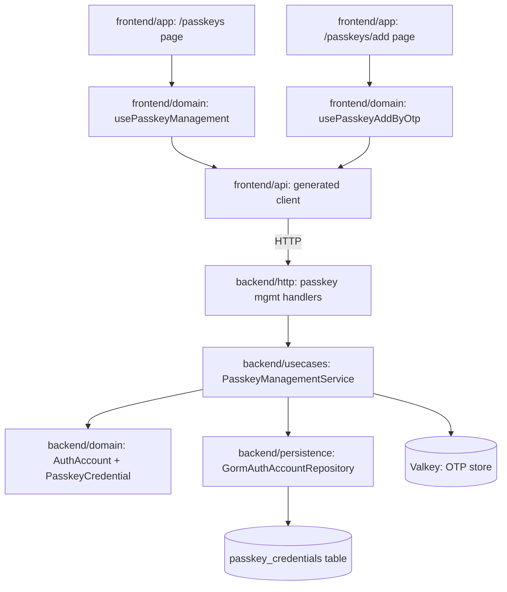
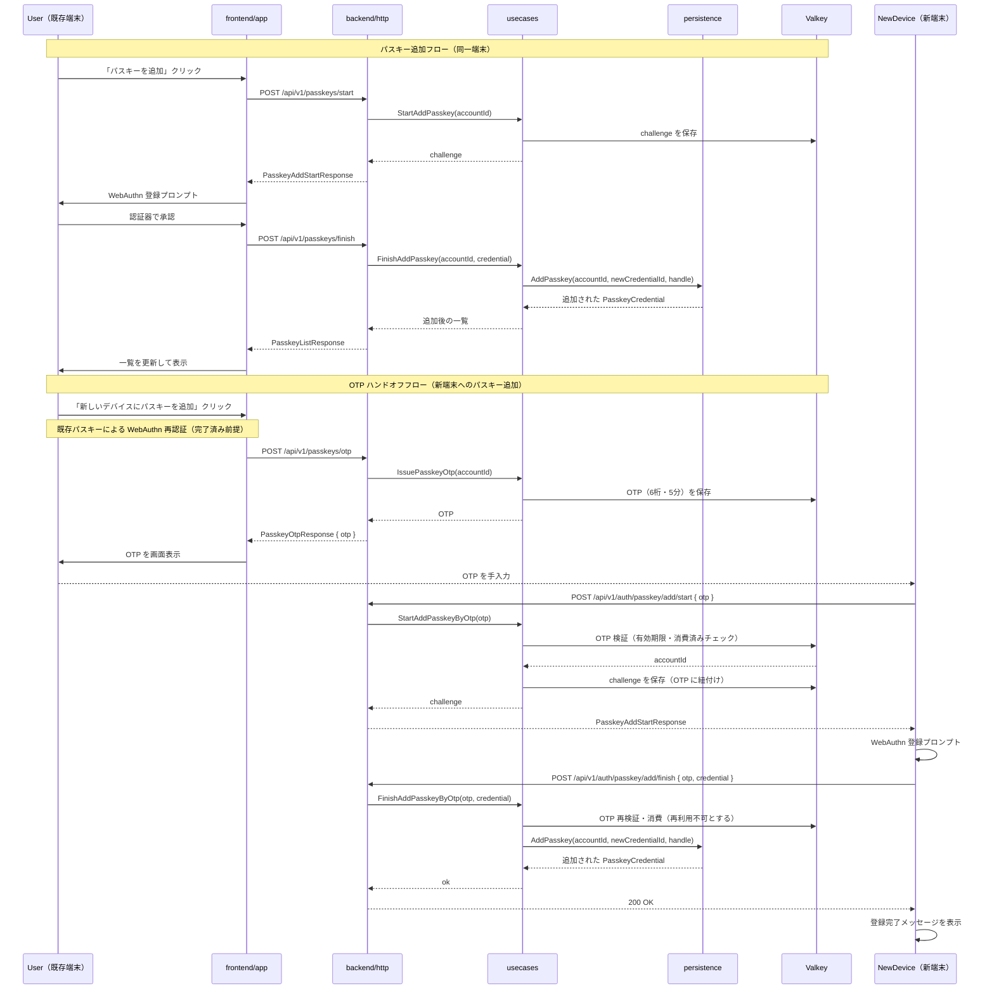
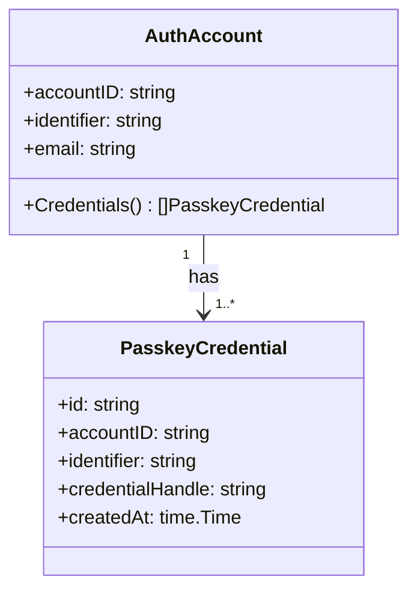
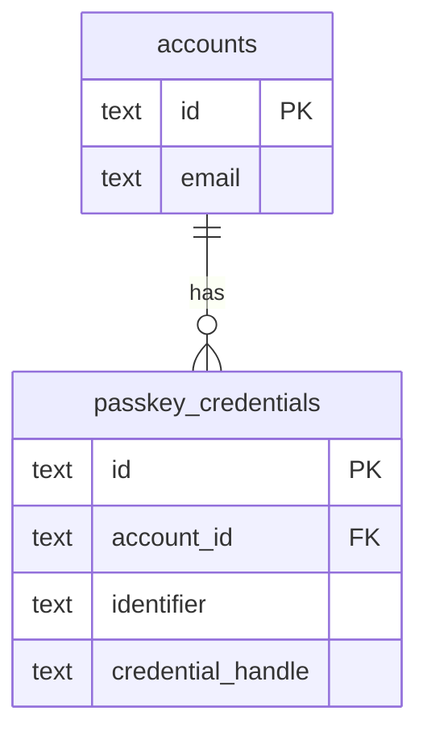
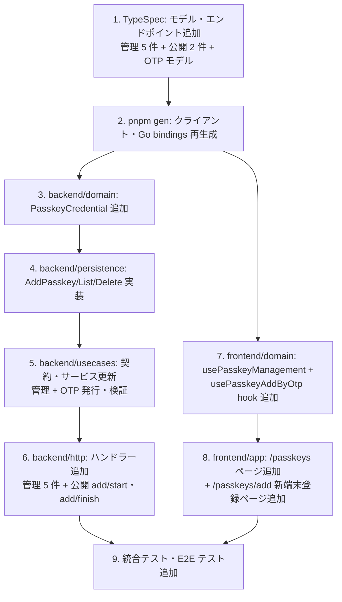

## Scope

### In Scope

- TypeSpec に passkey 管理 API エンドポイント 5 件を追加（`GET /api/v1/passkeys`、`POST /api/v1/passkeys/start`、`POST /api/v1/passkeys/finish`、`DELETE /api/v1/passkeys/{id}`、`POST /api/v1/passkeys/otp`）
- TypeSpec に新端末向け公開エンドポイント 2 件を追加（`POST /api/v1/auth/passkey/add/start`、`POST /api/v1/auth/passkey/add/finish`）
- Go バックエンドのドメインモデル・永続化層・ユースケース層を複数パスキー対応に変更
- `ReplacePasskey` を `AddPasskey` に置き換え、既存パスキーを保持するよう変更
- 削除時の最終 1 件保護ロジックを追加
- OTP ハンドオフによる新端末パスキー追加フローを追加（Valkey 保存・6 桁数字・5 分有効期限）
- フロントエンド API クライアントを再生成（`pnpm gen`）
- `frontend/domain` に passkey 管理ユースケース（一覧取得・追加・削除）を追加
- `frontend/app` にパスキー管理ページ (`/passkeys`) を追加（OTP 表示 UI 含む）
- `frontend/web` または `frontend/app` に新端末向けパスキー登録ページを追加
- 既存のすべての認証シナリオで回帰テストを実施

### Out of Scope

- パスキーへのニックネーム付与機能（将来対応）
- パスキーの最終利用日時・デバイス情報の表示（将来対応）
- WebAuthn conditional UI (autofill) 対応（スコープ外）

## Assumptions / Dependencies

- `passkey_credentials` テーブルは既にマルチレコードを格納できる構造になっており、スキーマ変更（migration）は不要
- 既存の passkey credential データは 1 件/アカウントが維持されており、移行処理は不要
- `POST /api/v1/passkeys/start` のチャレンジ発行は、セッション中の `accountId` から自動的にアカウントを識別する（identifier 入力は不要）
- ブランドシステム・UI ライブラリ (`packages/frontend/ui`) は既存のものを使用
- Valkey-backed auth state store は passkey 追加フローのチャレンジ管理にも使用する

## Impacted Areas

- `packages/typespec/main.tsp` / `src/models/auth.tsp` / `src/routes/v1/` — 新規エンドポイント・モデル追加（管理 API 5 件 + 公開 API 2 件）
- `packages/backend/internal/domain/auth_account.go` — `AuthAccount` を複数パスキー対応に変更
- `packages/backend/internal/usecases/auth_contracts.go` — `AuthAccountRepository` インターフェース変更
- `packages/backend/internal/usecases/auth_service.go` — `RegisterPasskey` の `ReplacePasskey` → `AddPasskey` 変更、管理ユースケース追加、OTP 発行・検証ユースケース追加
- `packages/backend/internal/persistence/gorm_auth_account_repository.go` — `ReplacePasskey` 廃止、CRUD メソッド追加
- `packages/backend/internal/http/auth.go` — 管理 API ハンドラー追加、OTP 発行ハンドラー追加、新端末向け公開エンドポイントハンドラー追加
- `packages/frontend/api/src/generated/client.ts` — 再生成（`pnpm gen`）
- `packages/frontend/domain/src/auth/` — passkey 管理ユースケース追加
- `packages/frontend/app/src/routes/(protected)/passkeys/` — 管理ページ新規追加（OTP 表示 UI 含む）
- `packages/frontend/app/src/lib/` — passkey 管理状態・コンポーネント追加
- `packages/frontend/app/src/routes/passkeys/add/` — 新端末向けパスキー登録ページ新規追加（未認証 surface）

## Directory Tree

```text
packages/
├─ typespec/
│   └─ src/
│       ├─ models/
│       │   └─ auth.tsp                      (edit: PasskeyItem, PasskeyListResponse, PasskeyAddStartResponse, PasskeyAddFinishRequest, PasskeyOtpResponse, PasskeyAddByOtpStartRequest, PasskeyAddByOtpFinishRequest モデル追加)
│       └─ routes/v1/
│           ├─ auth.tsp                      (edit: app namespace に passkey 管理エンドポイント 5 件追加、public namespace に add/start・add/finish 2 件追加)
│           └─ app_namespace.tsp             (確認のみ)
├─ backend/
│   └─ internal/
│       ├─ domain/
│       │   └─ auth_account.go               (edit: PasskeyCredential 型追加、AuthAccount に Credentials()[]PasskeyCredential 追加)
│       ├─ usecases/
│       │   ├─ auth_contracts.go             (edit: AuthAccountRepository に AddPasskey/ListPasskeys/DeletePasskey 追加、ReplacePasskey 廃止)
│       │   └─ auth_service.go               (edit: RegisterPasskey 変更、管理ユースケースメソッド追加、IssuePasskeyOtp/StartAddPasskeyByOtp/FinishAddPasskeyByOtp 追加)
│       ├─ persistence/
│       │   └─ gorm_auth_account_repository.go (edit: AddPasskey/ListPasskeys/DeletePasskey 実装、ReplacePasskey 廃止)
│       └─ http/
│           └─ auth.go                       (edit: passkey 管理ハンドラー追加、OTP 発行ハンドラー追加、add/start・add/finish 公開ハンドラー追加)
└─ frontend/
    ├─ api/src/generated/
    │   └─ client.ts                         (再生成)
    ├─ domain/src/
    │   └─ hooks/auth/
    │       ├─ usePasskeyManagement.svelte.ts (add: 一覧・追加・削除・OTP 発行のユースケース hook)
    │       └─ usePasskeyAddByOtp.svelte.ts  (add: OTP 入力・新端末パスキー登録のユースケース hook)
    └─ app/src/
        ├─ routes/(protected)/passkeys/
        │   ├─ +page.svelte                  (add: パスキー管理ページ・OTP 表示 UI 含む)
        │   └─ +page.ts                      (add: ページデータロード)
        ├─ routes/passkeys/
        │   └─ add/
        │       ├─ +page.svelte              (add: 新端末向けパスキー登録ページ・未認証 surface)
        │       └─ +page.ts                  (add: ページデータロード)
        └─ lib/
            └─ profiles/
                └─ PasskeyList.svelte        (add: パスキー一覧コンポーネント)
```

## New / Changed Files

| Type  | File                                                                     | Change                                                                                                                                                                       |
| ----- | ------------------------------------------------------------------------ | ---------------------------------------------------------------------------------------------------------------------------------------------------------------------------- |
| Edit  | `packages/typespec/src/models/auth.tsp`                                  | PasskeyItem, PasskeyListResponse, PasskeyAddStartResponse, PasskeyAddFinishRequest, PasskeyOtpResponse, PasskeyAddByOtpStartRequest, PasskeyAddByOtpFinishRequest モデル追加 |
| Edit  | `packages/typespec/src/routes/v1/auth.tsp`                               | app namespace に passkey 管理 5 エンドポイント追加、public namespace に add/start・add/finish 追加                                                                           |
| Edit  | `packages/backend/internal/domain/auth_account.go`                       | PasskeyCredential 値オブジェクト追加、AuthAccount に複数パスキー対応追加                                                                                                     |
| Edit  | `packages/backend/internal/usecases/auth_contracts.go`                   | AuthAccountRepository インターフェース更新                                                                                                                                   |
| Edit  | `packages/backend/internal/usecases/auth_service.go`                     | RegisterPasskey 変更、管理ユースケース 3 件追加、IssuePasskeyOtp/StartAddPasskeyByOtp/FinishAddPasskeyByOtp 追加                                                             |
| Edit  | `packages/backend/internal/persistence/gorm_auth_account_repository.go`  | ReplacePasskey 廃止・AddPasskey/ListPasskeys/DeletePasskey 実装                                                                                                              |
| Edit  | `packages/backend/internal/http/auth.go`                                 | passkey 管理ハンドラー 5 件追加（OTP 発行含む）、add/start・add/finish 公開ハンドラー 2 件追加                                                                               |
| Regen | `packages/frontend/api/src/generated/client.ts`                          | `pnpm gen` で自動再生成                                                                                                                                                      |
| Add   | `packages/frontend/domain/src/hooks/auth/usePasskeyManagement.svelte.ts` | パスキー管理ユースケース hook（一覧・追加・削除・OTP 発行）                                                                                                                  |
| Add   | `packages/frontend/domain/src/hooks/auth/usePasskeyAddByOtp.svelte.ts`   | 新端末向けパスキー登録 hook（OTP 入力・start/finish フロー）                                                                                                                 |
| Add   | `packages/frontend/app/src/routes/(protected)/passkeys/+page.svelte`     | パスキー管理ページ（一覧・追加・削除・OTP 表示 UI）                                                                                                                          |
| Add   | `packages/frontend/app/src/routes/(protected)/passkeys/+page.ts`         | ページデータロード（一覧 API 呼び出し）                                                                                                                                      |
| Add   | `packages/frontend/app/src/routes/passkeys/add/+page.svelte`             | 新端末向けパスキー登録ページ（未認証 surface・OTP 入力 → WebAuthn 登録）                                                                                                     |
| Add   | `packages/frontend/app/src/routes/passkeys/add/+page.ts`                 | ページデータロード                                                                                                                                                           |
| Add   | `packages/frontend/app/src/lib/profiles/PasskeyList.svelte`              | パスキー一覧・削除コンポーネント                                                                                                                                             |

## System Diagram

```mermaid
flowchart LR
  User[認証済みユーザー] -->|GET /api/v1/passkeys| AppAPI[Go API Server]
  User -->|POST /api/v1/passkeys/start| AppAPI
  User -->|POST /api/v1/passkeys/finish| AppAPI
  User -->|DELETE /api/v1/passkeys/{id}| AppAPI
  User -->|POST /api/v1/passkeys/otp| AppAPI
  NewDevice[新端末・未認証] -->|POST /api/v1/auth/passkey/add/start| AppAPI
  NewDevice -->|POST /api/v1/auth/passkey/add/finish| AppAPI
  AppAPI -->|bearer session verify| Valkey[(Valkey)]
  AppAPI -->|OTP 保存・検証| Valkey
  AppAPI -->|CRUD passkey_credentials| DB[(PostgreSQL)]
```

## Package Diagram



## Sequence Diagram



## UI Wireframes

N/A — wireframe not yet generated

## Domain Model Diagram



## ER Diagram



スキーマ変更なし。`passkey_credentials.account_id` に一意制約は元々存在しない。

## Package-Level Design

### Package List

| Package                        | Purpose / Responsibility                                            | Public API                                                                                                                                 | Dependencies                         |
| ------------------------------ | ------------------------------------------------------------------- | ------------------------------------------------------------------------------------------------------------------------------------------ | ------------------------------------ |
| `backend/internal/domain`      | パスキー credential の値オブジェクトとバリデーション                | `PasskeyCredential`, `AuthAccount.Credentials()`                                                                                           | なし                                 |
| `backend/internal/usecases`    | パスキー管理のビジネスロジック（最終 1 件保護・OTP 発行・検証含む） | `ListPasskeys`, `StartAddPasskey`, `FinishAddPasskey`, `DeletePasskey`, `IssuePasskeyOtp`, `StartAddPasskeyByOtp`, `FinishAddPasskeyByOtp` | domain, persistence インターフェース |
| `backend/internal/persistence` | passkey_credentials テーブルの CRUD                                 | `AddPasskey`, `ListPasskeys`, `DeletePasskey` (GORM 実装)                                                                                  | GORM, domain                         |
| `backend/internal/http`        | HTTP ハンドラー・リクエスト/レスポンスマッピング                    | `GET/POST/DELETE /api/v1/passkeys/*`、`POST /api/v1/auth/passkey/add/*`                                                                    | usecases, generated openapi          |
| `frontend/api`                 | 型安全な HTTP クライアント（自動生成）                              | 生成されたクライアント関数                                                                                                                 | TypeSpec 生成物                      |
| `frontend/domain/auth`         | パスキー管理ユースケース hook                                       | `usePasskeyManagement()` hook（`{ data, actions }` 形式）、`usePasskeyAddByOtp()` hook                                                     | frontend/api                         |
| `frontend/app`                 | パスキー管理ページ・新端末登録ページ・コンポーネント                | `/passkeys` ルート（認証済み）、`/passkeys/add` ルート（未認証）                                                                           | frontend/domain, frontend/ui         |

### Details

#### backend/internal/domain

- Purpose / Responsibility: `PasskeyCredential` 値オブジェクトを追加し、`AuthAccount` が `[]PasskeyCredential` を保持できるよう変更。バリデーションロジックを集約。
- Public API: `PasskeyCredential` 型、`AuthAccount.Credentials() []PasskeyCredential`
- Key Data Structures: `PasskeyCredential{id, accountID, identifier, credentialHandle, createdAt}`
- Key Flows: `NewPasskeyCredential(...)` でバリデーション → `AuthAccount` に追加
- Dependencies: なし
- Error Handling: 既存の `ErrInvalidPasskeyCredential` を流用
- Testing Strategy: UT で `NewPasskeyCredential` の正常系・異常系をカバー（UT-AUTH-BE-BND-\*）
- Security: `credentialHandle` の空白・不正値バリデーション

#### backend/internal/usecases

- Purpose / Responsibility: `AuthAccountRepository` インターフェースに `AddPasskey`, `ListPasskeys`, `DeletePasskeyByID` を追加。`ReplacePasskey` を廃止。最終 1 件削除防止ロジックを `DeletePasskey` ユースケースに実装。OTP の発行・Valkey 保存・検証を担う `IssuePasskeyOtp`, `StartAddPasskeyByOtp`, `FinishAddPasskeyByOtp` を追加。
- Public API: `ListPasskeys(ctx, accountID)`, `StartAddPasskey(ctx, input)`, `FinishAddPasskey(ctx, input)`, `DeletePasskey(ctx, accountID, credentialID)`, `IssuePasskeyOtp(ctx, accountID)`, `StartAddPasskeyByOtp(ctx, otp)`, `FinishAddPasskeyByOtp(ctx, otp, credential)`
- Key Flows:
  - DeletePasskey → `ListPasskeys` で残数確認 → 1 件ならエラー → `DeletePasskey` 実行
  - IssuePasskeyOtp → 6 桁乱数生成 → Valkey に `{otp: accountID, ttl: 5min}` 保存 → OTP 返却
  - StartAddPasskeyByOtp → OTP 検証 → accountID 解決 → challenge 生成 → Valkey に保存
  - FinishAddPasskeyByOtp → OTP 再検証・消費 → credential 検証 → `AddPasskey` 実行
- Error Handling: `ErrLastPasskeyCannotBeDeleted` (新規エラー), `ErrAuthAccountNotFound`, `ErrAuthStoreUnavailable`, `ErrInvalidOtp` (新規エラー), `ErrOtpExpiredOrConsumed` (新規エラー)
- Testing Strategy: UT で最終 1 件保護・他アカウント操作防止・OTP 有効期限切れ・OTP 再利用拒否・正常系をカバー
- Security: `DeletePasskey` は bearer session の `accountID` と credential の `accountID` を照合。OTP は消費後に Valkey から削除して再利用不可を保証。

#### frontend/domain/src/hooks/auth

- Purpose / Responsibility: パスキー管理の stateful ユースケース hook。API 呼び出しラッパー・エラーハンドリング・ローディング状態を提供。リポジトリ規約に従い `.svelte.ts` で実装する。
- Public API:
  - `usePasskeyManagement()` — `{ data: { passkeys, loading, error }, actions: { listPasskeys(), startAddPasskey(), finishAddPasskey(), deletePasskey(id), issueOtp() } }`
  - `usePasskeyAddByOtp()` — `{ data: { loading, error, done }, actions: { start(otp), finish(otp, credential) } }`
- Key Flows:
  - `actions.deletePasskey(id)` → API 呼び出し → 成功時に `data.passkeys` から該当エントリ除去 → エラー時は `data.error` セット
  - `actions.issueOtp()` → `POST /app/passkeys/otp` → 成功時に OTP 文字列を返却（UI に表示）
  - `actions.start(otp)` → `POST /auth/passkey/add/start` → challenge を返却 → `actions.finish(otp, credential)` → `POST /auth/passkey/add/finish` → 完了
- Dependencies: `frontend/api` 生成クライアント
- Testing Strategy: UT で各操作の正常系・エラー系をカバー（UT-AUTH-FE-\*）

## Implementation Plan



## Test Plan

### User Acceptance Test (Manual)

| UAT ID              | Related Requirement                             | Spec Summary                         | Customer Problem Summary       | Steps                                                                                                                                 | Expected Behavior                              |
| ------------------- | ----------------------------------------------- | ------------------------------------ | ------------------------------ | ------------------------------------------------------------------------------------------------------------------------------------- | ---------------------------------------------- |
| UAT-AUTH-FE-HAP-001 | AUTH-FE-R001 パスキー一覧・追加・削除管理ページ | 管理ページで一覧・追加・削除ができる | 複数デバイスを安全に管理したい | 1. ログイン 2. `/passkeys` へ遷移 3. 一覧を確認 4. 「追加」をクリックして WebAuthn 完了 5. 新しいパスキーが一覧に表示されることを確認 | 既存パスキーが消えず新しいパスキーが追加される |
| UAT-AUTH-FE-BND-001 | AUTH-FE-R001 最終 1 件削除不可                  | 最後の 1 件は削除できない            | ロックアウトを防ぎたい         | 1. ログイン 2. 管理ページで 1 件だけパスキーがある状態を確認 3. 削除ボタンが無効またはなし                                            | 削除操作が UI 上で無効化されている             |

### E2E Test (Playwright)

| E2E ID              | Playwright Test Name                                    | Related Scenario | Category | Summary                              | Steps (Playwright)                                                                                  | Expected Behavior                            |
| ------------------- | ------------------------------------------------------- | ---------------- | -------- | ------------------------------------ | --------------------------------------------------------------------------------------------------- | -------------------------------------------- |
| E2E-AUTH-FE-HAP-001 | [AUTH-FE-S010] パスキー管理ページで一覧を確認できる     | AUTH-FE-S010     | HAP      | 一覧ページ表示                       | 1. ログイン 2. `/passkeys` 遷移 3. パスキー一覧 DOM の存在確認                                      | 登録済みパスキーが一覧表示される             |
| E2E-AUTH-FE-HAP-002 | [AUTH-FE-S011] 新しいパスキーを追加できる               | AUTH-FE-S011     | HAP      | パスキー追加フロー                   | 1. ログイン 2. 管理ページ 3. 「追加」クリック 4. WebAuthn stub 完了 5. 一覧更新確認                 | 新しいパスキーが追加され、既存は保持される   |
| E2E-AUTH-FE-HAP-003 | [AUTH-FE-S012] パスキーを削除できる                     | AUTH-FE-S012     | HAP      | パスキー削除フロー（2 件以上の場合） | 1. ログイン（2 件パスキーがある状態）2. 削除クリック 3. 一覧更新確認                                | 削除されたパスキーのみ消え、残りは保持される |
| E2E-AUTH-FE-BND-001 | [AUTH-FE-S013] 最後の 1 件は削除ボタンが無効            | AUTH-FE-S013     | BND      | 削除ボタン無効化                     | 1. ログイン（1 件パスキー）2. 管理ページ 3. 削除ボタンが disabled を確認                            | 削除ボタンが disabled または非表示           |
| E2E-AUTH-FE-ERR-001 | [AUTH-FE-S014] パスキー追加フロー中のエラーは通知される | AUTH-FE-S014     | ERR      | 追加フローエラー通知                 | 1. ログイン 2. 管理ページ 3. 「追加」クリック 4. WebAuthn stub でキャンセル 5. エラーメッセージ確認 | エラーメッセージが表示されページに留まる     |

### Integration Test (Endpoint)

| IT ID              | Test Name                                                 | Genre | Category | Summary                         | Steps (Test)                                                                                 | Expected Behavior                                  |
| ------------------ | --------------------------------------------------------- | ----- | -------- | ------------------------------- | -------------------------------------------------------------------------------------------- | -------------------------------------------------- |
| IT-AUTH-BE-HAP-001 | [AUTH-BE-S014] GET /app/passkeys が一覧を返す             | be    | HAP      | 一覧取得 API                    | 1. テスト用 account+passkey セットアップ 2. GET /api/v1/passkeys 呼び出し 3. レスポンス確認  | 200 + パスキー一覧 JSON                            |
| IT-AUTH-BE-HAP-002 | [AUTH-BE-S015] パスキーを追加しても既存が残る             | be    | HAP      | AddPasskey API                  | 1. account+1passkey セットアップ 2. start/finish で追加 3. 一覧で 2 件を確認                 | 既存パスキーが保持される                           |
| IT-AUTH-BE-BND-001 | [AUTH-BE-S016] 最後の 1 件削除は 409 を返す               | be    | BND      | 最終 1 件削除防止               | 1. account+1passkey セットアップ 2. DELETE /api/v1/passkeys/{id} 3. 409 確認                 | 409 Conflict + エラーメッセージ                    |
| IT-AUTH-BE-HAP-003 | [AUTH-BE-S017] 2 件中 1 件の削除                          | be    | HAP      | パスキー削除 API                | 1. account+2passkey セットアップ 2. DELETE /api/v1/passkeys/{id} 3. 一覧で 1 件確認          | 指定したパスキーのみ削除                           |
| IT-AUTH-BE-SEC-001 | [AUTH-BE-S018] 他アカウントのパスキー削除は 403           | be    | SEC      | 他アカウント操作防止            | 1. account A/B セットアップ 2. A の session で B の passkey を DELETE 3. 403 確認            | 403 Forbidden                                      |
| IT-AUTH-BE-SEC-002 | [AUTH-BE-S019] 未認証リクエストは 401                     | be    | SEC      | 未認証アクセス拒否              | bearer token なしで GET /api/v1/passkeys 3. 401 確認                                         | 401 Unauthorized                                   |
| IT-AUTH-BE-HAP-004 | [AUTH-BE-S020] パスキー追加後に既存パスキーが残る（回帰） | be    | HAP      | AddPasskey 後の既存パスキー保持 | 1. account+1passkey 2. 追加フロー実行 3. 一覧で 2 件確認                                     | 既存パスキーが保持され、新しいパスキーが追加される |
| IT-AUTH-BE-HAP-005 | [AUTH-BE-S021] OTP を発行できる                           | be    | HAP      | OTP 発行 API                    | 1. account+passkey セットアップ 2. POST /api/v1/passkeys/otp 3. 6 桁数字のレスポンス確認     | 200 + 6 桁 OTP                                     |
| IT-AUTH-BE-HAP-006 | [AUTH-BE-S022] OTP で新端末にパスキーを追加できる         | be    | HAP      | OTP ハンドオフ正常系            | 1. OTP 発行 2. add/start で OTP 提示 3. add/finish で WebAuthn 完了 4. 一覧で件数確認        | 新パスキーが追加され、既存は保持される             |
| IT-AUTH-BE-ERR-001 | [AUTH-BE-S023] 有効期限切れ OTP は拒否される              | be    | ERR      | OTP 期限切れ拒否                | 1. OTP 発行後 5 分超過させる 2. add/start で提示 3. 400/401 確認                             | リクエスト拒否                                     |
| IT-AUTH-BE-ERR-002 | [AUTH-BE-S024] 消費済み OTP は再利用できない              | be    | ERR      | OTP 再利用拒否                  | 1. OTP 発行 2. 1 回目 add/start → add/finish 完了 3. 同 OTP で再度 add/start 4. 400/401 確認 | リクエスト拒否                                     |

### Unit/Component Test (UT)

| UT ID              | Test Name                                                               | Package          | Category | Summary                        | Steps (Test)                                                  | Expected Behavior                                       |
| ------------------ | ----------------------------------------------------------------------- | ---------------- | -------- | ------------------------------ | ------------------------------------------------------------- | ------------------------------------------------------- |
| UT-AUTH-BE-HAP-001 | [AUTH-BE-S016] DeletePasskey: 最終 1 件は ErrLastPasskeyCannotBeDeleted | backend/usecases | BND      | 最終 1 件保護ロジック          | List → 1 件 → DeletePasskey → エラー確認                      | `ErrLastPasskeyCannotBeDeleted` が返る                  |
| UT-AUTH-BE-SEC-001 | [AUTH-BE-S018] DeletePasskey: 他アカウントは拒否                        | backend/usecases | SEC      | 他アカウント操作防止           | accountID 不一致の credential ID → DeletePasskey → エラー確認 | `ErrAuthAccountNotFound` が返る                         |
| UT-AUTH-BE-BND-001 | [AUTH-BE-S016] domain.PasskeyCredential: 空ハンドルは拒否               | backend/domain   | BND      | 値オブジェクトのバリデーション | 空 credentialHandle → `NewPasskeyCredential` → エラー確認     | `ErrInvalidPasskeyCredential` が返る                    |
| UT-AUTH-BE-ERR-001 | [AUTH-BE-S023] IssuePasskeyOtp → StartAddPasskeyByOtp: 期限切れは拒否   | backend/usecases | ERR      | OTP 期限切れ拒否               | OTP 発行 → TTL 超過モック → StartAddPasskeyByOtp → エラー確認 | `ErrOtpExpiredOrConsumed` が返る                        |
| UT-AUTH-BE-ERR-002 | [AUTH-BE-S024] FinishAddPasskeyByOtp: 消費済み OTP は再利用不可         | backend/usecases | ERR      | OTP 再利用拒否                 | OTP 消費済みモック → FinishAddPasskeyByOtp → エラー確認       | `ErrOtpExpiredOrConsumed` が返る                        |
| UT-AUTH-FE-HAP-001 | [AUTH-FE-S012] deletePasskey: store から削除される                      | frontend/domain  | HAP      | store の削除後状態             | store に 2 件 → deletePasskey(id) → store が 1 件を確認       | 対象パスキーが store から除去される                     |
| UT-AUTH-FE-ERR-001 | [AUTH-FE-S015] deletePasskey: API エラー時に store は変化しない         | frontend/domain  | ERR      | エラー時の store 状態保全      | API モック → エラー返却 → store 状態を確認                    | store の状態は変化せず error フィールドにメッセージ設定 |

## Rollback / Migration

- DB スキーマ変更なし。ロールバックはアプリのデプロイロールバックで対応可能。
- `ReplacePasskey` 廃止後に旧バイナリへロールバックすると `recovery フロー` が失敗する可能性があるため、デプロイ後の確認が必要。

## Release Procedure

1. `pnpm gen` を実行し生成物を確認する
2. バックエンドのビルドと単体テストを確認 (`pnpm test:server`)
3. フロントエンドのビルドと単体テストを確認 (`pnpm test:client`)
4. E2E テストを確認 (`pnpm test:e2e`)
5. staging 環境でパスキー追加・削除・recovery フローを手動確認（UAT-AUTH-FE-HAP-001、UAT-AUTH-FE-BND-001）
6. production デプロイ

## Acceptance Criteria

- `GET /api/v1/passkeys` がアカウントのすべてのパスキーを返す
- パスキー追加フローを完了すると既存パスキーが消えない
- 最終 1 件の削除が API・UI 両方で防止される
- 他アカウントのパスキーを操作できない
- `POST /api/v1/passkeys/otp` が bearer session と再認証済み前提で 6 桁 OTP を返す
- 有効期限切れ・消費済みの OTP は新端末パスキー登録フローで拒否される
- 有効な OTP を使った `POST /api/v1/auth/passkey/add/start` → `POST /api/v1/auth/passkey/add/finish` フローが新端末にパスキーを追加し、既存パスキーを保持する
- すべての既存認証シナリオ（AUTH-BE-S001〜S013、AUTH-FE-S001〜S009）が回帰テストで合格する

## Open Issues

- パスキーの識別子として何を表示するか（現在の `identifier` フィールドは email 相当の値）。登録日時のみ表示するか、ニックネーム追加を将来対応とするか要確認。
