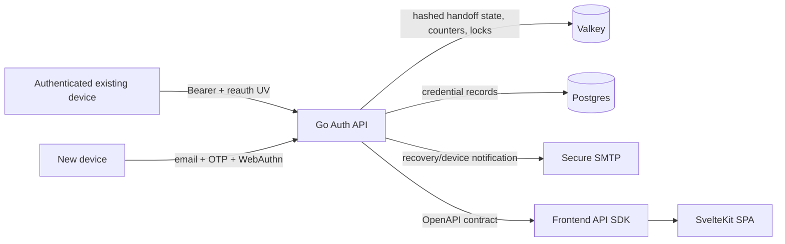
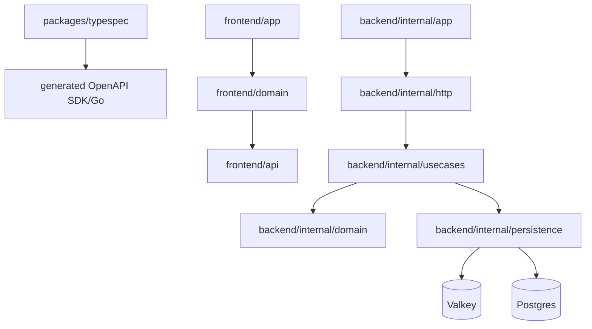
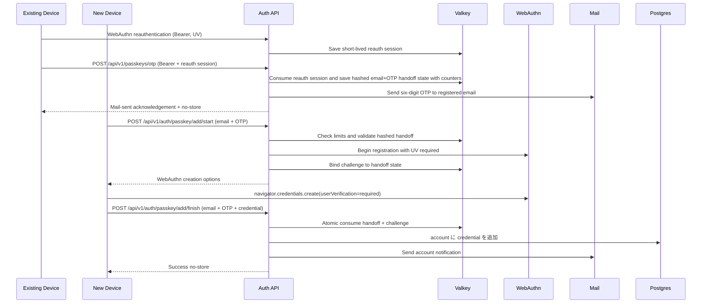
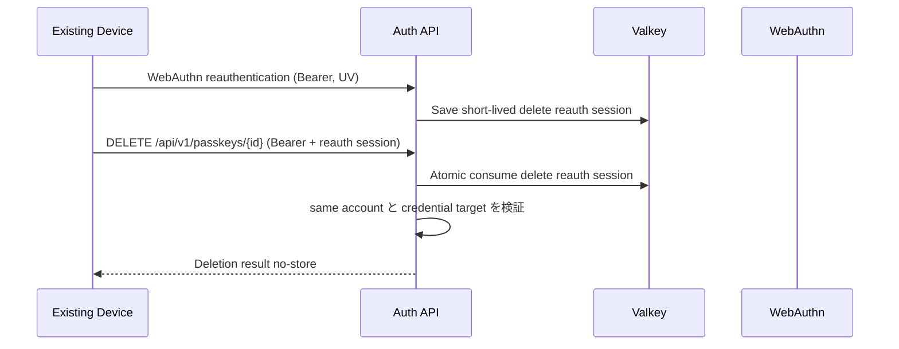
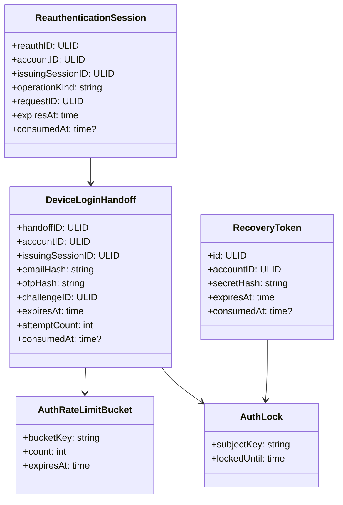
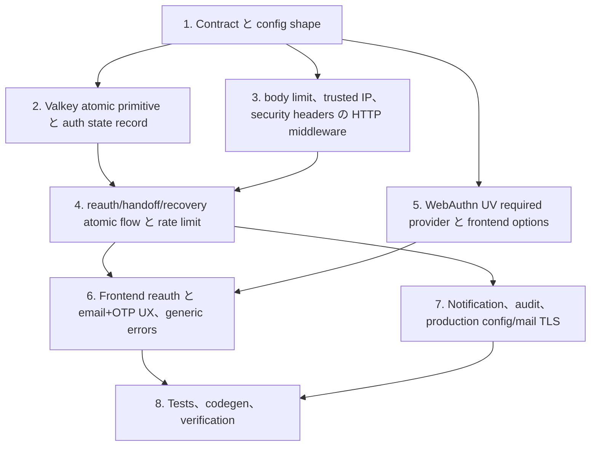

## 範囲

### 対象

- 登録メールアドレスへ送信する `email + 6桁OTP` による新しい端末のログイン有効化 API と UI。
- OTP 送信前と passkey credential 削除前の WebAuthn 再認証 session。
- OTP / recovery token / recovery session / reauthentication session / handoff challenge の hashed secret storage と atomic consume。
- public auth endpoint の IP、email、email+IP、OTP、account、global rate limit と temporary lock。
- public auth endpoint の body size limit、server timeout、trusted proxy boundary。
- WebAuthn user verification required の server/client 両面反映。
- production config validation、security headers、recovery URL token removal、recovery mail TLS/STARTTLS enforcement。
- TypeSpec contract、生成 OpenAPI / SDK / Go bindings、Go/Vitest/Playwright tests の更新。

### 対象外

- password 認証、social login、invite onboarding、authorization roles。
- Postgres schema 変更。handoff/recovery hardening は Valkey-backed とし、既存の passkey credential persistence は変更しない。
- bearer session storage を HttpOnly cookie session へ置き換えること。client contract は bearer-based のまま、persistence exposure 低減と browser hardening を行う。
- 新端末で OTP 入力後に既存端末へ real-time approval を求めること。この design は simple な code-entry UX を維持し、strict limit、short TTL、notification、audit に依存する。

## 前提 / 依存

- API contract source は `packages/typespec/main.tsp` のままとし、生成 file は `pnpm gen` で更新する。
- 既存 route policy は `/api/v1/auth/passkey/add/*` を public、`/api/v1/passkeys/otp` を bearer-protected のまま維持する。
- `/api/v1/passkeys/otp` と `DELETE /api/v1/passkeys/{id}` は追加で fresh な same-account reauthentication session を要求し、bearer だけでは成立しない。
- Valkey はすべての runtime environment で利用でき、`GETDEL` または Lua script による atomic operation を実行できる。
- Production deployment は Go API 手前で TLS terminate するか direct HTTPS で接続し、trusted proxy CIDR を設定できる。
- Mail delivery は production で証明書検証付き TLS または STARTTLS を support する。

## 影響範囲

- API: `startPasskeyAdditionByOtp` と `finishPasskeyAdditionByOtp` の request model に `email` を追加し、passkey OTP response は平文 OTP を返さずメール送信済み acknowledgement を返す。
- Backend HTTP: request body limit、trusted proxy setup、security headers、client IP extraction、route tests。
- Backend usecases/domain: handoff state、reauthentication session state、hashed secret verification、rate limit buckets、audit event shape、user verification handling。
- Backend persistence: OTP、challenge、recovery token/session、counters、locks 向けの Valkey atomic operations と key layout。
- Backend app/runtime: production config validation、server timeouts、WebAuthn provider options、SMTP secure transport。
- Frontend API/domain/app: email + OTP form、メール送信済み案内、再認証 prompt、generic errors、token URL removal、session persistence hardening、security header deployment config。
- Tests: TypeSpec drift、Go endpoint/unit tests、Vitest domain/component tests、Playwright UAT flows。

## ディレクトリ構成

```text
.
├─ packages
│  ├─ typespec
│  │  └─ src
│  │     └─ models
│  │        └─ auth.tsp
│  ├─ backend
│  │  ├─ internal
│  │  │  ├─ app
│  │  │  │  ├─ config.go
│  │  │  │  ├─ runtime.go
│  │  │  │  ├─ smtp_sender.go
│  │  │  │  └─ webauthn_provider.go
│  │  │  ├─ domain
│  │  │  │  ├─ auth_throttle.go
│  │  │  │  └─ recovery_token.go
│  │  │  ├─ http
│  │  │  │  ├─ auth.go
│  │  │  │  ├─ auth_test.go
│  │  │  │  ├─ router.go
│  │  │  │  └─ router_test.go
│  │  │  ├─ persistence
│  │  │  │  ├─ auth_state_repository.go
│  │  │  │  └─ valkey_store.go
│  │  │  ├─ types
│  │  │  │  ├─ config.go
│  │  │  │  └─ config_test.go
│  │  │  └─ usecases
│  │  │     ├─ auth_contracts.go
│  │  │     ├─ auth_errors.go
│  │  │     ├─ auth_service.go
│  │  │     └─ auth_service_test.go
│  │  └─ internal/generated/openapi/openapi.gen.go
│  └─ frontend
│     ├─ api
│     │  └─ src/generated/client.ts
│     ├─ domain
│     │  └─ src/auth
│     │     ├─ passkey/addByOtp/hook.svelte.ts
│     │     ├─ passkey/management/hook.svelte.ts
│     │     ├─ recovery/hook.svelte.ts
│     │     ├─ session/hook.svelte.ts
│     │     └─ webauthn.ts
│     └─ app
│        ├─ src/lib/profiles/PasskeyList.svelte
│        ├─ src/routes/login/recovery/consume/+page.svelte
│        └─ src/routes/passkeys/add/+page.svelte
└─ openspec
   └─ changes/harden-auth-production-security
      ├─ proposal.md
      ├─ specs/auth-be/spec.md
      ├─ specs/auth-fe/spec.md
      ├─ design.md
      └─ tasks.md
```

## 新規 / 変更ファイル

| 種別   | File                                                                   | 変更内容                                                                                                                                                                                                                                                         |
| ------ | ---------------------------------------------------------------------- | ---------------------------------------------------------------------------------------------------------------------------------------------------------------------------------------------------------------------------------------------------------------- |
| Update | `packages/typespec/src/models/auth.tsp`                                | OTP handoff start/finish request model に email を追加し、OTP issue response から `otp` を削除して `issued: true` のみ返すように変更する。`PasskeyStartResponse` と `PasskeyAddStartResponse` の `userVerification` を `"required"` の literal type に変更する。 |
| Update | `packages/typespec/src/routes/v1/auth.tsp`                             | `issuePasskeyOtp` と `deletePasskey` に `@header("X-Reauth-Session")` を必須として追加する。                                                                                                                                                                     |
| Update | `packages/backend/internal/types/config.go`                            | origin、RPID、recovery URL、trusted proxy、body limit、timeout、mail TLS 向け production security config と validation を追加する。                                                                                                                              |
| Update | `packages/backend/internal/app/config.go`                              | TOML から新しい config 値を読み込み、development 向け safe default を設定する。                                                                                                                                                                                  |
| Update | `packages/backend/internal/app/runtime.go`                             | HTTP server の read/write/idle timeout を設定する。                                                                                                                                                                                                              |
| Update | `packages/backend/internal/app/smtp_sender.go`                         | production mail transport で TLS/STARTTLS を要求する。                                                                                                                                                                                                           |
| Update | `packages/backend/internal/app/webauthn_provider.go`                   | user verification required、Valkey-backed challenge/session storage、および `FinishLogin`/`FinishRegistration` への challenge key 引数渡しを設定する。`clientDataJSON` からの challenge 自己解決は廃止する。                                                     |
| Update | `packages/backend/internal/http/auth.go`                               | generic auth rejection helper、body limit hook、security headers、trusted client IP handling を追加する。                                                                                                                                                        |
| Update | `packages/backend/internal/http/router.go`                             | trusted proxy、body limit middleware、security headers、rate-limit middleware を配線する。                                                                                                                                                                       |
| Update | `packages/backend/internal/persistence/valkey_store.go`                | `GETDEL` または Lua による atomic consume primitive を追加する。                                                                                                                                                                                                 |
| Update | `packages/backend/internal/persistence/auth_state_repository.go`       | hashed OTP/recovery secret、reauthentication session、namespaced handoff state、counter、lock、atomic consume を保存する。                                                                                                                                       |
| Update | `packages/backend/internal/usecases/auth_contracts.go`                 | email-aware handoff DTO、reauthentication session DTO、repository method を追加する。                                                                                                                                                                            |
| Update | `packages/backend/internal/usecases/auth_errors.go`                    | generic handoff failure と rate limit key を正規化する。                                                                                                                                                                                                         |
| Update | `packages/backend/internal/usecases/auth_service.go`                   | 再認証で保護された OTP delivery/deletion、email+OTP handoff validation、strict limits、atomic consume、notification、audit を実装する。                                                                                                                          |
| Update | `packages/backend/internal/http/*_test.go`                             | 新しい scenario ID の endpoint test を追加し、request payload を更新する。                                                                                                                                                                                       |
| Update | `packages/backend/internal/usecases/auth_service_test.go`              | collision isolation、atomic consume、rate limit、UV rejection の unit test を追加する。                                                                                                                                                                          |
| Update | `packages/frontend/api/src/generated/client.ts`                        | TypeSpec から生成される SDK を更新する。                                                                                                                                                                                                                         |
| Update | `packages/frontend/domain/src/auth/passkey/addByOtp/hook.svelte.ts`    | email + OTP を送信し、generic error を保ち、永続化を避ける。                                                                                                                                                                                                     |
| Update | `packages/frontend/domain/src/auth/passkey/management/hook.svelte.ts`  | 新端末ログイン有効化 copy、再認証 flow、メール送信済み OTP TTL guidance を扱う。                                                                                                                                                                                 |
| Update | `packages/frontend/domain/src/auth/recovery/hook.svelte.ts`            | token consume flow を維持しつつ token persistence を避ける。                                                                                                                                                                                                     |
| Update | `packages/frontend/domain/src/auth/session/hook.svelte.ts`             | missing-session contract を保ちながら persisted bearer session exposure を減らす。                                                                                                                                                                               |
| Update | `packages/frontend/domain/src/auth/webauthn.ts`                        | `userVerification: required` を使う。                                                                                                                                                                                                                            |
| Update | `packages/frontend/app/src/lib/profiles/PasskeyList.svelte`            | UX を新端末ログイン有効化へ変更し、再認証を要求し、メール送信済み email/TTL/share-warning guidance を表示する。                                                                                                                                                  |
| Update | `packages/frontend/app/src/routes/passkeys/add/+page.svelte`           | email input、generic errors、no persistent email/OTP state を追加する。                                                                                                                                                                                          |
| Update | `packages/frontend/app/src/routes/login/recovery/consume/+page.svelte` | 読み取り後に recovery token を visible URL から除去する。                                                                                                                                                                                                        |

## システム図



## パッケージ図



## シーケンス図





## UI ワイヤーフレーム

N/A。wireframe は未生成。

## ドメインモデル図



## ER 図

N/A。durable relational schema change は予定しない。Handoff、throttle、lock、recovery one-time state は Valkey-backed TTL record のままとし、passkey credential は既存 Postgres table を使い続ける。

## パッケージ別設計

### パッケージ一覧

| Package                                 | 目的 / 責務                                                      | Public API                                | 依存                               |
| --------------------------------------- | ---------------------------------------------------------------- | ----------------------------------------- | ---------------------------------- |
| `packages/typespec`                     | auth payload と security declaration の API contract を管理する  | `main.tsp`, auth models/routes            | TypeSpec emitter                   |
| `packages/backend/internal/http`        | transport validation、middleware、response mapping を担う        | Gin router, strict server methods         | generated OpenAPI, usecases        |
| `packages/backend/internal/usecases`    | auth flow orchestration と security decision を担う              | `AuthService` methods                     | domain, persistence ports          |
| `packages/backend/internal/persistence` | Valkey/Postgres persistence と atomic state mutation を担う      | auth state repository, account repository | Valkey, GORM                       |
| `packages/backend/internal/app`         | runtime config、WebAuthn provider、SMTP、server setup を構築する | runtime/container providers               | http, persistence, WebAuthn, SMTP  |
| `packages/frontend/domain`              | client auth flow state と WebAuthn serialization を担う          | domain hooks                              | frontend/api, WebAuthn browser API |
| `packages/frontend/app`                 | Svelte routes と user-facing auth UI を表示する                  | `/passkeys/add`, recovery routes          | frontend/domain, frontend/ui       |

### Details

#### packages/typespec

- 目的 / 責務: auth endpoint の canonical API request/response shape を維持する。
- Public API: `PasskeyAddByOtpStartRequest` と `PasskeyAddByOtpFinishRequest` は `email` と `otp` を含む。
- 主要データ構造: auth handoff 向け OpenAPI schema model。
- 主要フロー: contract edit -> `pnpm gen` -> generated SDK and Go bindings。
- 依存: TypeSpec compiler と Orval/oapi-codegen。
- エラー処理: invalid handoff の response shape は generic のままにする。
- テスト方針: `pnpm check:codegen`、OpenAPI contract tests、`AUTH-BE-S022` と `AUTH-BE-S033` を参照する endpoint tests。
- 非機能: contract は `/api/v1/*` に留め、bearer declaration の強制を維持する。
- 性能: runtime 性能への影響はなし。
- Security: public request schema は email+OTP を要求し、no-store response を維持する。

#### packages/backend/internal/http

- 目的 / 責務: auth state mutation の前に transport limit を強制し、usecase error を non-revealing response へ map する。
- Public API: Gin router と strict server handlers。
- 主要データ構造: body limit config、client IP context、auth operation error response。
- 主要フロー: Request -> security headers/body limit/rate limit -> strict handler -> usecase -> no-store/generic response。
- 依存: generated OpenAPI、usecases、types config。
- エラー処理: invalid body と handoff failure は generic no-store error を返し、internal store outage は `internal-error` のままにする。
- テスト方針: route policy、body limit、trusted proxy、security headers、新 payload shape の router tests。
- 非機能: WebAuthn parsing 前に limit で memory と CPU を保護する。
- 性能: large body を早期拒否し、budget 超過後の challenge issuance を避ける。
- Security: error body に email、OTP、credential raw ID を echo しない。

#### packages/backend/internal/usecases

- 目的 / 責務: auth invariant、handoff semantics、lockout、atomic state transition を所有する。
- Public API: `IssuePasskeyOtp`、`StartAddPasskeyByOtp`、`FinishAddPasskeyByOtp`、recovery consume methods。
- 主要データ構造: `DeviceLoginHandoff`、`ReauthenticationSession`、rate limit bucket keys、hashed secret inputs。
- 主要フロー: WebAuthn reauth -> reauth session consume -> OTP mail 送信と hashed handoff 保存 -> email+OTP 検証 -> challenge bind -> atomic finish -> credential 追加 -> notify/audit。
- 依存: domain、account repo、auth state repo、WebAuthn provider、recovery sender。
- エラー処理: handoff invalid/expired/consumed/locked はすべて generic bad request へ map し、store failure は internal error へ map する。
- テスト方針: reauth requirement、collision isolation、brute force lock、atomic consume race、account mismatch、notification の unit tests。
- 非機能: すべての state TTL は bounded とし、nodes 間で共有する。
- 性能: counter と lookup key は deterministic hashed bucket key を使う。
- Security: secret は HMAC/hash compare し、plain OTP や recovery secret を保存しない。

#### packages/backend/internal/persistence

- 目的 / 責務: atomic Valkey primitive を提供し、structured TTL auth state を保存する。
- Public API: hashed handoff、reauthentication sessions、counters、locks、atomic consume 向け auth state repository methods。
- 主要データ構造: prefixed Valkey key を使う JSON record、atomic Lua script または GETDEL result。
- 主要フロー: save -> increment/expire -> get/validate -> atomic consume。
- 依存: redis/go-redis、domain。
- エラー処理: Redis nil は not-found へ map し、Redis command error は store unavailable へ map する。
- テスト方針: stub repository を使う unit tests と atomic behavior の integration-compatible tests。
- 非機能: key prefix は environment isolation のため configurable のままにする。
- 性能: unbounded scan を避ける。TTL が expiry を扱うため cleanup loop は不要。
- Security: persistence 前に secret を hash し、可能な限り bucket key に raw email を露出しない。

#### packages/backend/internal/app

- 目的 / 責務: production-safe な runtime dependency を構築する。
- Public API: `LoadConfig`、`NewRuntimeWithConfig`、WebAuthn provider factory、SMTP sender。
- 主要データ構造: expanded `types.Config` security fields。
- 主要フロー: config load -> production constraint validation -> container build -> server start。
- 依存: persistence、WebAuthn library、SMTP。
- エラー処理: unsafe production config は startup error を返す。
- テスト方針: HTTPS/origin/RPID/proxy/mail TLS constraint の config tests と UV required の provider tests。
- 非機能: server timeout を中央で設定する。
- 性能: server timeout protection 以外の影響はなし。
- Security: fail-close config と secure mail transport。

#### packages/frontend/domain

- 目的 / 責務: client auth flow state、high-risk operation reauthentication、WebAuthn request construction を所有する。
- Public API: `usePasskeyAddByOtp`、`usePasskeyManagement`、`useRecoveryFlow`、`createWebAuthnAttestation`。
- 主要データ構造: add-by-OTP state は email、OTP、generic error、done/loading を含む。
- 主要フロー: 管理 UI が OTP メール送信 request または deletion 前に再認証する -> user が新端末で email+OTP を入力する -> UV required で WebAuthn registration -> generic error または success。
- 依存: frontend/api generated SDK と browser WebAuthn。
- エラー処理: public handoff failure は generic な user-facing message へ map する。
- テスト方針: payload、error normalization、no persistence、UV required options の Vitest tests。
- 非機能: email/OTP の persistent storage を避ける。
- 性能: 該当なし。
- Security: token/OTP telemetry または storage を行わない。

#### packages/frontend/app

- 目的 / 責務: user-facing auth screen と route-level behavior を表示する。
- Public API: Svelte routes と components。
- 主要データ構造: page-local な email/OTP input のみ。
- 主要フロー: `/passkeys` は再認証して OTP メール送信済み案内を表示する。`/passkeys/add` は email+OTP を受け付ける。削除は request 前に再認証する。`/login/recovery/consume` は URL から token を除去する。
- 依存: frontend/domain と frontend/ui。
- エラー処理: invalid code/email/lock/expiry には generic message を表示する。
- テスト方針: `AUTH-FE-S016` から `AUTH-FE-S022` までの component tests と Playwright flows。
- 非機能: deployment または app route support により no-store/security headers を提供する。
- 性能: 該当なし。
- Security: email/OTP を永続化せず、recovery token を visible URL から除去する。

## 実装計画



## テスト計画

### 受け入れテスト（手動）

| UAT ID              | 関連 Requirement                                                                 | Spec 要約                                                   | 顧客課題                                             | 手順                                                                                                                                    | 期待結果                                               |
| ------------------- | -------------------------------------------------------------------------------- | ----------------------------------------------------------- | ---------------------------------------------------- | --------------------------------------------------------------------------------------------------------------------------------------- | ------------------------------------------------------ |
| UAT-AUTH-FE-HAP-001 | AUTH-FE-R016 パスキー管理ページから OTP を発行して新端末にパスキーを追加できる   | 新しい端末でログインを有効にする導線が email+OTP で完了する | 技術用語を理解せずに新端末を安全に使えるようにしたい | 既存端末でログイン、管理ページで再認証してコードを登録メールへ送信、新端末で `/passkeys/add` を開きメールとコードを入力し WebAuthn 登録 | 新端末でログイン可能になり、完了表示と通知が確認できる |
| UAT-AUTH-FE-ERR-001 | AUTH-FE-R016 パスキー管理ページから OTP を発行して新端末にパスキーを追加できる   | 無効な email+OTP は generic error になる                    | 攻撃者に登録メールやコード正否を推測させたくない     | `/passkeys/add` で存在しないメールまたは誤ったコードを入力                                                                              | 同一の generic error が表示され、詳細は出ない          |
| UAT-AUTH-FE-SEC-001 | AUTH-FE-R019 認証 UI は secret leakage を抑える security presentation を提供する | recovery URL token が address bar から除去される            | token が履歴や画面共有で漏れるのを避けたい           | recovery token 付き URL を開く                                                                                                          | token が visible URL から消え、復旧フローは継続する    |

### E2E テスト（Playwright）

| E2E ID              | Playwright test name                                                | 関連 Scenario | Category | 要約                                                   | 手順（Playwright）                                                              | 期待結果                                                                                               |
| ------------------- | ------------------------------------------------------------------- | ------------- | -------- | ------------------------------------------------------ | ------------------------------------------------------------------------------- | ------------------------------------------------------------------------------------------------------ |
| E2E-AUTH-FE-HAP-001 | `[AUTH-FE-S016] 新端末ログイン用コードは案内付きでメール送信される` | AUTH-FE-S016  | HAP      | OTP メール送信済み案内に TTL/email guidance が含まれる | login、passkeys page を開く、新端末 action を押す、reauth を完了する            | メール送信済み acknowledgement、TTL、email guidance、share warning が表示され、平文 OTP は表示されない |
| E2E-AUTH-FE-HAP-002 | `[AUTH-FE-S017] 新端末ログイン有効化は email と OTP で成功する`     | AUTH-FE-S017  | HAP      | 新端末 flow が成功する                                 | OTP を発行し、`/passkeys/add` を開き、email+OTP を入力し、WebAuthn を mock する | success message が表示される                                                                           |
| E2E-AUTH-FE-ERR-001 | `[AUTH-FE-S018] 無効な email と OTP は generic error を表示する`    | AUTH-FE-S018  | ERR      | invalid input が原因を露出しない                       | `/passkeys/add` を開き、誤った email/code を入力する                            | generic error のみ表示される                                                                           |
| E2E-AUTH-FE-SEC-001 | `[AUTH-FE-S019] Recovery token は URL から除去される`               | AUTH-FE-S019  | SEC      | recovery token が strip される                         | token 付き recovery consume URL を訪問する                                      | address bar に token が残らない                                                                        |
| E2E-AUTH-FE-SEC-002 | `[AUTH-FE-S022] Passkey deletion は再認証を要求する`                | AUTH-FE-S022  | SEC      | deletion が reauthentication で guard される           | login、passkeys page を開く、deletion を要求する                                | WebAuthn reauth 成功後だけ delete request が送信される                                                 |

### 結合テスト（Endpoint）

| IT ID               | Test Name                                                                            | 種別 | Category | 要約                                            | 手順（Test）                                            | 期待結果                                                     |
| ------------------- | ------------------------------------------------------------------------------------ | ---- | -------- | ----------------------------------------------- | ------------------------------------------------------- | ------------------------------------------------------------ |
| IT-AUTH-BE-HAP-001  | `[AUTH-BE-S022] Email and OTP handoff adds credential`                               | be   | HAP      | Valid handoff completes                         | Issue OTP, start with email+OTP, finish with credential | Credential added; OTP/challenge consumed                     |
| IT-AUTH-BE-SEC-001  | `[AUTH-BE-S032] OTP brute force is locked before account takeover`                   | be   | SEC      | Repeated invalid OTP attempts lock handoff      | Submit invalid email+OTP beyond limit                   | Generic rejection; no challenge/credential                   |
| IT-AUTH-BE-SEC-002  | `[AUTH-BE-S034] Same OTP value is isolated per account`                              | be   | SEC      | OTP collision does not cross accounts           | Force same six-digit OTP for two accounts               | Each email maps only to own account                          |
| IT-AUTH-BE-REG-001  | `[AUTH-BE-S035] Handoff completion は concurrent finish requests でも atomic である` | be   | REG      | concurrent finish は credential を 1 つだけ作る | 同じ handoff へ parallel finish call を実行する         | 1 つだけ成功し、残りは generic failure になる                |
| IT-AUTH-BE-PERF-001 | `[AUTH-BE-S026] Oversized auth request is rejected before state mutation`            | be   | PERF     | Body limit protects auth state                  | Send oversized JSON to public auth endpoint             | 413/400-style rejection; no state mutation                   |
| IT-AUTH-BE-SEC-003  | `[AUTH-BE-S031] Identifier rotation does not bypass passkey start budget`            | be   | SEC      | Start budget is IP/global, not only identifier  | Call passkey start with varying identifiers             | Challenge issuance stops after budget                        |
| IT-AUTH-BE-SEC-004  | `[AUTH-BE-S028] Login ceremony は user verification を要求する`                      | be   | SEC      | UV-less assertion を拒否する                    | UV=false fixture で login を完了しようとする            | session が発行されない                                       |
| IT-AUTH-BE-SEC-005  | `[AUTH-BE-S030] Recovery token concurrent consume creates one recovery session`      | be   | SEC      | Recovery token consume atomic                   | Parallel consume same token                             | One session, rest generic failures                           |
| IT-AUTH-BE-SEC-006  | `[AUTH-BE-S036] OTP delivery は fresh な再認証を要求する`                            | be   | SEC      | OTP issue は bearer-only では成立しない         | fresh reauth session なしで OTP issue を呼び出す        | request は拒否され、OTP mail と handoff state は作成されない |
| IT-AUTH-BE-SEC-007  | `[AUTH-BE-S037] Passkey deletion は fresh な再認証を要求する`                        | be   | SEC      | deletion は bearer-only では成立しない          | fresh reauth session なしで passkey delete を呼び出す   | request は拒否され、credential は残る                        |

### Unit / Component テスト（UT）

| UT ID               | Test Name                                                                   | Package             | Category | 要約                                            | 手順（Test）                                          | 期待結果                                                     |
| ------------------- | --------------------------------------------------------------------------- | ------------------- | -------- | ----------------------------------------------- | ----------------------------------------------------- | ------------------------------------------------------------ |
| UT-AUTH-BE-SEC-001  | `[AUTH-BE-S033] Email and OTP mismatch remains non-revealing`               | backend/usecases    | SEC      | Failure causes share response                   | Arrange missing email, wrong OTP, expired OTP         | Same usecase error classification                            |
| UT-AUTH-BE-SEC-002  | `[AUTH-BE-S025] Unsafe production config fails closed`                      | backend/types       | SEC      | Config rejects unsafe production values         | Validate localhost/http/mismatched RPID/missing proxy | Validation returns error                                     |
| UT-AUTH-BE-SEC-003  | `[AUTH-BE-S027] Recovery mail は production で secure transport を要求する` | backend/app         | SEC      | SMTP は insecure production delivery を拒否する | production insecure SMTP を設定する                   | sender/config validation error になる                        |
| UT-AUTH-FE-SEC-001  | `[AUTH-FE-S021] Email and OTP are not persisted by new-device page`         | frontend/app/domain | SEC      | Client does not store handoff input             | Submit email+OTP and inspect storage mocks            | No email/OTP in storage                                      |
| UT-AUTH-FE-SEC-002  | `[AUTH-BE-S029] 新端末のログイン有効化は user verification を要求する`      | frontend/domain     | SEC      | WebAuthn create が UV required を使う           | creation options を build する                        | `userVerification` は `required` になる                      |
| UT-AUTH-FE-A11Y-001 | `[AUTH-FE-S016] OTP mail guidance is announced accessibly`                  | frontend/app        | A11Y     | Mail-sent/TTL/guidance are readable             | Render PasskeyList                                    | Labels and live region are present; OTP value is not present |

## Rollback / Migration

- Contract rollback では以前の TypeSpec request body を復元し、client/server bindings を再生成する必要がある。これは breaking API change なので、client は backend と同時に deploy する。
- Valkey key layout は hashed handoff state に新 prefix を使い、旧 key を自然 expire させることで coexist できる。
- Postgres migration は予定しない。
- rollout を停止する必要がある場合は、認証済み passkey management は維持しつつ、route guard または feature flag で public `/api/v1/auth/passkey/add/*` を無効化する。

## リリース手順

- TypeSpec 変更後に `pnpm gen` を実行する。
- `pnpm check:codegen` を実行し、生成 file を検証する。
- `pnpm lint` を実行し、security scan を通す。
- frontend と Go tests のために `pnpm test:run` を実行する。
- release readiness のために `pnpm build` を実行する。
- add-by-OTP request contract は breaking なので、backend と frontend を同時に deploy する。
- production config に HTTPS allowed origins、matching RP ID、trusted proxy、auth body limit、security header config、secure SMTP が含まれることを確認する。
- 再認証付き OTP mail issue、email+OTP new-device flow、invalid generic error、再認証付き deletion、recovery URL token removal の manual UAT を実施する。

## 受け入れ条件

- `AUTH-BE-S025` から `AUTH-BE-S037`、`AUTH-FE-S019` から `AUTH-FE-S022` までが automated test または documented manual coverage を持つ。
- 既存 auth scenario は updated request shape と generic errors で引き続き pass する。
- `pnpm gen`、`pnpm check:codegen`、`pnpm lint`、`pnpm test:run`、`pnpm build` が pass する。
- public auth endpoint body limit、rate limit、trusted proxy、UV required、high-risk operation reauthentication、atomic consume が tests で検証される。
- OTP、recovery token、bearer token、raw WebAuthn credential、recovery URL secret が logs、consume 後の visible URL、API response body、persistent client storage に出現しない。

## 設計決定（未決事項の解消）

以下は実装前に解決した設計決定であり、後方互換性コードを残さない前提で確定する。

### 1. Reauthentication session の HTTP 受け渡し

- **方式**: `X-Reauth-Session: <ulid>` 専用 HTTP header。
- **理由**: middleware で一括検証でき、request body モデルの汚染を防ぐ。TypeSpec では `@header` で宣言し、生成 SDK で型安全に扱う。
- **制約**: `X-Reauth-Session` は high-risk operation（`POST /api/v1/passkeys/otp`、`DELETE /api/v1/passkeys/{id}`）の request に必須とする。bearer-only では成立させない。
- **使い回し禁止**: operation kind（`otp-issue` / `passkey-delete`）を reauth session に bind し、異なる operation 間で使い回した場合は拒否する。

### 2. `PasskeyOtpResponse` の breaking 変更

- **方針**: `otp: string` フィールドを**完全削除**し、同じモデル名で `issued: true` のみを返す。
- **理由**: 平文 OTP の API response 返却を完全に廃止する。旧 client はコンパイルエラーになることを受け入れる。
- **新 shape**:
  ```typespec
  model PasskeyOtpResponse {
    requestId: UlidId;
    issued: true;
  }
  ```

### 3. WebAuthn challenge の Valkey 移行と server-side 検証

- **方針**: この変更に含め、WebAuthn challenge state を**すべて Valkey-backed TTL storage** に移行する。
- **理由**: 現状の in-memory (`sync.Map`) 保存はマルチインスタンス構成で破綻する。
- **影響**: `BeginLogin`/`BeginRegistration` で challenge を Valkey に TTL 付き保存し、`FinishLogin`/`FinishRegistration` で server-side に取得・検証・削除（GETDEL）する。`clientDataJSON` からの自己解決は廃止し、server-side challenge 検証に一本化する。
- **インターフェース変更**: WebAuthn provider の `FinishLogin`/`FinishRegistration` は challenge key を明示的に引数で受け取る。

### 4. OTP handoff state の再設計

- **方針**: 単一 Valkey record + secondary index 方式。
- **単一 record**: `auth:handoff:{handoffID}` に以下を JSON 化して保存する。
  - `handoffID: ULID`
  - `accountID: ULID`
  - `issuingSessionID: ULID`
  - `emailHash: keyed hash`
  - `otpHash: keyed hash`
  - `challengeID: ULID?`（start 時に bind）
  - `expiresAt: time`
  - `attemptCount: int`
  - `consumedAt: time?`
- **Secondary index**: OTP 検索用に `auth:handoff-otp-idx:{emailHash}:{otpHash} → handoffID` を TTL 付きで保存。これにより同じ 6 桁 OTP 値が別 account を上書きできない。
- **Atomic consume**: `FinishAddPasskeyByOtp` 時に `GETDEL auth:handoff:{handoffID}` で一括取得・削除し、challenge と credential 追加までを単一の transaction semantic で扱う。

### 5. Rate limit bucket の完全再編

- **方針**: identifier-based throttle を**完全廃止**し、IP bucket と global bucket のみとする。
- **詳細**:
  - `POST /api/v1/auth/passkey/start`: `auth:rate:passkey-start:ip:{ip}` と `auth:rate:passkey-start:global`
  - `POST /api/v1/auth/passkey/add/start` / `add/finish`: `email`、`ip`、`email+ip`、`otp-handoff`、`account`、`global` の multi-layer bucket
  - `POST /api/v1/auth/recovery`: 既存の email/IP throttle を維持
- **理由**: identifier rotation で budget を回避できないようにする（AUTH-BE-S031）。

### 6. Atomic consume の全面採用

- **方針**: `GETDEL`（または Lua script fallback）をすべての one-time state consume に採用する。
- **対象**:
  - `ConsumePasskeyOtp` → `GetDel` で一括取得・削除
  - `ConsumeChallenge` → `GetDel` で一括取得・削除
  - `ConsumeRecoveryToken` → `GetDel` で token record を削除し、その内容から recovery session を作成
  - `ConsumeRecoverySession` → `GetDel` で一括取得・削除
  - `DeviceLoginHandoff` → `GetDel` で一括取得・削除
- **禁止**: `Get` → `Delete` の 2 命令、または `setJSON` で consumed フラグを上書きする non-atomic な更新。

### 7. User verification required の固定値化

- **方針**: `PasskeyStartResponse.userVerification` と `PasskeyAddStartResponse.userVerification` を `string?` から `"required"` の literal type に変更する。
- **frontend**: `getWebAuthnAssertion` と `createWebAuthnAttestation` のデフォルトを `preferred` から `required` に変更。
- **backend**: WebAuthn provider の config で `userVerification = "required"` を明示し、UV-less assertion/attestation を server-side で拒否する。

### 8. Production config の fail-close 検証項目

- **検証対象**:
  - `allowed_origins`: HTTPS のみ、localhost/loopback/plain HTTP/wildcard を reject
  - `webauthn_rp_id`: allowed origin host と整合
  - `account_recovery_url_base`: HTTPS のみ
  - `trusted_proxy_cidrs`: 未設定または不正な CIDR を reject
  - `auth_body_limit_bytes`: 未設定を reject
  - `mail_secure_transport`: production で TLS/STARTTLS を require
- **動作**: `APP_ENV != development` で上記が満たされない場合、startup error を返して fail-close する。

### 9. Security headers の emit 場所

- **方針**: Go backend の Gin middleware で一括 emit する。
- **対象ヘッダー**: `Content-Security-Policy`、`Strict-Transport-Security`、`Referrer-Policy`、`X-Content-Type-Options`、frame embedding prevention（`X-Frame-Options` または CSP frame-ancestors）。
- **理由**: deployment config（Cloudflare 等）への依存を減らし、テンプレートとして安全な初期値を持つため。

### 10. Bearer session persistence

- **方針**: この change では**縮小しない**。別 hardening follow-up で検討する。
- **理由**: 現時点では reauthentication session による high-risk operation の保護が優先であり、bearer session storage の形式変更は scope creep を避けるため。
