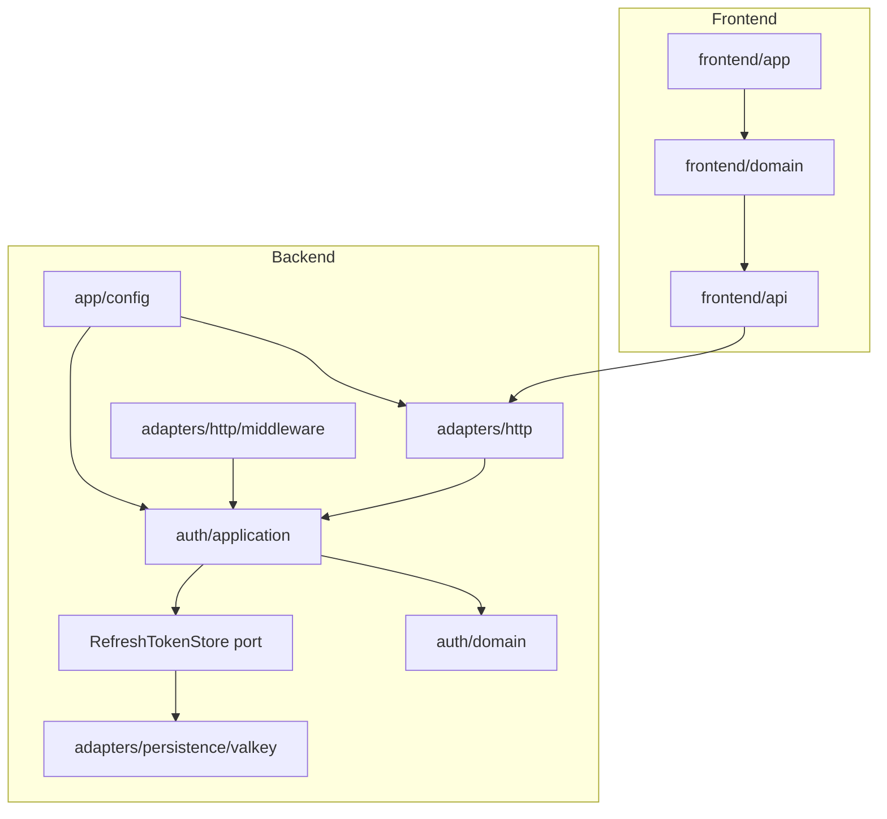
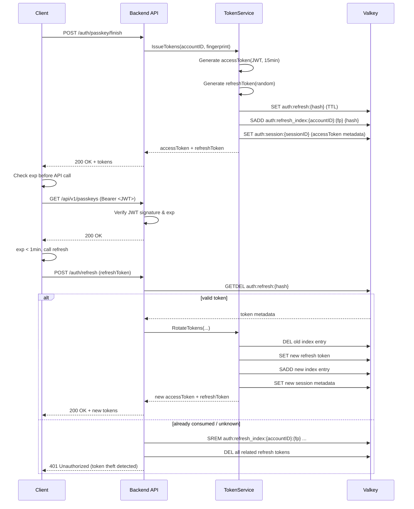
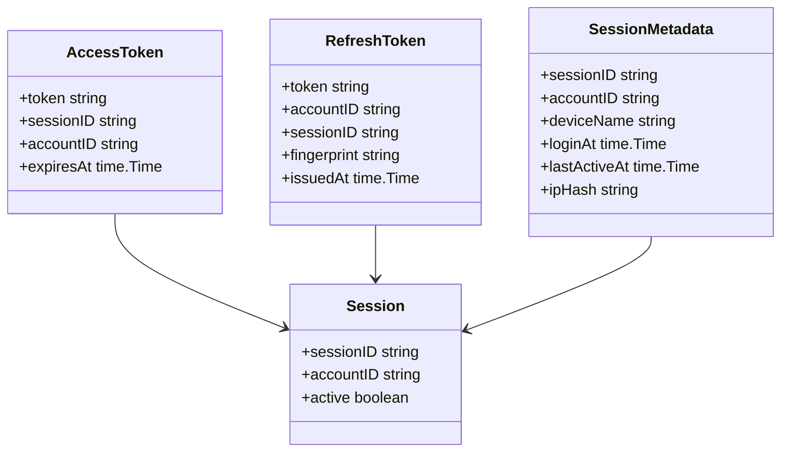
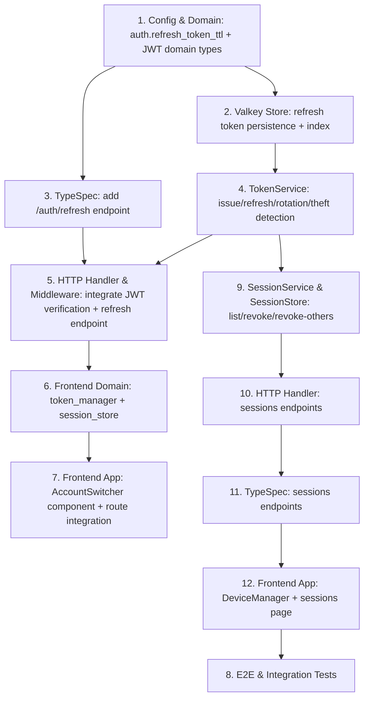

## Scope

### In Scope

- JWT アクセストークンの発行・検証・失効（バックエンド）
- リフレッシュトークンの発行・単回利用・ローテーション・盗難検出（バックエンド）
- `POST /api/v1/auth/refresh` エンドポイント（バックエンド）
- `auth.refresh_token_ttl` 設定とそのバリデーション（バックエンド）
- マルチセッション対応の Valkey キースキーマ（バックエンド）
- クライアントでの JWT デコード・有効期限監視・自動リフレッシュ（フロントエンド）
- メモリ上のマルチアカウントセッション管理（フロントエンド）
- アカウント切り替え UI（フロントエンド）
- セッション一覧・無効化エンドポイント（バックエンド）
- セッションメタデータ（デバイス名、IP ハッシュ、ログイン時刻、最終アクティブ時刻）管理（バックエンド）
- デバイス管理ページ・コンポーネント（フロントエンド）
- TypeSpec/OpenAPI への `POST /api/v1/auth/refresh` 追加
- TypeSpec/OpenAPI への `GET /api/v1/sessions`、`DELETE /api/v1/sessions/{id}`、`DELETE /api/v1/sessions/others` 追加

### Out of Scope

- WebAuthn ceremony の変更（login/registration は変更なし）
- Passkey 管理（add/delete/list）は変更なし
- OTP handoff フローは変更なし
- Recovery フローは変更なし
- OAuth2 / サードパーティ IdP
- SQL スキーマ変更（本変更は Valkey のみ）
- アクセストークンの asymmetric 署名（HS256 を使用）

## Assumptions / Dependencies

- JWT 署名用の共通シークレットは運用環境で安全に管理・配布される。
- Valkey は HA 構成で利用可能であり、GETDEL などの原子操作をサポートする。
- フロントエンドは generated OpenAPI クライアントを使用し、`fetch` / `axios` は直接使用しない。
- ブラウザは `atob` / `TextDecoder` による JWT ペイロードデコードをサポートする。
- サーバー時刻とクライアント時刻のズレは 1 分未満と仮定し、クライアントは `exp` に対して 1 分のマージンを持つ。

## Impacted Areas

- **Backend**: `packages/backend/internal/auth/domain`, `packages/backend/internal/auth/application`, `packages/backend/internal/adapters/http`, `packages/backend/internal/adapters/persistence/valkey`, `packages/backend/internal/app`
- **Frontend**: `packages/frontend/domain/src/auth/*`, `packages/frontend/app/src/lib/components/*`, `packages/frontend/app/src/routes/*`
- **API Contract**: `packages/typespec/main.tsp`
- **Config / Operations**: `packages/backend/config.toml` (example)
- **Security / Privacy**: セッションメタデータ内の IP ハッシュ化方針、リモートセッション無効化フロー

## Directory Tree

```text
packages/
├─ backend/
│  ├─ internal/
│  │  ├─ auth/
│  │  │  ├─ domain/
│  │  │  │  └─ jwt.go                      (new)
│  │  │  └─ application/
│  │  │     └─ token_service.go            (new)
│  │  ├─ adapters/
│  │  │  ├─ http/
│  │  │  │  ├─ auth_handler.go             (modify)
│  │  │  │  └─ middleware/
│  │  │  │     └─ auth_middleware.go       (modify)
│  │  │  └─ persistence/
│  │  │     └─ valkey/
│  │  │        └─ refresh_token_store.go   (new)
│  │  └─ app/
│  │     └─ config.go                      (modify)
│  └─ config.example.toml                  (modify)
├─ frontend/
│  ├─ domain/
│  │  └─ src/
│  │     └─ auth/
│  │        └─ session/
│  │           ├─ token_state.ts           (new)
│  │           ├─ hook.svelte.ts           (modify)
│  │           └─ state.ts                 (modify)
│     └─ app/
│        └─ src/
│           └─ lib/
│              └─ components/
│                 ├─ AccountSwitcher.svelte   (new)
│                 └─ DeviceManager.svelte     (new)
│              └─ routes/
│                 └─ sessions/
│                    └─ +page.svelte          (new)
└─ typespec/
   └─ main.tsp                              (modify)
```

## New / Changed Files

| Type   | File                                                                           | Change                                                            |
| ------ | ------------------------------------------------------------------------------ | ----------------------------------------------------------------- |
| Add    | `packages/backend/internal/auth/domain/jwt.go`                                 | JWT claims 構造体、署名・検証関数、クレーム抽出                   |
| Add    | `packages/backend/internal/auth/application/token_service.go`                  | トークン発行、リフレッシュ、ローテーション、盗難検出ロジック      |
| Add    | `packages/backend/internal/adapters/persistence/valkey/refresh_token_store.go` | リフレッシュトークンの保存・取得・原子消費・インデックス管理      |
| Update | `packages/backend/internal/adapters/http/auth_handler.go`                      | `POST /api/v1/auth/refresh` 追加、login/register レスポンス変更   |
| Update | `packages/backend/internal/adapters/http/middleware/auth_middleware.go`        | Bearer トークン検証を JWT 署名・有効期限検証に変更                |
| Update | `packages/backend/internal/app/config.go`                                      | `auth.refresh_token_ttl` フィールド追加とバリデーション           |
| Update | `packages/backend/config.example.toml`                                         | `auth.refresh_token_ttl` 設定例追加                               |
| Update | `packages/typespec/main.tsp`                                                   | Refresh エンドポイント、JWT Bearer スキーマ追加                   |
| Add    | `packages/frontend/domain/src/auth/session/token_state.ts`                     | JWT デコード、トークンのメモリ保持、pure 状態                     |
| Update | `packages/frontend/domain/src/auth/session/hook.svelte.ts`                     | 自動リフレッシュ、ログイン追加、切り替え、ログアウトの API 連携   |
| Update | `packages/frontend/domain/src/auth/session/state.ts`                           | マルチセッション状態、アクティブセッション選択                    |
| Add    | `packages/frontend/app/src/lib/components/AccountSwitcher.svelte`              | アカウント切り替えドロップダウン/リスト UI                        |
| Add    | `packages/frontend/app/src/lib/components/DeviceManager.svelte`                | デバイス一覧、個別ログアウト、一括ログアウト UI                   |
| Add    | `packages/frontend/app/src/routes/sessions/+page.svelte`                       | デバイス管理ページ（セッション一覧・操作画面）                    |
| Update | `packages/typespec/main.tsp`                                                   | Sessions エンドポイント（list, revoke single, revoke others）追加 |

## System Diagram

```mermaid
flowchart LR
  User[User/Browser] -->|POST /auth/passkey/finish| BE[Backend API]
  User -->|POST /auth/refresh| BE
  User -->|GET /sessions| BE
  User -->|DELETE /sessions/{id}| BE
  User -->|DELETE /sessions/others| BE
  User -->|Authorization: Bearer <JWT>| BE
  BE -->|Read/Write| Valkey[(Valkey)]
  BE -->|Sign/Verify| JWT[JWT Service]
```

## Package Diagram



## Sequence Diagram



## UI Wireframes

N/A — wireframe not yet generated

## Domain Model Diagram



## ER Diagram

N/A — 本変更は Valkey のみで SQL スキーマ変更はない。

## Package-Level Design

### Package List

| Package                                        | Purpose / Responsibility                                                                                   | Public API                                                                                                                                         | Dependencies                                                      |
| ---------------------------------------------- | ---------------------------------------------------------------------------------------------------------- | -------------------------------------------------------------------------------------------------------------------------------------------------- | ----------------------------------------------------------------- |
| `backend/internal/auth/domain`                 | JWT claims, token validation interface                                                                     | `Claims`, `TokenVerifier` interface                                                                                                                | なし（外部ライブラリ非依存）                                      |
| `backend/internal/auth/application`            | Token lifecycle (issue, refresh, revoke), rotation policy, theft detection; Session listing and revocation | `TokenService.Issue`, `TokenService.Refresh`, `TokenService.Revoke`, `SessionService.List`, `SessionService.Revoke`, `SessionService.RevokeOthers` | `domain`, `RefreshTokenStore port`, `SessionStore port`, `config` |
| `backend/internal/adapters/persistence/valkey` | Refresh token storage, atomic consume, index management; Session metadata storage and index                | `RefreshTokenStore`, `SessionStore` (port 実装)                                                                                                    | `go-valkey/valkey`                                                |
| `backend/internal/adapters/http`               | HTTP handlers for auth endpoints                                                                           | `AuthHandler.Refresh`, `AuthHandler.ListSessions`, `AuthHandler.RevokeSession`, `AuthHandler.RevokeOtherSessions`                                  | `application`, `domain`                                           |
| `backend/internal/adapters/http/middleware`    | JWT verification middleware                                                                                | `JWTAuthMiddleware`                                                                                                                                | `application` (signing/verify impl), `config`                     |
| `frontend/domain/src/auth/session`             | Client-side token management, multi-session state                                                          | `useAuthSession()` (hook), `tokenState`, `sessionState`                                                                                            | `@www-template/api`                                               |
| `frontend/app/src/lib/components`              | Account switcher UI; Device management UI                                                                  | `AccountSwitcher`, `DeviceManager`                                                                                                                 | `frontend/domain`                                                 |
| `frontend/app/src/routes/sessions`             | Device management page                                                                                     | `+page.svelte`                                                                                                                                     | `frontend/domain`, `frontend/ui`                                  |

### Details

#### `backend/internal/auth/domain/jwt.go`

- **Purpose**: JWT の構造定義と検証インターフェース。外部ライブラリ非依存の純粋 domain 層。
- **Public API**: `Claims` (struct with `AccountID`, `SessionID`, `ExpiresAt`, `IssuedAt`), `TokenVerifier` interface
- **Key Data Structures**: `Claims`
- **Error Handling**: `ErrTokenExpired`
- **Testing Strategy**: UT で `Claims` 構造体の生成と `TokenVerifier` モックを検証。実際の署名・検証は middleware / application 層の UT でカバー。Scenario: `AUTH-BE-S046`。

#### `backend/internal/auth/application/token_service.go`

- **Purpose**: トークン発行、リフレッシュローテーション、盗難検出、セッション失効。
- **Dependencies**: `RefreshTokenStore` port interface（保存・消費・失効）。実装は `adapters/persistence/valkey` が担当。
- **Key Flows**:
  1. Issue: JWT + refresh token 生成 → port.Save / port.IndexAdd
  2. Refresh: port.Consume (GETDEL) → 新ペア生成 → port.IndexRemove / port.Save
  3. Theft: 不明/既消費トークン検出 → port.RevokeAllForFingerprint
- **Error Handling**: `ErrRefreshTokenNotFound`, `ErrRefreshTokenConsumed`, `ErrTokenTheftDetected`
- **Testing Strategy**: UT/IT でローテーション、並行消費、盗難検出を検証。Mock port を使用。Scenario: `AUTH-BE-S043`, `AUTH-BE-S044`, `AUTH-BE-S045`。

#### `backend/internal/adapters/persistence/valkey/refresh_token_store.go`

- **Purpose**: リフレッシュトークンの永続化とインデックス。
- **Key Data Structures**: `RefreshTokenRecord` (JSON serialized in Valkey)
- **Key Flows**: `Save` (SET EX/NX), `Consume` (GETDEL), `RevokeAllForFingerprint` (SMEMBERS → DEL)
- **Testing Strategy**: IT で原子性と TTL を検証。

#### `frontend/domain/src/auth/session/token_state.ts`

- **Purpose**: メモリ上の pure token 状態。JWT ペイロードデコード、`exp` 監視、リフレッシュ閾値計算。
- **Public API**: `decodeAccessToken(token): Claims`, `isRefreshNeeded(exp, now, marginMs): boolean`
- **Key Flows**: `atob` + `TextDecoder` で JWT payload をデコード → `exp` を比較 → 1 分未満なら true。
- **Testing Strategy**: UT で `exp` 計算、リフレッシュトリガー、メモリ保持を検証。Scenario: `AUTH-FE-S023`, `AUTH-FE-S024`, `AUTH-FE-S025`, `AUTH-FE-S026`。

#### `frontend/domain/src/auth/session/state.ts`

- **Purpose**: 複数セッションの pure state 管理、アクティブセッション選択。
- **Public API**: `sessions: Session[]`, `activeSession: Session | null`, `addSession(session)`, `switchSession(sessionID)`, `removeActiveSession()`
- **Key Flows**: login → sessions 配列へ追加 → switch → activeSession 変更。API 呼び出しは行わない。
- **Testing Strategy**: UT でマルチセッション追加、切り替え、部分除去を検証。Scenario: `AUTH-FE-S027`, `AUTH-FE-S028`, `AUTH-FE-S030`, `AUTH-FE-S031`。

#### `frontend/domain/src/auth/session/hook.svelte.ts`

- **Purpose**: 自動リフレッシュ、ログイン追加、切り替え、ログアウトの API 連携。pure state を操作し、生成された API クライアント経由で backend を呼び出す。
- **Public API**: `useAuthSession()` (returns `{ sessions, activeSession, login, switchSession, logout, refresh }`)
- **Key Flows**: API 呼び出し前に `token_state.isRefreshNeeded` を確認 → 必要なら `auth.refresh` API を呼び出し → `state.ts` を更新。失敗時は `/session-expired` へ遷移。
- **Testing Strategy**: UT/IT で API 連携、リフレッシュフロー、エラーハンドリングを検証。Scenario: `AUTH-FE-S023`, `AUTH-FE-S024`, `AUTH-FE-S032`, `AUTH-FE-S033`。

#### `backend/internal/adapters/persistence/valkey/session_store.go`

- **Purpose**: セッションメタデータの永続化とアカウント単位のインデックス管理。
- **Key Data Structures**: `SessionRecord` (JSON serialized in Valkey), `auth:account-sessions:{accountID}` (set of sessionIDs)
- **Key Flows**: `SaveSession` (SET + SADD), `ListSessions` (SMEMBERS → MGET), `RevokeSession` (DEL + SREM), `RevokeOthers` (SMEMBERS → 現在の sessionID を除いて DEL + SREM)
- **Testing Strategy**: IT でセッション一覧、個別無効化、一括無効化を検証。Scenario: `AUTH-BE-S047`, `AUTH-BE-S048`, `AUTH-BE-S049`。

#### `backend/internal/auth/application/session_service.go`

- **Purpose**: セッション一覧取得、特定セッション無効化、他セッション一括無効化のユースケース。
- **Public API**: `SessionService.List(accountID)`, `SessionService.Revoke(accountID, sessionID)`, `SessionService.RevokeOthers(accountID, currentSessionID)`
- **Key Flows**: List → `SessionStore.ListSessions` → デバイス名・時刻整形 → レスポンス。Revoke → `SessionStore.RevokeSession` + `RefreshTokenStore.RevokeBySessionID`。RevokeOthers → `SessionStore.RevokeOthers` + 対象 sessionID 全てのリフレッシュトークン失効。
- **Testing Strategy**: UT/IT で所有権検証（他アカウント操作拒否）、無効化後の認証拒否を検証。Scenario: `AUTH-BE-S047`, `AUTH-BE-S048`, `AUTH-BE-S049`。

#### `frontend/app/src/lib/components/DeviceManager.svelte`

- **Purpose**: デバイス一覧の表示、個別ログアウトボタン、「他のすべてのデバイスをログアウト」ボタンを提供する UI コンポーネント。
- **Public API**: `DeviceManager` (props: `sessions`, `currentSessionId`, `onRevoke(sessionId)`, `onRevokeOthers()`)
- **Key Flows**: マウント時に `GET /api/v1/sessions` を呼び出し → 一覧表示 → 個別ログアウトで `DELETE /api/v1/sessions/{id}` → 成功時に一覧から除去。一括ログアウトで `DELETE /api/v1/sessions/others` → 成功時に現在のデバイスのみ残す。
- **Testing Strategy**: UT/CT でデバイス表示、ボタンクリック、エラー時の汎用メッセージ表示を検証。Scenario: `AUTH-FE-S034`, `AUTH-FE-S035`, `AUTH-FE-S036`。

#### `frontend/app/src/routes/sessions/+page.svelte`

- **Purpose**: デバイス管理ページ。認証済みユーザーのみアクセス可能。
- **Key Flows**: `DeviceManager` をレンダリングし、ドメインフック経由でセッションデータを取得・操作する。未認証時は login 導線へリダイレクト。
- **Testing Strategy**: E2E でページ遷移、デバイス一覧表示、ログアウト後の遷移を検証。Scenario: `AUTH-FE-S034`, `AUTH-FE-S035`, `AUTH-FE-S036`。

## Implementation Plan



## Test Plan

### User Acceptance Test (Manual)

| UAT ID              | Related Requirement | Spec Summary             | Customer Problem Summary                               | Steps                                                                                           | Expected Behavior                                                            |
| ------------------- | ------------------- | ------------------------ | ------------------------------------------------------ | ----------------------------------------------------------------------------------------------- | ---------------------------------------------------------------------------- |
| UAT-AUTH-BE-HAP-001 | AUTH-BE-R001        | JWT + refresh token 発行 | パスキーログイン後にセキュアで短命なセッションを得たい | 1. `/login` でパスキー認証<br>2. ネットワークタブでレスポンス確認                               | access_token (JWT) と refresh_token が返却される                             |
| UAT-AUTH-FE-HAP-001 | AUTH-FE-R023        | 自動リフレッシュ         | 操作中に認証が切れたくない                             | 1. ログイン後 15 分待つ or システム時刻を進める<br>2. API 操作を続行                            | 自動的にリフレッシュされ、セッションが継続する                               |
| UAT-AUTH-FE-HAP-002 | AUTH-FE-R027        | マルチアカウント切り替え | 複数アカウントを使い分けたい                           | 1. アカウント A でログイン<br>2. アカウント B でログイン<br>3. アカウント切り替え UI で切り替え | 再認証なしでアクティブアカウントが変更され、API が正しいアカウントで呼ばれる |
| UAT-AUTH-FE-HAP-003 | AUTH-FE-R030        | 単一セッションログアウト | 他のアカウントに影響を与えずログアウトしたい           | 1. A/B 両方ログイン<br>2. A をアクティブにしてログアウト<br>3. B の画面を確認                   | A のみログアウトされ、B は継続して操作できる                                 |
| UAT-AUTH-BE-HAP-004 | AUTH-BE-R047        | セッション一覧確認       | どのデバイスからログインされているか確認したい         | 1. 複数デバイスでログイン<br>2. `/sessions` へ移動                                              | 各デバイスの名前、ログイン時刻、最終アクティブ時刻が表示される               |
| UAT-AUTH-FE-HAP-005 | AUTH-FE-R034        | 特定デバイスログアウト   | 紛失した端末のセッションを無効化したい                 | 1. `/sessions` へ移動<br>2. 対象デバイスの「ログアウト」をクリック                              | 該当デバイスが一覧から消え、そのデバイスでの操作が 401 になる                |
| UAT-AUTH-FE-HAP-006 | AUTH-FE-R036        | 他デバイス一括ログアウト | 不審なアクティビティ時に他デバイスを一括無効化したい   | 1. `/sessions` へ移動<br>2. 「他のすべてのデバイスをログアウト」をクリック                      | 現在のデバイス以外が一覧から消え、それらでの操作が 401 になる                |

### E2E Test (Playwright)

| E2E ID              | Playwright Test Name                                       | Related Scenario | Category | Summary                                              | Steps (Playwright)                                                                                                      | Expected Behavior                                                                         |
| ------------------- | ---------------------------------------------------------- | ---------------- | -------- | ---------------------------------------------------- | ----------------------------------------------------------------------------------------------------------------------- | ----------------------------------------------------------------------------------------- |
| E2E-AUTH-BE-HAP-001 | [AUTH-BE-S001] Passkey login returns JWT and refresh token | AUTH-BE-S001     | HAP      | パスキーログインで JWT + refresh token を取得        | 1. `/login` へ移動<br>2. パスキー認証シミュレート<br>3. `passkey/finish` のレスポンスをインターセプト                   | レスポンスに `accessToken` (JWT) と `refreshToken` を含む                                 |
| E2E-AUTH-BE-HAP-002 | [AUTH-BE-S043] Refresh token rotates on use                | AUTH-BE-S043     | HAP      | リフレッシュトークン使用でローテーション             | 1. ログイン<br>2. `auth/refresh` を呼び出し<br>3. 同じ refresh token で再試行                                           | 初回は 200、再試行は 401                                                                  |
| E2E-AUTH-BE-ERR-001 | [AUTH-BE-S044] Reused refresh token revokes siblings       | AUTH-BE-S044     | ERR      | 消費済みトークン再利用で兄弟トークン失効             | 1. ログイン<br>2. `auth/refresh` 実行<br>3. 旧トークンで `auth/refresh`                                                 | 401 となり、新トークンも失効する（後続の refresh も 401）                                 |
| E2E-AUTH-FE-HAP-001 | [AUTH-FE-S023] Proactive refresh before expiry             | AUTH-FE-S023     | HAP      | 期限切れ前に自動リフレッシュ                         | 1. ログイン<br>2. 15 分経過シミュレート（clock 操作）<br>3. API 呼び出しをトリガー                                      | `auth/refresh` が先に呼ばれ、API が成功する                                               |
| E2E-AUTH-FE-HAP-002 | [AUTH-FE-S028] Account switching changes active token      | AUTH-FE-S028     | HAP      | アカウント切り替えで bearer トークンが変更           | 1. A/B ログイン<br>2. アカウント切り替え UI を操作<br>3. API 呼び出しをインターセプト                                   | `Authorization` ヘッダーが B のトークンに変わる                                           |
| E2E-AUTH-FE-HAP-003 | [AUTH-FE-S030] Logout affects only active session          | AUTH-FE-S030     | HAP      | ログアウトがアクティブセッションのみに影響           | 1. A/B ログイン<br>2. A をアクティブにしてログアウト<br>3. B の API 呼び出し                                            | B の API は 200、A は 401                                                                 |
| E2E-AUTH-BE-HAP-004 | [AUTH-BE-S047] Session list shows active devices           | AUTH-BE-S047     | HAP      | セッション一覧がデバイス情報を含む                   | 1. 複数デバイスでログイン<br>2. `GET /api/v1/sessions` を実行                                                           | 各セッションの deviceName, loginAt, lastActiveAt, ipHash, currentSession フラグが含まれる |
| E2E-AUTH-BE-HAP-005 | [AUTH-BE-S048] Revoke specific session invalidates token   | AUTH-BE-S048     | HAP      | 特定セッション無効化後トークン拒否                   | 1. デバイス A/B でログイン<br>2. `DELETE /api/v1/sessions/{id}` で B を無効化<br>3. B で保護エンドポイント呼び出し      | B は 401、A は 200                                                                        |
| E2E-AUTH-BE-HAP-006 | [AUTH-BE-S049] Revoke others keeps current session         | AUTH-BE-S049     | HAP      | 他デバイス一括無効化で現在のセッション維持           | 1. デバイス A/B/C でログイン<br>2. `DELETE /api/v1/sessions/others` を実行<br>3. 各デバイスで保護エンドポイント呼び出し | A（現在）のみ 200、B/C は 401                                                             |
| E2E-AUTH-FE-HAP-007 | [AUTH-FE-S034] Device manager page shows sessions          | AUTH-FE-S034     | HAP      | デバイス管理ページがセッション一覧を表示             | 1. `/sessions` へ移動                                                                                                   | デバイス名、ログイン時刻、最終アクティブ時刻、現在のデバイスインジケーターが表示される    |
| E2E-AUTH-FE-HAP-008 | [AUTH-FE-S035] Device manager revokes specific device      | AUTH-FE-S035     | HAP      | デバイス管理ページで特定デバイスをログアウト         | 1. `/sessions` へ移動<br>2. 対象デバイスのログアウトクリック                                                            | 該当デバイスが一覧から消え、API 呼び出しが 401 になる                                     |
| E2E-AUTH-FE-HAP-009 | [AUTH-FE-S036] Device manager revokes all other devices    | AUTH-FE-S036     | HAP      | デバイス管理ページで他のすべてのデバイスをログアウト | 1. `/sessions` へ移動<br>2. 「他のすべてのデバイスをログアウト」クリック                                                | 現在のデバイスのみ残り、他が一覧から消える                                                |

### Integration Test (Endpoint)

| IT ID              | Test Name                                                      | Genre | Category | Summary                                    | Steps (Test)                                                                                             | Expected Behavior                                       |
| ------------------ | -------------------------------------------------------------- | ----- | -------- | ------------------------------------------ | -------------------------------------------------------------------------------------------------------- | ------------------------------------------------------- |
| IT-AUTH-BE-HAP-001 | [AUTH-BE-S001] Passkey finish returns tokens                   | be    | HAP      | パスキー完了でトークンペア取得             | Setup: challenge → finish request → assert body                                                          | accessToken, refreshToken が含まれる                    |
| IT-AUTH-BE-HAP-002 | [AUTH-BE-S043] Refresh endpoint returns new pair               | be    | HAP      | 有効なリフレッシュで新ペア取得             | Setup: login → refresh request → assert body & old consumed                                              | 新しい accessToken, refreshToken、旧は GETDEL される    |
| IT-AUTH-BE-ERR-001 | [AUTH-BE-S044] Rotation failure revokes family                 | be    | ERR      | 盗難検出で同一 fingerprint 全失効          | Setup: login → refresh → reuse old → assert 401 → try new token                                          | 新旧とも 401                                            |
| IT-AUTH-BE-ERR-002 | [AUTH-BE-S045] Invalid refresh token rejected                  | be    | ERR      | 不正リフレッシュトークン拒否               | Setup: POST /auth/refresh with random token                                                              | 401                                                     |
| IT-AUTH-BE-BND-001 | [AUTH-BE-S046] Expired JWT rejected                            | be    | BND      | 期限切れ JWT 拒否                          | Setup: issue expired JWT → call protected endpoint                                                       | 401 session-expired                                     |
| IT-AUTH-BE-HAP-003 | [AUTH-BE-S042] Logout revokes only one session                 | be    | HAP      | 単一セッションログアウト                   | Setup: login A → login B → logout A → call protected with B                                              | A は 401、B は 200                                      |
| IT-AUTH-BE-ERR-003 | [AUTH-BE-S040] Short TTL blocks startup                        | be    | ERR      | 24 時間未満 TTL で起動拒否                 | Setup: config with 1h TTL → start app                                                                    | 起動失敗                                                |
| IT-AUTH-BE-HAP-004 | [AUTH-BE-S047] Session list returns owned sessions only        | be    | HAP      | セッション一覧は自身のセッションのみ       | Setup: login A → login B → A で `GET /api/v1/sessions`                                                   | A のセッションのみ含まれる、B は含まれない              |
| IT-AUTH-BE-HAP-005 | [AUTH-BE-S048] Revoke session removes metadata and tokens      | be    | HAP      | セッション無効化でメタデータとトークン削除 | Setup: login → `DELETE /api/v1/sessions/{id}` → call protected with old token                            | 保護エンドポイントで 401、Valkey のメタデータキーが消滅 |
| IT-AUTH-BE-HAP-006 | [AUTH-BE-S049] Revoke others leaves current session            | be    | HAP      | 他セッション一括無効化で現在のみ維持       | Setup: login A/B/C on same account → `DELETE /api/v1/sessions/others` from A → call protected with A/B/C | A は 200、B/C は 401                                    |
| IT-AUTH-BE-ERR-004 | [AUTH-BE-S048] Revoking another account's session is forbidden | be    | ERR      | 他アカウントセッション操作拒否             | Setup: login A and B → A で `DELETE /api/v1/sessions/{B_session_id}`                                     | 403 Forbidden                                           |

### Unit/Component Test (UT)

| UT ID              | Test Name                                                    | Package                                      | Category | Summary                      | Steps (Test)                                                                                          | Expected Behavior            |
| ------------------ | ------------------------------------------------------------ | -------------------------------------------- | -------- | ---------------------------- | ----------------------------------------------------------------------------------------------------- | ---------------------------- |
| UT-AUTH-BE-HAP-001 | [AUTH-BE-S001] JWT signing and verification                  | backend/internal/auth/domain                 | HAP      | JWT 署名と検証               | Arrange: claims, secret → Act: Sign → Assert: Verify OK                                               | 検証成功、クレーム一致       |
| UT-AUTH-BE-ERR-001 | [AUTH-BE-S046] Expired JWT verification fails                | backend/internal/auth/domain                 | ERR      | 期限切れ JWT 検証失敗        | Arrange: expired claims → Act: Sign with past exp → Assert: Verify error                              | `ErrTokenExpired`            |
| UT-AUTH-BE-HAP-002 | [AUTH-BE-S043] TokenService rotates refresh token            | backend/internal/auth/application            | HAP      | ローテーションロジック       | Arrange: mock store with valid token → Act: Refresh → Assert: consume + save new                      | 新ペア返却、旧消費           |
| UT-AUTH-BE-ERR-002 | [AUTH-BE-S044] TokenService detects theft                    | backend/internal/auth/application            | ERR      | 盗難検出ロジック             | Arrange: mock store returns nil (consumed) → Act: Refresh → Assert: RevokeAllForFingerprint called    | エラー返却、失効呼び出し     |
| UT-AUTH-FE-HAP-001 | [AUTH-FE-S023] TokenManager schedules refresh before expiry  | frontend/domain                              | HAP      | 期限前リフレッシュ判定       | Arrange: token with exp-30s → Act: isRefreshNeeded → Assert: true                                     | true                         |
| UT-AUTH-FE-HAP-002 | [AUTH-FE-S028] SessionStore switches active session          | frontend/domain                              | HAP      | アクティブセッション切り替え | Arrange: sessions [A,B] → Act: switchSession(B) → Assert: activeSession=B                             | activeSession が B           |
| UT-AUTH-FE-ERR-001 | [AUTH-FE-S031] SessionStore logout clears only active        | frontend/domain                              | ERR      | 部分ログアウト               | Arrange: sessions [A,B], active=A → Act: logoutActive → Assert: sessions=[B], active=B                | A のみ除去、B が active      |
| UT-AUTH-BE-HAP-003 | [AUTH-BE-S047] SessionStore lists sessions with metadata     | backend/internal/adapters/persistence/valkey | HAP      | セッションメタデータ一覧     | Arrange: save 3 sessions for account A → Act: ListSessions → Assert: 3 items with deviceName, loginAt | 3 件返却、メタデータ含む     |
| UT-AUTH-BE-HAP-004 | [AUTH-BE-S048] SessionStore revokes specific session         | backend/internal/adapters/persistence/valkey | HAP      | 特定セッション無効化         | Arrange: save session X → Act: RevokeSession(X) → Assert: GET returns nil                             | キーが削除される             |
| UT-AUTH-BE-HAP-005 | [AUTH-BE-S049] SessionStore revokes others                   | backend/internal/adapters/persistence/valkey | HAP      | 他セッション一括無効化       | Arrange: save sessions X/Y/Z for account A → Act: RevokeOthers(A, Y) → Assert: X/Z deleted, Y remains | X/Z 削除、Y 維持             |
| UT-AUTH-FE-HAP-003 | [AUTH-FE-S034] DeviceManager renders session list            | frontend/app                                 | HAP      | デバイス一覧レンダリング     | Arrange: mock sessions props → render DeviceManager → Assert: device names and timestamps visible     | デバイス名と時刻が表示される |
| UT-AUTH-FE-HAP-004 | [AUTH-FE-S035] DeviceManager triggers revoke on click        | frontend/app                                 | HAP      | 個別ログアウトクリック       | Arrange: mock sessions + onRevoke spy → click revoke → Assert: spy called with sessionId              | onRevoke が呼ばれる          |
| UT-AUTH-FE-HAP-005 | [AUTH-FE-S036] DeviceManager triggers revoke-others on click | frontend/app                                 | HAP      | 一括ログアウトクリック       | Arrange: mock sessions + onRevokeOthers spy → click button → Assert: spy called                       | onRevokeOthers が呼ばれる    |

## Rollback / Migration

- **Rollback**: フロントエンドおよびバックエンドを変更前のバージョンにデプロイする。Valkey 上の `auth:refresh:*` と `auth:refresh_index:*` キーは不要となるが、手動削除は運用裁量とする。
- **Migration**: SQL スキーマ変更はない。新しい `auth.refresh_token_ttl` が未設定の場合、既存動作（無期限リフレッシュ）と同等のセマンティクスを維持する。
- **Backward Compatibility**: `Authorization: Bearer <token>` ヘッダー形式は維持される。ただし、トークン内容が JWT となるため、トークン内容に依存する外部連携があれば更新が必要。

## Release Procedure

1. **Pre-release**:
   - `pnpm gen` を実行し、OpenAPI / SDK / Go bindings を再生成する。
   - `pnpm check:codegen` で codegen drift を確認する。
   - `pnpm test:run` で既存テストが壊れていないことを確認する。
2. **Backend**:
   - `auth.refresh_token_ttl` を本番設定に追加（未設定で無期限運用の場合は省略可）。
   - JWT 署名シークレットを本番環境に安全に展開。
   - バックエンドをローリングデプロイ。
3. **Frontend**:
   - フロントエンドアセットをデプロイ。
4. **Verification**:
   - `POST /api/v1/auth/refresh` が 200/401 を適切に返すことを確認。
   - ログイン時に JWT + refresh token が返却されることを確認。
   - 15 分経過後の自動リフレッシュ動作を確認。

## Acceptance Criteria

- `POST /api/v1/auth/passkey/finish` と recovery register branch が JWT access token と refresh token を返す。
- `POST /api/v1/auth/refresh` が有効な refresh token を消費し、新しいペアを返す。
- 消費済み/不明な refresh token の再利用が拒否され、関連トークンが失効する。
- `auth.refresh_token_ttl` が 24 時間未満の場合、サーバーが起動を拒否する。
- クライアントが期限切れ 1 分前に自動リフレッシュを実行する。
- 複数アカウントログイン後、切り替え UI で再認証なしにアクティブアカウントが変更できる。
- ログアウトがアクティブセッションのみに影響する。
- `GET /api/v1/sessions` が認証済みアカウントの active セッション一覧（デバイス名、ログイン時刻、最終アクティブ時刻、IP ハッシュ、現在のセッションフラグ）を返す。
- `DELETE /api/v1/sessions/{id}` が自身の特定セッションを無効化し、対象セッションのアクセストークンおよびリフレッシュトークンを即座に拒否する。
- `DELETE /api/v1/sessions/others` が現在のセッションを除くすべての active セッションを無効化する。
- 他アカウントのセッションを操作しようとした場合は `403 Forbidden` を返す。
- セッションメタデータの IP はハッシュ化され、生の IP アドレスは保持されない。
- デバイス管理ページでログイン中のデバイスを確認し、特定デバイスまたは他のすべてのデバイスをログアウトできる。
- すべての ADDED/MODIFIED Scenario ID に対応する自動テストが存在する。

## Open Issues

（本変更における未解決の技術的意思決定はない。下記は設計上の確定事項）

- **JWT 署名方式**: HS256 を採用。対称鍵は運用環境で安全に管理する。将来の鍵ローテーション要件が生じた場合に RS256 移行を検討する。
- **Refresh 失敗時の UX**: 以前有効だった active session の refresh 失敗時は `/session-expired` へ遷移。token 不在・browser 再訪時は通常の未認証 login 導線へ遷移。
- **Fingerprint 生成**: サーバーサイドで `User-Agent` + `X-Forwarded-For` のハッシュを fingerprint とする。Trusted proxy 設定が前提となる。
