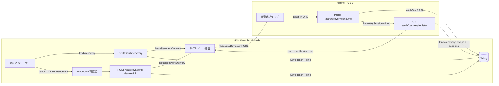
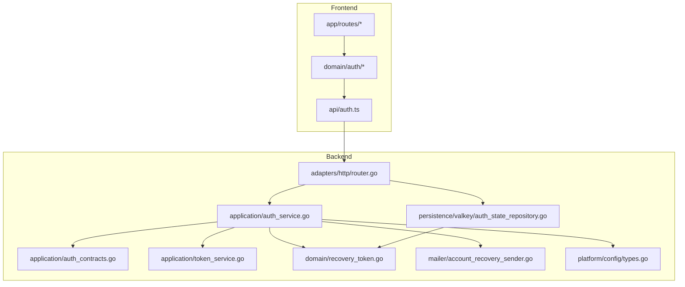
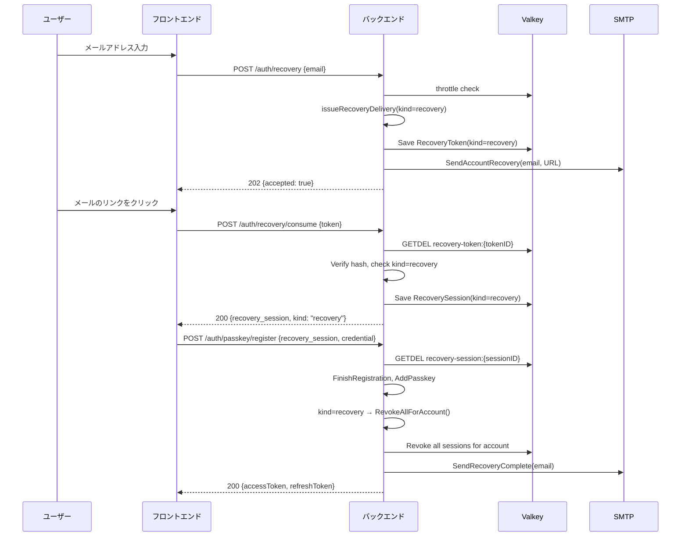
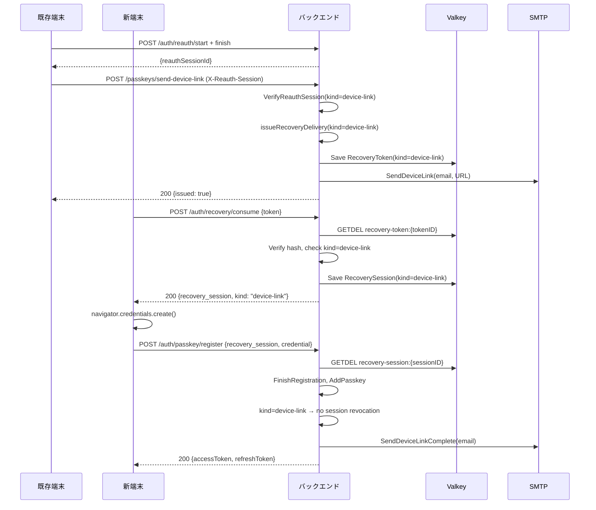
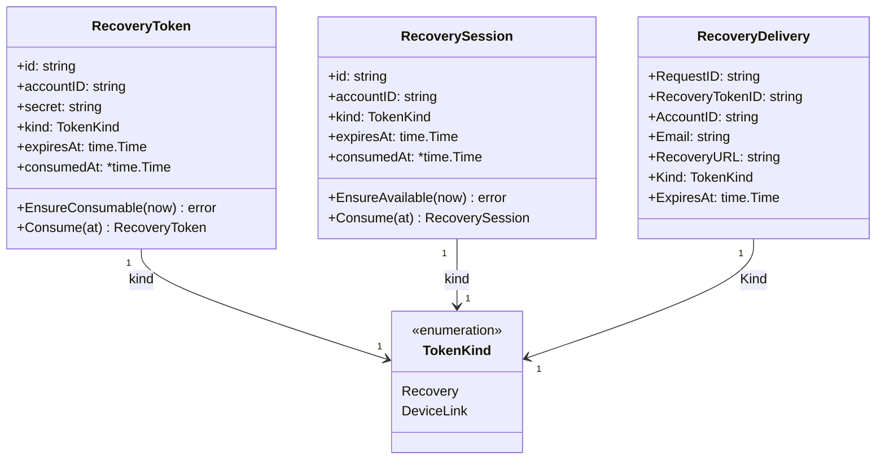
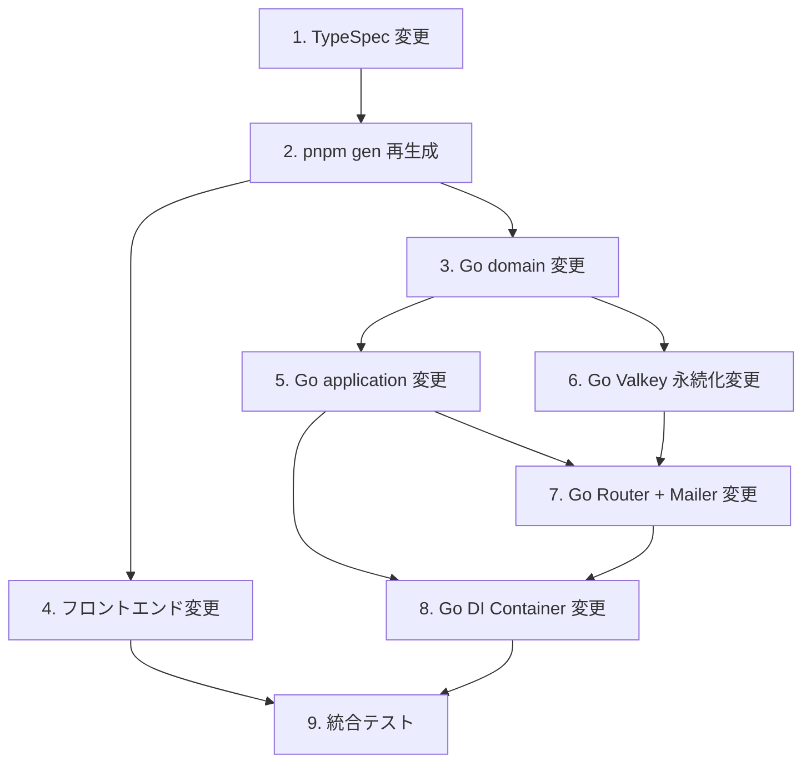

## Scope

### In Scope

1. **OTP ハンドオフの完全削除**
   - `DeviceLoginHandoff` ドメイン型 (`packages/backend/internal/auth/domain/device_login_handoff.go`) の削除
   - `IssuePasskeyOtp`, `StartAddPasskeyByOtp`, `FinishAddPasskeyByOtp` の削除 (`auth_service.go`)
   - OTP 関連 Valkey 永続化メソッドの削除 (`auth_state_repository.go`)
   - `PasskeyOtpSender` インターフェースの削除 (`auth_contracts.go`)
   - OTP メール送信の削除 (`account_recovery_sender.go`)
   - 3 つの TypeSpec エンドポイント定義の削除 (`auth.tsp`)
   - フロントエンド `addByOtp/` ドメインと `/passkeys/add` ルートの削除
   - OTP 関連テストの削除

2. **`RecoveryToken` / `RecoverySession` への `kind` 追加**
   - `TokenKind` 列挙型 (`"recovery"` | `"device-link"`) の追加
   - ドメイン型・永続化・API コントラクトの全レイヤでの一貫した追加
   - `ConsumeRecoveryToken` レスポンスに `kind` を含める

3. **新エンドポイント `POST /api/v1/passkeys/send-device-link`**
   - Bearer + reauth（`X-Reauth-Session`）必須
   - `kind=device-link` で `issueRecoveryDelivery` を呼び出し
   - 再認証 operation kind を `otp-issue` から `device-link` に変更

4. **パスキー登録完了時の後処理（`RegisterPasskey` 内）**
   - `kind=recovery`: 全セッション強制失効 + 復旧完了通知メール
   - `kind=device-link`: 新端末追加通知メール（失効なし）
   - `SessionStore.RevokeAllForAccount` の追加

5. **`hashSecret` の統一**
   - Valkey `auth_state_repository.go` のリカバリートークン用 `hashSecret` を raw SHA-256 から HMAC-SHA256 + pepper に変更
   - OTP 側の `hashSecret` は削除に伴い消滅

6. **メール文面の追加**
   - `SendDeviceLink`: 新端末追加用 URL を含むメール（件名: "www-template device login link"）
   - `SendRecoveryComplete`: 復旧完了通知
   - `SendDeviceLinkComplete`: 新端末追加完了通知
   - 既存 `SendAccountRecovery` は維持

### Out of Scope

- 招待オンボーディング (`invitation`) の変更 — 本変更は recovery / device-link の統合に限定し、invite フローには影響を与えない
- バックアップコードの導入 — 別変更として扱う
- 既存 Valkey データの自動マイグレーション — 既存 OTP handoff state は自然期限切れで削除されるため、手動移行不要
- 管理画面の UI デザイン刷新 — 機能変更に伴う最小限の UI 変更のみ

## Assumptions / Dependencies

- **Valkey キープレフィックス**: 既存の `auth:handoff:*` キーは削除、`auth:recovery-token:*` キーに `kind` フィールドが追加される。既存データとの下位互換性は不要（OTP handoff は期限切れで自然消滅、recovery token は 30 分 TTL で短期間）
- **再認証セッション `operationKind`**: 既存の `otp-issue` が `device-link` に置き換わる。`passkey-delete` は変更なし
- **`pnpm gen` の再実行**: TypeSpec 変更後、OpenAPI / SDK / Go バインディングの再生成が必要
- **Mail from address**: メールテンプレート追加に伴い `config.InfraConfig.Mail.FromAddress` を既存のまま使用
- **Go のテスト**: 削除対象のテストファイルは特定し次第削除。新テストは scenario に紐づけて追加

## Impacted Areas

| 領域                | 内容                                                                                                                                                    |
| ------------------- | ------------------------------------------------------------------------------------------------------------------------------------------------------- |
| **TypeSpec**        | `packages/typespec/src/routes/v1/auth.tsp` — 3 エンドポイント削除、1 エンドポイント追加、response model 変更                                            |
| **TypeSpec models** | `packages/typespec/src/models/auth.tsp` — OTP モデル削除、`kind` 追加                                                                                   |
| **Go domain**       | `packages/backend/internal/auth/domain/` — `DeviceLoginHandoff` 削除、`RecoveryToken`/`RecoverySession` に `kind` 追加、`TokenKind` 新規                |
| **Go application**  | `packages/backend/internal/auth/application/` — OTP 全ロジック削除、`send-device-link` 追加、`RegisterPasskey` 後処理追加、contract 変更                |
| **Go Valkey**       | `packages/backend/internal/adapters/persistence/valkey/` — OTP 永続化削除、`hashSecret` 変更、`Kind` field 追加                                         |
| **Go Mailer**       | `packages/backend/internal/adapters/mailer/` — OTP 送信削除、3 種の新メールテンプレート追加                                                             |
| **Go Router**       | `packages/backend/internal/adapters/http/router.go` — OTP ハンドラ削除、`send-device-link` ハンドラ追加                                                 |
| **Go Container**    | `packages/backend/internal/app/container.go` — 不要な DI 削除                                                                                           |
| **Frontend API**    | `packages/frontend/api/src/` — 生成された SDK が自動更新                                                                                                |
| **Frontend domain** | `packages/frontend/domain/src/auth/` — `addByOtp/` 削除、`management/hook.svelte.ts` 変更                                                               |
| **Frontend app**    | `packages/frontend/app/src/routes/` — `(auth)/passkeys/add/` 削除、`(protected)/passkeys/` 管理画面変更、`(auth)/login/recovery/consume/` kind 分岐追加 |
| **再生性**          | TypeSpec → `pnpm gen` → OpenAPI → Go/FE SDK                                                                                                             |

## Directory Tree

```text
unify-passkey-token-flow
├─ packages
│  ├─ typespec
│  │  └─ src
│  │     ├─ models/auth.tsp                  ← EDIT: OTP models 削除, TokenKind enum 追加, RecoveryConsumeResponse に kind 追加
│  │     └─ routes/v1/auth.tsp              ← EDIT: OTP 3 routes 削除, send-device-link route 追加
│  ├─ backend
│  │  └─ internal
│  │     ├─ auth
│  │     │  ├─ domain
│  │     │  │  ├─ device_login_handoff.go   ← DELETE
│  │     │  │  └─ recovery_token.go          ← EDIT: TokenKind 追加, kind フィールド追加
│  │     │  └─ application
│  │     │     ├─ auth_contracts.go           ← EDIT: PasskeyOtpSender 削除, SendDeviceLinkSender 追加, SessionStore.RevokeAllForAccount 追加, AuditNotifier 拡張
│  │     │     ├─ auth_service.go             ← EDIT: OTP メソッド削除, executeDeviceLink 追加, RegisterPasskey 後処理追加
│  │     │     ├─ auth_service_test.go        ← EDIT: OTP テスト削除, 新テスト追加
│  │     │     └─ auth_errors.go              ← EDIT: ErrInvalidOtp 削除, ErrOtpExpiredOrConsumed 削除
│  │     ├─ adapters
│  │     │  ├─ persistence/valkey
│  │     │  │  └─ auth_state_repository.go    ← EDIT: OTP handoff メソッド削除, hashSecret 強化, Kind 追加
│  │     │  ├─ http
│  │     │  │  ├─ router.go                   ← EDIT: OTP ハンドラ削除, send-device-link ハンドラ追加
│  │     │  │  └─ auth_test.go                ← EDIT: OTP テスト削除
│  │     │  └─ mailer
│  │     │     └─ account_recovery_sender.go  ← EDIT: SendPasskeyOtp 削除, SendDeviceLink 追加, SendRecoveryComplete 追加, SendDeviceLinkComplete 追加
│  │     └─ app
│  │        └─ container.go                   ← EDIT: OTP sender DI 削除, device-link sender DI 追加
│  └─ frontend
│     ├─ app
│     │  └─ src/routes
│     │     ├─ (auth)
│     │     │  └─ passkeys/add/               ← DELETE (entire directory)
│     │     │  └─ login/recovery
│     │     │     └─ consume/+page.svelte     ← EDIT: kind による遷移先分岐
│     │     └─ (protected)
│     │        └─ passkeys/+page.svelte       ← EDIT: OTP→send-device-link に変更
│     ├─ domain/src/auth
│     │  ├─ passkey/addByOtp/                 ← DELETE (entire directory)
│     │  └─ passkey/management
│     │     └─ hook.svelte.ts                 ← EDIT: issueOtp→sendDeviceLink に変更
│     └─ api/src
│        └─ auth.ts                           ← AUTO-GENERATED by pnpm gen
```

## New / Changed Files

| Type   | File                                                                             | Change                                                                                                                                                                       |
| ------ | -------------------------------------------------------------------------------- | ---------------------------------------------------------------------------------------------------------------------------------------------------------------------------- |
| DELETE | `packages/backend/internal/auth/domain/device_login_handoff.go`                  | OTP ハンドオフドメイン型削除                                                                                                                                                 |
| EDIT   | `packages/backend/internal/auth/domain/recovery_token.go`                        | `TokenKind` 型追加、`kind` フィールドを `RecoveryToken` と `RecoverySession` に追加                                                                                          |
| EDIT   | `packages/backend/internal/auth/application/auth_contracts.go`                   | `PasskeyOtpSender` 削除、`SendDeviceLinkSender` 追加、`SessionStore.RevokeAllForAccount` 追加、`AuditNotifier` に `EmitPasskeyRecovered`/`EmitPasskeyAddedByDeviceLink` 追加 |
| EDIT   | `packages/backend/internal/auth/application/auth_service.go`                     | OTP 全メソッド削除、`executeDeviceLink` 追加、`RegisterPasskey` 後処理追加、`hashSecret` 移動                                                                                |
| EDIT   | `packages/backend/internal/auth/application/auth_errors.go`                      | `ErrInvalidOtp`, `ErrOtpExpiredOrConsumed` 削除                                                                                                                              |
| EDIT   | `packages/backend/internal/auth/application/auth_service_test.go`                | OTP テスト削除、新フローテスト追加                                                                                                                                           |
| EDIT   | `packages/backend/internal/adapters/persistence/valkey/auth_state_repository.go` | OTP handoff メソッド削除、`hashSecret` を HMAC-SHA256+pepper に変更、record に `Kind` 追加                                                                                   |
| EDIT   | `packages/backend/internal/adapters/http/router.go`                              | OTP ハンドラ削除、`SendDeviceLink` ハンドラ追加                                                                                                                              |
| EDIT   | `packages/backend/internal/adapters/http/auth_test.go`                           | OTP テスト削除、`SendDeviceLink` テスト追加                                                                                                                                  |
| EDIT   | `packages/backend/internal/adapters/mailer/account_recovery_sender.go`           | `SendPasskeyOtp`/`buildPasskeyOtpMessage` 削除、`SendDeviceLink`/`SendRecoveryComplete`/`SendDeviceLinkComplete` 追加                                                        |
| EDIT   | `packages/backend/internal/app/container.go`                                     | OTP sender DI 削除、device-link sender DI 追加                                                                                                                               |
| EDIT   | `packages/typespec/src/models/auth.tsp`                                          | OTP モデル削除、`TokenKind` enum 追加、`RecoveryConsumeResponse` に `kind` 追加                                                                                              |
| EDIT   | `packages/typespec/src/routes/v1/auth.tsp`                                       | OTP 3 routes 削除、`sendDeviceLink` route 追加                                                                                                                               |
| DELETE | `packages/frontend/domain/src/auth/passkey/addByOtp/`                            | OTP 入力ドメインロジック削除                                                                                                                                                 |
| EDIT   | `packages/frontend/domain/src/auth/passkey/management/hook.svelte.ts`            | `issueOtp` → `sendDeviceLink` に変更                                                                                                                                         |
| DELETE | `packages/frontend/app/src/routes/(auth)/passkeys/add/`                          | OTP 入力 UI ルート削除                                                                                                                                                       |
| EDIT   | `packages/frontend/app/src/routes/(protected)/passkeys/+page.svelte`             | 「新しい端末でログインを有効にする」→ reauth → send-device-link に変更                                                                                                       |
| EDIT   | `packages/frontend/app/src/routes/(auth)/login/recovery/consume/+page.svelte`    | kind による遷移先分岐追加                                                                                                                                                    |

## System Diagram



## Package Diagram



## Sequence Diagram

### Recovery Flow (kind=recovery, 既存の復旧 — 後処理追加)



### Device-Link Flow (kind=device-link, OTP 置き換え)



## UI Wireframes

N/A — wireframe not yet generated

## Domain Model Diagram



## ER Diagram

N/A — データベーススキーマ変更なし。`passkey_credentials` / `accounts` テーブルは変更不要。Valkey のキー構造のみ変更（永続化レイヤ詳細は Package-Level Design 参照）。

## Package-Level Design

### Package List

| Package              | Purpose / Responsibility               | Public API                                                              | Dependencies             |
| -------------------- | -------------------------------------- | ----------------------------------------------------------------------- | ------------------------ |
| `domain`             | 認証ドメイン型と不変条件               | `RecoveryToken`, `RecoverySession`, `TokenKind`, エラー定義             | なし                     |
| `application`        | 認証ユースケースのオーケストレーション | `AuthService` (+ 全 usecase メソッド), `TokenService`, `SessionService` | `domain`, `config`, `id` |
| `persistence/valkey` | Valkey を用いた認証状態の永続化        | `AuthStateRepository`                                                   | `domain`, go-redis       |
| `mailer`             | SMTP メール送信                        | `AccountRecoverySender`                                                 | `application`, `config`  |
| `http`               | HTTP ルーターとハンドラ                | `StrictServer` (generated interface 実装)                               | `application`, `config`  |

### Details

#### `domain` — `recovery_token.go`

- **Purpose**: `RecoveryToken` と `RecoverySession` の不変条件とビジネスルールを保持
- **Public API**: `NewRecoveryToken(id, accountID, secret, expiresAt, kind)`, `NewRecoverySession(id, accountID, expiresAt, kind)`, `TokenKind` 型, `EnsureConsumable`, `EnsureAvailable`, `Consume`, 全 getter
- **Key Data Structures**: `TokenKind` (`"recovery"` | `"device-link"`), 両構造体に `kind` フィールド追加
- **Key Flows**: `NewRecoveryToken` で `kind` が空でないことを検証
- **Dependencies**: なし（std lib のみ）
- **Error Handling**: 既存の `ErrInvalidAuthID`, `ErrInvalidOpaqueSecret` 等を継続使用。kind バリデーション失敗時に `ErrInvalidTokenKind` を新規追加
- **Testing Strategy**: UT で kind のバリデーション、Consume 後の不変条件をカバー

#### `application` — `auth_service.go`

- **Purpose**: リカバリートークン発行・消費・パスキー登録のオーケストレーション。OTP ロジックの全削除と kind-based branching の追加
- **Removed Methods**:
  - `IssuePasskeyOtp()` (L757-802)
  - `StartAddPasskeyByOtp()` (L804-872)
  - `FinishAddPasskeyByOtp()` (L874-933)
  - `checkHandoffRateLimits()` (L935-960)
  - `resolveAndConsumeHandoff()` (L962-991)
  - `hashSecret()` (L748-755) — 共通化のため別パッケージへ移動
- **Modified Methods**:
  - `issueRecoveryDelivery()` (L557-579): `kind` パラメータ追加、`RecoveryDelivery.Kind` 設定、RecoveryURL 生成は kind に応じて異なる URL base を使用（※後方互換性のため、既存 `AccountRecoveryURLBase` に kind を query param で付与する方式も検討）
  - `ConsumeRecoveryToken()` (L299-341): consumed `RecoveryToken` の `kind` を `RecoverySession` に伝播、レスポンスに `kind` を含める
  - `RegisterPasskey()` (L398-460): recovery session 消費後、session の `kind` に応じて後処理分岐
  - `RequestPasskeyRecovery()` (L257-297): `issueRecoveryDelivery` に `kind=recovery` を渡す
- **Added Methods**:
  - `executeDeviceLink(ctx, accountID, sessionID)`: reauth 検証 → `issueRecoveryDelivery(kind=device-link)` → メール送信 → `{issued: true}` 応答
- **Key Flows**:
  1. `executeDeviceLink`: 認証済みセッション + reauth 検証 → Delivery(kind=device-link) → SendDeviceLink メール
  2. `RegisterPasskey` 後処理:
     - `kind=recovery`: `sessionStore.RevokeAllForAccount()` → `SendRecoveryComplete()` (fire-and-forget)
     - `kind=device-link`: `SendDeviceLinkComplete()` (fire-and-forget)
- **Dependencies**: `TokenService`, `AuthStateRepository`, `AuthAccountRepository`, `AccountRecoverySender`, `SendDeviceLinkSender`, `AuditNotifier`, `WebAuthnProvider`
- **Error Handling**: 後処理（セッション失効・メール送信）は fail-open（失敗しても登録成功を返す）。メール送信失敗は `slog.ErrorContext` で記録
- **Testing Strategy**: 既存の UT を修正し、kind 分岐の全パスをカバー。OTP 関連テストは削除

#### `persistence/valkey` — `auth_state_repository.go`

- **Purpose**: Valkey に対する認証状態の CRUD
- **Removed**: `SaveDeviceLoginHandoff`, `FindDeviceLoginHandoffByEmailAndOtp`, `ConsumeDeviceLoginHandoff`, `GetDeviceLoginHandoff` および `deviceLoginHandoffRecord` 構造体
- **Modified**: `hashSecret` を raw SHA-256 → HMAC-SHA256 + `SecretHashKey` に変更。`SecretHashKey` はリポジトリ構築時に注入（新規 `NewAuthStateRepository` パラメータ追加）
- **Record Changes**: `recoveryTokenRecord` と `recoverySessionRecord` に `Kind string` フィールド追加
- **Key Flows**: `ConsumeRecoveryTokenAtomic` で GETDEL → hash 検証 → `kind` を含む domain オブジェクト返却
- **Dependencies**: go-redis, `domain`, `config.SecretHashKey`
- **Testing Strategy**: 統合テストで hash 検証・kind 伝播・原子消費を検証

## Implementation Plan



Note: A→B は全コード生成の起点。C(domain) と D(frontend) は並列可能。E(application) は C に依存。F(Valkey) は C に依存。G(router/mailer) は E+F に依存。

## Test Plan

### User Acceptance Test (Manual)

| UAT ID              | Related Requirement | Spec Summary                                           | Customer Problem Summary               | Steps                                                                                                                        | Expected Behavior                                              |
| ------------------- | ------------------- | ------------------------------------------------------ | -------------------------------------- | ---------------------------------------------------------------------------------------------------------------------------- | -------------------------------------------------------------- |
| UAT-AUTH-FE-HAP-001 | AUTH-FE-R012 (新)   | パスキー管理画面から新端末追加リンクを送信する         | 新しい端末でログインできるようにしたい | 1. 認証済みでパスキー管理画面を開く 2.「新しい端末でログインを有効にする」をクリック 3. 再認証を完了 4. リンク送信確認を確認 | 「登録済みメールアドレスにリンクを送信しました」と表示される   |
| UAT-AUTH-FE-HAP-002 | AUTH-FE-R013 (新)   | 新端末でデバイスリンクをクリックしてパスキーを登録する | 新しい端末でログインできるようにしたい | 1. デバイスリンクメールの URL を新端末で開く 2. パスキー登録を完了する                                                       | 新端末でログイン状態になり、管理画面のパスキー一覧に追加される |
| UAT-AUTH-FE-HAP-003 | AUTH-FE-R003 (変更) | 復旧完了時に全セッションが強制失効される               | パスキー紛失時にアカウントを保護したい | 1. 複数端末でログイン 2. 1端末からログアウトせずにメールリカバリーを実行 3. 新パスキーを登録                                 | リカバリー完了後、他の端末のセッションがすべて無効化されている |

### E2E Test (Playwright)

| E2E ID              | Playwright Test Name                                       | Related Scenario    | Category | Summary                      | Steps (Playwright)                                                                                                                               | Expected Behavior                    |
| ------------------- | ---------------------------------------------------------- | ------------------- | -------- | ---------------------------- | ------------------------------------------------------------------------------------------------------------------------------------------------ | ------------------------------------ |
| E2E-AUTH-FE-HAP-001 | `[AUTH-FE-S035] Sends device link from passkey management` | AUTH-FE-S035 (新)   | HAP      | 管理画面から新端末リンク送信 | 1. Login via passkey 2. Navigate to /passkeys 3. Click "新しい端末でログインを有効にする" 4. Complete reauth (mocked) 5. Observe success message | リンク送信完了メッセージが表示される |
| E2E-AUTH-FE-SEC-001 | `[AUTH-BE-S005] Recovery with session revocation`          | AUTH-BE-S005 (変更) | SEC      | 復旧完了時全セッション失効   | 1. Login on two browsers 2. Do recovery from browser 1 3. Try accessing protected route on browser 2                                             | Browser 2 のセッションが失効している |

### Integration Test (Endpoint)

| IT ID              | Test Name                                                                   | Genre | Category | Summary                            | Steps (Test)                                                                                                          | Expected Behavior                                   |
| ------------------ | --------------------------------------------------------------------------- | ----- | -------- | ---------------------------------- | --------------------------------------------------------------------------------------------------------------------- | --------------------------------------------------- |
| IT-AUTH-BE-HAP-001 | `[AUTH-BE-S047] POST /passkeys/send-device-link returns 200`                | be    | HAP      | 認証済み端末からデバイスリンク発行 | 1. Create session 2. Create reauth session(kind=device-link) 3. POST /passkeys/send-device-link with X-Reauth-Session | 200, issued=true, メール送信                        |
| IT-AUTH-BE-SEC-002 | `[AUTH-BE-S047] POST /passkeys/send-device-link without reauth returns 403` | be    | SEC      | reauth なしでは送信不可            | 1. Create session 2. POST /passkeys/send-device-link without X-Reauth-Session                                         | 403                                                 |
| IT-AUTH-BE-HAP-003 | `[AUTH-BE-S007] Register with kind=recovery revokes sessions`               | be    | HAP      | 復旧登録完了で全セッション失効     | 1. Create 2 sessions for account 2. Complete recovery flow 3. List sessions                                           | 全セッションが削除され、新しい 1 セッションのみ存在 |

### Unit/Component Test (UT)

| UT ID              | Test Name                                                                | Package     | Category | Summary                    | Steps (Test)                                                                           | Expected Behavior                                     |
| ------------------ | ------------------------------------------------------------------------ | ----------- | -------- | -------------------------- | -------------------------------------------------------------------------------------- | ----------------------------------------------------- |
| UT-AUTH-BE-HAP-001 | `[AUTH-BE-S047] executeDeviceLink returns issued`                        | application | HAP      | デバイスリンク発行の正常系 | 1. Arrange: valid account, session, reauth 2. Act: executeDeviceLink() 3. Assert       | RecoveryDelivery(kind=device-link) が発行・メール送信 |
| UT-AUTH-BE-HAP-002 | `[AUTH-BE-S047] RegisterPasskey with kind=recovery revokes all sessions` | application | HAP      | recovery kind の後処理     | 1. Arrange: recovery session with kind=recovery 2. Act: RegisterPasskey() 3. Assert    | RevokeAllForAccount が呼ばれ、通知メールが送信        |
| UT-AUTH-BE-HAP-003 | `[AUTH-BE-S047] RegisterPasskey with kind=device-link does not revoke`   | application | HAP      | device-link kind の後処理  | 1. Arrange: recovery session with kind=device-link 2. Act: RegisterPasskey() 3. Assert | RevokeAllForAccount は呼ばれず、通知メールのみ送信    |
| UT-AUTH-BE-BND-001 | `[AUTH-BE-S047] RecoveryToken must have valid kind`                      | domain      | BND      | TokenKind バリデーション   | 1. Arrange: empty kind 2. Act: NewRecoveryToken(...) 3. Assert                         | ErrInvalidTokenKind                                   |

## Rollback / Migration

- **データ移行不要**: Valkey 上の既存 OTP handoff state (`auth:handoff:*`) は最大 5 分の TTL で自然消滅するため、手動移行は不要
- **既存 recovery token**: 最大 30 分 TTL のため、新デプロイから 30 分以内に全データが新スキーマ（kind 付き）に置き換わる。新旧混在期間のエラーハンドリングは不要（Valkey キーは単一ノードで原子操作）
- **ロールバック手順**: 旧コードへの切り戻しは標準のデプロイロールバックで可能。新スキーマで作られた `recovery-token` の `kind` フィールドは旧コードで無視される（JSON unmarshal で未知フィールドとして扱われるがエラーにはならない）
- **pnpm gen**: ロールバック時は `pnpm gen` を再実行して旧 TypeSpec からコード再生成が必要

## Release Procedure

1. `pnpm gen` で TypeSpec → OpenAPI / SDK / Go bindings を再生成
2. `pnpm check:codegen` でコード生成のドリフトを確認
3. `pnpm test:server` で Go バックエンドテストを実行
4. `pnpm test:client` でフロントエンドテストを実行
5. `pnpm test:e2e` で E2E テストを実行
6. デプロイ（本番 Valkey 上の既存 OTP handoff state は 5 分以内に自然消滅）

## Acceptance Criteria

- [ ] `POST /api/v1/passkeys/otp` がルーティングから削除され、404 を返す
- [ ] `POST /api/v1/auth/passkey/add/start` / `finish` が削除され、404 を返す
- [ ] `POST /api/v1/passkeys/send-device-link` が reauth ありで 200、なしで 403 を返す
- [ ] 復旧フロー（`/auth/recovery` → consume → register）が kind=recovery で動作し、登録完了後に全セッションが失効する
- [ ] デバイスリンクフロー（`send-device-link` → consume → register）が kind=device-link で動作し、セッションは失効しない
- [ ] 復旧完了通知メールが送信される
- [ ] デバイスリンク完了通知メールが送信される
- [ ] フロントエンドの OTP 入力 UI（`/passkeys/add`）が存在しない
- [ ] パスキー管理画面の「新しい端末でログインを有効にする」が reauth → send-device-link に置き換わっている
- [ ] `hashSecret` が HMAC-SHA256 + pepper で統一されている
- [ ] 全 UT / IT / E2E が通過する

## Open Issues

- `RecoveryToken` / `RecoverySession` の命名を `HandoffToken` / `HandoffSession` にリネームすべきか？ → 変更範囲が大きくなるため、既存名に `kind` を追加する方針で進める。リネームは後続変更で検討
- デバイスリンクメールの URL base は recovery と同一か？ → 同一の `AccountRecoveryURLBase` を使用し、kind は consume API のレスポンスで判別する。URL に kind query param を付与する方式も可能だが、token のみで完結させる
- 再認証セッションの `operationKind` は `otp-issue` を廃止し `device-link` のみにするか？→ `device-link` に統一
