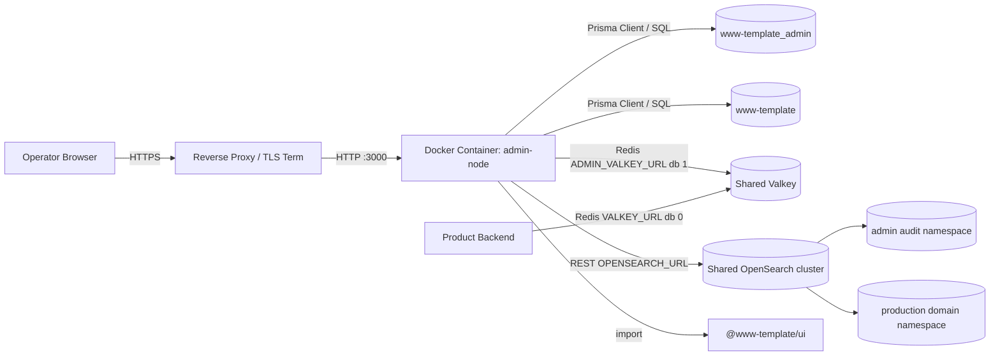
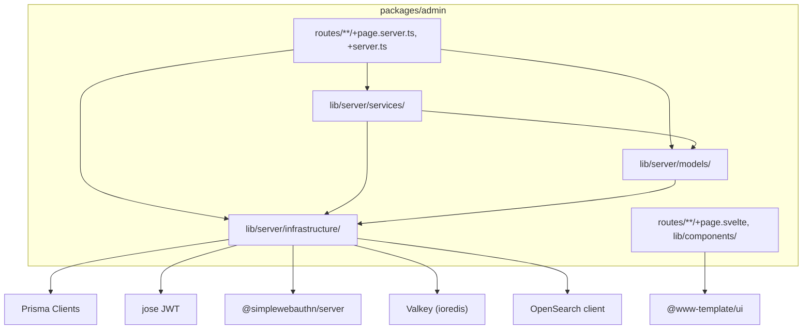
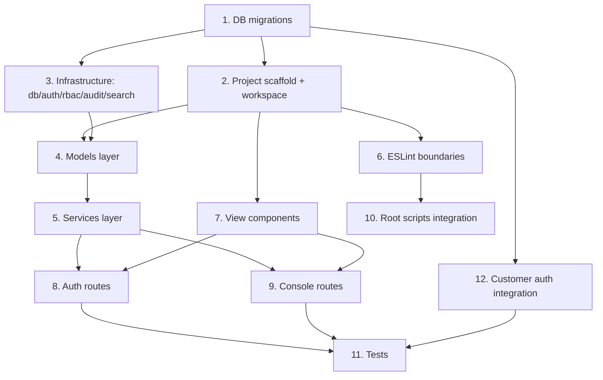

## Scope

### In Scope

- Admin Console SvelteKit full-stack アプリケーションの新規作成（`packages/admin/`）
- WebAuthn passkey 認証（プロダクションと同方式）→ JWT httpOnly cookie セッション
- オペレーター passkey 管理（追加・一覧・削除、user verification required）
- オペレーター 0 件時、明示 enable flag、有効期限付き bootstrap secret をすべて満たす場合のみ利用できる初回起動セットアップと、admin が追加したオペレーター向け setup token による初回 passkey 登録フロー
- RBAC（admin / operator / viewer の 3 ロール、Controller 層で強制）
- アカウント検索（部分一致・ページネーション・status フィルター）・閲覧・停止・復旧。停止は Product DB status を更新し、顧客向け `auth-be` の新規 access token / refresh token pair 発行・refresh rotation・既存 bearer access token 認可を拒否する
- 監査ログの自動記録（Service 層で保証）と閲覧（フィルター・ソート・details 展開）
- Settings 配下のオペレーター管理（一覧・追加・ロール変更・無効化、setup token 発行・再発行、admin ロールのみ）
- Admin DB（`www-template_admin`）: `admin.operators`, `admin.operator_passkeys`, `admin.audit_events`。migration metadata は Prisma Migrate が管理する
- Product DB（`www-template`）拡張: `accounts.status`, `accounts.session_revoked_after`, `admin_view.*`, `admin_op.*`
- 監査ログの OpenSearch インデックス — 監査イベントを OpenSearch に非同期でインデックスし、全文検索・集計を可能にする
- ESLint による MVCS 層間依存強制、顧客向けパッケージ import 禁止、セキュリティ制約
- Docker コンテナ + adapter-node でのデプロイ。DB（ADMIN_DB / PRODUCT_DB の 2 系統）へ直接接続
- 顧客向け `auth-be` / `auth-fe` の suspended account 対応（Admin suspend が実際の顧客アクセス停止として効くこと）
- Unit / Integration テスト（Vitest）

### Out of Scope

- 顧客向けアプリとのコード共有（`@www-template/ui` の純粋 UI コンポーネントを除く）
- WAF / ネットワークアクセス制限（インフラ層で設定。初回 bootstrap の enable flag / secret / expiry は Admin コードで強制するため in scope）
- Admin BFF route の TypeSpec contract 定義（`packages/admin/src/routes/api/admin/**` のみ対象外。Admin BFF は顧客向け SDK / OpenAPI / Go backend route ではなく、`/api/v1/*` path policy の例外範囲はこの package-local route に限定する）
- E2E テスト（Playwright）（初期実装では Unit / Integration に集中）
- オペレーター招待メール配送ワークフロー（オペレーター追加時の setup token 発行・one-time 表示・再発行は in scope。メール配送は out of scope）

## Assumptions / Dependencies

- PostgreSQL インスタンス上に `www-template_admin` データベースが作成済みであること
- Docker コンテナから環境変数で `ADMIN_DATABASE_URL`（→ `www-template_admin`）と `PRODUCT_DATABASE_URL`（→ `www-template`）が注入され、Prisma Client がそれぞれの DB へ接続すること
- Product auth と Admin が同じ Valkey infrastructure を共有し、Product は `VALKEY_URL`（例: DB 0）、Admin は `ADMIN_VALKEY_URL`（例: DB 1）で logical DB 番号を分離すること。Admin runtime は `admin:*` key prefix のみを読み書きし、Product auth の `auth:*` / `session:*` / `recovery:*` key は読み書きしてはならない
- OpenSearch cluster が `OPENSEARCH_URL` 環境変数で利用可能であること。物理 cluster / 接続情報は単一でもよいが、Admin audit namespace と Production domain namespace は index prefix で分離し、raw index name と cross namespace query を禁止すること
- Admin 公開 Origin が `ADMIN_ORIGIN`、Admin OpenSearch audit replica 数が `ADMIN_OPENSEARCH_AUDIT_REPLICAS`、Admin audit index prefix が `ADMIN_OPENSEARCH_AUDIT_INDEX_PREFIX`、Production domain index prefix が `PRODUCT_OPENSEARCH_INDEX_PREFIX` で設定されていること
- 初回 bootstrap 時のみ `ADMIN_BOOTSTRAP_ENABLED=true`、`ADMIN_BOOTSTRAP_SECRET_HASH`、`ADMIN_BOOTSTRAP_EXPIRES_AT` が短期間だけ設定され、初回完了後に無効化されること
- `@sveltejs/adapter-node` を使用
- Prisma を ORM Mapper として使用し、Admin DB 用 Prisma Client と Product DB 用 Prisma Client を分離して生成すること
- Product DB の schema 変更は既存 golang-migrate を継続し、Prisma Migrate は Product DB に適用しないこと
- `ioredis` 5.x を Valkey client として使用
- `@opensearch-project/opensearch` 3.x を OpenSearch client として使用
- `jose` 5.x を JWT 操作に使用
- `@simplewebauthn/server` を WebAuthn server-side 検証に使用
- `@simplewebauthn/browser` を WebAuthn client-side 操作に使用
- `bcryptjs` を setup token ハッシュに使用
- `zod` を入力バリデーションに使用
- `@www-template/ui` から Table / Button / Dialog / Form / Badge / Input 等の純粋 UI コンポーネントを共有

## Impacted Areas

| 領域                                                      | 影響                                                                                                                                    |
| --------------------------------------------------------- | --------------------------------------------------------------------------------------------------------------------------------------- |
| `packages/admin/`                                         | 新規作成                                                                                                                                |
| `packages/admin/prisma/admin/`                            | Admin DB Prisma schema + Prisma Migrate migration。初期オペレーター seed は作成しない                                                   |
| `packages/admin/prisma/product/`                          | Product DB 用 Prisma schema。migration は生成せず既存 golang-migrate の DB 構造を参照する                                               |
| `packages/backend/db/migrations/`                         | Product DB 拡張 migration を追加（000004 status/session_revoked_after, 000005 views, 000006 functions）。既存 golang-migrate 管理と統合 |
| `pnpm-workspace.yaml`                                     | `packages/admin` 追加                                                                                                                   |
| `tsconfig.base.json`                                      | `@www-template/admin` パスエイリアス追加                                                                                                |
| `eslint.config.js`                                        | Admin boundaries / MVCS / import 制限 / セキュリティルール追加                                                                          |
| `AGENTS.md`                                               | API path policy に package-local Admin BFF 例外を明記                                                                                   |
| `package.json` (root)                                     | dev:admin, build:admin, test:admin, Prisma generate / migrate deploy, db:migrate:product スクリプト追加                                 |
| `vitest.config.ts` (root)                                 | `frontend-admin` project 追加                                                                                                           |
| `packages/typespec/main.tsp`                              | 既存 auth response error classification に `account-suspended` を追加し、`pnpm gen` で生成物を更新                                      |
| `packages/backend/internal/auth/**`                       | login finish / refresh / bearer 認可で account status と `session_revoked_after` を検証                                                 |
| `packages/frontend/domain/**`, `packages/frontend/app/**` | `account-suspended` を session state に接続し、案内 UI を表示                                                                           |
| `.devcontainer/compose.yaml`                              | `www-template_admin` DB 作成用 init SQL 追加                                                                                            |
| `www-template_admin` DB                                   | 新規テーブル: operators, operator_passkeys, audit_events。migration metadata は Prisma Migrate が管理                                   |
| `www-template` DB                                         | accounts.status / session_revoked_after カラム、admin_view / admin_op スキーマ、admin_console_read / admin_console_write role grant     |

## Directory Tree

```text
packages/admin/
├─ package.json
├─ svelte.config.js
├─ vite.config.ts
├─ Dockerfile
├─ tsconfig.json
├─ vitest.config.ts
├─ .env.example
├─ prisma/
│  ├─ admin/
│  │  ├─ schema.prisma
│  │  └─ migrations/
│  │     └─ 000001_create_operators_and_passkeys/
│  │        └─ migration.sql
│  └─ product/
│     └─ schema.prisma
└─ src/
   ├─ app.d.ts
   ├─ app.css
   ├─ hooks.server.ts
   ├─ hooks.client.ts
   ├─ routes/
   │  ├─ +layout.svelte
   │  ├─ +layout.server.ts
   │  ├─ +page.svelte
   │  ├─ +page.server.ts
   │  ├─ login/
   │  │  ├─ +page.svelte
   │  │  └─ +page.server.ts
   │  ├─ setup/
   │  │  ├─ +page.svelte
   │  │  └─ +page.server.ts
   │  ├─ operator-setup/
   │  │  ├─ +page.svelte
   │  │  └─ +page.server.ts
   │  ├─ accounts/
   │  │  ├─ +page.svelte
   │  │  ├─ +page.server.ts
   │  │  └─ [id]/
   │  │     ├─ +page.svelte
   │  │     └─ +page.server.ts
   │  ├─ audit/
   │  │  ├─ +page.svelte
   │  │  └─ +page.server.ts
   │  ├─ settings/
   │  │  ├─ +page.svelte
   │  │  ├─ +page.server.ts
   │  │  └─ operators/
   │  │     ├─ +page.svelte
   │  │     └─ +page.server.ts
   │  ├─ passkeys/
   │  │  ├─ +page.svelte
   │  │  └─ +page.server.ts
   │  └─ api/
   │     └─ admin/
   │        └─ auth/
   │           ├─ logout/
   │           │  └─ +server.ts
   │           ├─ passkey/
   │           │  ├─ start/
   │           │  │  └─ +server.ts
   │           │  └─ finish/
   │           │     └─ +server.ts
   │           ├─ passkeys/
   │           │  ├─ +server.ts
   │           │  ├─ start/
   │           │  │  └─ +server.ts
   │           │  ├─ finish/
   │           │  │  └─ +server.ts
   │           │  └─ [id]/
   │           │     └─ +server.ts
   │           ├─ setup/
   │           │  ├─ start/
   │           │  │  └─ +server.ts
   │           │  └─ finish/
   │           │     └─ +server.ts
   │           └─ operator-setup/
   │              ├─ start/
   │              │  └─ +server.ts
   │              └─ finish/
   │                 └─ +server.ts
   └─ lib/
      ├─ server/
      │  ├─ services/
      │  │  ├─ accounts/
      │  │  │  ├─ search.ts
      │  │  │  ├─ detail.ts
      │  │  │  ├─ suspend.ts
      │  │  │  ├─ restore.ts
      │  │  │  └─ stats.ts
      │  │  ├─ audit/
      │  │  │  └─ list.ts
      │  │  └─ operators/
      │  │     ├─ list.ts
      │  │     └─ manage.ts
      │  ├─ models/
      │  │  ├─ operators.ts
      │  │  ├─ passkeys.ts
      │  │  ├─ audit-events.ts
      │  │  ├─ accounts.ts
      │  │  ├─ schemas.ts
      │  │  └─ types.ts
      │  └─ infrastructure/
      │     ├─ db/
      │     │  └─ prisma.ts
      │     ├─ auth/
      │     │  └─ operator.ts
      │     ├─ csrf/
      │     │  └─ guard.ts
      │     ├─ rbac/
      │     │  ├─ permissions.ts
      │     │  └─ guard.ts
      │     ├─ audit/
      │     │  └─ logger.ts
      │     ├─ search/
      │     │  └─ opensearch.ts
      │     └─ config/
      │        ├─ env.ts
      │        └─ platform.ts
      └─ components/
         ├─ layout/
         │  ├─ AdminShell.svelte
         │  ├─ AdminSidebar.svelte
         │  └─ AdminHeader.svelte
         ├─ accounts/
         │  ├─ AccountTable.svelte
         │  ├─ AccountStatusBadge.svelte
         │  └─ PasskeyList.svelte
         ├─ audit/
         │  ├─ AuditLogTable.svelte
         │  └─ AuditFilterBar.svelte
         ├─ operators/
         │  ├─ OperatorTable.svelte
         │  └─ OperatorRoleBadge.svelte
         └─ shared/
            ├─ ConfirmDialog.svelte
            ├─ DataTable.svelte
            └─ EmptyState.svelte
```

## New / Changed Files

| Type   | File                                                      | Change                                                                                                                      |
| ------ | --------------------------------------------------------- | --------------------------------------------------------------------------------------------------------------------------- |
| Add    | `packages/admin/` (tracked source files only)             | Admin Console アプリケーション新規作成。secret 実値を含む `.env` は作成・コミットせず、サンプルは `.env.example` に限定する |
| Add    | `packages/admin/Dockerfile`                               | multistage build（builder → Node.js runtime）                                                                               |
| Add    | `packages/admin/.env.example`                             | 必須環境変数名だけを記載する sample。secret 実値は含めない                                                                  |
| Add    | `packages/admin/prisma/admin/schema.prisma`               | Admin DB 用 Prisma schema。初期オペレーター seed は含めない                                                                 |
| Add    | `packages/admin/prisma/admin/migrations/**/migration.sql` | Admin DB schema を Prisma Migrate で管理                                                                                    |
| Add    | `packages/admin/prisma/product/schema.prisma`             | Product DB の admin_view / admin_op 利用に必要な Prisma schema。Prisma Migrate は使わない                                   |
| Add    | `packages/backend/db/migrations/000004_*.sql`             | Product DB 拡張 (status カラム)                                                                                             |
| Add    | `packages/backend/db/migrations/000005_*.sql`             | Product DB 拡張 (admin_view)                                                                                                |
| Add    | `packages/backend/db/migrations/000006_*.sql`             | Product DB 拡張 (admin_op functions, SECURITY DEFINER + search_path 固定)                                                   |
| Update | `pnpm-workspace.yaml`                                     | `packages/admin` 追加                                                                                                       |
| Update | `tsconfig.base.json`                                      | `@www-template/admin` パスエイリアス追加                                                                                    |
| Update | `eslint.config.js`                                        | Admin boundaries / MVCS / import 制限 / セキュリティルール追加                                                              |
| Update | `package.json` (root)                                     | dev/build/test/db スクリプトに Admin を追加                                                                                 |
| Update | `vitest.config.ts` (root)                                 | `frontend-admin` project 追加                                                                                               |
| Update | `.devcontainer/compose.yaml`                              | `www-template_admin` DB 作成用 init SQL                                                                                     |

## System Diagram



## Package Diagram



## Sequence Diagram

```mermaid
sequenceDiagram
    participant Op as Operator Browser
    participant Page as /login
    participant API as /api/admin/auth/passkey
    participant Hook as hooks.server.ts
    participant DB as DB

    Note over Op: === ログインフロー ===
    Op->>Page: email 入力 → passkey 認証クリック
    Page->>API: POST /api/admin/auth/passkey/start { email }
    API->>DB: SELECT FROM admin.operators WHERE email=$1
    DB-->>API: operator record
    API->>API: generate challengeId + challenge record(type=login, operatorId, email)
    API-->>Page: { challengeId, options }
    Page->>Op: WebAuthn API getAssertion()
    Op-->>Page: assertion
    Page->>API: POST /api/admin/auth/passkey/finish { challengeId, assertion }
    API->>DB: SELECT FROM admin.operator_passkeys WHERE credential_handle=$1
    API->>API: GETDEL challenge:<challengeId> and verify type/operator binding
    API->>API: verifyAssertion(assertion, challenge, publicKey, signCount)
    API->>API: createOperatorSession(sessionId, jti) in Admin Valkey
    API->>API: signOperatorJwt({operatorId, email, role, sessionId, jti})
    API-->>Page: Set-Cookie: admin_session=<JWT>; HttpOnly; Secure; SameSite=Lax
    Note over Page: 303 redirect to /

    Note over Op: === 保護 route アクセス ===
    Op->>Hook: GET /accounts (cookie: admin_session)
    Hook->>Hook: verifyOperatorJwt(cookie)
    Hook->>Hook: verify admin:session:<sessionId> jti in Valkey
    Hook->>DB: SELECT FROM admin.operators WHERE id=$1
    DB-->>Hook: operator record
    Hook->>Hook: event.locals.operator = operator + sessionId/jti
```

## Admin BFF Contract Boundary

- `packages/admin/src/routes/api/admin/**` は Admin Console の同一オリジン BFF route であり、顧客向け SDK / OpenAPI / Go backend route ではない。
- TypeSpec の canonical API contract は引き続き `packages/typespec/main.tsp` であり、OpenAPI path policy `/api/v1/*` は顧客向け Go backend surface のみに適用する。
- Admin BFF route は `packages/admin` package の内部 route として lint/test 対象に含めるが、`packages/frontend/api` の generated client から呼び出してはならない。
- `packages/admin` 以外に `/api/admin/*` route を追加してはならない。Go backend に Admin API を追加する場合は `/api/v1/*` と TypeSpec contract を必須にする。
- この package-local 例外は AGENTS.md の API path policy に明記し、例外範囲を `packages/admin/src/routes/api/admin/**` に限定する。
- `openspec validate` に加え、Admin 実装時は ESLint の no-restricted-imports で `@www-template/api` / `@www-template/domain` 依存禁止と Admin BFF の package-local 境界を検証する。

## Runtime Data Store Isolation

- Admin Valkey は Product auth と同じ Valkey infrastructure を共有し、`ADMIN_VALKEY_URL` の logical DB 番号を Product `VALKEY_URL` と必ず分けなければならない。例: Product は `redis://valkey:6379/0`、Admin は `redis://valkey:6379/1`。
- Admin runtime は Admin 用 logical DB に向いた client のみを生成し、challenge / rate limit / lock の読み書きは `admin:*` prefix のみで行う。Product auth の `auth:*` / `session:*` / `recovery:*` key は読み書きしてはならない。
- Local/dev compose は Product auth と同じ `valkey` service / volume を使い、DB 番号だけを分ける。Admin 専用 `admin-valkey` service / volume は作成してはならない。
- OpenSearch は `OPENSEARCH_URL` の単一接続情報を使用してよい。ただし Admin audit は `ADMIN_OPENSEARCH_AUDIT_INDEX_PREFIX`、Production domain search は `PRODUCT_OPENSEARCH_INDEX_PREFIX` を必ず使用し、prefix は一致してはならない。
- OpenSearch index name は namespace builder だけで生成し、route / service / model で raw index name、wildcard index pattern、comma-separated multi index、`_all` を直接指定してはならない。Admin audit query は Admin audit prefix のみ、Production domain query は Production domain prefix のみを対象にし、cross namespace query を禁止する。
- Admin Console は Product DB へ `PRODUCT_DATABASE_URL` で接続し、`admin_view.*` と `admin_op.*` を通じて Production account lifecycle を参照・操作できる。Production domain OpenSearch を使うユースケースは許可するが、Admin 監査ログ document は Admin audit prefix にのみ保存し、Production domain index へ書き込んではならない。
- Admin audit の DB fallback は Admin DB の `admin.audit_events` のみを参照し、Production domain index fallback と混在してはならない。

## Customer Auth Integration

- Admin の account suspend は表示フラグではなく顧客アクセス停止である。
- Product DB の `accounts.status='suspended'` は顧客向け `auth-be` の passkey login finish、refresh、`/api/v1/*` bearer 認可で参照される。
- Admin suspend は Product DB の status 更新と同じ transaction で `accounts.session_revoked_after` を現在時刻以上に更新する。
- 顧客向け auth middleware は bearer access token の `iat` claim と `session_revoked_after` を比較し、`session_revoked_after` 以前の access token を拒否する。refresh は refresh token に紐づく session metadata の `issuedAt` と `session_revoked_after` を比較し、古い refresh token を rotation してはならない。
- restore は過去 token pair を復活させない。restore 後の顧客は再ログインで新規 token pair を取得する。
- 公開 login start は account existence を漏らさない。`account-suspended` は HTTP 403 の `AuthFailureResponse` として、valid passkey assertion 後、refresh token 検証後、または既存 bearer access token 認可時のみ返す。
- `account-suspended` は TypeSpec の既存 auth error union に追加し、generated frontend SDK と Go bindings は `pnpm gen` で更新する。

## ER Diagram

```mermaid
erDiagram
    ADMIN_OPERATORS {
        TEXT id PK
        TEXT email UK
        TEXT display_name
        TEXT role
        BOOLEAN is_active
        TEXT setup_token_hash
        TIMESTAMPTZ setup_token_expires_at
        TIMESTAMPTZ last_login_at
        TIMESTAMPTZ created_at
        TIMESTAMPTZ updated_at
    }

    ADMIN_OPERATOR_PASSKEYS {
        TEXT id PK
        TEXT operator_id FK
        TEXT credential_handle UK
        BYTEA public_key
        BIGINT sign_count
        BYTEA aaguid
        BOOLEAN backup_eligible
        BOOLEAN backup_state
        JSONB transports
        TIMESTAMPTZ created_at
    }

    ADMIN_AUDIT_EVENTS {
        TEXT id PK
        TEXT operator_id FK
        TEXT action
        TEXT target_type
        TEXT target_id
        JSONB details
        TEXT outcome
        TEXT error_code
        TEXT ip_address
        TIMESTAMPTZ created_at
        TIMESTAMPTZ completed_at
    }

    ACCOUNTS {
        TEXT id PK
        TEXT email UK
        TEXT status
        TEXT status_reason
        TIMESTAMPTZ status_updated_at
        TEXT status_updated_by
        TIMESTAMPTZ session_revoked_after
    }

    PASSKEY_CREDENTIALS {
        TEXT id PK
        TEXT account_id FK
        TEXT identifier
        TEXT credential_handle UK
        BYTEA public_key
        BIGINT sign_count
        BYTEA aaguid
        BOOLEAN backup_eligible
        BOOLEAN backup_state
        JSONB transports
        TIMESTAMPTZ created_at
    }

    ADMIN_OPERATORS ||--o{ ADMIN_OPERATOR_PASSKEYS : "has"
    ADMIN_OPERATORS ||--o{ ADMIN_AUDIT_EVENTS : "records"
    ACCOUNTS ||--o{ PASSKEY_CREDENTIALS : "has"
```



## Package-Level Design

### Package List

| Package                                      | Purpose / Responsibility                                                      | Public API                                                                                                                                                                           | Dependencies                                                                          |
| -------------------------------------------- | ----------------------------------------------------------------------------- | ------------------------------------------------------------------------------------------------------------------------------------------------------------------------------------ | ------------------------------------------------------------------------------------- |
| `packages/admin` (routes)                    | HTTP boundary, Controller layer                                               | load, actions, +server.ts                                                                                                                                                            | services, models, infrastructure                                                      |
| `packages/admin` (lib/server/services)       | Business logic, audit recording                                               | searchAccounts, suspendAccount, restoreAccount, listAudit, manageOperator                                                                                                            | models, infrastructure                                                                |
| `packages/admin` (lib/server/models)         | Prisma 経由の DB queries, Zod schemas, types                                  | findOperatorByEmail, insertAuditEvent, searchAccounts, suspendAccountProduct                                                                                                         | infrastructure                                                                        |
| `packages/admin` (lib/server/infrastructure) | Prisma Client lifecycle, WebAuthn, JWT, CSRF, RBAC, audit, OpenSearch, config | getAdminPrisma, getProductPrisma, validateProductDbRuntimeRole, generateChallenge, verifyAssertion, signOperatorJwt, validateCsrf, hasPermission, indexAuditEvent, searchAuditEvents | @prisma/client, jose, @simplewebauthn/server, ioredis, @opensearch-project/opensearch |
| `packages/admin` (lib/components)            | View components                                                               | Svelte components                                                                                                                                                                    | @www-template/ui                                                                      |
| `@www-template/ui` (shared)                  | Pure UI primitives                                                            | Table, Button, Dialog, Form, Badge                                                                                                                                                   | svelte, bits-ui                                                                       |

### Prisma Design

- Admin DB: `packages/admin/prisma/admin/schema.prisma` を source of truth とし、`admin.operators` / `admin.operator_passkeys` / `admin.audit_events` を Prisma model として定義する。migration は Prisma Migrate の `migration.sql` で管理し、初期オペレーター seed は作成しない。
- Product DB: `packages/admin/prisma/product/schema.prisma` は既存 Product DB の参照用 schema として扱う。Product DB の変更は `packages/backend/db/migrations/` の golang-migrate のみで行い、Prisma Migrate は Product DB に対して実行しない。
- Generated Clients: Admin Prisma Client と Product Prisma Client は別 output に生成し、誤接続を型レベルで避ける。Model 層は該当する Client を引数または infrastructure helper から受け取る。
- Raw SQL Policy: Product DB の `admin_op.suspend_account` / `admin_op.restore_account` と view 検索は Prisma の parameterized `$queryRaw` / `$executeRaw` のみ許可する。`$queryRawUnsafe` / `$executeRawUnsafe` は lint で禁止する。

### Details

#### packages/admin (infrastructure/auth)

- Purpose: WebAuthn passkey 認証 + Valkey-backed challenge / active session 管理。start → Valkey SETEX challenge 保存 → browser WebAuthn → finish → Valkey GETDEL challenge 消費 → Valkey SETEX active session 保存 → JWT httpOnly cookie
- Public API: `generateChallenge(input, valkey)`, `consumeChallenge(challengeId, expectedType, valkey)`, `createOperatorSession(operator, valkey)`, `revokeOperatorSession(sessionId, valkey)`, `verifyOperatorSession(token, valkey)`, `verifyAssertion(assertion, expectedChallenge, credential, origin, rpId)`, `signOperatorJwt(operator, session)`, `verifyOperatorJwt(token)`, `createSessionCookie(token)`, `clearSessionCookie()`
- Key Data Structures: `OperatorClaims { sub, email, role, sessionId, jti, exp }`, `AdminChallengeRecord { challengeId, challenge, type, operatorId, email, createdAt, expiresAt }`, `AdminSessionRecord { sessionId, jti, operatorId, email, createdAt, expiresAt, lastSeenAt }`
- Key Flows: `POST /api/admin/auth/passkey/start` で ULID `challengeId` と challenge を生成し、`ADMIN_VALKEY_URL` が指す共有 Valkey infrastructure の Admin 用 logical DB に `SETEX admin:webauthn:challenge:<challengeId> 300 <record-json>` で保存 → response に `challengeId` と WebAuthn options を返す → browser で `getAssertion()` → `POST /api/admin/auth/passkey/finish` で `challengeId` を受け取り、Admin 用 logical DB から challenge record を `GETDEL` で取得・削除 → record の `type` / `operatorId` / `email` と credential owner を照合 → assertion 検証 → `sessionId` と `jti` を生成して `SETEX admin:session:<sessionId> 86400 <record-json>` → JWT 発行 → Set-Cookie。hook は JWT signature / exp と Valkey active session record の `sessionId` / `jti` を検証し、JWT role claim ではなく Admin DB の現在 role を毎 request で取得して認可に使う。logout は `admin:session:<sessionId>` を削除または revoked marker に置換し、盗難済み cookie を期限前に無効化する
- Dependencies: `@simplewebauthn/server` (WebAuthn), `jose` (JWT sign/verify), Admin Prisma Client (credential 照会), `ioredis` (Valkey client)
- Error Handling: 認証失敗時は non-revealing な 401。Valkey の challenge 不在/期限切れは 401。sign_count 減少は 401。Valkey unavailable 時は 503 fail-close。
- Testing: UT で JWT sign/verify roundtrip、Valkey mock、mock assertion 検証。UT で [ADMIN-AUTH-BE-S003] [ADMIN-AUTH-BE-S004]
- Security: JWT exp=24h, cookie=httpOnly/Secure/SameSite=Lax/Path=/, Valkey active session record exp=24h, logout/revocation check required, WebAuthn userVerification=required, sign_count replay detection, rate limit counter in Admin 用 logical DB, JWT role claim stale 化防止のため認可は DB current role を使用

#### packages/admin (infrastructure/csrf)

- Purpose: cookie session を使う Admin mutation route の CSRF 防御。Origin allowlist と signed double-submit token を cookie-authenticated non-GET request に適用する
- Public API: `issueCsrfToken(sessionId, jti)`, `validateCsrf(event)`, `requireSameOrigin(event)`
- Key Data Structures: `admin_csrf` cookie, `X-CSRF-Token` header / hidden form field, `ADMIN_ORIGIN` allowlist, `App.Locals.operator { id, email, role, sessionId, jti }`, active session の `sessionId` / `jti`
- Key Flows: login / setup 完了時に active session の `sessionId` / `jti` に HMAC で束縛した `admin_csrf` を発行 → SvelteKit form action と fetch request が token を送信 → `hooks.server.ts` または route helper が Origin、token、現在の `event.locals.operator.sessionId` / `jti` を検証 → 不一致時は 403。pre-auth auth route は session-bound CSRF を要求せず、Origin allowlist / rate limit / challenge binding / bootstrap secret または setup token で防御する
- Dependencies: `jose` または `crypto.subtle` HMAC, SvelteKit cookies/request
- Error Handling: Origin 欠落、不許可 Origin、token 欠落、不一致、期限切れは 403 fail-close
- Testing: UT で same-origin success / cross-origin reject / token mismatch reject / pre-auth CSRF bypass [ADMIN-AUTH-BE-S036] [ADMIN-AUTH-BE-S037] [ADMIN-AUTH-BE-S038] [ADMIN-AUTH-BE-S047]

#### packages/admin (infrastructure/db)

- Purpose: Admin DB / Product DB への Prisma Client lifecycle 管理。環境変数から接続文字列を取得し、2 つの generated client を明示的に分離する。Product DB 接続は runtime role の最小権限も起動時に検証する
- Public API: `getAdminPrisma()`, `getProductPrisma()`, `validateProductDbRuntimeRole()`, `disconnectPrisma()`
- Key Flows: `packages/admin/prisma/admin/schema.prisma` から Admin Prisma Client を生成し `ADMIN_DATABASE_URL` で接続する。`packages/admin/prisma/product/schema.prisma` から Product Prisma Client を生成し `PRODUCT_DATABASE_URL` で接続する。Product Prisma 初期化時に `current_user`、`pg_has_role(current_user, 'admin_console_write', 'member')`、`pg_roles.rolsuper`、対象 base table owner を検査し、login role が `admin_console_write` member ではない、superuser である、または base table owner である場合は fail-close する。SvelteKit server runtime では singleton として保持し、test では明示的に disconnect する
- Dependencies: `@prisma/client` と generated Prisma clients
- Error Handling: 接続失敗時と Product DB runtime role validation 失敗時は 503。Prisma の known request error は model 層で domain error に正規化する
- Testing: UT で mock Prisma Client、IT で実 DB 接続確認と runtime role validation 確認 [ADMIN-CONSOLE-BE-S018] [ADMIN-CONSOLE-BE-S019] [ADMIN-CONSOLE-BE-S020] [ADMIN-CONSOLE-BE-S044]

#### packages/admin (infrastructure/search)

- Purpose: OpenSearch への監査ログインデックス・検索。監査イベント発生時に非同期でインデックスし、監査ログ画面での全文検索・集計を可能にする
- Public API: `buildAdminAuditIndexName(date)`, `buildAdminAuditIndexPattern()`, `buildProductDomainIndexPattern(kind)`, `indexAuditEvent(event, opensearch)`, `searchAuditEvents(query, opensearch)`, `getAuditStats(opensearch)`
- Key Data Structures: `AuditEventDocument { id, operator_id, operator_email, operator_name, action, target_type, target_id, details, details_json, ip_address, created_at }`
- Key Flows: Service 層で `insertAuditEvent()` 成功後、`indexAuditEvent()` を非同期呼び出し。インデックス失敗時も監査ログ本体（DB）には記録済みのため、OpenSearch 連携失敗はログに警告するのみで mutation は失敗させない
- Mapping: index template `${ADMIN_OPENSEARCH_AUDIT_INDEX_PREFIX}-*` は `dynamic: strict`。`id/operator_id/operator_email/action/target_type/target_id` は `keyword`、`operator_name` は `text` + `.keyword`、`ip_address` は `ip`、`created_at` は `date`、`details_json` は `text`、`details` は `object` かつ `enabled: false`。index は `${ADMIN_OPENSEARCH_AUDIT_INDEX_PREFIX}-YYYY.MM`、primary shard 1、replica は `ADMIN_OPENSEARCH_AUDIT_REPLICAS` で指定する。Admin audit prefix は `PRODUCT_OPENSEARCH_INDEX_PREFIX` と一致してはならず、prefix 同士が包含関係になる設定（例: `admin` と `admin-audit`）も拒否する
- Dependencies: `@opensearch-project/opensearch` (OpenSearch client)
- Error Handling: OpenSearch unavailable 時は warn ログ出力し、監査 mutation 自体は成功扱い。監査ログ画面では DB fallback 検索を使用
- Testing: UT で mock OpenSearch client、IT で実インデックス・検索確認

#### packages/admin (infrastructure/rbac)

- Purpose: admin / operator / viewer の 3 ロール権限マップ。Controller から呼ばれる
- Public API: `hasPermission(role, permission)`, `requirePermission(operator, permission)`
- Key Data Structures: `ROLE_PERMISSIONS` 定数マップ（8 権限 × 3 ロール）
- Key Flows: Controller action 冒頭で `requirePermission(locals.operator, 'accounts:suspend')` → 権限不足時 `error(403)`
- Dependencies: `@sveltejs/kit` (error function)
- Testing: UT で全ロール × 全権限の matrix。未定義権限は false。[ADMIN-CONSOLE-BE-S033-S036]

#### packages/admin (services/accounts)

- Purpose: アカウント検索・詳細・停止・復旧。監査ログ必須
- Public API: `searchAccounts(productPrisma, params)`, `getAccountDetail(productPrisma, id)`, `suspendAccount(input)`, `restoreAccount(input)`, `getDashboardStats(productPrisma)`
- Key Flows: suspend → Admin Prisma Client で outcome=`pending` の audit intent を挿入 → Product Prisma Client の parameterized `$queryRaw` / `$executeRaw` で `admin_op.suspend_account(accountId, operatorId, reason, auditEventId)` を実行し、Product DB transaction 内で status と `session_revoked_after` を更新 → Admin audit outcome を `succeeded` に更新 → OpenSearch 非同期 index
- Dependencies: models/accounts, models/audit-events, infrastructure/db, infrastructure/audit
- Error Handling: 二重 suspend は DB 例外 `account_not_active`。pending audit intent 挿入に失敗した場合は Product DB mutation を開始せず 503。Product DB mutation が失敗した場合は audit outcome=`failed`、stable error_code、completed_at を記録してから domain error / 5xx を返す。Product DB mutation 成功後の audit outcome 更新失敗は分散 rollback せず、pending event を reconciliation 対象として残し、structured error log と metric を出力する。OpenSearch index 失敗だけは非ブロッキングで warn ログに留める
- Testing: UT で mock Prisma Client。suspend/restore 後に audit 記録を検証 [ADMIN-CONSOLE-BE-S014-S015]

## Implementation Plan



## Test Plan

### User Acceptance Test (Manual)

| UAT ID                       | Related Requirement          | Spec Summary                                            | Customer Problem Summary                 | Steps                                                           | Expected Behavior                                |
| ---------------------------- | ---------------------------- | ------------------------------------------------------- | ---------------------------------------- | --------------------------------------------------------------- | ------------------------------------------------ |
| UAT-ADMIN-AUTH-FE-HAP-001    | オペレーターパスキーログイン | passkey でログインし Dashboard に遷移                   | オペレーターが管理画面にアクセスできない | 1. /login 2. email 入力 3. passkey 認証                         | Dashboard にリダイレクト                         |
| UAT-ADMIN-AUTH-FE-HAP-002    | オペレーターパスキーログイン | WebAuthn キャンセル時にログイン画面に留まる             | 誤操作時に混乱しない                     | 1. /login 2. email 入力 3. WebAuthn ダイアログでキャンセル      | ログイン画面に留まりエラーメッセージ             |
| UAT-ADMIN-AUTH-FE-HAP-003    | 初回起動セットアップ         | オペレーター 0 件時に最初の admin を作成し passkey 登録 | 初期管理者がログインできない             | 1. /setup 2. email/name 入力 3. passkey 登録                    | admin オペレーター作成、Dashboard にリダイレクト |
| UAT-ADMIN-AUTH-FE-HAP-004    | passkey 管理                 | 新しい passkey を追加                                   | 新 device からログインできない           | 1. 管理画面 2. passkey 追加 3. WebAuthn 登録                    | 一覧に新しい passkey 追加                        |
| UAT-ADMIN-AUTH-FE-HAP-005    | passkey 管理                 | 最後の passkey は削除不可                               | 誤操作でログイン不能になるのを防ぐ       | 1. passkey 管理画面 2. passkey 1件のみ                          | 削除ボタン無効化                                 |
| UAT-ADMIN-CONSOLE-FE-HAP-006 | アカウント検索               | メール部分一致検索                                      | サポート問い合わせ時に顧客特定           | 1. Accounts 2. メール一部入力 3. 検索                           | 合致アカウント一覧                               |
| UAT-ADMIN-CONSOLE-FE-HAP-007 | アカウント検索               | status フィルター                                       | 停止中アカウントだけを抽出したい         | 1. Accounts 2. status: suspended 選択                           | suspended のみ表示                               |
| UAT-ADMIN-CONSOLE-FE-HAP-008 | アカウント停止               | 理由付きで停止                                          | 不正利用アカウントへの対応               | 1. 詳細 2. Suspend 3. 理由入力 4. 確認                          | status=suspended, 成功通知                       |
| UAT-ADMIN-CONSOLE-FE-HAP-009 | アカウント復旧               | 停止中アカウントを復旧                                  | 問題解決後の再開                         | 1. 詳細 2. Restore 3. 確認                                      | status=active                                    |
| UAT-ADMIN-CONSOLE-FE-HAP-010 | 監査ログ                     | 操作種別フィルター                                      | 特定操作だけを追跡したい                 | 1. Audit 2. action: account.suspend                             | suspend イベントのみ表示                         |
| UAT-ADMIN-CONSOLE-FE-HAP-011 | オペレーター管理             | 新規オペレーター追加                                    | 新しいオペレーターを追加                 | 1. Settings 2. オペレーター管理 3. 追加 4. email/name/role 入力 | 一覧に追加、one-time setup token 表示            |
| UAT-ADMIN-CONSOLE-FE-HAP-012 | ナビゲーション               | Sidebar の role-based 表示                              | 権限のない画面が表示されない             | 1. operator ログイン 2. Sidebar 確認                            | Settings / オペレーター管理リンク非表示          |
| UAT-ADMIN-CONSOLE-FE-HAP-013 | ナビゲーション               | Logout でログアウト                                     | 安全なセッション終了                     | 1. Header の Logout クリック                                    | /login にリダイレクト、cookie 消去               |
| UAT-AUTH-FE-HAP-014          | suspended account            | 停止済み顧客が再ログインできない                        | 不正利用時に顧客アクセスを止める         | 1. Admin で suspend 2. 顧客が passkey login                     | account suspended 案内、session 未発行           |
| UAT-AUTH-FE-HAP-015          | existing token pair revoke   | 停止前の既存 access token が拒否される                  | 停止後も API 利用されない                | 1. 顧客 login 2. Admin suspend 3. 顧客が API 呼出               | account suspended 案内、authenticated state 消去 |

### E2E Test (Playwright)

| E2E ID | Playwright Test Name | Related Scenario | Category | Summary                              | Steps (Playwright) | Expected Behavior |
| ------ | -------------------- | ---------------- | -------- | ------------------------------------ | ------------------ | ----------------- |
| N/A    | N/A                  | N/A              | N/A      | E2E は初期実装では対象外。後続で追加 | N/A                | N/A               |

### Integration Test (Endpoint)

| IT ID                       | Test Name                                                     | Genre | Category | Summary                                             | Steps (Test)                                       | Expected Behavior                               |
| --------------------------- | ------------------------------------------------------------- | ----- | -------- | --------------------------------------------------- | -------------------------------------------------- | ----------------------------------------------- |
| IT-ADMIN-AUTH-BE-HAP-001    | [ADMIN-AUTH-BE-S001] login sets cookie                        | be    | HAP      | 有効 assertion で cookie 設定                       | start→finish valid                                 | Set-Cookie: admin_session=<JWT>; 303 /          |
| IT-ADMIN-AUTH-BE-ERR-002    | [ADMIN-AUTH-BE-S002] invalid assertion 401                    | be    | ERR      | 改ざん assertion 拒否                               | finish with tampered sig                           | 401, no cookie                                  |
| IT-ADMIN-AUTH-BE-ERR-003    | [ADMIN-AUTH-BE-S003] unknown credential_handle 401            | be    | ERR      | 未登録 credential_handle                            | finish with unknown handle                         | 401                                             |
| IT-ADMIN-AUTH-BE-ERR-004    | [ADMIN-AUTH-BE-S004] expired challenge 401                    | be    | ERR      | TTL 切れ challenge                                  | start→wait 5min→finish                             | 401                                             |
| IT-ADMIN-AUTH-BE-ERR-005    | [ADMIN-AUTH-BE-S053] consumed challenge reuse 401             | be    | ERR      | 消費済み challenge 再利用                           | start→finish→finish again                          | 2nd finish: 401                                 |
| IT-ADMIN-AUTH-BE-HAP-006    | [ADMIN-AUTH-BE-S005] hooks verifies cookie                    | be    | HAP      | hooks が cookie 検証し locals 設定                  | GET / with valid cookie                            | event.locals.operator set                       |
| IT-ADMIN-AUTH-BE-ERR-007    | [ADMIN-AUTH-BE-S006] expired cookie redirects login           | be    | ERR      | 期限切れ cookie → /login                            | GET / with expired cookie                          | 302 /login                                      |
| IT-ADMIN-AUTH-BE-ERR-008    | [ADMIN-AUTH-BE-S007] tampered JWT redirects login             | be    | ERR      | 改ざん JWT → /login                                 | GET / with bad sig cookie                          | 302 /login, cookie cleared                      |
| IT-ADMIN-AUTH-BE-ERR-009    | [ADMIN-AUTH-BE-S008] inactive operator rejected               | be    | ERR      | 非アクティブオペレーター拒否                        | deactivate operator→GET / with valid JWT           | 302 /login                                      |
| IT-ADMIN-AUTH-BE-HAP-010    | [ADMIN-AUTH-BE-S010] list passkeys                            | be    | HAP      | passkey 一覧取得                                    | GET /api/admin/auth/passkeys                       | 2 creds returned                                |
| IT-ADMIN-AUTH-BE-HAP-011    | [ADMIN-AUTH-BE-S011] add passkey                              | be    | HAP      | passkey 追加                                        | start→finish with attestation                      | cred added to DB                                |
| IT-ADMIN-AUTH-BE-ERR-012    | [ADMIN-AUTH-BE-S012] delete last passkey 400                  | be    | ERR      | 最後の passkey 削除拒否                             | DELETE with only 1 cred left                       | 400                                             |
| IT-ADMIN-AUTH-BE-HAP-013    | [ADMIN-AUTH-BE-S013] delete passkey ok                        | be    | HAP      | 2件以上ある場合の削除成功                           | DELETE with 2+ creds                               | 200, cred removed                               |
| IT-ADMIN-AUTH-BE-ERR-014    | [ADMIN-AUTH-BE-S014] unauth passkey API 401                   | be    | ERR      | 未認証 passkey API 呼出                             | GET /api/admin/auth/passkeys no cookie             | 401                                             |
| IT-ADMIN-AUTH-BE-ERR-015    | [ADMIN-AUTH-BE-S015] cross-operator passkey 403               | be    | ERR      | 他オペレーター passkey 操作                         | DELETE other operator's cred                       | 403                                             |
| IT-ADMIN-AUTH-BE-HAP-016    | [ADMIN-AUTH-BE-S019] first setup creates admin passkey        | be    | HAP      | 初回起動セットアップで admin 作成                   | setup/start no operators→setup/finish attestation  | admin created, JWT cookie set                   |
| IT-ADMIN-AUTH-BE-ERR-017    | [ADMIN-AUTH-BE-S020] first setup blocked after bootstrap      | be    | ERR      | オペレーター作成済み時の初回 setup 不可             | setup/start after existing op                      | 400/403                                         |
| IT-ADMIN-AUTH-BE-ERR-018    | [ADMIN-AUTH-BE-S021] first setup finish rechecks count        | be    | ERR      | race 時の初回 setup finish 拒否                     | create op between start/finish                     | no passkey created                              |
| IT-ADMIN-AUTH-BE-HAP-019    | [ADMIN-AUTH-BE-S022] first setup role admin                   | be    | HAP      | 初回 setup は admin 固定                            | finish with role injection attempt                 | created role=admin                              |
| IT-ADMIN-AUTH-BE-ERR-020    | [ADMIN-AUTH-BE-S023] first setup rejects bad bootstrap secret | be    | ERR      | bootstrap secret 不正時は拒否                       | setup/start bad/expired secret                     | 403, no challenge                               |
| IT-ADMIN-AUTH-BE-ERR-020F   | [ADMIN-AUTH-BE-S046] first setup rejects disabled flag        | be    | ERR      | bootstrap flag 無効時は拒否                         | setup/start with disabled flag                     | 403, no challenge                               |
| IT-ADMIN-AUTH-BE-HAP-020A   | [ADMIN-AUTH-BE-S040] operator setup token registers passkey   | be    | HAP      | 追加オペレーター setup token 登録                   | operator-setup/start valid→finish attestation      | JWT cookie set, token consumed                  |
| IT-ADMIN-AUTH-BE-ERR-020B   | [ADMIN-AUTH-BE-S041] bad operator setup token rejected        | be    | ERR      | 不正 setup token                                    | operator-setup/start bad token                     | non-revealing error                             |
| IT-ADMIN-AUTH-BE-ERR-020C   | [ADMIN-AUTH-BE-S042] expired operator setup token rejected    | be    | ERR      | 期限切れ setup token                                | operator-setup/start expired                       | non-revealing error                             |
| IT-ADMIN-AUTH-BE-ERR-020D   | [ADMIN-AUTH-BE-S043] consumed operator setup token rejected   | be    | ERR      | 消費済み setup token 再利用                         | operator-setup/start consumed                      | non-revealing error                             |
| IT-ADMIN-AUTH-BE-ERR-020E   | [ADMIN-AUTH-BE-S044] setup blocked for registered             | be    | ERR      | passkey 登録済みオペレーターは setup 不可           | operator-setup/start registered op                 | 400                                             |
| IT-ADMIN-AUTH-BE-ERR-021    | [ADMIN-AUTH-BE-S027] duplicate credential_handle 409          | be    | ERR      | 重複 credential_handle                              | register same handle twice                         | 409                                             |
| IT-ADMIN-AUTH-BE-ERR-022    | [ADMIN-AUTH-BE-S028] throttle start 429                       | be    | ERR      | rate limit 超過                                     | 6x start in 5min                                   | 429 after 5th                                   |
| IT-ADMIN-AUTH-BE-ERR-023    | [ADMIN-AUTH-BE-S029] finish lock 429                          | be    | ERR      | temporary lock 発動                                 | 10x failed finish→11th try                         | 429                                             |
| IT-ADMIN-AUTH-BE-ERR-024    | [ADMIN-AUTH-BE-S033] Valkey unavailable 503                   | be    | ERR      | Valkey 障害時 fail-close                            | start with Valkey down                             | 503                                             |
| IT-ADMIN-AUTH-BE-SEC-024A   | [ADMIN-AUTH-BE-S045] stale JWT role ignored                   | be    | SEC      | JWT role claim ではなく DB role を使用              | JWT role=admin, DB role=viewer                     | admin route 403                                 |
| IT-ADMIN-AUTH-BE-SEC-024B   | [ADMIN-AUTH-BE-S047] pre-auth CSRF exemption                  | be    | SEC      | pre-auth start は CSRF なしで可                     | passkey/start no csrf, valid origin                | not rejected for csrf                           |
| IT-ADMIN-CONSOLE-BE-HAP-025 | [ADMIN-CONSOLE-BE-S007] status default active                 | be    | HAP      | 既存 account が active                              | run migration→check accounts                       | all status='active'                             |
| IT-ADMIN-CONSOLE-BE-HAP-026 | [ADMIN-CONSOLE-BE-S008] suspend_account function              | be    | HAP      | 停止関数が status と session_revoked_after 更新     | SELECT suspend_account('id','op','reason','audit') | status='suspended', session_revoked_after set   |
| IT-ADMIN-CONSOLE-BE-ERR-027 | [ADMIN-CONSOLE-BE-S009] suspend non-active throws             | be    | ERR      | 非 active 停止で例外                                | suspend_account on suspended                       | exception 'account_not_active'                  |
| IT-ADMIN-CONSOLE-BE-HAP-028 | [ADMIN-CONSOLE-BE-S010] restore_account function              | be    | HAP      | 復旧関数が status 更新し session_revoked_after 維持 | SELECT restore_account('id','op','audit')          | status='active',reason=NULL, revoked_after kept |
| IT-ADMIN-CONSOLE-BE-ERR-029 | [ADMIN-CONSOLE-BE-S011] restore non-suspended throws          | be    | ERR      | 非 suspended 復旧で例外                             | restore_account on active                          | exception 'account_not_suspended'               |
| IT-ADMIN-CONSOLE-BE-HAP-030 | [ADMIN-CONSOLE-BE-S012] view returns all accounts             | be    | HAP      | ビューが全 account 返す                             | SELECT \* FROM admin_view.account_summaries        | 5 rows                                          |
| IT-ADMIN-CONSOLE-BE-HAP-031 | [ADMIN-CONSOLE-BE-S013] view returns passkey info             | be    | HAP      | passkey ビュー                                      | SELECT \* FROM admin_view.account_passkeys         | cred+email                                      |
| IT-ADMIN-CONSOLE-BE-HAP-032 | [ADMIN-CONSOLE-BE-S018] admin DB query works                  | be    | HAP      | Admin DB に接続・クエリ                             | getAdminPrisma→query                               | valid result                                    |
| IT-ADMIN-CONSOLE-BE-HAP-033 | [ADMIN-CONSOLE-BE-S019] product DB query works                | be    | HAP      | Product DB に接続・クエリ                           | getProductPrisma→query                             | valid result                                    |
| IT-ADMIN-CONSOLE-BE-ERR-034 | [ADMIN-CONSOLE-BE-S020] DB connection failure throws          | be    | ERR      | 無効な connectionString                             | getAdminPrisma bad string→query                    | error thrown                                    |
| IT-ADMIN-CONSOLE-BE-HAP-035 | [ADMIN-CONSOLE-BE-S021] migration applies unapplied           | be    | HAP      | 未適用 migration 実行                               | run migrator with 1 unapplied                      | 1 migration applied                             |
| IT-ADMIN-CONSOLE-BE-HAP-036 | [ADMIN-CONSOLE-BE-S022] migration skips applied               | be    | HAP      | 適用済みはスキップ                                  | run migrator with all applied                      | no changes                                      |
| IT-ADMIN-CONSOLE-BE-ERR-037 | [ADMIN-CONSOLE-BE-S024] invalid limit 400                     | be    | ERR      | limit=0 拒否                                        | search with limit=0                                | 400 ZodError                                    |
| IT-ADMIN-CONSOLE-BE-ERR-038 | [ADMIN-CONSOLE-BE-S025] negative offset 400                   | be    | ERR      | offset=-1 拒否                                      | search with offset=-1                              | 400 ZodError                                    |

### Unit/Component Test (UT)

| UT ID                        | Test Name                                                    | Package                   | Category | Summary                                       | Steps (Test)                                            | Expected Behavior                         |
| ---------------------------- | ------------------------------------------------------------ | ------------------------- | -------- | --------------------------------------------- | ------------------------------------------------------- | ----------------------------------------- |
| UT-ADMIN-AUTH-FE-BND-001     | [ADMIN-AUTH-FE-S005] loading state during login              | routes/login              | BND      | ログイン中 loading 表示                       | render login page during auth                           | loading indicator visible                 |
| UT-ADMIN-AUTH-FE-HAP-002     | [ADMIN-AUTH-FE-S006] unauth redirects /login                 | hooks.server              | HAP      | 未認証→/login                                 | GET / no cookie                                         | 302 /login                                |
| UT-ADMIN-AUTH-FE-HAP-003     | [ADMIN-AUTH-FE-S007] authed /login→/                         | hooks.server              | HAP      | 認証済み /login→Dashboard                     | GET /login with cookie                                  | 302 /                                     |
| UT-ADMIN-AUTH-FE-HAP-004     | [ADMIN-AUTH-FE-S008] redirectTo preserved                    | hooks.server              | HAP      | ログイン後元の画面に戻る                      | GET /accounts no cookie→302 /login?redirectTo=/accounts | redirectTo in query                       |
| UT-ADMIN-AUTH-FE-ERR-005     | [ADMIN-AUTH-FE-S009] expired session clears cookie           | hooks.server              | ERR      | 期限切れ→cookie 消去 /login                   | GET / with expired cookie                               | Set-Cookie clear, 302 /login              |
| UT-ADMIN-AUTH-FE-ERR-006     | [ADMIN-AUTH-FE-S010] tampered JWT clears cookie              | hooks.server              | ERR      | 改ざん JWT→cookie 消去                        | GET / with bad sig cookie                               | Set-Cookie clear, 302 /login              |
| UT-ADMIN-AUTH-FE-SEC-007     | [ADMIN-AUTH-FE-S011] /login no-store header                  | hooks.server              | SEC      | /login が no-store                            | GET /login→check response                               | Cache-Control: no-store                   |
| UT-ADMIN-AUTH-FE-SEC-007A    | [ADMIN-AUTH-FE-S022] setup no-store header                   | hooks.server              | SEC      | setup 系が no-store                           | GET /setup, /operator-setup                             | Cache-Control: no-store                   |
| UT-ADMIN-AUTH-FE-SMK-008     | [ADMIN-AUTH-FE-S012] passkey list rendered                   | routes/passkeys           | SMK      | passkey 一覧表示                              | render with 2 creds                                     | 2 rows displayed                          |
| UT-ADMIN-AUTH-FE-SMK-009     | [ADMIN-AUTH-FE-S014] delete button disabled for 1 cred       | routes/passkeys           | SMK      | 削除ボタン無効化                              | render with 1 cred                                      | delete button disabled                    |
| UT-ADMIN-AUTH-FE-SMK-010     | [ADMIN-AUTH-FE-S015] delete button enabled for 2+ creds      | routes/passkeys           | SMK      | 削除ボタン有効                                | render with 2 creds                                     | delete buttons enabled                    |
| UT-ADMIN-AUTH-FE-HAP-011     | [ADMIN-AUTH-FE-S017] first setup registers passkey           | routes/setup              | HAP      | 初回起動セットアップ成功                      | POST setup/start when no operators→finish               | admin created, JWT cookie, redirect /     |
| UT-ADMIN-AUTH-FE-ERR-012     | [ADMIN-AUTH-FE-S018] setup blocked after bootstrap           | routes/setup              | ERR      | 既存オペレーターありでは初回 setup 不可       | GET /setup after operators exist                        | 302 /login または 403                     |
| UT-ADMIN-AUTH-FE-BND-013     | [ADMIN-AUTH-FE-S019] invite setup registers passkey          | routes/operator-setup     | BND      | 追加オペレーターの token 登録                 | POST operator-setup/start valid token→finish            | JWT cookie, redirect /                    |
| UT-ADMIN-AUTH-FE-ERR-013A    | [ADMIN-AUTH-FE-S023] disabled bootstrap hides setup          | routes/setup              | ERR      | bootstrap gate 無効時はフォーム非表示         | GET /setup with disabled gate                           | 403, no form                              |
| UT-ADMIN-AUTH-BE-SEC-014     | [ADMIN-AUTH-BE-S006] expired JWT verify returns null         | infrastructure/auth       | SEC      | 期限切れ JWT→null                             | sign(past exp)→verifyOperatorJwt                        | null                                      |
| UT-ADMIN-AUTH-BE-SEC-015     | [ADMIN-AUTH-BE-S009] last_login_at updated on login          | models/operators          | SEC      | ログイン時に last_login_at 更新               | login→check operator record                             | last_login_at=now                         |
| UT-ADMIN-AUTH-BE-SEC-016     | [ADMIN-AUTH-BE-S016] userVerification required               | infrastructure/auth       | SEC      | options に userVerification=required          | generateChallenge                                       | opts.userVerification='required'          |
| UT-ADMIN-AUTH-BE-HAP-017     | [ADMIN-AUTH-BE-S017] no UV assertion rejected                | infrastructure/auth       | SEC      | UV なし assertion 拒否                        | verify with UV=false                                    | error thrown                              |
| UT-ADMIN-AUTH-BE-HAP-018     | [ADMIN-AUTH-BE-S018] UV assertion accepted                   | infrastructure/auth       | SEC      | UV あり assertion 受理                        | verify with UV=true                                     | success                                   |
| UT-ADMIN-AUTH-BE-SEC-019     | [ADMIN-AUTH-BE-S024] credential saved for verification       | infrastructure/auth       | SEC      | 保存 credential で検証                        | save cred→verify with saved                             | success                                   |
| UT-ADMIN-AUTH-BE-SEC-020     | [ADMIN-AUTH-BE-S025] sign_count decrease rejected            | infrastructure/auth       | SEC      | sign_count 減少拒否                           | cred signCount=10, assertion=8                          | error thrown                              |
| UT-ADMIN-AUTH-BE-HAP-021     | [ADMIN-AUTH-BE-S026] sign_count updated on success           | models/passkeys           | HAP      | 認証後 signCount 更新                         | cred signCount=5→login assertion=6                      | DB signCount=6                            |
| UT-ADMIN-AUTH-BE-HAP-022     | [ADMIN-AUTH-BE-S031] Secure attr in production               | infrastructure/auth       | BND      | production で Secure 属性                     | env!=dev→createSessionCookie                            | cookie includes Secure                    |
| UT-ADMIN-AUTH-BE-HAP-023     | [ADMIN-AUTH-BE-S032] Path=/ in cookie                        | infrastructure/auth       | SMK      | cookie に Path=/                              | createSessionCookie                                     | includes Path=/                           |
| UT-ADMIN-CONSOLE-BE-SEC-024  | [ADMIN-CONSOLE-BE-S001] tables exist after migration         | db migrations             | SMK      | 全テーブル作成                                | run migration→check tables                              | 4 tables exist                            |
| UT-ADMIN-CONSOLE-BE-SEC-025  | [ADMIN-CONSOLE-BE-S002] cascade delete passkeys              | models/operators          | SEC      | cascade delete 動作                           | delete operator→check passkeys                          | passkeys deleted                          |
| UT-ADMIN-CONSOLE-BE-BND-026  | [ADMIN-CONSOLE-BE-S003] email UNIQUE constraint              | models/operators          | BND      | 重複 email 拒否                               | create dup email                                        | constraint error                          |
| UT-ADMIN-CONSOLE-BE-BND-027  | [ADMIN-CONSOLE-BE-S004] role CHECK constraint                | models/operators          | BND      | 無効 role 値拒否                              | create with invalid role                                | constraint error                          |
| UT-ADMIN-CONSOLE-BE-SMK-028  | [ADMIN-CONSOLE-BE-S005] migration does not seed operator     | Prisma migration          | SMK      | migration は初期オペレーターを作成しない      | run migration→check                                     | operators row count 0                     |
| UT-ADMIN-CONSOLE-BE-SMK-029  | [ADMIN-CONSOLE-BE-S006] sign_count default 0                 | models/passkeys           | SMK      | sign_count default                            | insert without sign_count                               | signed_count=0                            |
| UT-ADMIN-CONSOLE-BE-HAP-030  | [ADMIN-CONSOLE-BE-S014] suspend records audit                | services/accounts         | HAP      | 停止成功時に audit 記録                       | suspendAccount mock                                     | audit_events 1 件、action=account.suspend |
| UT-ADMIN-CONSOLE-BE-HAP-031  | [ADMIN-CONSOLE-BE-S015] restore records audit                | services/accounts         | HAP      | 復旧成功時に audit 記録                       | restoreAccount mock                                     | audit_events 1 件、action=account.restore |
| UT-ADMIN-CONSOLE-BE-HAP-032  | [ADMIN-CONSOLE-BE-S016] role update records audit            | services/operators        | HAP      | ロール変更 audit 記録                         | updateOperatorRole mock                                 | audit 1 件、from_role to_role             |
| UT-ADMIN-CONSOLE-BE-ERR-033  | [ADMIN-CONSOLE-BE-S017] audit intent failure stops mutation  | services/accounts         | ERR      | audit intent 失敗時は Product mutation 未開始 | suspend with audit intent error                         | no product update, 503                    |
| UT-ADMIN-CONSOLE-BE-ERR-033A | [ADMIN-CONSOLE-BE-S052] audit outcome failure leaves pending | services/accounts         | ERR      | outcome 更新失敗時は pending 残存             | suspend success, outcome update error                   | pending event, metric/log                 |
| UT-ADMIN-CONSOLE-BE-SEC-034  | [ADMIN-CONSOLE-BE-S026] SQL injection prevented              | models/accounts           | SEC      | SQL injection 防止                            | searchAccounts with `'; DROP`                           | no table dropped, literal search          |
| UT-ADMIN-CONSOLE-BE-SMK-035  | [ADMIN-CONSOLE-BE-S033] admin has all perms                  | infrastructure/rbac       | SEC      | admin 全権限 true                             | hasPermission for all 8 perms                           | all true                                  |
| UT-ADMIN-CONSOLE-BE-SMK-036  | [ADMIN-CONSOLE-BE-S034] viewer no write perms                | infrastructure/rbac       | SEC      | viewer 書き込み権限なし                       | hasPermission for write perms                           | all false                                 |
| UT-ADMIN-CONSOLE-BE-ERR-037  | [ADMIN-CONSOLE-BE-S035] requirePermission throws 403         | infrastructure/rbac       | ERR      | 権限不足時 403 throw                          | requirePermission viewer accounts:suspend               | error(403) thrown                         |
| UT-ADMIN-CONSOLE-BE-BND-038  | [ADMIN-CONSOLE-BE-S036] unknown perm false                   | infrastructure/rbac       | BND      | 未定義権限 false                              | hasPermission admin 'nonexistent'                       | false                                     |
| UT-ADMIN-CONSOLE-BE-SEC-039  | [ADMIN-CONSOLE-BE-S030] hardcoded conn string lint err       | eslint                    | SEC      | lint がハードコード接続検出                   | code with postgres://... literal                        | ESLint error reported                     |
| UT-ADMIN-CONSOLE-BE-SEC-040  | [ADMIN-CONSOLE-BE-S031] @html lint error                     | eslint                    | SEC      | @html 禁止                                    | .svelte with {@html content}                            | ESLint error reported                     |
| UT-ADMIN-CONSOLE-BE-SEC-041  | [ADMIN-CONSOLE-BE-S032] SQL template literal lint error      | eslint                    | SEC      | SQL テンプレートリテラル禁止                  | model with `` `SELECT ${x}` ``                          | ESLint error reported                     |
| UT-ADMIN-CONSOLE-BE-SEC-042  | [ADMIN-CONSOLE-BE-S027] Model→services import lint err       | eslint                    | SEC      | Model→services 禁止                           | model imports $lib/server/services/                     | ESLint error reported                     |
| UT-ADMIN-CONSOLE-BE-SEC-043  | [ADMIN-CONSOLE-BE-S028] Service→components import lint err   | eslint                    | SEC      | Service→components 禁止                       | service imports $lib/components/                        | ESLint error reported                     |
| UT-ADMIN-CONSOLE-BE-SEC-044  | [ADMIN-CONSOLE-BE-S029] admin→api import lint err            | eslint                    | SEC      | @www-template/api 禁止                        | admin file imports @www-template/api                    | ESLint error reported                     |
| UT-ADMIN-CONSOLE-FE-SMK-045  | [ADMIN-CONSOLE-FE-S001] search filters by email              | routes/accounts           | SMK      | メール部分一致検索表示                        | load with query='example'                               | alice@example.com displayed               |
| UT-ADMIN-CONSOLE-FE-SMK-046  | [ADMIN-CONSOLE-FE-S002] empty search shows empty state       | components/shared         | SMK      | 空結果で空状態表示                            | render EmptyState with 0 results                        | '該当なし' displayed                      |
| UT-ADMIN-CONSOLE-FE-SMK-047  | [ADMIN-CONSOLE-FE-S004] pagination shows pages               | routes/accounts           | SMK      | ページネーション表示                          | load with 25 items, pageSize=20                         | page 1: 20, page 2: 5, nav shown          |
| UT-ADMIN-CONSOLE-FE-SMK-048  | [ADMIN-CONSOLE-FE-S007] account detail displayed             | routes/accounts/[id]      | SMK      | 詳細画面表示                                  | load with valid id                                      | email,status,passkeys shown               |
| UT-ADMIN-CONSOLE-FE-ERR-049  | [ADMIN-CONSOLE-FE-S008] invalid id shows 404                 | routes/accounts/[id]      | ERR      | 存在しない ID→404                             | load with bad id                                        | 404 page                                  |
| UT-ADMIN-CONSOLE-FE-SMK-050  | [ADMIN-CONSOLE-FE-S009] 0 passkeys shows empty               | routes/accounts/[id]      | SMK      | passkey 0 件アカウント                        | load with account: 0 passkeys                           | 'passkey 登録なし' displayed              |
| UT-ADMIN-CONSOLE-FE-BND-051  | [ADMIN-CONSOLE-FE-S011] empty reason rejected                | routes/accounts/[id]      | BND      | 空理由拒否                                    | submit suspend with empty reason                        | validation error                          |
| UT-ADMIN-CONSOLE-FE-SMK-052  | [ADMIN-CONSOLE-FE-S013] suspended shows no suspend btn       | routes/accounts/[id]      | SMK      | 停止中は Suspend ボタン非表示                 | render with status=suspended                            | Suspend button hidden/disabled            |
| UT-ADMIN-CONSOLE-FE-SMK-053  | [ADMIN-CONSOLE-FE-S015] active shows no restore btn          | routes/accounts/[id]      | SMK      | active は Restore 非表示                      | render with status=active                               | Restore button hidden/disabled            |
| UT-ADMIN-CONSOLE-FE-SMK-054  | [ADMIN-CONSOLE-FE-S016] audit log rendered                   | routes/audit              | SMK      | 監査ログ一覧表示                              | load with 5 events                                      | 5 rows, newest first                      |
| UT-ADMIN-CONSOLE-FE-SMK-055  | [ADMIN-CONSOLE-FE-S017] audit filter by action               | routes/audit              | SMK      | 操作フィルター                                | filter action='account.suspend'                         | only suspend events                       |
| UT-ADMIN-CONSOLE-FE-SMK-056  | [ADMIN-CONSOLE-FE-S018] details JSON expand                  | components/audit          | SMK      | details 展開表示                              | click event row→expand                                  | reason displayed                          |
| UT-ADMIN-CONSOLE-FE-SMK-057  | [ADMIN-CONSOLE-FE-S020] operator list displayed              | routes/settings/operators | SMK      | オペレーター一覧表示                          | load with 3 ops                                         | 3 rows, email/name/role/status            |
| UT-ADMIN-CONSOLE-FE-ERR-058  | [ADMIN-CONSOLE-FE-S021] non-admin access 403                 | routes/settings/operators | ERR      | operator→オペレーター管理画面                 | load with role=operator                                 | 403                                       |
| UT-ADMIN-CONSOLE-FE-HAP-059  | [ADMIN-CONSOLE-FE-S022] add operator success                 | routes/settings/operators | HAP      | 新規オペレーター追加                          | POST create with email/name/role                        | op added, success msg                     |
| UT-ADMIN-CONSOLE-FE-ERR-060  | [ADMIN-CONSOLE-FE-S023] dup email shows error                | routes/settings/operators | ERR      | 重複 email エラー表示                         | POST create dup email                                   | error message, no change                  |
| UT-ADMIN-CONSOLE-FE-HAP-061  | [ADMIN-CONSOLE-FE-S024] role update success                  | routes/settings/operators | HAP      | ロール変更成功                                | POST update role viewer→operator                        | role updated, success msg                 |
| UT-ADMIN-CONSOLE-FE-HAP-062  | [ADMIN-CONSOLE-FE-S025] deactivate success                   | routes/settings/operators | HAP      | 無効化成功                                    | POST deactivate                                         | is_active=false                           |
| UT-ADMIN-CONSOLE-FE-BND-063  | [ADMIN-CONSOLE-FE-S026] self deactivate blocked              | routes/settings/operators | BND      | 自己無効化不可                                | render own row                                          | deactivate button disabled                |
| UT-ADMIN-CONSOLE-FE-SMK-064  | [ADMIN-CONSOLE-FE-S028] admin sees settings link             | components/layout         | SMK      | admin に Settings リンク                      | render Sidebar role=admin                               | Settings link visible                     |
| UT-ADMIN-CONSOLE-FE-SMK-065  | [ADMIN-CONSOLE-FE-S029] operator no settings link            | components/layout         | SMK      | operator に非表示                             | render Sidebar role=operator                            | Settings link hidden                      |
| UT-ADMIN-CONSOLE-FE-SMK-066  | [ADMIN-CONSOLE-FE-S030] header shows operator name           | components/layout         | SMK      | ヘッダーに名前表示                            | render Header displayName='John Doe'                    | 'John Doe' visible                        |
| UT-ADMIN-CONSOLE-FE-SMK-067  | [ADMIN-CONSOLE-FE-S032] dashboard shows KPIs                 | routes/+page              | SMK      | Dashboard KPI 表示                            | load with 12 total, 2 suspended                         | 12 / 10 / 2 displayed                     |
| UT-ADMIN-CONSOLE-FE-SMK-068  | [ADMIN-CONSOLE-FE-S033] dashboard shows recent audit         | routes/+page              | SMK      | 最近の audit 表示                             | load with 15 events                                     | latest 10 displayed                       |
| UT-ADMIN-CONSOLE-FE-SMK-069  | [ADMIN-CONSOLE-FE-S034] view→model import lint err           | eslint                    | SEC      | View→Model lint error                         | .svelte imports $lib/server/models/                     | ESLint error reported                     |
| UT-ADMIN-CONSOLE-FE-SMK-070  | [ADMIN-CONSOLE-FE-S035] admin→@www-template/api lint err     | eslint                    | SEC      | admin→api lint error                          | admin file imports api                                  | ESLint error reported                     |

### Automated Test Coverage Notes

OpenSpec config requires every Scenario ID to be covered by an automated test task unless the scenario is explicitly tagged manual. This change keeps all listed Admin scenarios automated by using Vitest component tests, route tests, fake timers, and mocked WebAuthn APIs where browser-native ceremonies are not available in unit tests.

## Rollback / Migration

- Admin DB migration は Prisma Migrate の `migration.sql` で管理し、`down.sql` は持たない。Admin DB rollback は原則 forward fix migration を作成する。重大障害時は DB backup restore、または Prisma の migration metadata を確認したうえで `prisma migrate resolve` を用いる運用手順で復旧し、手書き down migration runner は追加しない
- Product DB 拡張（`packages/backend/db/migrations/000004-000006`）は既存 golang-migrate で down 可能。status カラム削除前に backup 推奨
- Admin コンテナのロールバック: `docker compose down && docker compose up -d` で前イメージに戻す

## Release Procedure

1. Product DB 拡張 migration を製品環境に適用: `PRODUCT_DATABASE_URL="$PRODUCT_DATABASE_URL" pnpm db:migrate:product`
2. Product DB の環境別 login role を作成し、`GRANT admin_console_write TO <product_admin_login_role>` を実行する。login role は superuser / table owner にしない
3. Admin DB migration を適用: `ADMIN_DATABASE_URL="$ADMIN_DATABASE_URL" pnpm --filter @www-template/admin prisma:migrate:deploy`
4. Admin DB の `admin.operators` が 0 件であることを確認し、短期 `ADMIN_BOOTSTRAP_ENABLED=true` / `ADMIN_BOOTSTRAP_SECRET_HASH` / `ADMIN_BOOTSTRAP_EXPIRES_AT` を設定して初回起動セットアップを有効化
5. Admin イメージをビルド: `docker build -t www-template-admin:latest -f packages/admin/Dockerfile .`
6. docker-compose でデプロイ: `docker compose up -d admin`（compose file は `admin` service、共有 `valkey` service、Admin DB 接続、`VALKEY_URL`、`ADMIN_VALKEY_URL`、`OPENSEARCH_URL`、`PRODUCT_OPENSEARCH_INDEX_PREFIX`、`ADMIN_OPENSEARCH_AUDIT_INDEX_PREFIX` を含む）
7. 起動時の `validateProductDbRuntimeRole()` が Product DB login role の membership / non-superuser / non-owner を通過することを確認する
8. `/setup` で bootstrap secret を提示し、最初の admin オペレーターを作成し passkey を登録
9. 初回 setup 完了直後に `ADMIN_BOOTSTRAP_ENABLED=false` または bootstrap secret 環境変数削除で bootstrap を無効化
10. admin ロールのオペレーターが `/settings/operators` で他オペレーターを追加し、one-time setup token を安全な別経路で渡す

## Acceptance Criteria

- オペレーター 0 件かつ bootstrap gate 有効時に限り `/setup` で最初の admin オペレーターを作成し、passkey 登録後に Admin Console にログインできること
- 認証済み operator がアカウント検索・詳細表示・停止・復旧を実行できること
- suspended account が顧客向け `/api/v1/*` bearer access token で拒否され、既存 access token / refresh token が Product DB の `session_revoked_after` により無効化されること
- 顧客 frontend が `account-suspended` を受け取ったとき bearer-authenticated state を消去し、サポート案内を表示すること
- viewer ロールで account suspend が 403 になること
- アカウント停止操作が audit_events に自動記録されること
- Admin mutation route が Origin / CSRF token 不一致を 403 で拒否すること
- `pnpm lint` が Admin 全ファイルを対象に含み、既存ルールに違反しないこと
- Admin から `@www-template/api` を import すると ESLint エラーになること
- `pnpm test:admin` が全テストをパスすること
- Docker イメージがビルドでき、コンテナが正常起動すること
- 監査イベントが OpenSearch にインデックスされ、検索可能であること

## Open Issues

- 多要素認証（TOTP / 複数 passkey 必須）の追加
