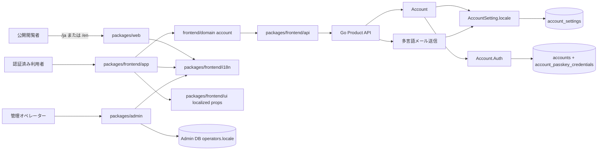
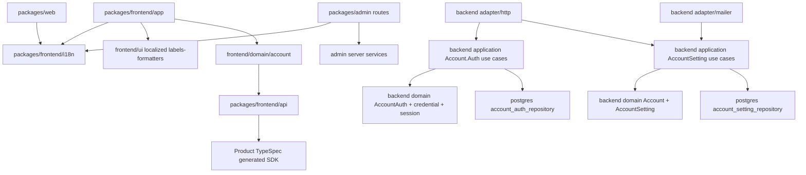
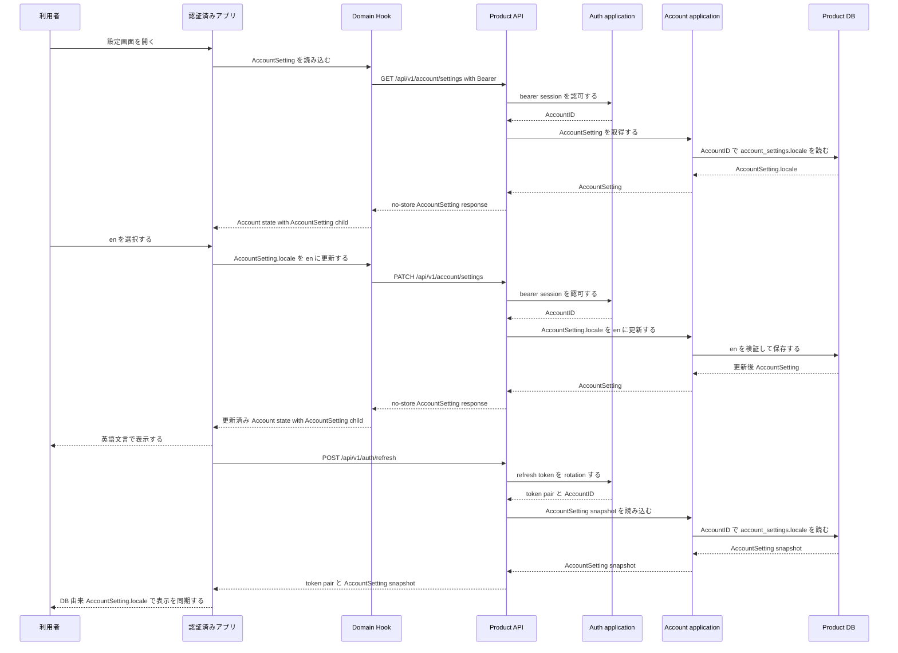
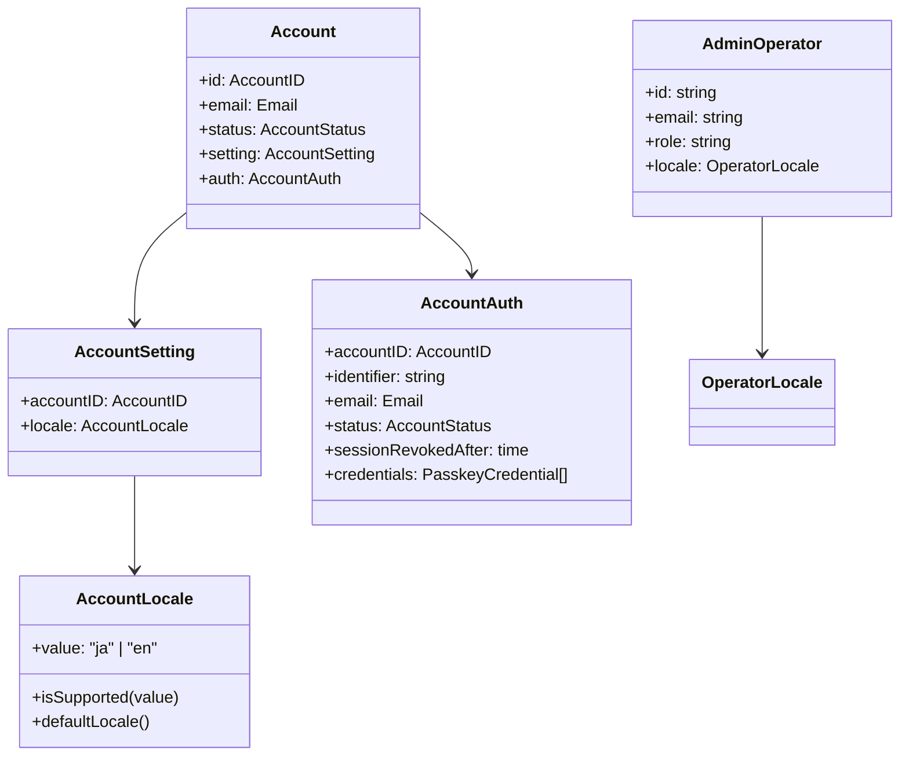
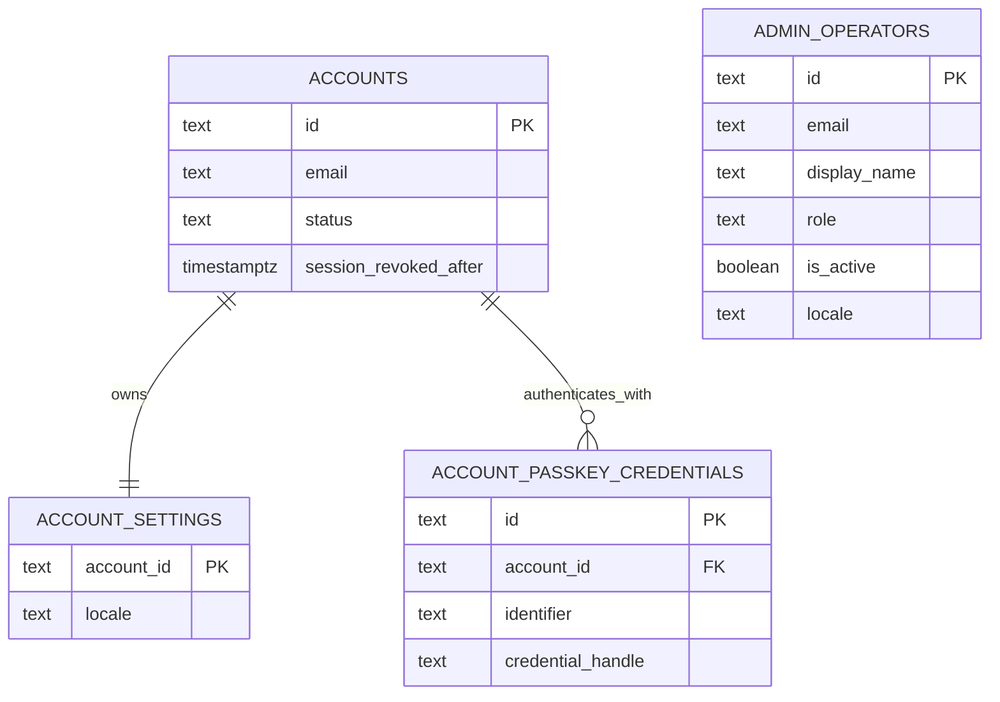
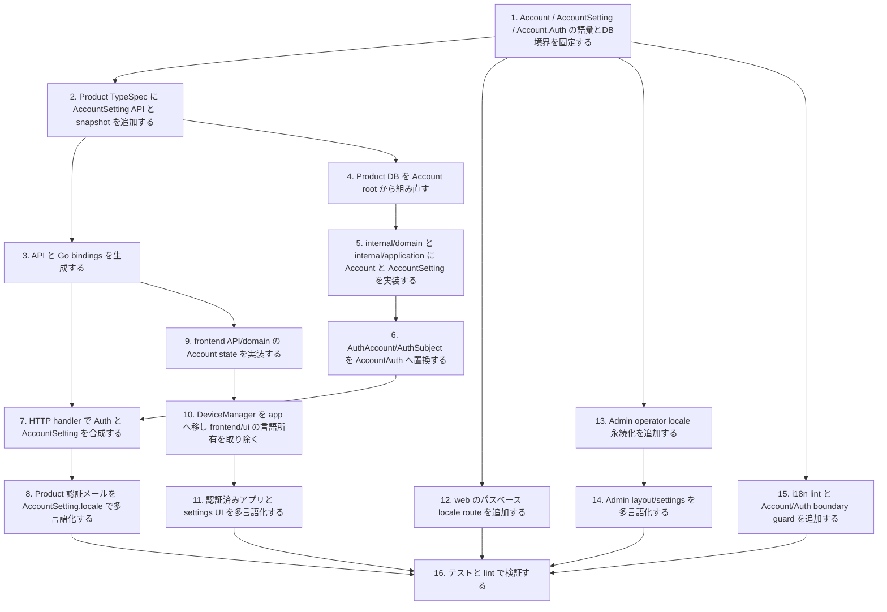

## Scope

この設計は `localization-fe` と `localization-be` の仕様を実装するための構成を定義する。表示言語は初期対応として `ja` と `en` に固定する。公開 Web は URL、認証済みアプリは Product Account の `AccountSetting.locale`、Admin Console は Admin operator locale を言語選択の正とする。

### Core Domain Model

Product の利用主体は `Account` である。`Account` には、利用者の表示・通知設定を表す `AccountSetting` と、本人確認・session・token・credential を扱う `Auth` がぶら下がる。

```text
Account
├─ AccountSetting
│  └─ locale
└─ Auth
   ├─ passkey credentials
   ├─ sessions
   ├─ refresh/access tokens
   └─ recovery/device-link ceremonies
```

この変更では、locale を Account の外へ逃がさない。locale は `AccountSetting.locale` であり、Auth の属性でも、端末ローカル状態でも、UI 都合の一時設定でもない。Auth は Account に従属する認証概念として AccountID を扱うが、AccountSetting を所有しない。

### In Scope

- `packages/web` の `/ja` と `/en` による公開ページ表示、`/` から対応ロケール URL への誘導、公開ページメタデータのローカライズ。
- `packages/frontend/app` と `packages/frontend/domain/src/account` の AccountSetting.locale 取得、更新、認証前 fallback、設定 UI、認証済み画面文言の辞書化。
- `packages/frontend/ui` の reusable component から固定言語文言と固定 locale formatter を排除し、呼び出し側から localized labels / formatters を注入する境界整備。i18n import が必要な concrete component は UI package に置かない。`DeviceManager` は app 固有の device/session 文言を表示するため `packages/frontend/app` へ移す。
- `packages/admin` のオペレーター言語読み込み、設定 UI、Admin layout data、Admin 認証前代替言語、Admin 文言の辞書化。
- Product API の AccountSetting 取得・更新、TypeSpec 契約、Product DB 永続化、Account と Auth の境界整理、生成物更新。
- Product 認証メールの AccountSetting.locale による件名・本文選択。
- Admin DB の operator locale 永続化と本人更新処理。
- 対象パッケージに対する i18n lint 強制と辞書キー整合チェック。
- `packages/frontend/i18n` への共有 i18n 実装導入。外部 i18n dependency に頼らず、locale 定義、loader/config、typed translator、formatter、key coverage utility を集約する。locale JSON files は `packages/web`、`packages/frontend/app`、`packages/admin` がそれぞれ所有し、各 package は `@www-template/i18n` に自分の辞書を渡して使う。

### Out of Scope

- `ja` と `en` 以外のロケール追加。
- Account 作成時の言語選択 UI。
- 翻訳管理 SaaS、外部翻訳管理、機械翻訳連携。
- Admin から Product Account の AccountSetting.locale を代理変更する機能。
- 画面ワイヤーフレーム作成。navigation、settings form、locale selector の情報設計をこの変更で広げない。

## Assumptions / Dependencies

- TypeSpec は `packages/typespec/main.tsp` を契約の正とし、`pnpm gen` で OpenAPI、frontend SDK、Go bindings を生成する。
- TypeSpec は Product API 契約だけを表し、Admin operator locale、Admin BFF `/api/admin/**`、Admin UI 用 locale symbols を含めない。
- Product API model は `AccountSetting`、`AccountSettingSnapshot`、`AccountLocale` のように Account 所有を名前で明示する。
- Product API の認証済みエンドポイントは `/api/v1/*` 配下かつ BearerAuth 必須である。
- Product DB migration は `packages/backend/db/migrations/**` に置き、`AutoMigrate` は使用しない。
- Product DB は Account root から組み直し、`accounts`、`account_settings`、`account_passkey_credentials` を正規 table として扱う。`account_settings.account_id` と `account_passkey_credentials.account_id` は `accounts.id` に従属する。`passkey_credentials` と `accounts.locale` は作らない。
- Admin DB migration は `packages/admin/prisma/admin/migrations/**` と Prisma Migrate で管理する。
- Product BE は Clean Architecture を徹底し、`packages/backend/internal/domain` が Account root、AccountSetting、Account.Auth projection を flat package で所有する。
- `packages/backend/internal/application` は AccountSetting use case と Auth use case を flat package 内で分離し、本人確認、session、token、passkey/recovery 認証フローだけを Auth 側責務として扱う。
- Product BE は Account aggregate を代替する `AuthAccount` や `AuthSubject` を提供しない。認証用 projection は `AccountAuth` と呼ぶ。
- `AccountAuth` は AccountID、認証 identifier、email、status、session revoked boundary、passkey credentials だけを扱い、AccountSetting を持たない。
- HTTP adapter は `auth` で bearer session または refresh token を検証して AccountID を得た後、`account` use case で AccountSetting を取得し、transport response を合成する。
- `packages/frontend/app` は API を直接呼ばず、`packages/frontend/domain -> packages/frontend/api` の依存方向を維持する。
- `packages/frontend/domain` は `src/account` を Account domain root とし、Account と AccountSetting API 協調だけを担当する。`account-settings` root、`localStorage`、browser/OS language、DOM globals による端末 fallback を所有しない。
- `packages/web`、`packages/frontend/app`、`packages/admin` は SvelteKit 面の翻訳適用に `@www-template/i18n` を使用する。locale JSON files は表示面ごとの package が所有し、route component 内の ad hoc translator と別 surface の辞書 import を禁止する。
- `packages/frontend/ui` は app/admin/web の表示言語、i18n import、固定文言、固定 date/time locale を所有せず、localized props と formatter を呼び出し側から受け取る。
- `packages/web` は公開面として `@www-template/domain` と `@www-template/api` に依存しない。
- `packages/admin` は SvelteKit server routes と server load を持つため、operator locale は server hook と layout load で読み込める。Admin operator locale は Admin package-local symbols で扱い、Product AccountSetting を import しない。
- 標準検証は `pnpm gen`、`pnpm check:codegen`、`pnpm lint`、`pnpm check`、`pnpm test:run` を使用する。

## Impacted Areas

- Product API 契約: Product AccountSetting model、認証済み route、refresh response の AccountSetting snapshot。Admin operator locale は含めない。
- Product DB: `accounts`、`account_settings`、`account_passkey_credentials` table、対応 locale 制約、Account child 外部キー、Account 中心 admin views/functions。
- Admin Console BE spec: `admin-console-be` の Product Database 拡張 requirement を Account root / `account_passkey_credentials` 前提へ更新する。
- Go backend: `internal/domain`、`internal/application`、`internal/adapter/*` の flat 構造で表す Account / AccountSetting / Account.Auth projection、HTTP strict handler、localized mailer composition。
- Frontend API client: 生成 SDK と wrapper method。
- Frontend domain: `src/account` の Account state hook、AccountSetting state/types。API wrapper は `packages/frontend/api` に閉じる。
- Frontend i18n: 共有 i18n 実装、locale 定義、typed translator、formatter、key coverage utility。locale JSON files は持たない。
- Frontend app: app-owned locale JSON files、`@www-template/i18n` 接続、settings 画面、layout 文言、auth/protected 文言、localStorage 優先 fallback、browser/OS locale resolver。
- Frontend UI: i18n 非依存 reusable primitive の localized label props、aria label props、date/time formatter props。i18n import が必要な concrete component は app/admin/web 側へ移す。`DeviceManager` は `packages/frontend/app` 側へ移す。
- Public web: web-owned locale JSON files、`@www-template/i18n` 接続、locale route、metadata、root 誘導。
- Admin DB: `admin.operators.locale` column と Prisma model。
- Admin server: operator model、locals、layout data、settings action。
- lint/tooling: ハードコード文言検知、辞書網羅性チェック、Account/Auth 境界 guard。
- tests: Go、Vitest、Playwright、lint guard。

## Directory Tree

```text
www-template
├─ package.json
├─ eslint.config.js
├─ scripts
│  └─ i18n
│     └─ check-locales.ts
├─ packages
│  ├─ typespec
│  │  ├─ main.tsp
│  │  ├─ src
│  │  │  ├─ models
│  │  │  │  └─ account_settings.tsp
│  │  │  └─ routes
│  │  │     └─ v1
│  │  │        └─ account_settings.tsp
│  │  └─ openapi
│  │     └─ openapi.json
│  ├─ backend
│  │  ├─ db
│  │  │  └─ migrations
│  │  │     ├─ 000001_create_accounts.up.sql
│  │  │     ├─ 000001_create_accounts.down.sql
│  │  │     ├─ 000002_create_account_settings.up.sql
│  │  │     ├─ 000002_create_account_settings.down.sql
│  │  │     ├─ 000003_create_account_passkey_credentials.up.sql
│  │  │     ├─ 000003_create_account_passkey_credentials.down.sql
│  │  │     ├─ 000004_add_account_status.up.sql
│  │  │     ├─ 000004_add_account_status.down.sql
│  │  │     ├─ 000005_create_admin_views.up.sql
│  │  │     └─ 000006_create_admin_functions.up.sql
│  │  └─ internal
│  │     ├─ account
│  │     │  ├─ application
│  │     │  │  ├─ account_setting_service.go
│  │     │  │  ├─ account_setting_snapshot.go
│  │     │  │  └─ contracts.go
│  │     │  └─ domain
│  │     │     ├─ account.go
│  │     │     ├─ account_setting.go
│  │     │     └─ account_locale.go
│  │     ├─ adapters
│  │     │  ├─ http
│  │     │  │  ├─ router.go
│  │     │  │  └─ account_settings_test.go
│  │     │  ├─ mailer
│  │     │  │  ├─ account_recovery_sender.go
│  │     │  │  ├─ localized_messages.go
│  │     │  │  └─ account_recovery_sender_test.go
│  │     │  └─ persistence
│  │     │     └─ postgres
│  │     │        ├─ account_setting_repository.go
│  │     │        ├─ account_setting_repository_test.go
│  │     │        ├─ account_auth_repository.go
│  │     │        └─ account_auth_repository_test.go
│  │     ├─ auth
│  │     │  ├─ application
│  │     │  │  ├─ auth_contracts.go
│  │     │  │  ├─ auth_service.go
│  │     │  │  ├─ token_service.go
│  │     │  │  └─ auth_service_test.go
│  │     │  └─ domain
│  │     │     ├─ account_auth.go
│  │     │     └─ account_auth_test.go
│  │     └─ generated
│  │        └─ openapi
│  │           └─ openapi.gen.go
│  ├─ frontend
│  │  ├─ i18n
│  │  │  ├─ package.json
│  │  │  └─ src
│  │  │     ├─ catalog.ts
│  │  │     ├─ config.ts
│  │  │     ├─ coverage.ts
│  │  │     ├─ formatters.ts
│  │  │     ├─ index.ts
│  │  │     ├─ locales.ts
│  │  │     └─ translator.ts
│  │  ├─ api
│  │  │  └─ src
│  │  │     ├─ api
│  │  │     │  └─ client.ts
│  │  │     ├─ generated
│  │  │     │  └─ client.ts
│  │  │     └─ sdk.ts
│  │  ├─ domain
│  │  │  ├─ package.json
│  │  │  └─ src
│  │  │     ├─ account
│  │  │     │  ├─ hook.svelte.ts
│  │  │     │  ├─ index.ts
│  │  │     │  ├─ state.ts
│  │  │     │  └─ types.ts
│  │  │     └─ index.ts
│  │  ├─ ui
│  │  │  └─ src
│  │  │     └─ components
│  │  │        └─ primitives
│  │  └─ app
│  │     └─ src
│  │        ├─ components
│  │        │  └─ device-manager
│  │        │     └─ device-manager.svelte
│  │        ├─ lib
│  │        │  ├─ i18n
│  │        │  │  ├─ index.ts
│  │        │  │  └─ messages
│  │        │  └─ locale
│  │        │     └─ resolver.ts
│  │        └─ routes
│  │           ├─ login
│  │           │  └─ +page.svelte
│  │           └─ (protected)
│  │              ├─ +layout.svelte
│  │              ├─ +page.svelte
│  │              └─ settings
│  │                 └─ +page.svelte
│  ├─ web
│  │  └─ src
│  │     ├─ lib
│  │     │  └─ i18n
│  │     └─ routes
│  │        ├─ +layout.svelte
│  │        ├─ +page.ts
│  │        └─ [locale]
│  │           └─ +page.svelte
│  └─ admin
│     ├─ prisma
│     │  └─ admin
│     │     ├─ schema.prisma
│     │     └─ migrations
│     │        └─ 000002_add_operator_locale
│     │           └─ migration.sql
│     └─ src
│        ├─ app.d.ts
│        ├─ hooks.server.ts
│        ├─ lib
│        │  ├─ i18n
│        │  └─ server
│        │     ├─ models
│        │     │  ├─ operator_locale.ts
│        │     │  ├─ operators.ts
│        │     │  └─ types.ts
│        │     └─ services
│        │        └─ operators
│        │           └─ locale.ts
│        └─ routes
│           ├─ +layout.server.ts
│           ├─ +layout.svelte
│           └─ settings
│              ├─ +page.server.ts
│              └─ +page.svelte
└─ tests
   └─ i18n-lint.test.ts
```

## New / Changed Files

| Type | File                                                                             | Change                                                                                                                                                             |
| ---- | -------------------------------------------------------------------------------- | ------------------------------------------------------------------------------------------------------------------------------------------------------------------ |
| 更新 | `package.json`                                                                   | 標準 `pnpm lint` に i18n lint と辞書網羅性チェックを組み込み、`@www-template/i18n` を `pnpm check` / `pnpm test:run` 対象に含める。                                |
| 更新 | `AGENTS.md`、`CODING_STANDARDS.md`、`eslint.config.js`                           | `packages/frontend/i18n` を正式な共有 frontend package として許可し、domain/ui からの i18n import を禁止する。                                                     |
| 追加 | `scripts/i18n/check-locales.ts`                                                  | `ja` と `en` の辞書キー網羅性を検証する。                                                                                                                          |
| 更新 | `packages/typespec/main.tsp`                                                     | AccountSetting model と account settings route を読み込む。                                                                                                        |
| 追加 | `packages/typespec/src/models/account_settings.tsp`                              | Product API 専用の `AccountLocale`、`AccountSetting`、`AccountSettingSnapshot`、AccountSetting request/response model を定義し、Admin operator locale を含めない。 |
| 追加 | `packages/typespec/src/routes/v1/account_settings.tsp`                           | 認証済み AccountSetting 取得・更新操作と refresh response の AccountSetting snapshot を定義する。                                                                  |
| 生成 | `packages/typespec/openapi/openapi.json`                                         | OpenAPI 契約を再生成する。                                                                                                                                         |
| 更新 | `packages/backend/db/migrations/000001_create_accounts.*.sql`                    | Product DB を Account root から作り直し、`accounts` を作る。                                                                                                       |
| 更新 | `packages/backend/db/migrations/000002_create_account_settings.*.sql`            | Account child として `account_settings` を作る。                                                                                                                   |
| 更新 | `packages/backend/db/migrations/000003_create_account_passkey_credentials.*.sql` | Account.Auth child として `account_passkey_credentials` を作る。`passkey_credentials` は作らない。                                                                 |
| 更新 | `packages/backend/db/migrations/000004_*`                                        | Account root の status/session revoked boundary を `accounts` に揃える。                                                                                           |
| 更新 | `packages/backend/db/migrations/000005_*`、`000006_*`                            | Admin view/function を Account root と `account_passkey_credentials` に揃える。                                                                                    |
| 追加 | `packages/backend/internal/domain/account.go`                                    | Product 利用主体としての Account root を定義する。                                                                                                                 |
| 追加 | `packages/backend/internal/domain/account_setting.go`                            | AccountSetting と AccountSetting snapshot を定義する。                                                                                                             |
| 追加 | `packages/backend/internal/domain/account_locale.go`                             | AccountSetting.locale 値オブジェクト、検証、既定値を定義する。                                                                                                     |
| 追加 | `packages/backend/internal/application/*`                                        | AccountSetting の取得・更新、refresh composition 用 snapshot 読み込み、repository port、Auth use case を flat application に実装する。                             |
| 削除 | 旧 `AuthAccount` model                                                           | Account 代替モデルである AuthAccount を廃止する。                                                                                                                  |
| 追加 | `packages/backend/internal/domain/account_auth.go`                               | Account にぶら下がる Auth projection として AccountAuth を定義する。AccountSetting は持たない。                                                                    |
| 更新 | `packages/backend/internal/application/auth_contracts.go`                        | AuthAccountRepository を AccountAuthRepository に置き換え、AccountSetting DTO や locale を含めない。                                                               |
| 更新 | `packages/backend/internal/application/auth_service.go`                          | Auth は配送 intent を発行し、locale は所有しない。メール送信側が AccountSetting.locale と composition する。                                                       |
| 更新 | `packages/backend/internal/application/token_service.go`                         | refresh は token rotation と AccountID 確定だけを担当し、AccountSetting snapshot は HTTP/application composition 側で読み込む。                                    |
| 追加 | `packages/backend/internal/adapter/postgres/account_setting_repository.go`       | `account_settings.locale` の読み書きと snapshot 読み込みを実装する。                                                                                               |
| 削除 | `packages/backend/internal/adapter/postgres/auth_account_repository.go`          | AuthAccount 命名の repository adapter を廃止する。                                                                                                                 |
| 追加 | `packages/backend/internal/adapter/postgres/account_auth_repository.go`          | Account.Auth 用 projection repository として認証に必要な account status / passkey だけを復元し、`account_settings` は読まない。                                    |
| 更新 | `packages/backend/internal/adapter/http/router.go`                               | Auth で本人認可し、AccountSetting service へ AccountID と request locale を渡して settings/refresh response を合成する。                                           |
| 更新 | `packages/backend/internal/adapter/mailer/account_recovery_sender.go`            | Auth delivery intent と AccountSetting.locale を composition してメール文面を選択する。                                                                            |
| 追加 | `packages/backend/internal/adapter/mailer/localized_messages.go`                 | 認証メールの日本語・英語テンプレートを定義する。                                                                                                                   |
| 生成 | `packages/backend/internal/generated/openapi/openapi.gen.go`                     | Go OpenAPI bindings を再生成する。                                                                                                                                 |
| 生成 | `packages/frontend/api/src/generated/client.ts`                                  | frontend API client を再生成する。                                                                                                                                 |
| 更新 | `packages/frontend/api/src/sdk.ts`、`packages/frontend/api/src/api/client.ts`    | API wrapper 集約点に Account / AccountSetting API を公開する。feature-specific wrapper file は作らない。                                                           |
| 更新 | `packages/frontend/domain/package.json`、`packages/frontend/domain/src/index.ts` | Account domain entrypoint を公開する。                                                                                                                             |
| 追加 | `packages/frontend/domain/src/account/*`                                         | Account と AccountSetting の state、hook、型、index を実装する。API wrapper file、端末 fallback、DOM/localStorage は持たない。                                     |
| 追加 | `packages/frontend/i18n/package.json`、`packages/frontend/i18n/src/*`            | 共有 i18n 実装を追加する。app/web/admin の locale JSON files は置かない。                                                                                          |
| 削除 | `packages/frontend/ui/src/components/device-manager/device-manager.svelte`       | app 固有の device/session 文言を持つ concrete component は UI package に置かないため削除する。                                                                     |
| 追加 | `packages/frontend/app/src/components/device-manager/device-manager.svelte`      | `DeviceManager` を認証済み app 側へ移し、app-owned locale JSON files と `@www-template/i18n` から文言と formatter を受け取って描画する。                           |
| 更新 | `packages/frontend/app/**`、`packages/web/**`、`packages/admin/**`               | 表示面ごとの locale JSON files と `@www-template/i18n` 接続を実装する。                                                                                            |
| 追加 | `tests/i18n-lint.test.ts`                                                        | i18n lint と辞書網羅性チェックの挙動を検証する。                                                                                                                   |

## System Diagram



## Package Diagram



## Sequence Diagram



## Domain Model Diagram



## ER Diagram



## Package-Level Design

### Package List

| Package                                      | Purpose / Responsibility                                                     | Public API                                                                 | Dependencies                                                     |
| -------------------------------------------- | ---------------------------------------------------------------------------- | -------------------------------------------------------------------------- | ---------------------------------------------------------------- |
| `packages/web`                               | 公開 URL ロケール選択、web-owned locale JSON files、共有 i18n 適用           | `/ja`、`/en`、`/`                                                          | `@www-template/ui`、`@www-template/i18n`                         |
| `packages/frontend/app`                      | 認証済み UI、app-owned locale JSON files、Account state 同期、共有 i18n 適用 | Svelte routes                                                              | `@www-template/domain`、`@www-template/ui`、`@www-template/i18n` |
| `packages/frontend/domain`                   | Account と AccountSetting state の domain use case。API wrapper は所有しない | `useAccount`                                                               | `@www-template/api` の public wrapper                            |
| `packages/frontend/ui`                       | 再利用 UI の構造と表示 primitive。言語と i18n import は所有しない            | localized label / formatter props                                          | なし、または UI 内部 primitive                                   |
| `packages/frontend/i18n`                     | web/app/admin 共通の i18n 実装。locale JSON files は所有しない               | locale resolver、JSON catalog loader、translator、formatter、coverage util | TypeScript のみ                                                  |
| `packages/frontend/api`                      | 型付き API wrapper の集約。Account / AccountSetting API を公開する           | `accountApi`                                                               | 生成 SDK                                                         |
| `packages/typespec`                          | Product API AccountSetting 契約                                              | AccountSetting models/routes                                               | TypeSpec emitters                                                |
| `packages/backend/internal/domain`           | Product Account root、AccountSetting、Account.Auth projection                | Account、AccountSetting、AccountAuth 値オブジェクト                        | domain 内部型                                                    |
| `packages/backend/internal/application`      | AccountSetting use case と Auth use case                                     | AccountSetting service、snapshot reader、AuthService、TokenService         | domain、platform、application                                    |
| `packages/backend/internal/adapter/http`     | Product API の transport と use case 合成                                    | generated strict handler                                                   | application、domain、platform、生成 OpenAPI                      |
| `packages/backend/internal/adapter/postgres` | Product Account/Auth 永続化 adapter                                          | account setting repository、account auth repository                        | PostgreSQL、domain、application                                  |
| `packages/backend/internal/adapter/mailer`   | AccountSetting.locale-aware 認証メール送信                                   | AccountRecoverySender                                                      | SMTP、application、domain                                        |
| `packages/admin`                             | operator locale 永続化、admin-owned locale JSON files、共有 i18n 適用        | server load/action、Prisma model                                           | Admin DB、`@www-template/ui`、`@www-template/i18n`               |
| `scripts/i18n`                               | 辞書網羅性検証                                                               | `check-locales.ts`                                                         | Node/tsx                                                         |

`packages/frontend/i18n` は正式な共有 frontend package として扱う。実装時は `AGENTS.md`、`CODING_STANDARDS.md`、`eslint.config.js` の依存境界を同時に更新し、`packages/web`、`packages/frontend/app`、`packages/admin` からの `@www-template/i18n` import を許可する。一方で `packages/frontend/domain` と `packages/frontend/ui` からの `@www-template/i18n`、app/web/admin i18n module、surface-owned locale JSON files への依存は禁止のまま機械検証する。

### Details

#### `packages/backend/internal/domain` と `packages/backend/internal/application`

- 責務: flat domain は Product 利用主体である Account root、Account に属する AccountSetting、Account にぶら下がる Account.Auth projection を所有する。flat application は AccountSetting use case と Auth use case を分離して所有する。
- 公開入口: `AccountSettingService.Get`、`AccountSettingService.Update`、`AccountSettingSnapshotService.Load`、`AuthService`、`TokenService`、各 repository port。
- 主なデータ: `Account`、`AccountSetting`、`AccountLocale`、AccountSetting snapshot、`AccountAuth`、passkey credential、session metadata、refresh token record、account status / session revoked boundary。
- 主な流れ: HTTP adapter から受け取った認可済み AccountID で AccountSetting を取得・更新し、refresh response 用 snapshot を DB から読み込む。Auth use case は bearer session を検証して AccountID を返し、refresh token を rotation して token pair と AccountID を返す。
- 禁止事項: Auth use case / repository は AccountSetting、AccountSetting.locale、AccountSetting mutation、AccountSetting snapshot を所有しない。AccountAuth repository は `account_settings` table と `passkey_credentials` table を読まない。
- テスト: Account/Auth domain/application/repository test と package boundary test で `LOCALIZATION-BE-S001` から `LOCALIZATION-BE-S005`、`LOCALIZATION-BE-S008`、`LOCALIZATION-BE-S013`、`LOCALIZATION-BE-S014`、`ARCH-BE-ACCOUNT-SETTING`、`ARCH-BE-REFRESH-COMPOSITION`、`ARCH-BE-ACCOUNT-AUTH-SUBORDINATION`、`ARCH-BE-AUTH-NO-ACCOUNT-SETTING` を確認する。

#### `packages/backend/internal/adapter/http`

- 責務: generated strict handler として transport 入出力を扱い、auth application と account application を application 境界で合成する。
- 公開入口: `GetAccountSettings`、`UpdateAccountSettings`、`RefreshToken` handler。
- 主な流れ: AccountSetting endpoint は Auth で bearer session を認可し、AccountSetting service へ AccountID と request locale を渡す。refresh endpoint は Auth で token rotation を完了し、AccountSetting snapshot を読み込んで response を組み立てる。
- テスト: HTTP test で `LOCALIZATION-BE-S001` から `LOCALIZATION-BE-S004`、`LOCALIZATION-BE-S013` を確認する。

#### `packages/backend/internal/adapter/mailer`

- 責務: Auth delivery intent と AccountSetting.locale を合成して認証メール文面を選択し、SMTP transport へ渡す。locale の所有や更新は行わない。
- 公開入口: `AccountRecoverySender`。
- テスト: Mailer test で `LOCALIZATION-BE-S006` と `LOCALIZATION-BE-S007` を確認する。

#### `packages/typespec`

- 責務: Product API の AccountSetting contract だけを定義する。Admin Console と Admin operator locale は扱わない。
- 公開入口: `AccountLocale`、`AccountSetting`、`AccountSettingSnapshot`、`AccountSettingResponse`、`UpdateAccountSettingRequest`、`/api/v1/account/settings`。
- 主な流れ: TypeSpec source を変更し、`pnpm gen` で OpenAPI、frontend SDK、Go bindings を同期する。
- 禁止事項: `OperatorLocale`、Admin operator settings、`/api/admin/**`、Admin BFF symbols、`AccountClientSettings` を Product TypeSpec/generated artifacts に含めない。
- テスト: `ARCH-BE-PRODUCT-API-CONTRACT`、`pnpm gen`、`pnpm check:codegen`、OpenAPI lint で確認する。

#### `packages/frontend/domain`

- 責務: 認証済み Account state の domain use case を管理し、AccountSetting を Account child state として扱う。HTTP/generated SDK の wrapper file は所有しない。
- 公開入口: `useAccount(): { data, actions }` と Account / AccountSetting 型。
- 主な流れ: auth session 由来の Authorization header を受け取り、`@www-template/api` の `accountApi` を呼び出して Account state を更新し、エラーを domain state に正規化する。
- 禁止事項: `account_setting_api.ts` や `account_settings_api.ts` などの新規 feature-specific API wrapper file、generated SDK の直接 import、`localStorage`、browser/OS language、DOM globals、UI component import、`@www-template/i18n` import、app/web/admin i18n module import、直接 `fetch` を使わない。
- テスト: `LOCALIZATION-FE-S004` から `LOCALIZATION-FE-S006`、`LOCALIZATION-FE-S012` の state 挙動を Vitest で確認し、domain/API 配置境界は `ARCH-FE-DOMAIN-API-BOUNDARY` source guard で確認する。

#### `packages/frontend/app`

- 責務: 認証前と認証後の app 文言を app-owned locale JSON files と `@www-template/i18n` から表示し、AccountSetting.locale 設定画面を提供する。
- 公開入口: `/login`、protected root、protected `/settings`。
- 主な流れ: 認証前は `localStorage` の対応 locale を優先し、存在しない場合はアクセス時の browser/OS language を `ja` / `en` へ解決する。protected layout は AccountSetting を読み込み、settings は AccountSetting.locale 更新後に app-owned locale JSON files を渡した translator の current locale を切り替える。refresh 成功後は AccountSetting snapshot を正として表示状態を置き換える。
- テスト: component test と Playwright で `LOCALIZATION-FE-S004`、`LOCALIZATION-FE-S005`、`LOCALIZATION-FE-S006`、`LOCALIZATION-FE-S012` を確認する。

#### `packages/frontend/i18n`

- 責務: web/app/admin が共有する frontend 表示翻訳実装を提供する。locale 定義、fallback 解決、JSON catalog loader、typed translator、formatter builder、辞書 key coverage utility を所有するが、各 surface の locale JSON files は所有しない。
- 禁止事項: app/web/admin の locale JSON files、Product API SDK、frontend/domain、frontend/ui、admin server persistence、DOM globals、`localStorage`、Svelte component を import しない。
- テスト: `LOCALIZATION-FE-S010`、`ARCH-I18N-DICTIONARY-COVERAGE`、unit test で consuming package ごとの locale JSON files の key coverage と fallback を確認する。root `pnpm check`、`pnpm lint`、`pnpm test:run` は `packages/frontend/i18n` を標準検証対象に含める。

#### `packages/frontend/ui`

- 責務: reusable primitive の構造、slot、interaction primitive を提供し、言語・辞書・i18n package・Account/Auth/Admin 文脈を所有しない。
- 禁止事項: 固定日本語、固定英語、固定 `ja-JP` / `en-US` formatter、`@www-template/i18n` import、app/web/admin i18n module import、Product API/domain/Admin server への依存を持たない。`DeviceManager` を UI package に置かない。
- テスト: `ARCH-FE-UI-LOCALIZED-PROPS`、`ARCH-FE-UI-NO-I18N-IMPORT`、i18n lint で UI package が表示言語と i18n 実装を所有せず、`DeviceManager` を含まないことを確認する。

#### `packages/web`

- 責務: Product API に依存せず、公開 URL のロケール選択と web-owned locale JSON files を管理し、共通翻訳処理は `@www-template/i18n` から取得する。
- 公開入口: SvelteKit routes `/`、`/ja`、`/en`。
- テスト: `LOCALIZATION-FE-S001` から `LOCALIZATION-FE-S003` を Playwright と unit test で確認する。

#### `packages/admin`

- 責務: Admin operator locale の保存、読み込み、本人更新、admin-owned locale JSON files と `@www-template/i18n` による Admin UI 文言表示を管理する。
- 禁止事項: operator locale のために Product TypeSpec/generated SDK、`@www-template/api`、Product AccountSetting を import しない。
- エラー処理: 更新時の未対応 locale は form error とし、保存値を変更しない。DB から未知 locale が読めた場合は既定値へ黙って丸めず fail-closed にする。
- テスト: Admin service/server/component test で `LOCALIZATION-BE-S009` から `LOCALIZATION-BE-S012`、`ARCH-ADMIN-LOCALE-INDEPENDENCE`、`LOCALIZATION-FE-S007` から `LOCALIZATION-FE-S009` を確認する。

#### `scripts/i18n` と `eslint.config.js`

- 責務: 対象 UI ソースの共有 i18n 辞書経由表示、UI label contract、辞書キー網羅性、UI/domain package の i18n import 禁止、`@www-template/i18n` を許可する表示面境界を標準 lint で強制する。
- 公開入口: `pnpm lint`。
- テスト: `tests/i18n-lint.test.ts` で `LOCALIZATION-FE-S011`、`ARCH-I18N-LITERAL-GUARD`、`ARCH-I18N-DICTIONARY-COVERAGE` を確認する。

## Implementation Plan



## Test Plan

### User Acceptance Test (Manual)

| UAT ID                      | Related Requirement                        | Spec Summary                                                | Customer Problem Summary                         | Steps                                                    | Expected Behavior                                                   |
| --------------------------- | ------------------------------------------ | ----------------------------------------------------------- | ------------------------------------------------ | -------------------------------------------------------- | ------------------------------------------------------------------- |
| UAT-LOCALIZATION-FE-HAP-001 | LOCALIZATION-FE-S001                       | 公開 Web が `/ja` と `/en` を提供する。                     | 共有リンクの言語を固定したい。                   | `/`、`/ja`、`/en` を開く。                               | `/` は対応ロケールへ到達し、各 locale page は対応言語で表示される。 |
| UAT-LOCALIZATION-FE-HAP-002 | LOCALIZATION-FE-S004                       | アプリは保存済み AccountSetting.locale を使う。             | Account ごとの言語を端末間で安定させたい。       | ログイン後に言語を英語へ変更し、別セッションで開く。     | 認証済みアプリが英語で表示される。                                  |
| UAT-LOCALIZATION-FE-HAP-003 | LOCALIZATION-FE-S007, LOCALIZATION-FE-S008 | Admin は保存済み operator locale を使い、更新後も反映する。 | 管理操作の言語を端末間で安定させたい。           | Admin にログインし、自分の言語を変更して再読み込みする。 | Admin navigation と settings が選択言語で表示される。               |
| UAT-LOCALIZATION-BE-HAP-001 | LOCALIZATION-BE-S006                       | 認証メールは AccountSetting.locale を使う。                 | ログイン不能時のメールを理解できる言語にしたい。 | AccountSetting.locale を英語にして recovery を依頼する。 | 復旧メールの件名と本文が英語になる。                                |

### Automated Test Matrix

| Test Name                                                                                                          | Package                        | Scenario              | Expected Behavior                                                                                                                                             |
| ------------------------------------------------------------------------------------------------------------------ | ------------------------------ | --------------------- | ------------------------------------------------------------------------------------------------------------------------------------------------------------- |
| `[LOCALIZATION-BE-S001] AccountSetting get は現在値を返す`                                                         | backend/http                   | LOCALIZATION-BE-S001  | 200 no-store response に `locale: ja` が含まれる。                                                                                                            |
| `[LOCALIZATION-BE-S002] AccountSetting patch は locale を保存する`                                                 | backend/http                   | LOCALIZATION-BE-S002  | `account_settings.locale` と response が `en` になる。                                                                                                        |
| `[LOCALIZATION-BE-S003] 未対応 AccountSetting.locale は拒否される`                                                 | backend/http                   | LOCALIZATION-BE-S003  | error response となり永続値は変化しない。                                                                                                                     |
| `[LOCALIZATION-BE-S004] 未認証 AccountSetting request は拒否される`                                                | backend/http                   | LOCALIZATION-BE-S004  | auth failure となり永続値は変化しない。                                                                                                                       |
| `[LOCALIZATION-BE-S005] Product Account は既定 AccountSetting.locale を持つ`                                       | backend/account                | LOCALIZATION-BE-S005  | Account 作成時に `ja` の AccountSetting が同じ Account child として作られる。                                                                                 |
| `[LOCALIZATION-BE-S006] recovery email は AccountSetting.locale を使う`                                            | backend/mailer                 | LOCALIZATION-BE-S006  | 件名と本文が英語になり token は log に出ない。                                                                                                                |
| `[LOCALIZATION-BE-S007] device-link completion email は AccountSetting.locale を使う`                              | backend/mailer                 | LOCALIZATION-BE-S007  | 件名と本文が日本語になる。                                                                                                                                    |
| `[LOCALIZATION-BE-S008] 不正 AccountSetting.locale は拒否される`                                                   | backend/account                | LOCALIZATION-BE-S008  | domain または persistence が拒否する。                                                                                                                        |
| `[LOCALIZATION-BE-S009] Admin context は operator locale を読み込む`                                               | admin                          | LOCALIZATION-BE-S009  | locals.operator.locale が設定される。                                                                                                                         |
| `[LOCALIZATION-BE-S010] operator は自分の locale を更新できる`                                                     | admin                          | LOCALIZATION-BE-S010  | 自分の record だけが更新される。                                                                                                                              |
| `[LOCALIZATION-BE-S011] Admin の未対応 locale 更新は拒否される`                                                    | admin                          | LOCALIZATION-BE-S011  | 保存済み operator locale は変化しない。                                                                                                                       |
| `[LOCALIZATION-BE-S012] Operator 管理操作は locale を暗黙変更しない`                                               | admin                          | LOCALIZATION-BE-S012  | 対象 operator の locale は mutation 前の値を保持する。                                                                                                        |
| `[LOCALIZATION-BE-S013] refresh は AccountSetting snapshot を返す`                                                 | backend/http                   | LOCALIZATION-BE-S013  | token pair と AccountSetting snapshot `locale: en` が返る。                                                                                                   |
| `[LOCALIZATION-BE-S014][ARCH-BE-ACCOUNT-AUTH-SUBORDINATION] Auth projection は AccountSetting を所有しない`        | backend/auth                   | LOCALIZATION-BE-S014  | `AuthAccount` / `AuthSubject` は残らず、`AccountAuth` は AccountSetting を持たず、Auth repository は `account_settings` と `passkey_credentials` を読まない。 |
| `[ADMIN-CONSOLE-BE-S007] Account status は active で作成される`                                                    | backend/migrations             | ADMIN-CONSOLE-BE-S007 | Account root record は `active` status と NULL `session_revoked_after` を持つ。                                                                               |
| `[ADMIN-CONSOLE-BE-S008] suspend_account は active Account を停止する`                                             | backend/migrations             | ADMIN-CONSOLE-BE-S008 | `admin_op.suspend_account` が status と `session_revoked_after` を更新する。                                                                                  |
| `[ADMIN-CONSOLE-BE-S009] suspend_account は非 active Account を拒否する`                                           | backend/migrations             | ADMIN-CONSOLE-BE-S009 | `account_not_active` が返る。                                                                                                                                 |
| `[ADMIN-CONSOLE-BE-S010] restore_account は suspended Account を復旧する`                                          | backend/migrations             | ADMIN-CONSOLE-BE-S010 | status が `active` になり `session_revoked_after` は戻らない。                                                                                                |
| `[ADMIN-CONSOLE-BE-S011] restore_account は非 suspended Account を拒否する`                                        | backend/migrations             | ADMIN-CONSOLE-BE-S011 | `account_not_suspended` が返る。                                                                                                                              |
| `[ADMIN-CONSOLE-BE-S012] account_summaries は Account と passkey_count を返す`                                     | backend/migrations             | ADMIN-CONSOLE-BE-S012 | passkey_count は `account_passkey_credentials` に基づく。                                                                                                     |
| `[ADMIN-CONSOLE-BE-S013] account_passkeys は Account.Auth passkey を返す`                                          | backend/migrations             | ADMIN-CONSOLE-BE-S013 | view は `account_passkey_credentials` を参照し、`passkey_credentials` を参照しない。                                                                          |
| `[ADMIN-CONSOLE-BE-S037] SECURITY DEFINER 関数は search_path を固定する`                                           | backend/migrations             | ADMIN-CONSOLE-BE-S037 | `SET search_path = pg_catalog, admin_op` と schema-qualified Product table 参照を持つ。                                                                       |
| `[ADMIN-CONSOLE-BE-S038] SECURITY DEFINER 関数は PUBLIC 実行権限を剥奪する`                                        | backend/migrations             | ADMIN-CONSOLE-BE-S038 | PUBLIC EXECUTE が REVOKE される。                                                                                                                             |
| `[ADMIN-CONSOLE-BE-S042] admin_console_read は admin_view SELECT のみ許可される`                                   | backend/migrations             | ADMIN-CONSOLE-BE-S042 | read role は `admin_op` EXECUTE を持たない。                                                                                                                  |
| `[ADMIN-CONSOLE-BE-S043] admin_console_write のみ admin_op 関数を実行できる`                                       | backend/migrations             | ADMIN-CONSOLE-BE-S043 | EXECUTE は write role のみに GRANT される。                                                                                                                   |
| `[ADMIN-CONSOLE-BE-S044] PRODUCT_DATABASE_URL は最小権限 role を使う`                                              | backend/migrations             | ADMIN-CONSOLE-BE-S044 | login role は `admin_console_write` member であり owner/superuser ではない。                                                                                  |
| `[LOCALIZATION-FE-S001] 公開 root は対応ロケールへ到達する`                                                        | web                            | LOCALIZATION-FE-S001  | `/` が `ja` または `en` の URL/内容へ解決される。                                                                                                             |
| `[LOCALIZATION-FE-S002] 公開ロケールページはロケール別文言を表示する`                                              | web                            | LOCALIZATION-FE-S002  | `/ja` と `/en` で文言と metadata が切り替わる。                                                                                                               |
| `[LOCALIZATION-FE-S003] 未対応ロケールは翻訳済みページとして扱われない`                                            | web                            | LOCALIZATION-FE-S003  | 対応ロケールへの誘導または not found になる。                                                                                                                 |
| `[LOCALIZATION-FE-S004] AccountSetting.locale は app 表示へ反映する`                                               | frontend/domain + frontend/app | LOCALIZATION-FE-S004  | navigation、heading、操作 label が英語になる。                                                                                                                |
| `[LOCALIZATION-FE-S005] AccountSetting.locale 更新でアプリ文言が切り替わる`                                        | frontend/app                   | LOCALIZATION-FE-S005  | 成功表示と navigation が英語になる。                                                                                                                          |
| `[LOCALIZATION-FE-S006] login は localStorage または system locale で表示する`                                     | frontend/app                   | LOCALIZATION-FE-S006  | AccountSetting API は呼ばれず fallback 文言が表示される。                                                                                                     |
| `[LOCALIZATION-FE-S007] Admin layout は operator locale を使う`                                                    | admin                          | LOCALIZATION-FE-S007  | Admin navigation label が英語になる。                                                                                                                         |
| `[LOCALIZATION-FE-S008] operator locale 更新で Admin 文言が切り替わる`                                             | admin                          | LOCALIZATION-FE-S008  | Admin layout/settings が英語になる。                                                                                                                          |
| `[LOCALIZATION-FE-S009] Admin 認証前画面は代替言語で表示される`                                                    | admin                          | LOCALIZATION-FE-S009  | operator DB の認証済み読み取りを要求しない。                                                                                                                  |
| `[LOCALIZATION-FE-S010][ARCH-I18N-DICTIONARY-COVERAGE] 辞書欠落 key は検証で失敗する`                              | tooling                        | LOCALIZATION-FE-S010  | 欠落 key path と所有 package が報告される。                                                                                                                   |
| `[LOCALIZATION-FE-S011][ARCH-I18N-LITERAL-GUARD] 未翻訳 UI literal は lint で失敗する`                             | tooling                        | LOCALIZATION-FE-S011  | 違反 file と rule が報告される。                                                                                                                              |
| `[LOCALIZATION-FE-S012] refresh 後に AccountSetting snapshot locale を表示する`                                    | frontend/app                   | LOCALIZATION-FE-S012  | fallback 表示が保存済み AccountSetting.locale へ置き換わる。                                                                                                  |
| `[LOCALIZATION-FE-S013][ARCH-FE-UI-LOCALIZED-PROPS][ARCH-FE-UI-NO-I18N-IMPORT] reusable UI は表示言語を所有しない` | frontend/ui + frontend/app     | LOCALIZATION-FE-S013  | UI は i18n import を持たず、DeviceManager は app 側に存在する。                                                                                               |

## Rollback / Migration

- Product DB rollback は Account root schema の down migration で `account_passkey_credentials`、`account_settings`、`accounts`、Account 中心 admin views/functions を同じ責務単位で削除する。
- Admin DB rollback は Prisma migration rollback、または `admin.operators.locale` を削除する rollback SQL で行う。
- 契約 rollback は TypeSpec の AccountSetting route/model を戻し、`pnpm gen` で OpenAPI、frontend SDK、Go bindings を再生成する。
- アプリケーション rollback は AccountSetting UI、API wrapper、メール文面選択、lint 強制をまとめて戻し、生成 symbol や lint rule の不整合を残さない。

## Release Procedure

- TypeSpec 変更後に `pnpm gen` を実行する。
- `pnpm check:codegen` で生成物の整合を確認する。
- 各環境で `pnpm db:migrate:product` により Product DB migration を適用する。
- 各環境で `pnpm prisma:admin:migrate:deploy` により Admin DB migration を適用する。
- `pnpm lint` を実行し、i18n lint と Account/Auth boundary guard を含めて検証する。
- `pnpm check` を実行する。
- `pnpm test:run` を実行する。
- リリース前に `pnpm build` を実行する。
- 非本番環境で `/ja`、`/en`、認証済みアプリ設定、Admin 設定、復旧メール言語を smoke test する。

## Acceptance Criteria

- Product BE で Account root、AccountSetting、Account.Auth projection の責務が分離される。
- `AccountSetting.locale` は `account_settings` table に保存され、`accounts` root table と外部キーで紐づく。
- Product DB は `accounts`、`account_settings`、`account_passkey_credentials` を正とし、`passkey_credentials`、`auth_accounts`、`accounts.locale` を持たない。
- `AuthAccount`、`AuthSubject`、`AccountClientSettings` は残らず、Auth projection は `AccountAuth` として AccountSetting を所有しない。
- Product API が AccountSetting 取得・更新を提供し、未対応 locale と未認証 AccountSetting request を拒否し、永続値を変更しない。
- refresh response は Auth の token pair と AccountSetting snapshot を composition して返す。
- Product TypeSpec/generated SDK が Product AccountSetting だけを表し、Admin operator locale や `/api/admin/**` を含まない。
- Product 認証メールが AccountSetting.locale から日本語または英語文面を選ぶ。
- 認証済みアプリが domain/API 境界を守って Account.setting.locale を読み書きし、app route から Product API を直接 import しない。
- account API wrapper は `packages/frontend/api/src/api/client.ts` に存在し、`packages/frontend/domain/src/account` は API wrapper file と generated SDK import を持たない。`packages/frontend/domain/src/account-settings` は存在しない。
- 公開 Web が `/ja` と `/en` で locale 別文言と metadata を表示し、`/` が対応ロケールへ到達する。
- `packages/frontend/i18n` が共有 i18n 実装として locale 定義、loader/config、JSON catalog loader、typed translator、formatter、辞書 key coverage utility を提供し、locale JSON files は持たない。
- `AGENTS.md`、`CODING_STANDARDS.md`、`eslint.config.js` が `packages/frontend/i18n` を正式な共有 frontend package として扱い、web/app/admin からの利用を許可し、domain/ui からの i18n 依存を禁止する。
- `packages/web`、`packages/frontend/app`、`packages/admin` が各自の locale JSON files を所有し、それを `@www-template/i18n` に渡して使い、互いの辞書を import しない。
- `packages/frontend/ui` が表示言語、i18n import、固定 formatter locale を所有せず、app/Admin から localized labels/formatters を受け取る。i18n import が必要な component は UI package に存在しない。`DeviceManager` は `packages/frontend/ui` から削除され、`packages/frontend/app/src/components/device-manager` に存在する。
- Admin Console が operator locale を server context に読み込み、認証済み本人だけが自分の locale を更新できる。Admin operator locale は Admin package-local で、Product AccountSetting を参照しない。
- 標準 `pnpm lint` が未翻訳のユーザー向け UI 文言、対応ロケール辞書の欠落 key、Account/Auth 境界違反で失敗する。
- 標準 `pnpm check`、`pnpm lint`、`pnpm test:run` が `packages/frontend/i18n` を検証対象に含める。
- `pnpm gen`、`pnpm check:codegen`、`pnpm lint`、`pnpm check`、`pnpm test:run` が通る。

## Open Issues

なし。初期対応ロケールと永続化の所有者は、`ja` / `en`、Product AccountSetting.locale、Admin operator locale に固定する。
