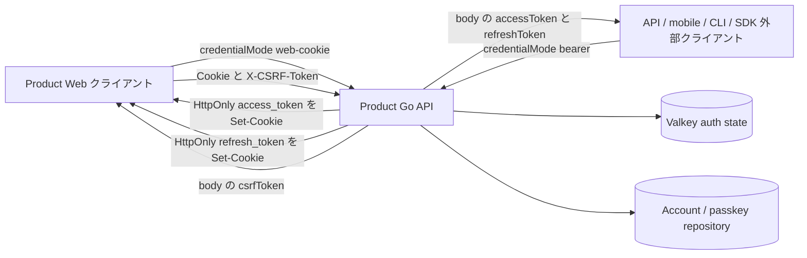
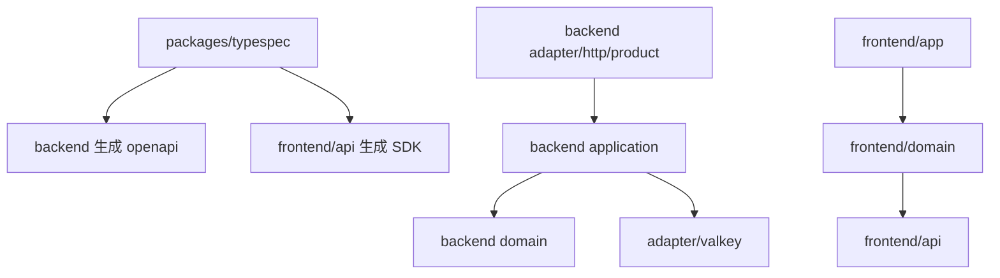
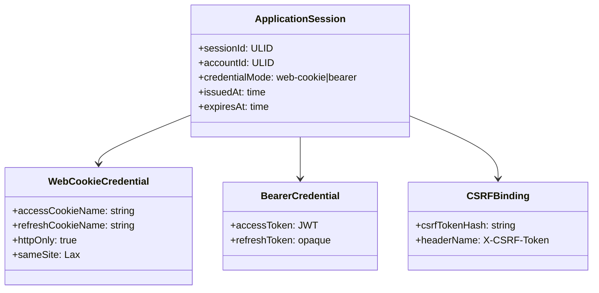
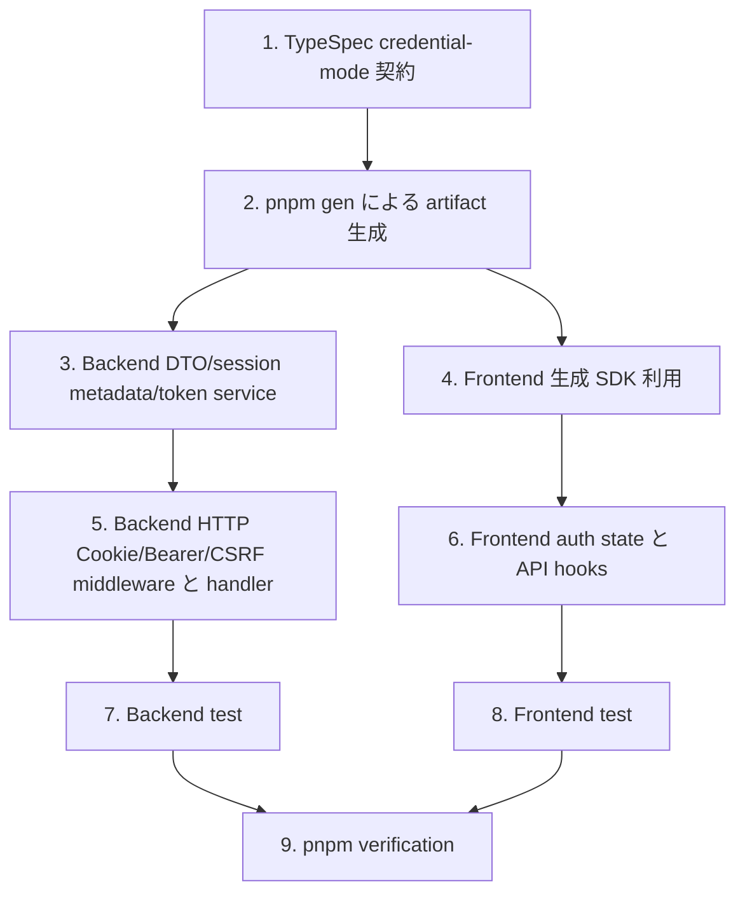

## Scope

### In Scope

- `auth-be` の Product session 発行・更新・保護 route 認可を `credentialMode="web-cookie"` と `credentialMode="bearer"` に分離する。
- Product Web 用に HttpOnly access Cookie と HttpOnly refresh Cookie を発行し、CSRF token だけをブラウザーから読める memory state に渡す。
- API / mobile / CLI / SDK 用に Bearer accessToken と refreshToken を response body で返す明示 mode を維持する。
- Product 保護 route で Cookie credential と `Authorization: Bearer` credential の同時提示を拒否する。
- Cookie credential を使う state-changing request に Origin 検証と session-bound `X-CSRF-Token` 検証を追加する。
- `auth-fe` の Web auth state を accessToken memory state から Cookie + CSRF memory state へ移行する。
- TypeSpec source を更新し、OpenAPI / frontend SDK / Go bindings を `pnpm gen` で再生成する。
- Scenario ID `AUTH-BE-S060` / `AUTH-BE-S062` / `AUTH-BE-S063` / `AUTH-BE-S073` から `AUTH-BE-S077` と `AUTH-FE-S045` から `AUTH-FE-S054` を中心に backend / frontend test を追加・更新する。

### Out of Scope

- Admin auth の Cookie / CSRF 実装変更。Admin は既存の operator session / CSRF contract を維持する。
- 永続 DB schema の migration。CSRF binding は Product auth session metadata / Valkey auth state に閉じる。
- Product Web の複数 account switching UI。Product Web は 1 つの active Cookie session を扱う。
- Bearer クライアント用 UI。Bearer mode は API contract と backend behavior のみを提供する。

## Assumptions / Dependencies

- `packages/typespec/main.tsp` が API contract の source of truth であり、生成 artifact は `pnpm gen` で更新する。
- Product Web と Product API は same-origin credential request を使える。
- Product Web 認証 Cookie 名は `access_token` と `refresh_token` に統一する。`access_token` は protected `/api/v1/*` に送信され、`refresh_token` は auth refresh/logout に必要な path に限定する。
- CSRF token は session-bound opaque secret として発行し、hash を session metadata に保存する。
- Cookie auth の unsafe method は Origin header を必須にし、configured allowed origin と完全一致で検証する。
- 既存 Valkey session metadata に CSRF hash がない場合、その session は Cookie mutation を許可しない。互換 fallback は置かず、必要なら再ログインで新 session を発行する。
- `pnpm` script 経由の検証だけを使う。直接 `go test` / `tsc` / `vitest` / `svelte-check` は呼び出さない。

## Impacted Areas

- `packages/typespec`: credential mode request / response union、CSRF header、Cookie/Bearer session DTO を定義する。
- `packages/backend/internal/adapter/http/product`: Product auth middleware、Cookie helper、Origin / CSRF 検証、strict handler、test を更新する。
- `packages/backend/internal/application`: session result DTO、TokenService issue / refresh flow、CSRF token 生成 / 検証を更新する。
- `packages/backend/internal/adapter/valkey`: session metadata persistence に CSRF hash を含める。
- `packages/frontend/api`: 生成 SDK が credential mode の response union と CSRF field を反映する。
- `packages/frontend/domain`: auth session state、login/recovery/passkey/account/session API を Cookie + CSRF request に変更する。
- `packages/frontend/app`: route test / mock / bootstrap flow を Cookie session 前提に更新する。
- セキュリティ・運用: Cookie attributes、CORS allowed headers、Origin comparison、no-store response、secret logging boundary を確認する。

## Directory Tree

```text
packages
├─ typespec
│  ├─ src/models/auth.tsp
│  ├─ src/routes/v1/auth.tsp
│  ├─ openapi/openapi.json
│  └─ generated/**
├─ backend
│  └─ internal
│     ├─ adapter/http/product/auth.go
│     ├─ adapter/http/product/router.go
│     ├─ adapter/http/product/router_test.go
│     ├─ adapter/valkey/session_store.go
│     ├─ application/auth_contracts.go
│     ├─ application/auth_service.go
│     ├─ application/auth_service_test.go
│     ├─ application/token_service.go
│     ├─ application/token_service_test.go
│     └─ generated/openapi/openapi.gen.go
└─ frontend
   ├─ api/src/generated/client.ts
   ├─ domain/src/auth/types.ts
   ├─ domain/src/auth/passkey/login/hook.svelte.ts
   ├─ domain/src/auth/recovery/hook.svelte.ts
   ├─ domain/src/auth/passkey/management/hook.svelte.ts
   ├─ domain/src/auth/session/state.ts
   ├─ domain/src/auth/session/hook.svelte.ts
   ├─ domain/src/auth/session/hook.test.ts
   ├─ domain/src/auth/session/session_api.ts
   ├─ domain/src/account/hook.svelte.ts
   ├─ domain/src/account/localeSync.svelte.ts
   └─ app/src/tests/mocks/handlers.ts
```

## New / Changed Files

| Type   | File                                                                  | Change                                                                                                                    |
| ------ | --------------------------------------------------------------------- | ------------------------------------------------------------------------------------------------------------------------- |
| Update | `packages/typespec/src/models/auth.tsp`                               | `credentialMode`、Web Cookie session 応答、Bearer session 応答、CSRF token、refresh request / response DTO を定義する。   |
| Update | `packages/typespec/src/routes/v1/auth.tsp`                            | login/register/refresh/logout/protected mutation contract に mode と CSRF header を反映する。                             |
| Update | `packages/typespec/openapi/openapi.json`                              | Product OpenAPI 生成 artifact を更新する。                                                                                |
| Update | `packages/typespec/generated/**`                                      | frontend SDK input となる生成 artifact を更新する。                                                                       |
| Update | `packages/backend/internal/generated/openapi/openapi.gen.go`          | Product Go bindings を `pnpm gen` で更新する。                                                                            |
| Update | `packages/backend/internal/adapter/http/product/auth.go`              | Cookie/Bearer extraction、ambiguity rejection、Origin / CSRF middleware、context binding を追加する。                     |
| Update | `packages/backend/internal/adapter/http/product/router.go`            | session 発行 / 更新 / logout handler を credential mode 別 response と Cookie helper に変更する。                         |
| Update | `packages/backend/internal/adapter/http/product/router_test.go`       | Cookie login、Bearer login、CSRF failure、Cookie/Bearer ambiguity、refresh rotation を固定する endpoint test を追加する。 |
| Update | `packages/backend/internal/application/auth_contracts.go`             | AuthSession DTO に credential mode、CSRF token、Bearer refresh token body の表現を追加する。                              |
| Update | `packages/backend/internal/application/auth_service.go`               | passkey finish/register/logout authorization が credential mode を application result に反映できるようにする。            |
| Update | `packages/backend/internal/application/token_service.go`              | issue/refresh 時に session-bound CSRF token を生成・hash 保存し、Cookie/Bearer refresh 経路を分ける。                     |
| Update | `packages/backend/internal/application/*_test.go`                     | TokenService/AuthService の CSRF binding と mode 別 result を検証する。                                                   |
| Update | `packages/backend/internal/adapter/valkey/session_store.go`           | SessionMetadata JSON に CSRF hash を含める。                                                                              |
| Update | `packages/frontend/api/src/generated/client.ts`                       | 生成 SDK に credential mode DTO と response union を反映する。                                                            |
| Update | `packages/frontend/domain/src/auth/types.ts`                          | accessToken を session summary から外し、CSRF token と session metadata を保持する型へ変更する。                          |
| Update | `packages/frontend/domain/src/auth/session/state.ts`                  | Authorization header 生成をやめ、Cookie request init / CSRF header 生成へ変更する。                                       |
| Update | `packages/frontend/domain/src/auth/session/hook.svelte.ts`            | bootstrap refresh、session-expired retry、logout、device/session calls を Cookie + CSRF flow に変更する。                 |
| Update | `packages/frontend/domain/src/auth/session/session_api.ts`            | session management API を same-origin credentials + CSRF header で呼び出す。                                              |
| Update | `packages/frontend/domain/src/auth/passkey/login/hook.svelte.ts`      | passkey finish request に `credentialMode="web-cookie"` を付け、body token を読まない。                                   |
| Update | `packages/frontend/domain/src/auth/recovery/hook.svelte.ts`           | recovery register request に `credentialMode="web-cookie"` を付け、CSRF token を受け取る。                                |
| Update | `packages/frontend/domain/src/auth/passkey/management/hook.svelte.ts` | passkey management mutation に CSRF header を付ける。                                                                     |
| Update | `packages/frontend/domain/src/account/hook.svelte.ts`                 | AccountSetting API を Cookie + CSRF request contract に変更する。                                                         |
| Update | `packages/frontend/domain/src/account/localeSync.svelte.ts`           | locale load/update を Authorization header 依存から Cookie + CSRF に変更する。                                            |
| Update | `packages/frontend/domain/src/auth/session/hook.test.ts`              | Cookie bootstrap / CSRF / accessToken 非保存 / retry behavior test に更新する。                                           |
| Update | `packages/frontend/app/src/tests/mocks/handlers.ts`                   | MSW mock を Web Cookie mode の応答形に更新する。                                                                          |

## System Diagram



## Package Diagram



## Sequence Diagram

```mermaid
sequenceDiagram
  participant W as Product Web
  participant API as Product API
  participant S as セッションストア
  W->>API: POST /api/v1/auth/passkey/finish { credentialMode: "web-cookie" }
  API->>S: session metadata + refresh hash + csrf hash を保存
  API-->>W: Set-Cookie access_token; Set-Cookie refresh_token; { csrfToken, session metadata }
  W->>API: Cookie + X-CSRF-Token 付きで PATCH /api/v1/account/settings
  API->>S: access cookie + csrf hash を検証
  API-->>W: 200 no-store
  W->>API: refresh cookie 付きで POST /api/v1/auth/refresh { credentialMode: "web-cookie" }
  API->>S: refresh を原子的に rotation し、新しい csrf hash を保存
  API-->>W: rotation 後の Cookie と { csrfToken, session metadata, accountSetting }
```

## UI Wireframes

N/A。wireframe は未生成。UI 構造は既存の auth / app surface を維持し、変更対象は auth state と request credential behavior に限る。

## Domain Model Diagram



## ER Diagram

N/A。永続 DB schema は変更しない。CSRF binding は Valkey-backed session metadata に保存する。

## Package-Level Design

### Package List

| Package                                          | Purpose / Responsibility                                                | Public API                                     | Dependencies                                         |
| ------------------------------------------------ | ----------------------------------------------------------------------- | ---------------------------------------------- | ---------------------------------------------------- |
| `packages/typespec`                              | Product auth API 契約の正本                                             | TypeSpec model/route、生成 OpenAPI             | TypeSpec emitter、`pnpm gen` 経由の oapi-codegen     |
| `packages/backend/internal/adapter/http/product` | HTTP credential 抽出、Cookie/CSRF/Origin 境界、OpenAPI handler 対応付け | `NewRouter`、strict handler method、middleware | application auth/token/session service、生成 OpenAPI |
| `packages/backend/internal/application`          | session 発行 / 更新 / logout、CSRF binding、account/session 検証        | `AuthService`、`TokenService`、DTO             | domain auth、session/refresh store                   |
| `packages/backend/internal/adapter/valkey`       | session metadata / refresh token 永続化                                 | `SessionStore`、`RefreshTokenStore`            | Valkey client                                        |
| `packages/frontend/api`                          | 生成 Product API SDK                                                    | 生成 client function/type                      | TypeSpec 生成 output                                 |
| `packages/frontend/domain`                       | Web 認証 session state と API 呼び出し調整                              | auth/session/passkey/account hook              | frontend/api                                         |
| `packages/frontend/app`                          | App bootstrap と route-level test/mock                                  | SvelteKit route/test                           | frontend/domain                                      |

### Details

#### packages/typespec

- Purpose / Responsibility: Product auth 契約で mode を明示し、Web Cookie response と Bearer response を型で分ける。
- Public API: `AuthCredentialMode`、`WebCookieSessionResponse`、`BearerSessionResponse`、`RefreshTokenRequest`、`RefreshTokenResponse`、`X-CSRF-Token` parameter 群。
- Key Data Structures: `credentialMode: "web-cookie" | "bearer"`、`csrfToken`、session metadata、Bearer mode の accessToken / refreshToken。
- Key Flows: login/register/refresh は request mode によって response union を返す。
- Dependencies: 生成 OpenAPI / SDK / Go bindings。
- Error Handling: credential の曖昧さ・欠落は `AuthFailureResponse` に正規化する。
- Testing Strategy: `pnpm check:codegen` で生成物の drift を検出する。
- Non-Functional: no-store header を契約上維持する。
- Performance: 契約 shape の変更だけなので追加 network hop はない。
- Security: Web Cookie mode では token body 露出を禁止する。

#### packages/backend/internal/adapter/http/product

- Purpose / Responsibility: HTTP request から credential source を exactly one として抽出し、CSRF/Origin を handler 前に検証する。
- Public API: `NewRouter`、`appAuthMiddleware`、strict server handler。
- Key Data Structures: credential source enum、Product auth context、Cookie option、CSRF header value。
- Key Flows: request credential 抽出 -> ambiguity 検査 -> session 認可 -> 必要時の CSRF 検証 -> handler context binding。
- Dependencies: `application.AuthService`、`application.TokenService`、生成 `openapi` type。
- Error Handling: missing credential は `unauthenticated`、expired/revoked は `session-expired`、suspended は `account-suspended`、internal は `internal-error`。
- Testing Strategy: `AUTH-BE-S060` / `AUTH-BE-S074` / `AUTH-BE-S075` / `AUTH-BE-S076` / `AUTH-BE-S077` を router test で固定する。
- Non-Functional: すべての auth/protected response は `Cache-Control: no-store` を維持する。
- Performance: Cookie/JWT verification は request ごとに一定量で、CSRF hash compare は local session metadata 検査に閉じる。
- Security: ambiguous credentials、invalid Origin、missing CSRF、nil dependencies は fail-close する。

#### packages/backend/internal/application

- Purpose / Responsibility: session credential を mode 別に発行・refresh・revoke し、CSRF binding を session lifecycle と合わせる。
- Public API: `AuthService.FinishPasskeyAuthentication`、`AuthService.RegisterPasskey`、`AuthService.AuthorizeSession`、`TokenService.Issue`、`TokenService.RefreshWithAccountID`。
- Key Data Structures: `AuthSession`、`SessionMetadata`、`RefreshTokenRecord`、CSRF token/hash。
- Key Flows: session 発行 -> access credential 生成 -> refresh credential 生成 -> Web Cookie mode 用 CSRF token 生成 -> metadata/hash 保存 -> mode 別 result 返却。
- Dependencies: domain token signing、session store、refresh token store、account repository。
- Error Handling: store unavailable と generation failure は `ErrInternalError` を返し、token theft detection は refresh family を revoke する。
- Testing Strategy: mode 別 issue/refresh と CSRF hash persistence を unit test で検証する。
- Non-Functional: plaintext refresh token または CSRF hash を log/trace に出さない。
- Performance: crypto random generation と HMAC/SHA hashing は issue/refresh ごとの有界処理に留める。
- Security: CSRF token は opaque とし、保存時は hash-only、validation path では constant-time compare を使う。

#### packages/frontend/domain

- Purpose / Responsibility: Product Web の認証状態を session metadata + CSRF token に限定し、すべての API call を same-origin credential request にする。
- Public API: `useAuthSession`、passkey login/recovery/management hooks、account hooks。
- Key Data Structures: accessToken を持たない `AuthSessionSummary`、`csrfToken`、route intent、AccountSetting snapshot。
- Key Flows: bootstrap refresh -> session metadata 受け入れ -> credential + CSRF 付き API call -> session-expired 時に refresh を 1 回実行 -> retry または route intent 更新。
- Dependencies: 生成 frontend API SDK。
- Error Handling: `unauthenticated` -> `/login`、`session-expired` -> refresh を 1 回試行してから `/session-expired`、`account-suspended` -> `/account-suspended`。
- Testing Strategy: `AUTH-FE-S051` / `AUTH-FE-S047` / `AUTH-FE-S054` と既存の session expiry scenario を Vitest で検証する。
- Non-Functional: persistent storage、telemetry、console、URL に secret を残さない。
- Performance: bootstrap 時の refresh は 1 回、expired operation ごとの refresh/retry は最大 1 回に制限する。
- Security: Product Web では `Authorization` header を生成せず、Cookie value を JavaScript から読まない。

## Implementation Plan



## Test Plan

### User Acceptance Test (Manual)

| UAT ID              | Related Requirement                       | Spec Summary                                                | Customer Problem Summary                         | Steps                                                                   | Expected Behavior                                                                               |
| ------------------- | ----------------------------------------- | ----------------------------------------------------------- | ------------------------------------------------ | ----------------------------------------------------------------------- | ----------------------------------------------------------------------------------------------- |
| UAT-AUTH-FE-HAP-001 | AUTH-FE-R001 低強調のパスキーログイン導線 | Web login は Cookie session と CSRF token を受け入れる      | 利用者は token 露出なしでログインしたい          | `/login` で passkey login を完了し、devtools Network/Storage を確認する | response body に accessToken/refreshToken がなく、HttpOnly Cookie と CSRF token で app に入れる |
| UAT-AUTH-FE-SEC-002 | AUTH-FE-R003 認証 UI secret leakage       | Web auth state は bearer token と Cookie value を保存しない | XSS や debug UI から credential を漏らしたくない | login 後に localStorage/sessionStorage/app state を確認する             | bearer token、refreshToken、Cookie value が保存されていない                                     |
| UAT-AUTH-FE-ERR-003 | AUTH-FE-R004 session expiry と logout     | session-expired と missing session を区別する               | 利用者が未ログインと期限切れを混同したくない     | Cookie なし初回アクセス、期限切れ Cookie、logout をそれぞれ実行する     | missing は login、expired は refresh 失敗後 session-expired、logout は public/login へ戻る      |

### E2E Test (Playwright)

| E2E ID              | Playwright Test Name                                                                    | Related Scenario | Category | Summary                                                  | Steps (Playwright)                                                            | Expected Behavior                                                  |
| ------------------- | --------------------------------------------------------------------------------------- | ---------------- | -------- | -------------------------------------------------------- | ----------------------------------------------------------------------------- | ------------------------------------------------------------------ |
| E2E-AUTH-FE-HAP-001 | `[AUTH-FE-S051] Web login は bearer token なしで Cookie session を保持する`             | AUTH-FE-S051     | HAP      | passkey login response を Web Cookie mode として処理する | passkey flow を mock -> finish が Set-Cookie + csrfToken を返す -> app へ遷移 | app が authenticated になり、Authorization header が生成されない   |
| E2E-AUTH-FE-HAP-002 | `[AUTH-FE-S047] Bootstrap refresh は Cookie session を復元する`                         | AUTH-FE-S047     | HAP      | refresh cookie から app session を復元する               | refresh cookie を設定 -> app route を開く -> refresh 200 を intercept         | app が AccountSetting snapshot 付き authenticated state を表示する |
| E2E-AUTH-FE-ERR-003 | `[AUTH-FE-S006] 期限切れ Cookie session は refresh 失敗後に session-expired へ遷移する` | AUTH-FE-S006     | ERR      | expired session と missing session を区別する            | protected API が session-expired を返す -> refresh も session-expired を返す  | route intent が `/session-expired` になる                          |

### Integration Test (Endpoint)

| IT ID              | Test Name                                                                 | Genre | Category | Summary                                                      | Steps (Test)                                               | Expected Behavior                                                                                      |
| ------------------ | ------------------------------------------------------------------------- | ----- | -------- | ------------------------------------------------------------ | ---------------------------------------------------------- | ------------------------------------------------------------------------------------------------------ |
| IT-AUTH-BE-HAP-001 | `[AUTH-BE-S060] Web Cookie login は body token を返さない`                | be    | HAP      | Web Cookie mode login の応答形                               | `credentialMode=web-cookie` で passkey auth を完了         | access/refresh Cookie が Set-Cookie され、body は csrfToken を持ち accessToken/refreshToken を持たない |
| IT-AUTH-BE-HAP-002 | `[AUTH-BE-S001] Bearer login は token body を返す`                        | be    | HAP      | Bearer mode が外部クライアント向けに利用可能であることを保つ | `credentialMode=bearer` で passkey auth を finish          | body が accessToken/refreshToken を持ち、Product auth Set-Cookie はない                                |
| IT-AUTH-BE-SEC-003 | `[AUTH-BE-S075] Cookie mutation は CSRF を要求する`                       | be    | SEC      | Cookie mutation を CSRF で保護する                           | valid Cookie PATCH を `X-CSRF-Token` なしで送信            | handler mutation 前に 403/401 failure になる                                                           |
| IT-AUTH-BE-SEC-004 | `[AUTH-BE-S076] Cookie と Bearer の ambiguity は拒否される`               | be    | SEC      | exactly-one credential source                                | valid Cookie と valid Bearer を protected route に同時送信 | failure response になり、session は選択されない                                                        |
| IT-AUTH-BE-HAP-005 | `[AUTH-BE-S062] Web Cookie refresh は Cookie credential を rotation する` | be    | HAP      | refresh が Cookie credential と CSRF を rotation する        | refresh Cookie 付きで `credentialMode=web-cookie` を送信   | old refresh が consumed になり、新 Cookie と csrfToken が返る                                          |

### Unit/Component Test (UT)

| UT ID              | Test Name                                                                         | Package              | Category | Summary                                        | Steps (Test)                                                   | Expected Behavior                                                        |
| ------------------ | --------------------------------------------------------------------------------- | -------------------- | -------- | ---------------------------------------------- | -------------------------------------------------------------- | ------------------------------------------------------------------------ |
| UT-AUTH-BE-SEC-001 | `[AUTH-BE-S076] Product credential extraction は Cookie と Bearer を同時拒否する` | backend/product http | SEC      | extraction helper が ambiguity を検出する      | request headers/cookies を用意 -> middleware/helper を呼び出す | next を呼ばずに ambiguity failure を返す                                 |
| UT-AUTH-BE-HAP-002 | `[AUTH-BE-S060] TokenService は Web Cookie mode の CSRF binding を発行する`       | backend/application  | HAP      | CSRF hash を session metadata に永続化する     | web-cookie session を issue                                    | plaintext csrf は一度だけ返り、hash は metadata に保存される             |
| UT-AUTH-FE-SEC-003 | `[AUTH-FE-S054] Auth state は bearer と Cookie value を含めない`                  | frontend/domain      | SEC      | session state は metadata と CSRF のみ保持する | Web Cookie session 応答を受け入れる                            | state は csrfToken/session metadata を持ち、accessToken field を持たない |
| UT-AUTH-FE-HAP-004 | `[AUTH-FE-S047] Bootstrap refresh は AccountSetting snapshot を反映する`          | frontend/domain      | HAP      | refresh success で app state を復元する        | csrfToken/accountSetting 付き refresh 200 を mock              | authenticated state と locale snapshot が更新される                      |
| UT-AUTH-FE-ERR-005 | `[AUTH-FE-S045] 期限切れ API call は refresh を 1 回実行して retry する`          | frontend/domain      | ERR      | session-expired retry behavior                 | protected call が session-expired を返し、refresh は成功する   | 元の call が更新後 CSRF で 1 回だけ retry される                         |

## Rollback / Migration

- 永続 DB migration は不要。
- Valkey session metadata の shape が変わるため、CSRF hash を持たない Cookie session は mutation 認可で fail-close する。互換 fallback は実装しない。
- ロールバックは application deployment を前の revision へ戻し、Product auth cookies を clear して再ログインを促す。
- Generated artifacts は TypeSpec source と同じ commit で戻す。
- Bearer 外部クライアントは `credentialMode="bearer"` の明示 contract を使う。body token を暗黙的に返す旧 contract は維持しない。

## Release Procedure

- `pnpm gen` を実行し、OpenAPI / SDK / Go bindings を更新する。
- `pnpm check:codegen` で generated drift がないことを確認する。
- `pnpm lint` を実行する。
- `pnpm check` を実行する。
- `pnpm test:server` を実行する。
- `pnpm test:client` を実行する。
- 必要に応じて `pnpm test:e2e` を実行し、Web login / refresh / logout の browser behavior を確認する。
- Deploy 後、Web login、bootstrap refresh、protected mutation、logout、Bearer login/refresh を smoke test する。

## Acceptance Criteria

- Web Cookie mode の login/register/refresh response body に accessToken / refreshToken 平文が含まれない。
- Bearer mode の login/register/refresh response body に accessToken / refreshToken が含まれ、Product auth Cookie が設定されない。
- Product protected route は Cookie と Bearer の同時提示を拒否する。
- Cookie state-changing request は valid Origin と session-bound CSRF token なしでは mutation へ到達しない。
- Frontend domain state から accessToken が消え、CSRF token と session metadata だけで authenticated state を表現する。
- Bootstrap refresh 成功で session が復元され、missing session は `/session-expired` ではなく login 導線へ正規化される。
- `pnpm check:codegen`、`pnpm lint`、`pnpm check`、`pnpm test:server`、`pnpm test:client` が成功する。

## Open Issues

N/A。credential mode は `web-cookie` / `bearer` で確定済み。Cookie/Bearer 同時提示は fail-close で拒否する。
