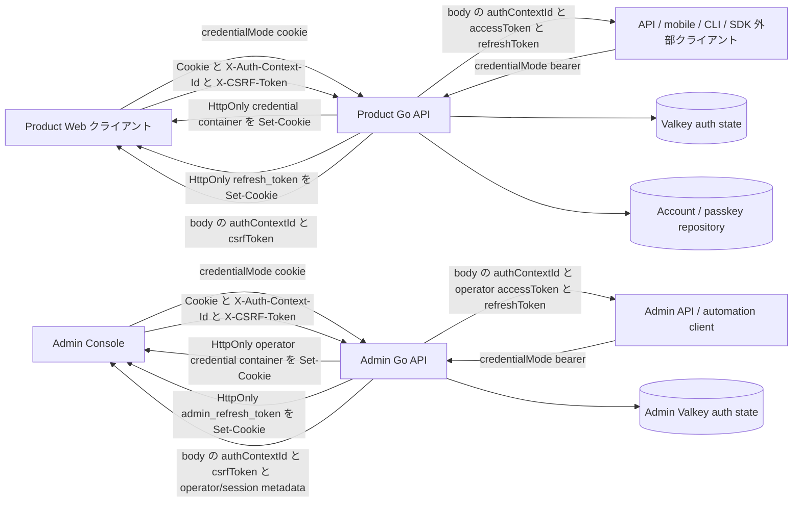
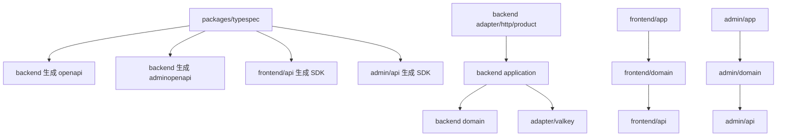
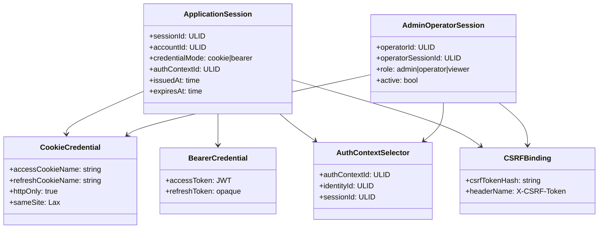
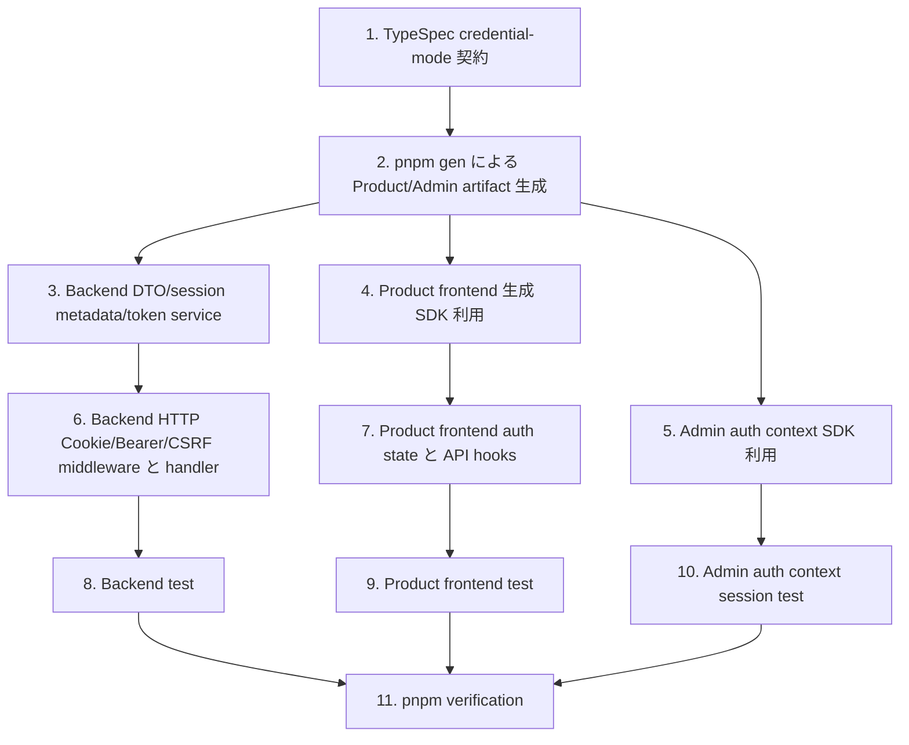

## Scope

### In Scope

- `auth-be` の Product session 発行・更新・保護 route 認可を `credentialMode="cookie"` と `credentialMode="bearer"` に分離する。
- `admin-auth-be` の Admin operator session 発行・更新・保護 route 認可も `credentialMode="cookie"` と `credentialMode="bearer"` に分離する。
- Product Web 用に HttpOnly credential container Cookie と HttpOnly refresh Cookie を発行し、CSRF token、active auth context metadata、switchable auth contexts だけをブラウザーから読める memory state に渡す。
- Admin Console 用に HttpOnly operator credential container Cookie と HttpOnly operator refresh Cookie を発行し、CSRF token、active operator auth context metadata、switchable operator auth contexts だけをブラウザーから読める memory state に渡す。
- Product API / mobile / CLI / SDK 用に Bearer accessToken と refreshToken を response body で返す明示 mode を維持する。
- Admin API / automation client 用に Bearer operator accessToken と refreshToken を response body で返す明示 mode を追加する。
- Product 保護 route で Cookie credential と `Authorization: Bearer` credential の同時提示を拒否する。
- Admin 保護 route で Cookie credential と `Authorization: Bearer` credential の同時提示を拒否する。
- Product/Admin protected route は Cookie / Bearer のどちらの credential transport でも server-issued `X-Auth-Context-Id` を auth context selector として受け取り、credential がその selector を利用できる場合だけ account/session または operator/session context を束縛する。
- Cookie credential を使う state-changing request に Origin 検証と session-bound `X-CSRF-Token` 検証を追加する。
- `auth-fe` の Web auth state を accessToken memory state から Cookie + `X-Auth-Context-Id` + CSRF memory state へ移行する。
- `admin-auth-fe` の Admin auth state を operator accessToken memory state から Cookie + `X-Auth-Context-Id` + CSRF memory state へ移行する。
- TypeSpec source を更新し、OpenAPI / frontend SDK / Go bindings を `pnpm gen` で再生成する。
- Scenario ID `AUTH-BE-S060` / `AUTH-BE-S062` / `AUTH-BE-S063` / `AUTH-BE-S073` から `AUTH-BE-S077`、`AUTH-FE-S045` から `AUTH-FE-S054`、`ADMIN-AUTH-BE-S056` から `ADMIN-AUTH-BE-S074`、`ADMIN-AUTH-FE-S027` から `ADMIN-AUTH-FE-S037`、`ADMIN-CONSOLE-BE-S056` から `ADMIN-CONSOLE-BE-S058`、`ADMIN-CONSOLE-BE-S068`、`ADMIN-CONSOLE-BE-S069` を中心に backend / frontend / admin test を追加・更新する。

### Out of Scope

- 永続 DB schema の migration。CSRF binding は Product / Admin auth session metadata と Valkey auth state に閉じる。
- Bearer クライアント用 UI。Bearer mode は API contract と backend behavior のみを提供する。
- Admin 外部 Bearer client 用 UI。Bearer mode は API contract と backend behavior のみを提供する。

## Assumptions / Dependencies

- `packages/typespec/main.tsp` が API contract の source of truth であり、生成 artifact は `pnpm gen` で更新する。
- Product Web と Product API、Admin Console と Admin API はそれぞれの origin で same-origin credential request を使える。
- Product Web 認証 Cookie 名は `access_token` と `refresh_token` に統一する。`access_token` は browser credential container を指し、protected `/api/v1/*` に送信され、`refresh_token` は auth refresh/logout に必要な path に限定する。
- Admin Console 認証 Cookie 名は `admin_access_token` と `admin_refresh_token` に統一する。`admin_access_token` は operator credential container を指し、Admin origin の protected `/api/v1/*` に送信され、`admin_refresh_token` は Admin auth refresh/logout に必要な path に限定する。
- CSRF token は session-bound opaque secret として発行し、hash を session metadata に保存する。
- `X-Auth-Context-Id` は server-issued opaque ULID selector とし、Cookie transport では credential container の auth context registry、Bearer transport では token の account/session または operator/session claims と照合する。
- Cookie auth の unsafe method は Origin header を必須にし、configured allowed origin と完全一致で検証する。
- 既存 Valkey session metadata に CSRF hash がない場合、その session は Cookie mutation を許可しない。互換 fallback は置かず、必要なら再ログインで新 session を発行する。
- `pnpm` script 経由の検証だけを使う。直接 `go test` / `tsc` / `vitest` / `svelte-check` は呼び出さない。

## Impacted Areas

- `packages/typespec`: Product/Admin credential mode request / response union、auth context selector、Cookie session response、Bearer session response、CSRF header、Cookie/Bearer security scheme を定義する。
- `packages/backend/internal/adapter/http/product`: Product auth middleware、Cookie helper、Origin / CSRF 検証、strict handler、test を更新する。
- `packages/backend/internal/adapter/http/admin`: Admin auth middleware、Cookie/Bearer credential helper、`X-Auth-Context-Id` selector、Origin / CSRF 検証、strict handler、test を operator auth context session に更新する。
- `packages/backend/internal/application`: session result DTO、TokenService issue / refresh flow、auth context selector、CSRF token 生成 / 検証を更新する。
- `packages/backend/internal/adapter/valkey`: session metadata persistence に CSRF hash と Product/Admin auth context registry を含める。
- `packages/frontend/api`: 生成 SDK が credential mode の response union と CSRF field を反映する。
- `packages/frontend/domain`: auth session state、login/recovery/passkey/account/session API を Cookie + `X-Auth-Context-Id` + CSRF request に変更する。
- `packages/frontend/app`: route test / mock / bootstrap flow を Cookie session 前提に更新する。
- `packages/typespec/openapi/admin.openapi.json`: Admin OpenAPI が Admin Cookie/Bearer session response、Cookie/Bearer auth security、`X-Auth-Context-Id`、CSRF header、Admin origin `/api/v1/*` を反映する。
- `packages/admin/api`: 生成 Admin SDK が same-origin credentials + `X-Auth-Context-Id` + CSRF request と Bearer request を提供し、Admin Console domain では Authorization header helper と browser-readable operator accessToken 型を使わせない。
- `packages/backend/internal/generated/adminopenapi`: 生成 Admin Go bindings が Admin Cookie session response と Cookie auth security を反映する。
- `packages/admin/domain`: Admin Console domain が `@www-template/admin-api` 経由で active operator auth context metadata と CSRF token だけを扱い、operator accessToken、Product SDK、raw fetch、Product domain に依存しないよう更新する。
- `packages/admin/app`: Admin app が Admin domain を API 境界として使い、browser-readable operator accessToken、`@www-template/admin-api` 直 import、`@www-template/api`、`/api/admin/*`、package-local BFF route を使わないよう更新する。
- セキュリティ・運用: Cookie attributes、CORS allowed headers、Origin comparison、no-store response、secret logging boundary を確認する。

## Directory Tree

```text
packages
├─ typespec
│  ├─ .spectral.yaml
│  ├─ scripts/check-surface-boundaries.mjs
│  ├─ spectral/app-security.js
│  ├─ spectral/bearer-scheme.js
│  ├─ spectral/path-policy.js
│  ├─ src/models/admin.tsp
│  ├─ src/models/auth.tsp
│  ├─ src/routes/admin-v1/accounts.tsp
│  ├─ src/routes/admin-v1/auth.tsp
│  ├─ src/routes/v1/account_settings.tsp
│  ├─ src/routes/v1/auth.tsp
│  ├─ openapi/openapi.json
│  └─ openapi/admin.openapi.json
├─ backend
│  └─ internal
│     ├─ adapter/http/admin/auth.go
│     ├─ adapter/http/admin/router.go
│     ├─ adapter/http/admin/router_test.go
│     ├─ adapter/http/admin/session_validator.go
│     ├─ adapter/http/product/auth.go
│     ├─ adapter/http/product/auth_test.go
│     ├─ adapter/http/product/router.go
│     ├─ adapter/http/product/router_test.go
│     ├─ adapter/valkey/auth_state_repository_test.go
│     ├─ adapter/valkey/session_store.go
│     ├─ adapter/valkey/store_test.go
│     ├─ application/admin/account_creation_service.go
│     ├─ application/admin/account_creation_service_test.go
│     ├─ application/admin/auth/authorization.go
│     ├─ application/admin/auth/authorization_test.go
│     ├─ application/admin/auth/payload.go
│     ├─ application/admin/auth/service.go
│     ├─ application/admin/auth/service_test.go
│     ├─ application/admin/auth/types.go
│     ├─ application/auth_contracts.go
│     ├─ application/auth_service.go
│     ├─ application/auth_service_test.go
│     ├─ application/product_admin_auth_boundary_test.go
│     ├─ application/session_service_test.go
│     ├─ application/token_service.go
│     ├─ application/token_service_test.go
│     ├─ generated/adminopenapi/openapi.gen.go
│     ├─ generated/openapi/openapi.gen.go
│     ├─ platform/config/types.go
│     └─ platform/config/types_test.go
├─ frontend
│  ├─ api/src/generated/client.ts
│  ├─ domain/src/auth/types.ts
│  ├─ domain/src/auth/passkey/hook.svelte.ts
│  ├─ domain/src/auth/recovery/hook.svelte.ts
│  ├─ domain/src/auth/passkey/management/hook.svelte.ts
│  ├─ domain/src/auth/passkey/management/state.ts
│  ├─ domain/src/auth/passkey/management/state.test.ts
│  ├─ domain/src/auth/session/state.ts
│  ├─ domain/src/auth/session/state.test.ts
│  ├─ domain/src/auth/session/hook.svelte.ts
│  ├─ domain/src/auth/session/hook.test.ts
│  ├─ domain/src/auth/session/session_api.ts
│  ├─ domain/src/auth/session/token_state.ts
│  ├─ domain/src/auth/session/token_state.test.ts
│  ├─ domain/src/account/hook.svelte.ts
│  ├─ domain/src/account/hook.test.ts
│  ├─ domain/src/account/localeSync.svelte.ts
│  ├─ app/src/tests/components/DeviceManager.test.ts
│  ├─ app/src/tests/components/PasskeyList.test.ts
│  ├─ app/src/tests/hooks/usePasskeyManagement.test.ts
│  ├─ app/src/tests/mocks/handlers.ts
│  ├─ app/src/tests/mocks/server.ts
│  ├─ app/src/tests/routes/login-page.test.ts
│  └─ app/src/tests/routes/settings-page.test.ts
└─ admin
   ├─ api/src/client.ts
   ├─ api/src/client.test.ts
   ├─ api/src/generated/client.ts
   ├─ api/src/index.ts
   ├─ domain/src/accounts.ts
   ├─ domain/src/accounts.test.ts
   ├─ domain/src/auth.ts
   ├─ domain/src/auth.test.ts
   ├─ domain/src/hooks/index.ts
   ├─ domain/src/hooks/useAdminAccounts.svelte.ts
   ├─ domain/src/hooks/useAdminInitialSetup.svelte.ts
   ├─ domain/src/hooks/useAdminLogin.svelte.ts
   ├─ domain/src/hooks/useAdminOperatorSetup.svelte.ts
   ├─ domain/src/hooks/useAdminOperators.svelte.ts
   ├─ domain/src/hooks/useAdminSession.svelte.ts
   ├─ domain/src/index.ts
   ├─ domain/src/operators.ts
   ├─ app/src/routes/+layout.svelte
   ├─ app/src/routes/accounts/+page.svelte
   ├─ app/src/routes/accounts/[id]/+page.svelte
   ├─ app/src/routes/login/+page.svelte
   ├─ app/src/routes/operator-setup/+page.svelte
   ├─ app/src/routes/passkeys/+page.svelte
   ├─ app/src/routes/settings/operators/+page.svelte
   ├─ app/src/routes/setup/+page.svelte
   └─ app/src/routes/static-client-cleanup.test.ts
```

## New / Changed Files

| Type   | File                                                                           | Change                                                                                                                                                                                 |
| ------ | ------------------------------------------------------------------------------ | -------------------------------------------------------------------------------------------------------------------------------------------------------------------------------------- |
| Update | `packages/typespec/src/models/auth.tsp`                                        | Product `credentialMode`、Cookie session response、Bearer session response、`authContextId`、switchable auth contexts、CSRF token、mode 別 refresh DTO を定義する。                    |
| Update | `packages/typespec/src/models/admin.tsp`                                       | Admin `credentialMode`、Cookie session response、Bearer session response、operator `authContextId`、switchable operator contexts、CSRF token を定義する。                              |
| Update | `packages/typespec/src/routes/v1/auth.tsp`                                     | Product passkey finish、recovery register、refresh、logout、passkey/session operation に `credentialMode`、`X-Auth-Context-Id`、CSRF header を反映する。                               |
| Update | `packages/typespec/src/routes/v1/account_settings.tsp`                         | AccountSetting read/update を Cookie/Bearer exactly-one credential、`X-Auth-Context-Id`、Cookie mode CSRF header に合わせる。                                                          |
| Update | `packages/typespec/src/routes/admin-v1/auth.tsp`                               | Admin login/setup/operator-setup/current/refresh/logout/passkey/operator routes を Cookie/Bearer credential + `X-Auth-Context-Id` + CSRF contract に変更する。                         |
| Update | `packages/typespec/src/routes/admin-v1/accounts.tsp`                           | Admin account list/detail/create を Admin Cookie/Bearer credential + `X-Auth-Context-Id` + CSRF contract に変更し、Product bearer を認可材料にしない。                                 |
| Update | `packages/typespec/.spectral.yaml`                                             | Product BearerAuth と Product/Admin CookieAuth の security rule 適用範囲を宣言する。                                                                                                   |
| Update | `packages/typespec/spectral/app-security.js`                                   | Product external Bearer route と Cookie session route の security 許可条件を分離する。                                                                                                 |
| Update | `packages/typespec/spectral/bearer-scheme.js`                                  | Product BearerAuth scheme を維持し、Admin CookieAuth 追加で bearer scheme check が誤検出しないよう固定する。                                                                           |
| Update | `packages/typespec/spectral/path-policy.js`                                    | Product/Admin とも `/api/v1/*` のまま、`/api/admin/*` を許可しないことを維持する。                                                                                                     |
| Update | `packages/typespec/scripts/check-surface-boundaries.mjs`                       | Product OpenAPI と Admin OpenAPI の operation/tag/security scheme contamination を検出する。                                                                                           |
| Update | `packages/typespec/openapi/openapi.json`                                       | `pnpm gen` で Product OpenAPI に Product Cookie/Bearer mode、`X-Auth-Context-Id`、CSRF header を反映する。                                                                             |
| Update | `packages/typespec/openapi/admin.openapi.json`                                 | `pnpm gen` で Admin OpenAPI に Admin Cookie/Bearer mode、`X-Auth-Context-Id`、CSRF header、Console cookie response の no body accessToken を反映する。                                 |
| Update | `packages/backend/internal/generated/openapi/openapi.gen.go`                   | `pnpm gen` で Product Go bindings を Product contract に同期する。                                                                                                                     |
| Update | `packages/backend/internal/generated/adminopenapi/openapi.gen.go`              | `pnpm gen` で Admin Go bindings を Admin Cookie/Bearer auth context contract に同期する。                                                                                              |
| Update | `packages/backend/internal/application/auth_contracts.go`                      | Product mode 別 session result、auth context selector、CSRF token output、Bearer body token output、session metadata CSRF hash を表現する。                                            |
| Update | `packages/backend/internal/application/token_service.go`                       | Product Cookie mode と Bearer mode の credential transport、auth context selector、refresh/CSRF 発行・rotation を分離する。                                                            |
| Update | `packages/backend/internal/application/auth_service.go`                        | Product passkey finish、recovery register、refresh、logout が request `credentialMode` を application result へ伝搬する。                                                              |
| Update | `packages/backend/internal/application/auth_service_test.go`                   | Product login/register/refresh が Cookie mode で body token を返さず、Bearer mode だけ body token を返すことを検証する。                                                               |
| Update | `packages/backend/internal/application/token_service_test.go`                  | Product Cookie mode の auth context / CSRF hash 保存、Bearer mode の body token、refresh theft detection を検証する。                                                                  |
| Update | `packages/backend/internal/application/session_service_test.go`                | session metadata に CSRF binding がない Cookie mutation を fail-close することを検証する。                                                                                             |
| Update | `packages/backend/internal/application/product_admin_auth_boundary_test.go`    | Product account auth と Admin operator auth が相互 import / shared switch に畳み込まれないことを検証する。                                                                             |
| Update | `packages/backend/internal/application/admin/auth/types.go`                    | Admin application DTO を Cookie/Bearer mode 別に分け、Cookie mode は authContextId、CSRF token、operator/session metadata、Bearer mode は operator accessToken / refreshToken を返す。 |
| Update | `packages/backend/internal/application/admin/auth/service.go`                  | Admin login/setup/operator-setup/refresh/logout/current/mutation validation を Admin credential + `X-Auth-Context-Id` + session record + CSRF に変更する。                             |
| Update | `packages/backend/internal/application/admin/auth/payload.go`                  | Admin credential Cookie payload、Admin Bearer payload、Product bearer payload の意味境界を分ける。                                                                                     |
| Update | `packages/backend/internal/application/admin/auth/authorization.go`            | RBAC input を検証済み operator context に限定し、Product bearer / browser-readable token を判定材料にしない。                                                                          |
| Update | `packages/backend/internal/application/admin/auth/service_test.go`             | Admin Cookie mode response body に accessToken/refreshToken 平文が出ないこと、Bearer mode response body だけ token を返すこと、authContextId と CSRF が発行されることを検証する。      |
| Update | `packages/backend/internal/application/admin/auth/authorization_test.go`       | Admin RBAC が role/active/passkey registration state だけで決まり、Product auth credential を使わないことを検証する。                                                                  |
| Update | `packages/backend/internal/application/admin/account_creation_service.go`      | account creation が handler から渡された検証済み operator context と RBAC decision だけを監査・実行入力に使う。                                                                        |
| Update | `packages/backend/internal/application/admin/account_creation_service_test.go` | account creation が未認証/権限不足 context で副作用を起こさないことを検証する。                                                                                                        |
| Update | `packages/backend/internal/adapter/valkey/session_store.go`                    | Product/Admin session metadata JSON に CSRF hash、credential source discriminator、auth context registry を含める。                                                                    |
| Update | `packages/backend/internal/adapter/valkey/store_test.go`                       | session metadata の CSRF hash serialization / deserialization を検証する。                                                                                                             |
| Update | `packages/backend/internal/adapter/valkey/auth_state_repository_test.go`       | Product/Admin Valkey logical DB と key prefix が混在しないことを検証する。                                                                                                             |
| Update | `packages/backend/internal/platform/config/types.go`                           | Product/Admin Cookie name、path、Secure、SameSite、allowed origin、Valkey namespace validation を fail-close にする。                                                                  |
| Update | `packages/backend/internal/platform/config/types_test.go`                      | production insecure Cookie、Admin/Product Cookie domain mismatch、Valkey namespace collision を拒否することを検証する。                                                                |
| Update | `packages/backend/internal/adapter/http/product/auth.go`                       | Product request から Cookie credential または Bearer credential を exactly one として抽出し、`X-Auth-Context-Id` の所属、Origin/CSRF を検証する。                                      |
| Update | `packages/backend/internal/adapter/http/product/auth_test.go`                  | Product Cookie/Bearer ambiguity、missing CSRF、invalid Origin、Bearer-only success を検証する。                                                                                        |
| Update | `packages/backend/internal/adapter/http/product/router.go`                     | Product login/register/refresh/logout handler が mode 別 generated DTO、credential Cookie、refresh Cookie、clear Cookie を使う。                                                       |
| Update | `packages/backend/internal/adapter/http/product/router_test.go`                | Product Cookie login/refresh/logout、Bearer login、auth context selector、CSRF failure、Cookie/Bearer ambiguity を endpoint test で固定する。                                          |
| Update | `packages/backend/internal/adapter/http/admin/auth.go`                         | Admin request から Cookie credential または Bearer credential を exactly one として抽出し、`X-Auth-Context-Id` の operator 所属、Origin/CSRF を検証する。                              |
| Update | `packages/backend/internal/adapter/http/admin/session_validator.go`            | Admin credential payload、operator session record、auth context selector、CSRF binding、RBAC permission を application service へ渡す adapter にする。                                 |
| Update | `packages/backend/internal/adapter/http/admin/router.go`                       | Admin login/setup/operator-setup/refresh/logout handler が mode 別 generated DTO、Cookie command、Bearer body token response を使う。                                                  |
| Update | `packages/backend/internal/adapter/http/admin/router_test.go`                  | Admin Cookie/Bearer login/setup/refresh/logout/current/passkey/account mutation、auth context selector、credential ambiguity、CSRF failure を検証する。                                |
| Update | `packages/frontend/api/src/generated/client.ts`                                | `pnpm gen` で Product generated SDK に mode 別 DTO、Cookie response、CSRF field/header を反映する。                                                                                    |
| Update | `packages/frontend/domain/src/auth/types.ts`                                   | Product Web auth state から `accessToken` を削除し、`activeAuthContextId`、`authContexts`、account/session metadata、`csrfToken` だけを保持する。                                      |
| Update | `packages/frontend/domain/src/auth/session/state.ts`                           | `createAuthorizationHeaders` を削除し、same-origin credential request init、`X-Auth-Context-Id`、CSRF header helper に置き換える。                                                     |
| Update | `packages/frontend/domain/src/auth/session/token_state.ts`                     | bearer access token state 型を削除し、Product Cookie session metadata と auth context selector 型へ置換する。                                                                          |
| Update | `packages/frontend/domain/src/auth/session/hook.svelte.ts`                     | bootstrap refresh、session-expired retry、logout、device/session calls、auth context switching を Cookie + `X-Auth-Context-Id` + CSRF flow に変更する。                                |
| Update | `packages/frontend/domain/src/auth/session/session_api.ts`                     | session list/revoke/revoke-others API を same-origin credentials + `X-Auth-Context-Id` + CSRF header で呼び出す。                                                                      |
| Update | `packages/frontend/domain/src/auth/passkey/hook.svelte.ts`                     | passkey finish request に `credentialMode="cookie"` を付け、body token を decode/storage に渡さない。                                                                                  |
| Update | `packages/frontend/domain/src/auth/recovery/hook.svelte.ts`                    | recovery register request に `credentialMode="cookie"` を付け、CSRF token、active auth context、switchable auth contexts を受け取る。                                                  |
| Update | `packages/frontend/domain/src/auth/passkey/management/hook.svelte.ts`          | passkey management read/mutation を Cookie + `X-Auth-Context-Id` + CSRF request helper に移行する。                                                                                    |
| Update | `packages/frontend/domain/src/auth/passkey/management/state.ts`                | passkey management state が bearer header を保持しないようにする。                                                                                                                     |
| Update | `packages/frontend/domain/src/account/hook.svelte.ts`                          | AccountSetting load/update を Cookie + `X-Auth-Context-Id` + CSRF request contract に変更する。                                                                                        |
| Update | `packages/frontend/domain/src/account/localeSync.svelte.ts`                    | locale load/update を Authorization header 依存から Cookie + `X-Auth-Context-Id` + CSRF に変更する。                                                                                   |
| Update | `packages/frontend/domain/src/auth/session/hook.test.ts`                       | Cookie bootstrap、CSRF、accessToken 非保存、retry behavior を検証する。                                                                                                                |
| Update | `packages/frontend/domain/src/auth/session/state.test.ts`                      | Product Web state が Authorization header を作らず `X-Auth-Context-Id` と CSRF header helper だけを作ることを検証する。                                                                |
| Update | `packages/frontend/domain/src/auth/session/token_state.test.ts`                | accessToken state helper が削除または Cookie session metadata helper に置換されたことを検証する。                                                                                      |
| Update | `packages/frontend/domain/src/auth/passkey/management/state.test.ts`           | passkey management state が bearer token / Cookie value を保持しないことを検証する。                                                                                                   |
| Update | `packages/frontend/domain/src/account/hook.test.ts`                            | AccountSetting API call が Cookie + `X-Auth-Context-Id` + CSRF request helper を使い、Authorization header を生成しないことを検証する。                                                |
| Update | `packages/frontend/app/src/tests/mocks/handlers.ts`                            | MSW mock response を Cookie mode の body shape に変更し、accessToken fixture を削除する。                                                                                              |
| Update | `packages/frontend/app/src/tests/mocks/server.ts`                              | MSW server setup が Cookie mode handler と CSRF header expectation を使うように維持・調整する。                                                                                        |
| Update | `packages/frontend/app/src/tests/routes/login-page.test.ts`                    | login UI が Cookie response で authenticated state へ入り、Authorization header 前提を持たず `X-Auth-Context-Id` を使うことを検証する。                                                |
| Update | `packages/frontend/app/src/tests/routes/settings-page.test.ts`                 | settings load/update が Cookie + `X-Auth-Context-Id` + CSRF request helper を通ることを検証する。                                                                                      |
| Update | `packages/frontend/app/src/tests/components/DeviceManager.test.ts`             | session revoke/revoke-others が Cookie + `X-Auth-Context-Id` + CSRF request で動くことを検証する。                                                                                     |
| Update | `packages/frontend/app/src/tests/components/PasskeyList.test.ts`               | passkey list/delete が Cookie + `X-Auth-Context-Id` + CSRF request で動くことを検証する。                                                                                              |
| Update | `packages/frontend/app/src/tests/hooks/usePasskeyManagement.test.ts`           | passkey management hook が bearer header を caller から受け取らないことを検証する。                                                                                                    |
| Update | `packages/admin/api/src/generated/client.ts`                                   | `pnpm gen` で Admin generated SDK に Cookie session response、Bearer session response、`X-Auth-Context-Id`、CSRF header を反映する。                                                   |
| Update | `packages/admin/api/src/client.ts`                                             | Admin Console 用の Authorization header helper を削除し、same-origin credentials、`X-Auth-Context-Id`、CSRF header helper を提供し、Admin Bearer client 用 helper を分離する。         |
| Update | `packages/admin/api/src/client.test.ts`                                        | Admin Console 用 `createAdminRequestInit` が Authorization を生成せず、`X-Auth-Context-Id`、CSRF header、`credentials: 'same-origin'` だけを生成することを検証する。                   |
| Update | `packages/admin/api/src/index.ts`                                              | generated Admin SDK、Cookie selector wrapper、Admin Bearer wrapper だけを公開し、Product SDK 型を再 export しないことを維持する。                                                      |
| Update | `packages/admin/domain/src/auth.ts`                                            | `AdminSessionState.accessToken` を削除し、active operator auth context metadata、`authContextId`、switchable operator contexts、`csrfToken` だけで current/refresh/logout を駆動する。 |
| Update | `packages/admin/domain/src/auth.test.ts`                                       | login/current/refresh/setup/operator-setup が accessToken/refreshToken/Cookie value を state に保存しないことを検証する。                                                              |
| Update | `packages/admin/domain/src/accounts.ts`                                        | account list/detail/create が Admin authContextId + Admin session metadata + CSRF token だけを API wrapper へ渡すようにする。                                                          |
| Update | `packages/admin/domain/src/accounts.test.ts`                                   | account API call が accessToken 入力を渡さず、unauthenticated/forbidden mapping を維持することを検証する。                                                                             |
| Update | `packages/admin/domain/src/operators.ts`                                       | operator create が Admin session metadata + CSRF token だけを使い、setup token 平文を response/state に持たないことを維持する。                                                        |
| Update | `packages/admin/domain/src/hooks/useAdminSession.svelte.ts`                    | protected route bootstrap が Cookie current/refresh result を使い、session 期限切れ時は generic login guidance に戻す。                                                                |
| Update | `packages/admin/domain/src/hooks/useAdminLogin.svelte.ts`                      | login finish 後に token body を読まず、Cookie + `X-Auth-Context-Id` session state へ遷移する。                                                                                         |
| Update | `packages/admin/domain/src/hooks/useAdminInitialSetup.svelte.ts`               | initial setup finish 後に Cookie + `X-Auth-Context-Id` session state へ遷移し、bootstrap secret を session state に移さない。                                                          |
| Update | `packages/admin/domain/src/hooks/useAdminOperatorSetup.svelte.ts`              | operator setup finish 後に Cookie + `X-Auth-Context-Id` session state へ遷移し、setup token を URL/history から削除する。                                                              |
| Update | `packages/admin/domain/src/hooks/useAdminAccounts.svelte.ts`                   | account list/create action が API wrapper や generated SDK を直接持たず、domain function 経由を維持する。                                                                              |
| Update | `packages/admin/domain/src/hooks/useAdminOperators.svelte.ts`                  | operator create action が Cookie + `X-Auth-Context-Id` session domain function 経由を維持する。                                                                                        |
| Update | `packages/admin/domain/src/hooks/index.ts`                                     | auth context selector 化後の hook export 名を `use*` のまま維持する。                                                                                                                  |
| Update | `packages/admin/domain/src/index.ts`                                           | Admin app へ公開する domain API を auth/accounts/operators/hooks に限定する。                                                                                                          |
| Update | `packages/admin/app/src/routes/+layout.svelte`                                 | protected content を current operator 検証完了まで描画せず、session に accessToken field がなくても shell を表示できるようにする。                                                     |
| Update | `packages/admin/app/src/routes/login/+page.svelte`                             | passkey login route が Admin domain callback だけを使い、generated SDK / Product SDK / raw fetch を直接使わないことを維持する。                                                        |
| Update | `packages/admin/app/src/routes/setup/+page.svelte`                             | initial setup route が Cookie + `X-Auth-Context-Id` session finish を受け、bootstrap unavailable state を秘匿的に表示する。                                                            |
| Update | `packages/admin/app/src/routes/operator-setup/+page.svelte`                    | operator setup route が URL token を履歴から削除し、Cookie + `X-Auth-Context-Id` session finish を受ける。                                                                             |
| Update | `packages/admin/app/src/routes/accounts/+page.svelte`                          | account list/create route が Admin domain action だけを使い、API package / raw fetch / `/api/admin/*` を直接使わない。                                                                 |
| Update | `packages/admin/app/src/routes/accounts/[id]/+page.svelte`                     | account detail 表示と suspend 操作を Admin domain action 経由に統一し、Console Authorization header 前提の comment と direct API 呼び出し余地を削除する。                              |
| Update | `packages/admin/app/src/routes/passkeys/+page.svelte`                          | passkey list/delete 操作を Admin domain action 経由の Cookie + `X-Auth-Context-Id` + CSRF request に接続し、Console Authorization header 前提の comment を削除する。                   |
| Update | `packages/admin/app/src/routes/settings/operators/+page.svelte`                | operator create route が Admin domain action だけを使い、setup token 平文を表示・保存しないことを維持する。                                                                            |
| Update | `packages/admin/app/src/routes/static-client-cleanup.test.ts`                  | Admin app/domain/api source contract が accessToken/Authorization/BFF/Product SDK を含まないことを文字列検査で固定する。                                                               |

## System Diagram



## Package Diagram



## Sequence Diagram

```mermaid
sequenceDiagram
  participant W as Product Web
  participant API as Product API
  participant A as Admin Console
  participant AA as Admin API
  participant S as セッションストア
  W->>API: POST /api/v1/auth/passkey/finish { credentialMode: "cookie" }
  API->>S: browser credential container + auth context + refresh hash + csrf hash を保存
  API-->>W: Set-Cookie access_token; Set-Cookie refresh_token; { authContextId, csrfToken, session metadata }
  W->>API: Cookie + X-Auth-Context-Id + X-CSRF-Token 付きで PATCH /api/v1/account/settings
  API->>S: access cookie + auth context 所属 + csrf hash を検証
  API-->>W: 200 no-store
  W->>API: refresh cookie 付きで POST /api/v1/auth/refresh { credentialMode: "cookie" }
  API->>S: refresh を原子的に rotation し、新しい csrf hash を保存
  API-->>W: rotation 後の Cookie と { authContextId, csrfToken, session metadata, accountSetting }
  A->>AA: POST /api/v1/auth/passkey/finish { credentialMode: "cookie" }
  AA->>S: operator credential container + auth context + refresh hash + csrf hash を Admin namespace に保存
  AA-->>A: Set-Cookie admin_access_token; Set-Cookie admin_refresh_token; { authContextId, csrfToken, operator, session metadata }
  A->>AA: Cookie + X-Auth-Context-Id + X-CSRF-Token 付きで POST /api/v1/auth/operators
  AA->>S: admin access cookie + auth context 所属 + csrf hash + RBAC を検証
  AA-->>A: 201 no-store
```

## UI Wireframes

この変更では新規 wireframe artifact を作成しない。対象 UI は既存の `packages/admin/app/src/routes/login/+page.svelte`、`packages/admin/app/src/routes/setup/+page.svelte`、`packages/admin/app/src/routes/operator-setup/+page.svelte`、`packages/admin/app/src/routes/accounts/+page.svelte`、`packages/admin/app/src/routes/accounts/[id]/+page.svelte`、`packages/admin/app/src/routes/passkeys/+page.svelte`、`packages/frontend/app/src/routes/+layout.svelte`、`packages/frontend/app/src/routes/(protected)/+layout.svelte`、`packages/frontend/app/src/routes/(protected)/+page.svelte`、`packages/frontend/app/src/routes/(protected)/passkeys/+page.svelte`、`packages/frontend/app/src/routes/(protected)/sessions/+page.svelte`、`packages/frontend/app/src/routes/(protected)/settings/+page.svelte`、`packages/frontend/app/src/routes/account-suspended/+page.svelte`、`packages/frontend/app/src/routes/login/+page.svelte`、`packages/frontend/app/src/routes/login/recovery/+page.svelte`、`packages/frontend/app/src/routes/login/recovery/sent/+page.svelte`、`packages/frontend/app/src/routes/login/recovery/consume/+page.svelte`、`packages/frontend/app/src/routes/login/recovery/register/+page.svelte`、`packages/frontend/app/src/routes/logout/+page.svelte`、`packages/frontend/app/src/routes/session-expired/+page.svelte` であり、画面構造は維持する。変更責務は browser-readable token を前提にした state / request / comment / test を Cookie + `X-Auth-Context-Id` + CSRF 境界へ置き換えることに限定し、表示 component の新規 layout 設計は行わない。

## Domain Model Diagram



## ER Diagram

永続 DB schema は変更しないため、新しい RDB table / column / relation は追加しない。CSRF binding は `packages/backend/internal/adapter/valkey/session_store.go` が扱う Valkey-backed session metadata に保存し、DB migration file は作成しない。

## Package-Level Design

### Package List

| Package                                          | Purpose / Responsibility                                                | Public API                                     | Dependencies                                         |
| ------------------------------------------------ | ----------------------------------------------------------------------- | ---------------------------------------------- | ---------------------------------------------------- |
| `packages/typespec`                              | Product auth API 契約の正本                                             | TypeSpec model/route、生成 OpenAPI             | TypeSpec emitter、`pnpm gen` 経由の oapi-codegen     |
| `packages/backend/internal/adapter/http/product` | HTTP credential 抽出、Cookie/CSRF/Origin 境界、OpenAPI handler 対応付け | `NewRouter`、strict handler method、middleware | application auth/token/session service、生成 OpenAPI |
| `packages/backend/internal/application`          | session 発行 / 更新 / logout、CSRF binding、account/session 検証        | `AuthService`、`TokenService`、DTO             | domain auth、session/refresh store                   |
| `packages/backend/internal/adapter/valkey`       | session metadata / refresh token 永続化                                 | `SessionStore`、`RefreshTokenStore`            | Valkey client                                        |
| `packages/frontend/api`                          | 生成 Product API SDK                                                    | 生成 client function/type                      | TypeSpec 生成 output                                 |
| `packages/frontend/domain`                       | Web 認証 session state と API 呼び出し調整                              | auth/session/passkey/account hook              | frontend/api                                         |
| `packages/frontend/app`                          | App bootstrap と route-level test/mock                                  | SvelteKit route/test                           | frontend/domain                                      |
| `packages/admin/api`                             | 生成 Admin API SDK の分離境界                                           | 生成 client function/type                      | TypeSpec 生成 output                                 |
| `packages/admin/domain`                          | Admin operator auth state と Admin API 呼び出し調整                     | admin auth/current/refresh/passkey hooks       | admin/api                                            |
| `packages/admin/app`                             | Admin static frontend と protected route presentation                   | SvelteKit route/test                           | admin/domain                                         |

### Details

#### packages/typespec

- Purpose / Responsibility: Product/Admin auth 契約で mode を明示し、Cookie response / Bearer response / auth context selector を型で分ける。
- Public API: `AuthCredentialMode`、`CookieSessionResponse`、`BearerSessionResponse`、`AdminCookieSessionResponse`、`AdminBearerSessionResponse`、`RefreshTokenRequest`、`RefreshTokenResponse`、`X-Auth-Context-Id` parameter、Cookie auth security scheme、Bearer auth security scheme、`X-CSRF-Token` parameter 群。
- Key Data Structures: `credentialMode: "cookie" | "bearer"`、`authContextId`、`authContexts`、`csrfToken`、Product session metadata、Admin operator/session metadata、Bearer mode の accessToken / refreshToken。
- Key Flows: Product/Admin login/register/setup/refresh は request mode によって Cookie transport response または Bearer transport response を返す。
- Dependencies: 生成 OpenAPI / SDK / Go bindings。
- Error Handling: credential の曖昧さ・欠落は `AuthFailureResponse` に正規化する。
- Testing Strategy: `pnpm check:codegen` で生成物の drift を検出する。
- Non-Functional: no-store header を契約上維持する。
- Performance: 契約 shape の変更だけなので追加 network hop はない。
- Security: Cookie mode では token body 露出を禁止し、Bearer mode では `X-Auth-Context-Id` と token claims の一致を必須にする。

#### packages/backend/internal/adapter/http/product

- Purpose / Responsibility: HTTP request から credential source を exactly one として抽出し、`X-Auth-Context-Id` selector、CSRF/Origin を handler 前に検証する。
- Public API: `NewRouter`、`appAuthMiddleware`、strict server handler。
- Key Data Structures: credential source enum、Product resolved auth context、auth context selector、Cookie option、CSRF header value。
- Key Flows: request credential 抽出 -> ambiguity 検査 -> `X-Auth-Context-Id` 所属検証 -> session 認可 -> 必要時の CSRF 検証 -> handler context binding。
- Dependencies: `application.AuthService`、`application.TokenService`、生成 `openapi` type。
- Error Handling: missing credential は `unauthenticated`、expired/revoked は `session-expired`、suspended は `account-suspended`、internal は `internal-error`。
- Testing Strategy: `AUTH-BE-S060` / `AUTH-BE-S074` / `AUTH-BE-S075` / `AUTH-BE-S076` / `AUTH-BE-S077` を router test で固定する。
- Non-Functional: すべての auth/protected response は `Cache-Control: no-store` を維持する。
- Performance: Cookie/JWT verification は request ごとに一定量で、CSRF hash compare は local session metadata 検査に閉じる。
- Security: ambiguous credentials、missing/foreign auth context selector、invalid Origin、missing CSRF、nil dependencies は fail-close する。

#### packages/backend/internal/application

- Purpose / Responsibility: Product account session credential、Admin operator session credential、auth context selector を発行・refresh・revoke し、CSRF binding を session lifecycle と合わせる。
- Public API: `AuthService.FinishPasskeyAuthentication`、`AuthService.RegisterPasskey`、`AuthService.AuthorizeSession`、`TokenService.Issue`、`TokenService.RefreshWithAccountID`。
- Key Data Structures: `AuthSession`、`OperatorSession`、`AuthContext`、`SessionMetadata`、`RefreshTokenRecord`、CSRF token/hash。
- Key Flows: session 発行 -> credential transport 生成 -> auth context selector 生成 -> refresh credential 生成 -> Cookie mode 用 CSRF token 生成 -> metadata/hash 保存 -> mode 別 result 返却。
- Dependencies: domain token signing、session store、refresh token store、account repository。
- Error Handling: store unavailable と generation failure は `ErrInternalError` を返し、token theft detection は refresh family を revoke する。
- Testing Strategy: mode 別 issue/refresh と CSRF hash persistence を unit test で検証する。
- Non-Functional: plaintext refresh token または CSRF hash を log/trace に出さない。
- Performance: crypto random generation と HMAC/SHA hashing は issue/refresh ごとの有界処理に留める。
- Security: CSRF token は opaque とし、保存時は hash-only、validation path では constant-time compare を使う。

#### packages/frontend/domain

- Purpose / Responsibility: Product Web の認証状態を active auth context metadata + switchable auth contexts + CSRF token に限定し、すべての API call を same-origin credential request と `X-Auth-Context-Id` selector にする。
- Public API: `useAuthSession`、passkey login/recovery/management hooks、account hooks。
- Key Data Structures: accessToken を持たない `AuthSessionSummary`、`activeAuthContextId`、`authContexts`、`csrfToken`、route intent、AccountSetting snapshot。
- Key Flows: bootstrap refresh -> active auth context metadata 受け入れ -> credential + `X-Auth-Context-Id` + CSRF 付き API call -> session-expired 時に refresh を 1 回実行 -> retry または route intent 更新。
- Dependencies: 生成 frontend API SDK。
- Error Handling: `unauthenticated` -> `/login`、`session-expired` -> refresh を 1 回試行してから `/session-expired`、`account-suspended` -> `/account-suspended`。
- Testing Strategy: `AUTH-FE-S051` / `AUTH-FE-S047` / `AUTH-FE-S054` と既存の session expiry scenario を Vitest で検証する。
- Non-Functional: persistent storage、telemetry、console、URL に secret を残さない。
- Performance: bootstrap 時の refresh は 1 回、expired operation ごとの refresh/retry は最大 1 回に制限する。
- Security: Product Web では `Authorization` header を生成せず、Cookie value を JavaScript から読まず、selector は server-issued `authContextId` のみを使う。

#### packages/admin

- Purpose / Responsibility: Admin Console の browser-readable operator accessToken を廃止し、Admin Cookie/Bearer credential transport、`X-Auth-Context-Id` selector、CSRF / Origin validation、same-origin Admin backend `/api/v1/*` へ移行する。
- Public API: `packages/admin/api` の生成 Admin SDK、Cookie selector request wrapper、Admin Bearer wrapper、`packages/admin/domain` の Admin auth/current/refresh/passkey hook、`packages/admin/app` の静的 route。
- Key Data Structures: active operator auth context metadata、switchable operator contexts、operator role、CSRF token、HttpOnly operator credential container Cookie、HttpOnly operator refresh Cookie。
- Key Flows: login/setup -> operator credential/refresh Cookie を受け取る -> body の authContextId、session metadata、CSRF token を memory state に保持 -> current operator request は same-origin Cookie + `X-Auth-Context-Id` -> refresh は HttpOnly refresh Cookie -> mutation は Admin auth context selector と CSRF token を送信する。
- Dependencies: `admin/app -> admin/domain -> admin/api` を保ち、Product `frontend/api`、Product `frontend/domain`、package-local BFF route、raw fetch に依存しない。
- Error Handling: refresh/current failure、operator inactive、expired/revoked session は protected content を表示せず generic login guidance へ戻す。
- Testing Strategy: `ADMIN-AUTH-FE-S027` / `ADMIN-AUTH-FE-S028` / `ADMIN-AUTH-FE-S033` / `ADMIN-AUTH-FE-S034` / `ADMIN-AUTH-FE-S035` と `ADMIN-AUTH-BE-S057` / `ADMIN-AUTH-BE-S060` / `ADMIN-AUTH-BE-S061` / `ADMIN-AUTH-BE-S074` を `pnpm test:admin` と backend test で固定する。
- Non-Functional: Admin HTML / API response は no-store semantics を保ち、`/api/admin/*` を使わない。
- Performance: bootstrap 時の refresh は 1 回、expired operation ごとの refresh/retry は最大 1 回に制限する。
- Security: Product account credential を operator session として扱わず、Admin generated artifact に Product auth operation を混入させず、Admin Console では `Authorization` header を生成しない。Admin Bearer client は Admin 専用 Bearer token と `X-Auth-Context-Id` の一致がある場合だけ許可する。

## Implementation Plan



## Test Plan

### User Acceptance Test (Manual)

| UAT ID               | Related Requirement                       | Spec Summary                                                         | Customer Problem Summary                           | Steps                                                                    | Expected Behavior                                                                                                             |
| -------------------- | ----------------------------------------- | -------------------------------------------------------------------- | -------------------------------------------------- | ------------------------------------------------------------------------ | ----------------------------------------------------------------------------------------------------------------------------- |
| UAT-AUTH-FE-HAP-001  | AUTH-FE-R001 低強調のパスキーログイン導線 | Web login は Cookie session、auth context、CSRF token を受け入れる   | 利用者は token 露出なしでログインしたい            | `/login` で passkey login を完了し、devtools Network/Storage を確認する  | response body に accessToken/refreshToken がなく、HttpOnly Cookie、`X-Auth-Context-Id`、CSRF token で app に入れる            |
| UAT-AUTH-FE-SEC-002  | AUTH-FE-R003 認証 UI secret leakage       | Web auth state は bearer token と Cookie value を保存しない          | XSS や debug UI から credential を漏らしたくない   | login 後に localStorage/sessionStorage/app state を確認する              | bearer token、refreshToken、Cookie value が保存されていない                                                                   |
| UAT-AUTH-FE-ERR-003  | AUTH-FE-R004 session expiry と logout     | session-expired と missing session を区別する                        | 利用者が未ログインと期限切れを混同したくない       | Cookie なし初回アクセス、期限切れ Cookie、logout をそれぞれ実行する      | missing は login、expired は refresh 失敗後 session-expired、logout は public/login へ戻る                                    |
| UAT-ADMIN-FE-SEC-004 | ADMIN-AUTH-FE operator session            | Admin login は Cookie session、auth context、CSRF token を受け入れる | 運営者 token を XSS や debug UI から漏らしたくない | Admin `/login` で operator login 後、devtools Network/Storage を確認する | response body と state に accessToken/refreshToken がなく、HttpOnly Cookie、`X-Auth-Context-Id`、CSRF token で Admin に入れる |

### E2E Test (Playwright)

| E2E ID               | Playwright Test Name                                                                    | Related Scenario   | Category | Summary                                                     | Steps (Playwright)                                                                                           | Expected Behavior                                                                                                            |
| -------------------- | --------------------------------------------------------------------------------------- | ------------------ | -------- | ----------------------------------------------------------- | ------------------------------------------------------------------------------------------------------------ | ---------------------------------------------------------------------------------------------------------------------------- |
| E2E-AUTH-FE-HAP-001  | `[AUTH-FE-S051] Web login は bearer token なしで Cookie session を保持する`             | AUTH-FE-S051       | HAP      | passkey login response を Cookie mode として処理する        | passkey flow を mock -> finish が Set-Cookie + authContextId + csrfToken を返す -> app へ遷移                | app が authenticated になり、Authorization header が生成されず X-Auth-Context-Id が使われる                                  |
| E2E-AUTH-FE-HAP-002  | `[AUTH-FE-S047] Bootstrap refresh は Cookie session を復元する`                         | AUTH-FE-S047       | HAP      | refresh cookie から app session を復元する                  | refresh cookie を設定 -> app route を開く -> refresh 200 を intercept                                        | app が AccountSetting snapshot 付き authenticated state を表示する                                                           |
| E2E-AUTH-FE-ERR-003  | `[AUTH-FE-S006] 期限切れ Cookie session は refresh 失敗後に session-expired へ遷移する` | AUTH-FE-S006       | ERR      | expired session と missing session を区別する               | protected API が session-expired を返す -> refresh も session-expired を返す                                 | route intent が `/session-expired` になる                                                                                    |
| E2E-ADMIN-FE-SEC-004 | `[ADMIN-AUTH-FE-S034] Admin protected route は Cookie session を検証に使う`             | ADMIN-AUTH-FE-S034 | SEC      | Admin protected route の認証境界を Cookie + selector にする | Admin credential Cookie と authContextId を mock -> `/accounts` を開く -> current operator call を intercept | Admin UI は Authorization header を送らず、Cookie + X-Auth-Context-Id current operator 検証後に protected content を表示する |

### Integration Test (Endpoint)

| IT ID               | Test Name                                                                        | Genre | Category | Summary                                                           | Steps (Test)                                                                          | Expected Behavior                                                                                                           |
| ------------------- | -------------------------------------------------------------------------------- | ----- | -------- | ----------------------------------------------------------------- | ------------------------------------------------------------------------------------- | --------------------------------------------------------------------------------------------------------------------------- |
| IT-AUTH-BE-HAP-001  | `[AUTH-BE-S060] Cookie login は body token を返さない`                           | be    | HAP      | Cookie mode login の応答形                                        | `credentialMode=cookie` で passkey auth を完了                                        | credential/refresh Cookie が Set-Cookie され、body は authContextId と csrfToken を持ち accessToken/refreshToken を持たない |
| IT-AUTH-BE-HAP-002  | `[AUTH-BE-S001] Bearer login は token body を返す`                               | be    | HAP      | Bearer mode が外部クライアント向けに利用可能であることを保つ      | `credentialMode=bearer` で passkey auth を finish                                     | body が accessToken/refreshToken を持ち、Product auth Set-Cookie はない                                                     |
| IT-AUTH-BE-SEC-003  | `[AUTH-BE-S075] Cookie mutation は CSRF を要求する`                              | be    | SEC      | Cookie mutation を CSRF で保護する                                | valid Cookie PATCH を `X-CSRF-Token` なしで送信                                       | handler mutation 前に 403/401 failure になる                                                                                |
| IT-AUTH-BE-SEC-004  | `[AUTH-BE-S076] Cookie と Bearer の ambiguity は拒否される`                      | be    | SEC      | exactly-one credential source                                     | valid Cookie と valid Bearer を protected route に同時送信                            | failure response になり、session は選択されない                                                                             |
| IT-AUTH-BE-HAP-005  | `[AUTH-BE-S062] Cookie refresh は Cookie credential を rotation する`            | be    | HAP      | refresh が Cookie credential、auth context、CSRF を rotation する | refresh Cookie 付きで `credentialMode=cookie` を送信                                  | old refresh が consumed になり、新 Cookie、authContextId、csrfToken が返る                                                  |
| IT-AUTH-BE-SEC-008  | `[AUTH-BE-S078] Product auth context selector の所属外指定は拒否される`          | be    | SEC      | selector は credential 所属検証後だけ使える                       | valid credential と別 account の `X-Auth-Context-Id` を送信                           | 403 `auth-context-forbidden` になり handler は実行されない                                                                  |
| IT-ADMIN-BE-SEC-006 | `[ADMIN-AUTH-BE-S057] Admin middleware は operator credential Cookie を検証する` | be    | SEC      | Admin backend 認可境界を Cookie + selector にする                 | valid operator credential Cookie と `X-Auth-Context-Id` で protected Admin API を呼ぶ | Admin context に operator/role/session/CSRF binding が設定され、Product auth と Product Authorization header は使われない   |
| IT-ADMIN-BE-SEC-008 | `[ADMIN-AUTH-BE-S075] Admin auth context selector の所属外指定は拒否される`      | be    | SEC      | Admin selector は credential 所属検証後だけ使える                 | valid Admin credential と別 operator の `X-Auth-Context-Id` を送信                    | 403 `auth-context-forbidden` になり handler は実行されない                                                                  |
| IT-ADMIN-BE-SEC-007 | `[ADMIN-AUTH-BE-S061] pre-auth Admin passkey start は Origin を検証する`         | be    | SEC      | Admin pre-auth Origin 境界を維持する                              | session-bound CSRF なしで allowlisted Origin から start を呼ぶ                        | Origin / rate limit が検証され、session-bound CSRF 不在だけでは拒否されない                                                 |

### Unit/Component Test (UT)

| UT ID               | Test Name                                                                         | Package              | Category | Summary                                             | Steps (Test)                                                   | Expected Behavior                                                                                                            |
| ------------------- | --------------------------------------------------------------------------------- | -------------------- | -------- | --------------------------------------------------- | -------------------------------------------------------------- | ---------------------------------------------------------------------------------------------------------------------------- |
| UT-AUTH-BE-SEC-001  | `[AUTH-BE-S076] Product credential extraction は Cookie と Bearer を同時拒否する` | backend/product http | SEC      | extraction helper が ambiguity を検出する           | request headers/cookies を用意 -> middleware/helper を呼び出す | next を呼ばずに ambiguity failure を返す                                                                                     |
| UT-AUTH-BE-HAP-002  | `[AUTH-BE-S060] TokenService は Cookie mode の CSRF binding を発行する`           | backend/application  | HAP      | CSRF hash を session metadata に永続化する          | cookie session を issue                                        | plaintext csrf は一度だけ返り、hash と authContextId は metadata に保存される                                                |
| UT-AUTH-FE-SEC-003  | `[AUTH-FE-S054] Auth state は bearer と Cookie value を含めない`                  | frontend/domain      | SEC      | session state は authContextId と CSRF のみ保持する | Cookie session 応答を受け入れる                                | state は csrfToken/authContextId/session metadata を持ち、accessToken field を持たない                                       |
| UT-AUTH-FE-HAP-004  | `[AUTH-FE-S047] Bootstrap refresh は AccountSetting snapshot を反映する`          | frontend/domain      | HAP      | refresh success で app state を復元する             | csrfToken/accountSetting 付き refresh 200 を mock              | authenticated state と locale snapshot が更新される                                                                          |
| UT-AUTH-FE-ERR-005  | `[AUTH-FE-S045] 期限切れ API call は refresh を 1 回実行して retry する`          | frontend/domain      | ERR      | session-expired retry behavior                      | protected call が session-expired を返し、refresh は成功する   | 元の call が更新後 CSRF で 1 回だけ retry される                                                                             |
| UT-ADMIN-FE-SEC-006 | `[ADMIN-AUTH-FE-S033] Operator login は browser-readable token を保存しない`      | admin/domain         | SEC      | Admin auth state から token を除去する              | Admin Cookie session 応答を受け入れる                          | state は csrfToken/operator/session metadata を持ち、accessToken / refreshToken field を持たない                             |
| UT-ADMIN-FE-HAP-007 | `[ADMIN-AUTH-FE-S035] Admin refresh は HttpOnly Cookie に委ねる`                  | admin/domain         | HAP      | Admin refresh flow を Cookie + selector にする      | refresh success response を mock                               | 新しい authContextId、session metadata、CSRF token が memory state に反映され、accessToken / refreshToken 平文は保存されない |

## Rollback / Migration

- 永続 DB migration は不要。
- Product / Admin Valkey session metadata の shape が変わるため、CSRF hash または auth context registry を持たない Cookie session は mutation 認可で fail-close する。互換 fallback は実装しない。
- ロールバックは application deployment を前の revision へ戻し、Product / Admin auth cookies を clear して再ログインを促す。
- Generated artifacts は TypeSpec source と同じ commit で戻す。
- Product/Admin Bearer 外部クライアントは `credentialMode="bearer"` の明示 contract と `X-Auth-Context-Id` selector を使う。body token を暗黙的に返す旧 contract は維持しない。

## Release Procedure

- `pnpm gen` を実行し、OpenAPI / SDK / Go bindings を更新する。
- `pnpm check:codegen` で generated drift がないことを確認する。
- `pnpm lint` を実行する。
- `pnpm check` を実行する。
- `pnpm test:server` を実行する。
- `pnpm test:client` を実行する。
- `pnpm test:admin` を実行する。
- `pnpm test:e2e` を実行し、Product Web と Admin Console の login / current / refresh / protected mutation / logout browser behavior を確認する。
- Deploy 後、Web login、bootstrap refresh、protected mutation、logout、Bearer login/refresh、Admin login/current/refresh/logout を smoke test する。

## Acceptance Criteria

- Product/Admin Cookie mode の login/register/setup/refresh response body に accessToken / refreshToken 平文が含まれない。
- Product/Admin Bearer mode の login/register/setup/refresh response body に accessToken / refreshToken が含まれ、Cookie が設定されない。
- Product/Admin protected route は Cookie と Bearer の同時提示を拒否し、どちらの transport でも `X-Auth-Context-Id` selector が credential に属さない場合は 403 で拒否する。
- Admin Console は Authorization header を Admin Console credential として生成しない。Admin Bearer client は Admin 専用 Bearer token と `X-Auth-Context-Id` の一致がある場合だけ許可される。
- Cookie state-changing request は valid Origin と session-bound CSRF token なしでは mutation へ到達しない。
- Product frontend domain state と Admin Console domain state から accessToken が消え、`activeAuthContextId` / `authContexts` / CSRF token / session metadata だけで authenticated state を表現する。
- Bootstrap refresh 成功で session が復元され、missing session は `/session-expired` ではなく login 導線へ正規化される。
- Admin Console は HttpOnly credential Cookie、HttpOnly refreshToken Cookie、`X-Auth-Context-Id`、Admin CSRF token を使い、browser-readable operator accessToken / Product SDK / Product domain / `/api/admin/*` を使わない。
- Product/Admin generated artifacts は Product OpenAPI / SDK / Go bindings と Admin OpenAPI / SDK / Go bindings に分離され、相互に operation / tag / export が混入しない。
- `pnpm check:codegen`、`pnpm lint`、`pnpm check`、`pnpm test:server`、`pnpm test:client`、`pnpm test:admin`、`pnpm test:e2e` が成功する。

## Open Issues

未決定事項はない。credential mode は Product/Admin とも `cookie` / `bearer` で確定済みであり、`X-Auth-Context-Id` は認可材料ではなく credential 所属検証後に使う selector として扱い、Cookie/Bearer 同時提示は fail-close で拒否する。
