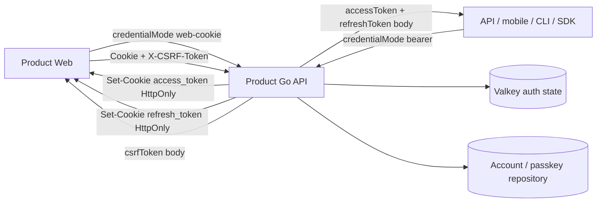
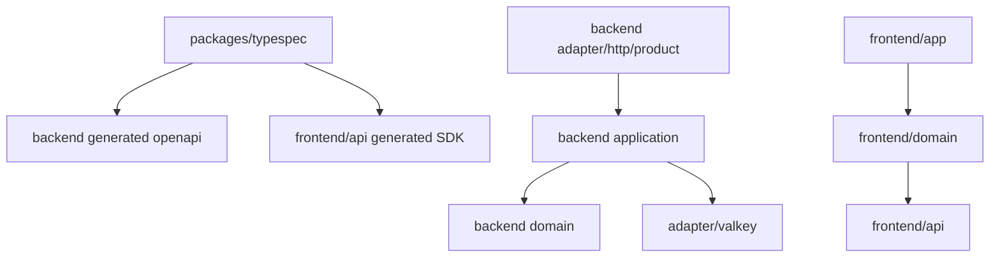
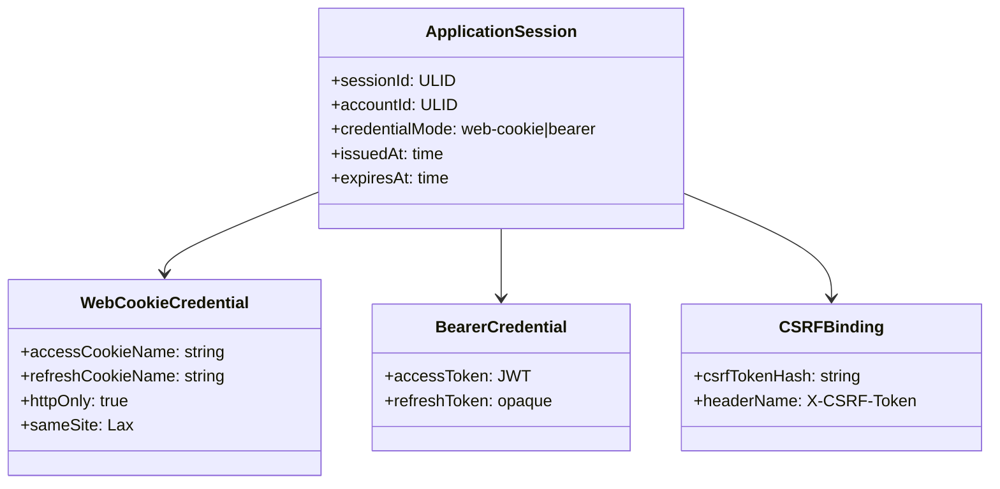
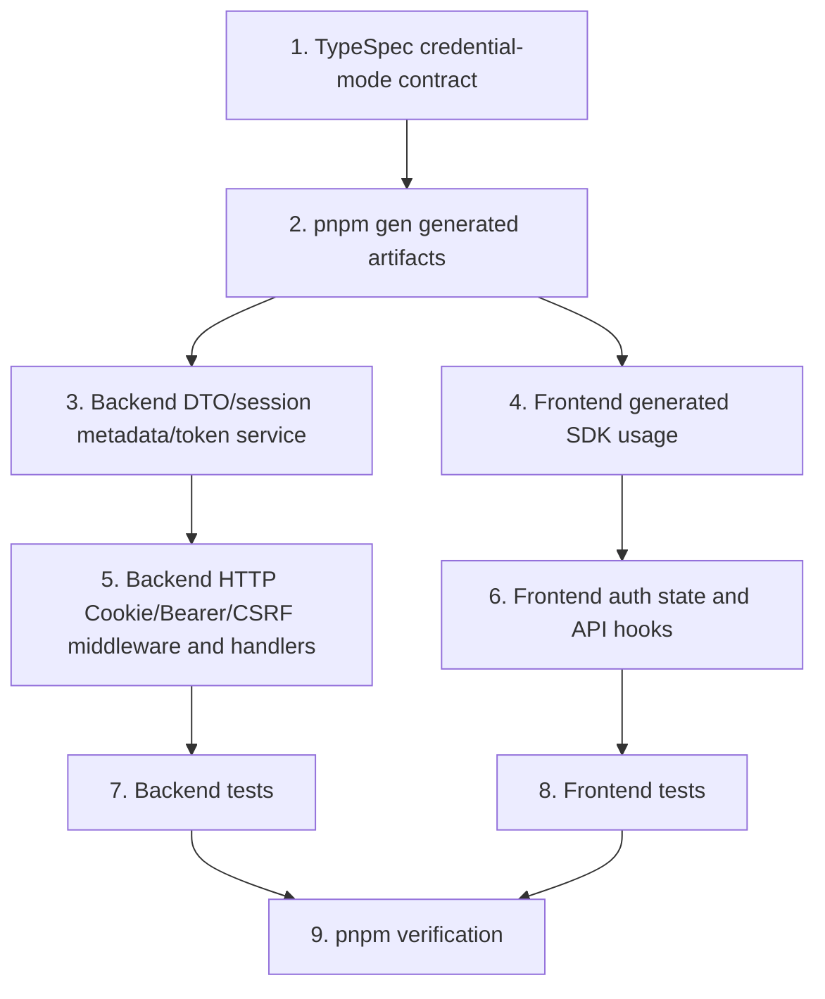

## Scope

### In Scope

- `auth-be` の Product session issuance / refresh / protected route authorization を `credentialMode="web-cookie"` と `credentialMode="bearer"` に分離する。
- Product Web 用に HttpOnly access Cookie と HttpOnly refresh Cookie を発行し、CSRF token だけを browser-readable memory state に渡す。
- API / mobile / CLI / SDK 用に Bearer accessToken と refreshToken を body で返す明示 mode を維持する。
- Product protected route で Cookie credential と `Authorization: Bearer` credential の同時提示を拒否する。
- Cookie credential を使う state-changing request に Origin validation と session-bound `X-CSRF-Token` validation を追加する。
- `auth-fe` の Web auth state を accessToken memory state から Cookie + CSRF memory state へ移行する。
- TypeSpec source を更新し、OpenAPI / frontend SDK / Go bindings を `pnpm gen` で再生成する。
- Scenario IDs `AUTH-BE-S060` から `AUTH-BE-S065` と `AUTH-FE-S045` から `AUTH-FE-S048` を中心に backend / frontend tests を追加・更新する。

### Out of Scope

- Admin auth の Cookie / CSRF 実装変更。Admin は既存の operator session / CSRF contract を維持する。
- 永続 DB schema migration。CSRF binding は Product auth session metadata / Valkey auth state に閉じる。
- Product Web の複数 account switching UI。Product Web は 1 つの active Cookie session を扱う。
- Bearer client 用 UI。Bearer mode は API contract と backend behavior のみを提供する。

## Assumptions / Dependencies

- `packages/typespec/main.tsp` が API contract の source of truth であり、generated artifact は `pnpm gen` で更新する。
- Product Web と Product API は same-origin credential request を使える。
- Product Web auth Cookie 名は `access_token` と `refresh_token` に統一する。`access_token` は protected `/api/v1/*` に送信され、`refresh_token` は auth refresh/logout に必要な path に限定する。
- CSRF token は session-bound opaque secret として発行し、hash を session metadata に保存する。
- Cookie auth の unsafe method は Origin header を必須にし、configured allowed origin と完全一致で検証する。
- 既存 Valkey session metadata に CSRF hash がない場合、その session は Cookie mutation を許可しない。互換 fallback は置かず、必要なら再ログインで新 session を発行する。
- `pnpm` script 経由の検証だけを使う。直接 `go test` / `tsc` / `vitest` / `svelte-check` は呼び出さない。

## Impacted Areas

- `packages/typespec`: credential mode request / response union、CSRF header、Cookie/Bearer session DTO を定義する。
- `packages/backend/internal/adapter/http/product`: Product auth middleware、Cookie helpers、Origin / CSRF validation、strict handlers、tests を更新する。
- `packages/backend/internal/application`: session result DTO、TokenService issue / refresh flow、CSRF token generation / validation を更新する。
- `packages/backend/internal/adapter/valkey`: session metadata persistence に CSRF hash を含める。
- `packages/frontend/api`: generated SDK が credential mode response union と CSRF fields を反映する。
- `packages/frontend/domain`: auth session state、login/recovery/passkey/account/session APIs を Cookie + CSRF request に変更する。
- `packages/frontend/app`: route tests / mocks / bootstrap flow を Cookie session 前提に更新する。
- Security / operations: Cookie attributes、CORS allowed headers、Origin comparison、no-store response、secret logging boundary を確認する。

## Directory Tree

```text
packages
├─ typespec
│  ├─ src/models/auth.tsp
│  ├─ src/routes/v1/auth.tsp
│  ├─ openapi/openapi.json
│  └─ generated/**
├─ backend
│  └─ internal
│     ├─ adapter/http/product/auth.go
│     ├─ adapter/http/product/router.go
│     ├─ adapter/http/product/router_test.go
│     ├─ adapter/valkey/session_store.go
│     ├─ application/auth_contracts.go
│     ├─ application/auth_service.go
│     ├─ application/auth_service_test.go
│     ├─ application/token_service.go
│     ├─ application/token_service_test.go
│     └─ generated/openapi/openapi.gen.go
└─ frontend
   ├─ api/src/generated/client.ts
   ├─ domain/src/auth/types.ts
   ├─ domain/src/auth/passkey/login/hook.svelte.ts
   ├─ domain/src/auth/recovery/hook.svelte.ts
   ├─ domain/src/auth/passkey/management/hook.svelte.ts
   ├─ domain/src/auth/session/state.ts
   ├─ domain/src/auth/session/hook.svelte.ts
   ├─ domain/src/auth/session/hook.test.ts
   ├─ domain/src/auth/session/session_api.ts
   ├─ domain/src/account/hook.svelte.ts
   ├─ domain/src/account/localeSync.svelte.ts
   └─ app/src/tests/mocks/handlers.ts
```

## New / Changed Files

| Type   | File                                                                  | Change                                                                                                                          |
| ------ | --------------------------------------------------------------------- | ------------------------------------------------------------------------------------------------------------------------------- |
| Update | `packages/typespec/src/models/auth.tsp`                               | `credentialMode`、Web Cookie session response、Bearer session response、CSRF token、refresh request / response DTO を定義する。 |
| Update | `packages/typespec/src/routes/v1/auth.tsp`                            | login/register/refresh/logout/protected mutation contract に mode と CSRF header を反映する。                                   |
| Update | `packages/typespec/openapi/openapi.json`                              | Product OpenAPI generated artifact を更新する。                                                                                 |
| Update | `packages/typespec/generated/**`                                      | frontend SDK input となる generated artifact を更新する。                                                                       |
| Update | `packages/backend/internal/generated/openapi/openapi.gen.go`          | Product Go bindings を `pnpm gen` で更新する。                                                                                  |
| Update | `packages/backend/internal/adapter/http/product/auth.go`              | Cookie/Bearer extraction、ambiguity rejection、Origin / CSRF middleware、context binding を追加する。                           |
| Update | `packages/backend/internal/adapter/http/product/router.go`            | session issuance / refresh / logout handlers を credential mode 別 response と Cookie helper に変更する。                       |
| Update | `packages/backend/internal/adapter/http/product/router_test.go`       | Cookie login、Bearer login、CSRF failure、Cookie/Bearer ambiguity、refresh rotation を固定する endpoint tests を追加する。      |
| Update | `packages/backend/internal/application/auth_contracts.go`             | AuthSession DTO に credential mode、CSRF token、Bearer refresh token body の表現を追加する。                                    |
| Update | `packages/backend/internal/application/auth_service.go`               | passkey finish/register/logout authorization が credential mode を application result に反映できるようにする。                  |
| Update | `packages/backend/internal/application/token_service.go`              | issue/refresh 時に session-bound CSRF token を生成・hash 保存し、Cookie/Bearer refresh 経路を分ける。                           |
| Update | `packages/backend/internal/application/*_test.go`                     | TokenService/AuthService の CSRF binding と mode 別 result を検証する。                                                         |
| Update | `packages/backend/internal/adapter/valkey/session_store.go`           | SessionMetadata JSON に CSRF hash を含める。                                                                                    |
| Update | `packages/frontend/api/src/generated/client.ts`                       | generated SDK に credential mode DTO と response union を反映する。                                                             |
| Update | `packages/frontend/domain/src/auth/types.ts`                          | accessToken を session summary から外し、CSRF token と session metadata を保持する型へ変更する。                                |
| Update | `packages/frontend/domain/src/auth/session/state.ts`                  | Authorization header 生成をやめ、Cookie request init / CSRF header 生成へ変更する。                                             |
| Update | `packages/frontend/domain/src/auth/session/hook.svelte.ts`            | bootstrap refresh、session-expired retry、logout、device/session calls を Cookie + CSRF flow に変更する。                       |
| Update | `packages/frontend/domain/src/auth/session/session_api.ts`            | session management API を same-origin credentials + CSRF header で呼び出す。                                                    |
| Update | `packages/frontend/domain/src/auth/passkey/login/hook.svelte.ts`      | passkey finish request に `credentialMode="web-cookie"` を付け、body token を読まない。                                         |
| Update | `packages/frontend/domain/src/auth/recovery/hook.svelte.ts`           | recovery register request に `credentialMode="web-cookie"` を付け、CSRF token を受け取る。                                      |
| Update | `packages/frontend/domain/src/auth/passkey/management/hook.svelte.ts` | passkey management mutations に CSRF header を付ける。                                                                          |
| Update | `packages/frontend/domain/src/account/hook.svelte.ts`                 | AccountSetting API を Cookie + CSRF request contract に変更する。                                                               |
| Update | `packages/frontend/domain/src/account/localeSync.svelte.ts`           | locale load/update を Authorization header 依存から Cookie + CSRF に変更する。                                                  |
| Update | `packages/frontend/domain/src/auth/session/hook.test.ts`              | Cookie bootstrap / CSRF / no accessToken storage / retry behavior tests に更新する。                                            |
| Update | `packages/frontend/app/src/tests/mocks/handlers.ts`                   | MSW mocks を Web Cookie mode response shape に更新する。                                                                        |

## System Diagram



## Package Diagram



## Sequence Diagram

```mermaid
sequenceDiagram
  participant W as Product Web
  participant API as Product API
  participant S as Session Store
  W->>API: POST /api/v1/auth/passkey/finish { credentialMode: "web-cookie" }
  API->>S: Save session metadata + refresh hash + csrf hash
  API-->>W: Set-Cookie access_token; Set-Cookie refresh_token; { csrfToken, session metadata }
  W->>API: PATCH /api/v1/account/settings with Cookie + X-CSRF-Token
  API->>S: Validate access cookie + csrf hash
  API-->>W: 200 no-store
  W->>API: POST /api/v1/auth/refresh { credentialMode: "web-cookie" } with refresh cookie
  API->>S: Atomic refresh rotation + new csrf hash
  API-->>W: rotated cookies + { csrfToken, session metadata, accountSetting }
```

## UI Wireframes

N/A — wireframe not yet generated. UI structure remains the existing auth and app surface; the change is auth state / request credential behavior.

## Domain Model Diagram



## ER Diagram

N/A — 永続 DB schema は変更しない。CSRF binding は Valkey-backed session metadata に保存する。

## Package-Level Design

### Package List

| Package                                          | Purpose / Responsibility                                                         | Public API                                      | Dependencies                                               |
| ------------------------------------------------ | -------------------------------------------------------------------------------- | ----------------------------------------------- | ---------------------------------------------------------- |
| `packages/typespec`                              | Product auth API contract の source of truth                                     | TypeSpec models/routes, generated OpenAPI       | TypeSpec emitters, oapi-codegen via `pnpm gen`             |
| `packages/backend/internal/adapter/http/product` | HTTP credential extraction、Cookie/CSRF/Origin boundary、OpenAPI handler mapping | `NewRouter`, strict handler methods, middleware | application auth/token/session services, generated OpenAPI |
| `packages/backend/internal/application`          | session issuance/refresh/logout、CSRF binding、account/session validation        | `AuthService`, `TokenService`, DTOs             | domain auth, session/refresh stores                        |
| `packages/backend/internal/adapter/valkey`       | session metadata / refresh token persistence                                     | `SessionStore`, `RefreshTokenStore`             | Valkey client                                              |
| `packages/frontend/api`                          | Generated Product API SDK                                                        | generated client functions/types                | TypeSpec generated output                                  |
| `packages/frontend/domain`                       | Web auth session state and API orchestration                                     | auth/session/passkey/account hooks              | frontend/api                                               |
| `packages/frontend/app`                          | App bootstrap and route-level tests/mocks                                        | SvelteKit routes/tests                          | frontend/domain                                            |

### Details

#### packages/typespec

- Purpose / Responsibility: Product auth contract を mode 明示にし、Web Cookie response と Bearer response を型で分ける。
- Public API: `AuthCredentialMode`, `WebCookieSessionResponse`, `BearerSessionResponse`, `RefreshTokenRequest`, `RefreshTokenResponse`, `X-CSRF-Token` parameters。
- Key Data Structures: `credentialMode: "web-cookie" | "bearer"`, `csrfToken`, session metadata, Bearer token pair。
- Key Flows: login/register/refresh は request mode によって response union を返す。
- Dependencies: generated OpenAPI / SDK / Go bindings。
- Error Handling: ambiguity / missing credential は `AuthFailureResponse` に正規化する。
- Testing Strategy: `pnpm check:codegen` で generated drift を検出する。
- Non-Functional: no-store headers を contract に維持する。
- Performance: contract shape change のみで追加 network hop はない。
- Security: Web Cookie mode では token body exposure を禁止する。

#### packages/backend/internal/adapter/http/product

- Purpose / Responsibility: HTTP request から credential source を exactly one として抽出し、CSRF/Origin を handler 前に検証する。
- Public API: `NewRouter`, `appAuthMiddleware`, strict server handlers。
- Key Data Structures: credential source enum、Product auth context、Cookie options、CSRF header value。
- Key Flows: request credential extraction -> ambiguity check -> session authorization -> optional CSRF validation -> handler context binding。
- Dependencies: `application.AuthService`, `application.TokenService`, generated `openapi` types。
- Error Handling: missing credential は `unauthenticated`、expired/revoked は `session-expired`、suspended は `account-suspended`、internal は `internal-error`。
- Testing Strategy: router tests for `AUTH-BE-S061` / `AUTH-BE-S062` / `AUTH-BE-S063` / `AUTH-BE-S064` / `AUTH-BE-S065`。
- Non-Functional: all auth/protected responses remain `Cache-Control: no-store`。
- Performance: Cookie/JWT verification remains constant per request; CSRF hash compare is local session metadata check。
- Security: fail-close on ambiguous credentials, invalid Origin, missing CSRF, nil dependencies。

#### packages/backend/internal/application

- Purpose / Responsibility: session credentials を mode 別に発行・refresh・revoke し、CSRF binding を session lifecycle と合わせる。
- Public API: `AuthService.FinishPasskeyAuthentication`, `AuthService.RegisterPasskey`, `AuthService.AuthorizeSession`, `TokenService.Issue`, `TokenService.RefreshWithAccountID`。
- Key Data Structures: `AuthSession`, `SessionMetadata`, `RefreshTokenRecord`, CSRF token/hash。
- Key Flows: issue session -> generate access credential -> generate refresh credential -> generate CSRF token for Web Cookie mode -> save metadata/hash -> return mode-specific result。
- Dependencies: domain token signing, session store, refresh token store, account repository。
- Error Handling: store unavailable and generation failure return `ErrInternalError`; token theft detection revokes refresh family。
- Testing Strategy: unit tests for mode-specific issue/refresh and CSRF hash persistence。
- Non-Functional: no plaintext refresh token or CSRF hash in logs/traces。
- Performance: crypto random generation and HMAC/SHA hashing are bounded per issue/refresh。
- Security: CSRF token is opaque, hash-only at rest, constant-time compare in validation path。

#### packages/frontend/domain

- Purpose / Responsibility: Product Web auth state を session metadata + CSRF token に限定し、all API calls を same-origin credential request にする。
- Public API: `useAuthSession`, passkey login/recovery/management hooks, account hooks。
- Key Data Structures: `AuthSessionSummary` without accessToken, `csrfToken`, route intent, AccountSetting snapshot。
- Key Flows: bootstrap refresh -> accept session metadata -> API call with credentials + CSRF -> on session-expired refresh once -> retry or route intent update。
- Dependencies: generated frontend API SDK。
- Error Handling: `unauthenticated` -> `/login`, `session-expired` -> refresh once then `/session-expired`, `account-suspended` -> `/account-suspended`。
- Testing Strategy: Vitest tests for `AUTH-FE-S045` / `AUTH-FE-S047` / `AUTH-FE-S048` and existing session expiry scenarios。
- Non-Functional: no secret in persistent storage, telemetry, console, URL。
- Performance: one refresh at bootstrap and at most one refresh/retry per expired operation。
- Security: never creates `Authorization` header for Product Web, never reads Cookie value from JavaScript。

## Implementation Plan



## Test Plan

### User Acceptance Test (Manual)

| UAT ID              | Related Requirement                       | Spec Summary                                                | Customer Problem Summary                         | Steps                                                                   | Expected Behavior                                                                               |
| ------------------- | ----------------------------------------- | ----------------------------------------------------------- | ------------------------------------------------ | ----------------------------------------------------------------------- | ----------------------------------------------------------------------------------------------- |
| UAT-AUTH-FE-HAP-001 | AUTH-FE-R001 低強調のパスキーログイン導線 | Web login は Cookie session と CSRF token を受け入れる      | 利用者は token 露出なしでログインしたい          | `/login` で passkey login を完了し、devtools Network/Storage を確認する | response body に accessToken/refreshToken がなく、HttpOnly Cookie と CSRF token で app に入れる |
| UAT-AUTH-FE-SEC-002 | AUTH-FE-R003 認証 UI secret leakage       | Web auth state は bearer token と Cookie value を保存しない | XSS や debug UI から credential を漏らしたくない | login 後に localStorage/sessionStorage/app state を確認する             | bearer token、refreshToken、Cookie value が保存されていない                                     |
| UAT-AUTH-FE-ERR-003 | AUTH-FE-R004 session expiry と logout     | session-expired と missing session を区別する               | 利用者が未ログインと期限切れを混同したくない     | Cookie なし初回アクセス、期限切れ Cookie、logout をそれぞれ実行する     | missing は login、expired は refresh 失敗後 session-expired、logout は public/login へ戻る      |

### E2E Test (Playwright)

| E2E ID              | Playwright Test Name                                                                    | Related Scenario | Category | Summary                                                  | Steps (Playwright)                                                         | Expected Behavior                                            |
| ------------------- | --------------------------------------------------------------------------------------- | ---------------- | -------- | -------------------------------------------------------- | -------------------------------------------------------------------------- | ------------------------------------------------------------ |
| E2E-AUTH-FE-HAP-001 | `[AUTH-FE-S045] Web login stores Cookie session without bearer token`                   | AUTH-FE-S045     | HAP      | passkey login response を Web Cookie mode として処理する | mock passkey flow -> finish returns Set-Cookie + csrfToken -> navigate app | app authenticated; no Authorization header generated         |
| E2E-AUTH-FE-HAP-002 | `[AUTH-FE-S047] Bootstrap refresh restores Cookie session`                              | AUTH-FE-S047     | HAP      | refresh cookie から app session を復元する               | set refresh cookie -> open app route -> intercept refresh 200              | app renders authenticated state with AccountSetting snapshot |
| E2E-AUTH-FE-ERR-003 | `[AUTH-FE-S006] Expired Cookie session routes to session-expired after refresh failure` | AUTH-FE-S006     | ERR      | expired session と missing session を区別する            | protected API returns session-expired -> refresh returns session-expired   | route intent becomes `/session-expired`                      |

### Integration Test (Endpoint)

| IT ID              | Test Name                                                      | Genre | Category | Summary                                         | Steps (Test)                                          | Expected Behavior                                                             |
| ------------------ | -------------------------------------------------------------- | ----- | -------- | ----------------------------------------------- | ----------------------------------------------------- | ----------------------------------------------------------------------------- |
| IT-AUTH-BE-HAP-001 | `[AUTH-BE-S062] Web Cookie login omits body tokens`            | be    | HAP      | Web Cookie mode login response shape            | finish passkey auth with `credentialMode=web-cookie`  | Set-Cookie access/refresh; body has csrfToken and no accessToken/refreshToken |
| IT-AUTH-BE-HAP-002 | `[AUTH-BE-S001] Bearer login returns token body`               | be    | HAP      | Bearer mode remains usable for external clients | finish passkey auth with `credentialMode=bearer`      | body has accessToken/refreshToken; no Product auth Set-Cookie                 |
| IT-AUTH-BE-SEC-003 | `[AUTH-BE-S063] Cookie mutation requires CSRF`                 | be    | SEC      | Cookie mutation is protected by CSRF            | send valid Cookie PATCH without `X-CSRF-Token`        | 403/401 failure before handler mutation                                       |
| IT-AUTH-BE-SEC-004 | `[AUTH-BE-S064] Cookie and Bearer ambiguity is rejected`       | be    | SEC      | exactly-one credential source                   | send valid Cookie and valid Bearer to protected route | failure response; no session selected                                         |
| IT-AUTH-BE-HAP-005 | `[AUTH-BE-S043] Web Cookie refresh rotates Cookie credentials` | be    | HAP      | refresh rotates cookie credentials and CSRF     | send `credentialMode=web-cookie` with refresh Cookie  | old refresh consumed; new cookies and csrfToken returned                      |

### Unit/Component Test (UT)

| UT ID              | Test Name                                                                | Package              | Category | Summary                                    | Steps (Test)                                              | Expected Behavior                                          |
| ------------------ | ------------------------------------------------------------------------ | -------------------- | -------- | ------------------------------------------ | --------------------------------------------------------- | ---------------------------------------------------------- |
| UT-AUTH-BE-SEC-001 | `[AUTH-BE-S061] Product credential extraction rejects Cookie and Bearer` | backend/product http | SEC      | extraction helper detects ambiguity        | arrange request headers/cookies -> call middleware/helper | returns ambiguity failure without calling next             |
| UT-AUTH-BE-HAP-002 | `[AUTH-BE-S062] TokenService issues CSRF binding for Web Cookie mode`    | backend/application  | HAP      | CSRF hash persists with session metadata   | issue web-cookie session                                  | plaintext csrf returned once; hash saved in metadata       |
| UT-AUTH-FE-SEC-003 | `[AUTH-FE-S048] Auth state excludes bearer and Cookie values`            | frontend/domain      | SEC      | session state keeps only metadata and CSRF | accept Web Cookie session response                        | state has csrfToken/session metadata; no accessToken field |
| UT-AUTH-FE-HAP-004 | `[AUTH-FE-S047] Bootstrap refresh applies AccountSetting snapshot`       | frontend/domain      | HAP      | refresh success restores app state         | mock refresh 200 with csrfToken/accountSetting            | authenticated state and locale snapshot updated            |
| UT-AUTH-FE-ERR-005 | `[AUTH-FE-S023] Expired API call refreshes once and retries`             | frontend/domain      | ERR      | session-expired retry behavior             | protected call returns session-expired, refresh succeeds  | original call retried once with updated CSRF               |

## Rollback / Migration

- 永続 DB migration は不要。
- Valkey session metadata shape が変わるため、CSRF hash を持たない Cookie session は mutation authorization で fail-close する。互換 fallback は実装しない。
- Rollback は application deployment を前の revision へ戻し、Product auth cookies を clear して再ログインを促す。
- Generated artifacts は TypeSpec source と同じ commit で戻す。
- Bearer external client は `credentialMode="bearer"` の明示 contract を使う。古い implicit token body contract は維持しない。

## Release Procedure

- `pnpm gen` を実行し、OpenAPI / SDK / Go bindings を更新する。
- `pnpm check:codegen` で generated drift がないことを確認する。
- `pnpm lint` を実行する。
- `pnpm check` を実行する。
- `pnpm test:server` を実行する。
- `pnpm test:client` を実行する。
- 必要に応じて `pnpm test:e2e` を実行し、Web login / refresh / logout の browser behavior を確認する。
- Deploy 後、Web login、bootstrap refresh、protected mutation、logout、Bearer login/refresh を smoke test する。

## Acceptance Criteria

- Web Cookie mode の login/register/refresh response body に accessToken / refreshToken 平文が含まれない。
- Bearer mode の login/register/refresh response body に accessToken / refreshToken が含まれ、Product auth Cookie が設定されない。
- Product protected route は Cookie と Bearer の同時提示を拒否する。
- Cookie state-changing request は valid Origin と session-bound CSRF token なしでは mutation へ到達しない。
- Frontend domain state から accessToken が消え、CSRF token と session metadata だけで authenticated state を表現する。
- Bootstrap refresh 成功で session が復元され、missing session は `/session-expired` ではなく login 導線へ正規化される。
- `pnpm check:codegen`、`pnpm lint`、`pnpm check`、`pnpm test:server`、`pnpm test:client` が成功する。

## Open Issues

N/A — credential mode は `web-cookie` / `bearer` で確定済み。Cookie/Bearer 同時提示は fail-close で拒否する。
