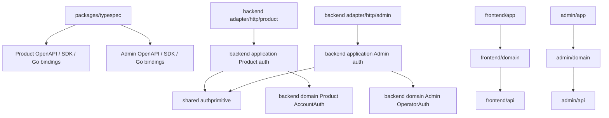
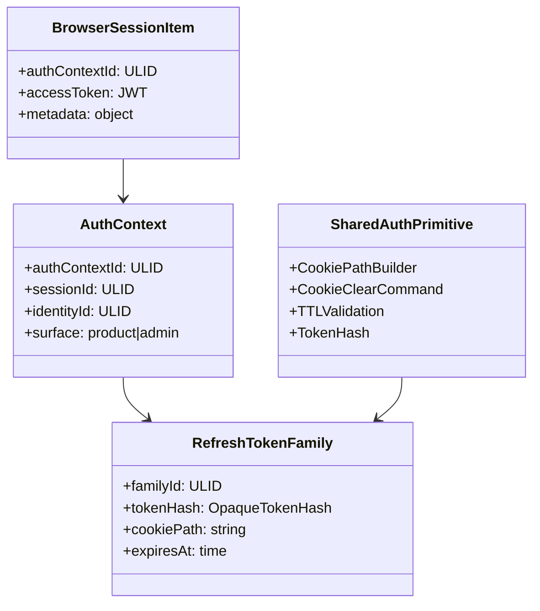
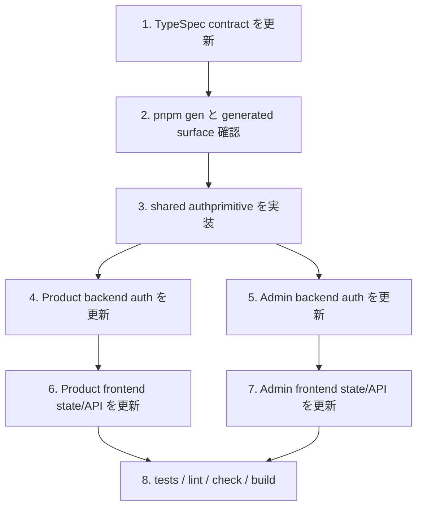

## Scope

### In Scope

- Product Web / Admin Console の browser surface は `credentialMode="cookie"` でも response body の short-lived accessToken を memory-only に保持し、protected API は `Authorization: Bearer` だけで呼び出す。
- Product external API / mobile / CLI / SDK と Admin automation client は `credentialMode="bearer"` で accessToken と refreshToken を body から受け取る。
- Product/Admin の refresh endpoint は同じ relative path `POST /api/v1/auth/contexts/{authContextId}/refresh` を使い、origin / binary / TypeSpec service / generated artifacts は分離する。
- Browser refresh credential は `HttpOnly; Secure; SameSite=Lax; Path=/api/v1/auth/contexts/{authContextId}/refresh` Cookie とし、body refreshToken との同時提示を拒否する。
- Product/Admin protected routes は Cookie credential、refresh Cookie、`X-Auth-Context-Id`、CSRF token を認可材料にせず、accessToken claims と server-side session record で account/operator/session/authContext を束縛する。
- Browser memory が消えた後の bootstrap 用に token/secret を含まない context index を扱い、tamper された index は context refresh failure として fail-close する。
- shared backend auth primitive は Cookie path construction、Cookie clear command、TTL validation、opaque token hashing、JWT signing/verifying、failure normalization に限定し、Product account status / Admin operator active / RBAC は各 domain が所有する。

### Out of Scope

- N/A。認証方式全体の再設計に必要な Product、Admin、browser surfaces、external Bearer clients、generated artifact separation はすべて対象に含める。

## Assumptions / Dependencies

- API contract の source of truth は `packages/typespec/main.tsp` であり、Product/Admin の generated artifacts は `pnpm gen` でのみ更新する。
- Product と Admin はどちらも `/api/v1/*` を使うが、origin、Go binary、TypeSpec service、OpenAPI artifact、SDK package、Go bindings は分離する。
- Browser JavaScript は `Cookie` header を個別選択できないため、refresh credential selection は Cookie Path と refresh URL の `authContextId` で行う。
- Product/Admin accessToken TTL は短命で、標準 15 分相当を維持し、protected request では延長しない。
- Product/Admin browser flow の Cookie 設定・rotation endpoint は allowed Origin、SameSite=Lax、CORS、Fetch Metadata、no-store、browser security headers を fail-close で検証する。
- Context index は Product/Admin それぞれの origin-local `localStorage` に固定し、token/secret/Cookie value を含めず、server refresh で必ず再検証する。

## Impacted Areas

- `packages/typespec`: Product/Admin credential mode、context refresh route、response DTO、BearerAuth、surface separation rules。
- `packages/backend`: shared auth primitives、Product auth application/HTTP adapter、Admin auth application/HTTP adapter、Valkey refresh/session store、config validation、route tests。
- `packages/frontend/domain` / `packages/frontend/app`: Product multi-session memory state、Authorization helper、context refresh retry、context index/bootstrap、AccountSwitcher。
- `packages/admin/api` / `packages/admin/domain` / `packages/admin/app`: Admin accessToken memory state、context refresh retry、context index/bootstrap、Admin SDK wrapper separation。
- Generated artifacts: Product OpenAPI / SDK / Go bindings と Admin OpenAPI / SDK / Go bindings を surface ごとに更新する。
- Security/operations: refresh credential ambiguity rejection、Authorization-on-refresh rejection、Cookie clear command、no-store、Origin / Fetch Metadata、secret logging boundary、codegen drift check。

## Directory Tree

```text
packages
├─ typespec
│  ├─ main.tsp
│  ├─ openapi
│  │  ├─ openapi.json
│  │  └─ admin.openapi.json
│  └─ src
│     ├─ models
│     │  ├─ auth.tsp
│     │  └─ admin.tsp
│     └─ routes
│        ├─ v1/auth.tsp
│        └─ admin-v1/auth.tsp
├─ backend
│  └─ internal
│     ├─ application
│     │  ├─ auth_service.go
│     │  ├─ token_service.go
│     │  ├─ shared/authprimitive
│     │  └─ admin/auth/service.go
│     ├─ adapter/http
│     │  ├─ product/router.go
│     │  └─ admin/router.go
│     ├─ adapter/valkey/session_store.go
│     └─ generated
│        ├─ openapi/openapi.gen.go
│        └─ adminopenapi/openapi.gen.go
├─ frontend
│  ├─ api/src/generated/client.ts
│  ├─ domain/src/auth
│  │  ├─ types.ts
│  │  └─ session
│  │     ├─ state.ts
│  │     └─ hook.svelte.ts
│  └─ app/src/lib/components/AccountSwitcher.svelte
└─ admin
   ├─ api/src
   │  ├─ client.ts
   │  └─ generated/client.ts
   ├─ domain/src/auth.ts
   └─ domain/src/hooks/useAdminSession.svelte.ts
```

## New / Changed Files

| Type       | File                                                              | Change                                                                                              |
| ---------- | ----------------------------------------------------------------- | --------------------------------------------------------------------------------------------------- |
| Update     | `packages/typespec/main.tsp`                                      | Product/Admin service 分離を維持したまま context refresh と credential mode を定義する。            |
| Update     | `packages/typespec/src/models/auth.tsp`                           | Product Cookie/Bearer session DTO、authContextId、refresh DTO を表現する。                          |
| Update     | `packages/typespec/src/models/admin.tsp`                          | Admin Cookie/Bearer operator session DTO、authContextId、refresh DTO を表現する。                   |
| Update     | `packages/typespec/src/routes/v1/auth.tsp`                        | Product login/register/logout/context refresh の path と BearerAuth を定義する。                    |
| Update     | `packages/typespec/src/routes/admin-v1/auth.tsp`                  | Admin login/setup/operator-setup/logout/context refresh の path と BearerAuth を定義する。          |
| Update     | `packages/typespec/openapi/openapi.json`                          | `pnpm gen` により Product artifact を同期する。                                                     |
| Update     | `packages/typespec/openapi/admin.openapi.json`                    | `pnpm gen` により Admin artifact を同期する。                                                       |
| Update     | `packages/backend/internal/generated/openapi/openapi.gen.go`      | `pnpm gen` により Product Go bindings を同期する。                                                  |
| Update     | `packages/backend/internal/generated/adminopenapi/openapi.gen.go` | `pnpm gen` により Admin Go bindings を同期する。                                                    |
| Add/Update | `packages/backend/internal/application/shared/authprimitive/*`    | 中立 primitive と Cookie path / clear command / TTL validation を共有する。                         |
| Update     | `packages/backend/internal/application/auth_service.go`           | Product session issuance、context refresh、logout を credential mode 別に扱う。                     |
| Update     | `packages/backend/internal/application/token_service.go`          | Product accessToken / refreshToken family / authContextId を発行・検証する。                        |
| Update     | `packages/backend/internal/application/admin/auth/service.go`     | Admin operator session issuance、context refresh、protected validation を扱う。                     |
| Update     | `packages/backend/internal/adapter/http/product/router.go`        | Product HTTP response、Set-Cookie、clear Cookie、Bearer-only protected route を実装する。           |
| Update     | `packages/backend/internal/adapter/http/admin/router.go`          | Admin HTTP response、Set-Cookie、clear Cookie、Bearer-only protected route を実装する。             |
| Update     | `packages/backend/internal/adapter/valkey/session_store.go`       | refresh token family、authContextId、context index metadata を保存する。                            |
| Update     | `packages/frontend/domain/src/auth/types.ts`                      | Product session item に authContextId と accessToken を持たせ、refreshToken を持たせない。          |
| Update     | `packages/frontend/domain/src/auth/session/state.ts`              | active accessToken Authorization helper と context refresh URL builder を分離する。                 |
| Update     | `packages/frontend/domain/src/auth/session/hook.svelte.ts`        | refresh-once retry、multi-session switching、context index bootstrap を扱う。                       |
| Update     | `packages/frontend/app/src/lib/components/AccountSwitcher.svelte` | active session item selection と表示 metadata を authContextId 対応にする。                         |
| Update     | `packages/admin/api/src/client.ts`                                | Admin Console wrapper と Admin automation Bearer wrapper を分離する。                               |
| Update     | `packages/admin/domain/src/auth.ts`                               | Admin operator session item を accessToken + authContextId + metadata の memory-only state にする。 |
| Update     | `packages/admin/domain/src/hooks/useAdminSession.svelte.ts`       | Admin current/refresh/logout と context index bootstrap を実装する。                                |

## System Diagram

```mermaid
flowchart LR
  PW[Product Web] -->|credentialMode cookie login| PAPI[Product API]
  PAPI -->|body accessToken + authContextId| PW
  PAPI -->|HttpOnly refresh Cookie Path=/api/v1/auth/contexts/{authContextId}/refresh| PW
  PW -->|Authorization Bearer active accessToken| PAPI
  EC[Product external client] -->|body refreshToken| PAPI
  AC[Admin Console] -->|credentialMode cookie login/setup| AAPI[Admin API]
  AAPI -->|body operatorAccessToken + authContextId| AC
  AAPI -->|HttpOnly operator refresh Cookie Path=/api/v1/auth/contexts/{authContextId}/refresh| AC
  AC -->|Authorization Bearer active operatorAccessToken| AAPI
  BOT[Admin automation client] -->|body operator refreshToken| AAPI
  PAPI --> PV[(Product Valkey auth state)]
  AAPI --> AV[(Admin Valkey auth state)]
```

## Package Diagram



## Sequence Diagram

```mermaid
sequenceDiagram
  participant W as Product Web
  participant P as Product API
  participant S as Product auth state
  W->>P: POST /api/v1/auth/passkey/finish { credentialMode: cookie }
  P->>S: authContextId と refresh hash を保存
  P-->>W: Set-Cookie refresh Path=/api/v1/auth/contexts/{authContextId}/refresh; body accessToken
  W->>P: Authorization Bearer accessToken で protected API
  P-->>W: 401 session-expired
  W->>P: POST /api/v1/auth/contexts/{authContextId}/refresh credentials same-origin
  P->>S: path authContextId と refresh Cookie 所属を検証して rotation
  P-->>W: Set-Cookie rotated refresh; body new accessToken
  W->>P: Authorization Bearer new accessToken で retry
```

## UI Wireframes

N/A。wireframe は未生成。

## Domain Model Diagram



## Context Index Contract

- Storage: Product は Product origin の `localStorage`、Admin は Admin origin の `localStorage` に surface-specific key を使って保存する。Product/Admin で key namespace を共有してはならない。
- Schema: `{ version, surface, activeAuthContextId, entries[] }` を持ち、各 entry は `authContextId`, `sessionId`, `identityKind`, `displayHint`, `lastSeenAt`, `expiresHintAt` だけを含む。`accessToken`, `refreshToken`, Cookie value, setup token, recovery token, email verification secret を含めてはならない。
- Trust model: context index は改竄可能な hint であり、authenticated state の証明として扱わない。bootstrap は index entry ごとに context refresh を実行し、server が返した accessToken と metadata だけを session item として採用する。
- Cleanup: logout/revoke/suspend/operator deactivation/context refresh failure は対象 entry を削除する。all-context logout または account-wide/operator-wide revocation は該当 surface の entries をすべて削除する。
- Multi-tab: storage event または BroadcastChannel で add/remove/active changes を同一 origin の tab に伝搬し、競合時は server refresh result を正とする。
- Limits: stale entry は `expiresHintAt` または refresh failure で削除し、過剰件数は least-recently-used で削除する。削除は security boundary ではなく privacy と UX のために行う。

## Cookie And Origin Boundary

- Cookie `Path` は browser の送信先を狭める selection helper であり、認可境界ではない。backend は refresh token record に `surface`, `authContextId`, `sessionId`, `familyId`, `cookiePath`, `expiresAt` を保存し、request path と record の不一致を fail-close にする。
- Product/Admin Cookie-setting endpoints（login finish、setup/register finish、operator-setup finish、Cookie mode context refresh、logout clear response）は allowed Origin と Fetch Metadata を検証する。
- `Sec-Fetch-Site: cross-site` は拒否する。Fetch Metadata が欠落する legacy client は `Origin` が allowlist と完全一致する場合だけ許可し、Origin も欠落する browser request は Cookie setting / rotation を実行しない。
- CORS は credentialed same-origin browser flow だけを許可し、allowed Origin、allowed methods、allowed headers を固定する。wildcard Origin と credentials の組み合わせは禁止する。
- Response は `Cache-Control: no-store` と browser security headers を返し、Set-Cookie には `HttpOnly; Secure; SameSite=Lax; Path=/api/v1/auth/contexts/{authContextId}/refresh` を付与する。

## Refresh Token Family State Machine

- State: refresh record は `active`, `consumed`, `revoked`, `expired` のいずれかである。
- Atomicity: context refresh は compare-and-set で active record を consumed にし、新しい active record と accessToken を同一 transaction / Lua script / equivalent atomic operation で発行する。partial failure は old/new が同時に valid にならないよう fail-close する。
- Race: 同一 authContextId への同時 refresh は 1 件だけ成功する。敗者が consumed token を提示した場合、直近成功と同一 request correlation と判断できない限り replay として扱う。実装が idempotent grace を導入する場合でも、grace window と correlation key を明示して test で固定する。
- Reuse detection: consumed / unknown / tampered refresh token は theft signal として扱い、同一 surface + identity + device fingerprint + refresh family を revoke する。account-wide/operator-wide revoke が必要な suspended/inactive では全 family を revoke する。
- Observability: token plaintext、Cookie value、hash pepper、setup/recovery secret は log、trace、error response に出さない。

## Logout And Cookie Clear Contract

- Active logout は `Authorization: Bearer <accessToken>` claims から surface、identity、session、authContextId を解決し、対応 refresh family を revoke する。
- Logout response は clear-cookie command list を持ち、各 command は cookie name、exact Path `/api/v1/auth/contexts/{authContextId}/refresh`、Max-Age=0、Secure、HttpOnly、SameSite=Lax を含む。
- Revoke others / suspend / operator deactivation は対象 context 群の clear-cookie command list と context index cleanup instruction を返す。frontend は返却された authContextId entries を index から削除する。
- Backend は client-provided context index を信用して clear 対象を決めてはならない。server-side session/family store を正とする。

## ER Diagram

N/A。永続 RDB table の追加は前提にせず、refresh token family と authContextId は既存の auth state store / Valkey namespace で管理する。実装時に RDB persistence が必要と判明した場合は backend migration pair policy に従う。

## Package-Level Design

### Package List

| Package                                                      | Purpose / Responsibility                                                                      | Public API                                        | Dependencies                                    |
| ------------------------------------------------------------ | --------------------------------------------------------------------------------------------- | ------------------------------------------------- | ----------------------------------------------- |
| `packages/typespec`                                          | Product/Admin の API 契約と generated artifact 分離を所有する。                               | `packages/typespec/main.tsp`, `pnpm gen`          | TypeSpec emitter                                |
| `packages/backend/internal/application/shared/authprimitive` | 認証 surface 非依存の token / Cookie / TTL primitive を所有する。                             | Cookie path builder、clear command、TTL validator | `internal/domain` の中立値、stdlib              |
| `packages/backend/internal/application`                      | Product account auth の発行・refresh・logout・eligibility を所有する。                        | Product auth use cases                            | Product domain、ports                           |
| `packages/backend/internal/application/admin/auth`           | Admin operator auth の発行・refresh・logout・RBAC 前段検証を所有する。                        | Admin auth use cases                              | Admin domain、ports                             |
| `packages/backend/internal/adapter/http/product`             | Product HTTP DTO / Cookie / Bearer boundary を扱う。                                          | Product strict handlers                           | Product generated bindings、Product application |
| `packages/backend/internal/adapter/http/admin`               | Admin HTTP DTO / Cookie / Bearer boundary を扱う。                                            | Admin strict handlers                             | Admin generated bindings、Admin application     |
| `packages/frontend/domain`                                   | Product browser session state と active accessToken request orchestration を所有する。        | `useAuthSession`                                  | `packages/frontend/api`                         |
| `packages/admin/domain`                                      | Admin browser session state と active operator accessToken request orchestration を所有する。 | `useAdminSession`                                 | `packages/admin/api`                            |

### Details

#### packages/typespec

- Purpose / Responsibility: Product/Admin の同名 relative refresh path を surface ごとに分離して表現し、`/api/admin/*` を許可しない。
- Public API: `main.tsp` と各 generated OpenAPI / SDK / Go bindings。
- Key Data Structures: Cookie session response、Bearer session response、context refresh request/response、AuthFailureResponse。
- Key Flows: TypeSpec 更新 -> `pnpm gen` -> generated artifact 分離確認。
- Dependencies: TypeSpec emitter と codegen scripts。
- Error Handling: Spectral と codegen drift check で surface contamination を fail-close にする。
- Testing Strategy: `API-CONTRACT-BE-S001`、`API-CONTRACT-BE-S002`、`API-CONTRACT-BE-S010` を `pnpm check:codegen` と contract tests で検証する。
- Non-Functional: generated artifacts の手編集を禁止する。
- Performance: N/A。契約生成の performance は runtime path に影響しない。
- Security: Product/Admin operation/tag/export contamination と `/api/admin/*` を検出する。

#### packages/backend/internal/application/shared/authprimitive

- Purpose / Responsibility: Product/Admin の意味を持たない primitive だけを共有する。
- Public API: `BuildRefreshCookiePath(authContextId)`, `BuildRefreshCookieClearCommand`, `ValidateTokenTTL`, `HashOpaqueToken`。
- Key Data Structures: Cookie command、TokenTTL、OpaqueTokenHash、AuthFailure classification。
- Key Flows: 各 surface application から primitive を呼び、domain decision は呼び元が実行する。
- Dependencies: stdlib と中立 domain value object。
- Error Handling: invalid TTL、invalid authContextId、invalid Cookie path は fail-close error にする。
- Testing Strategy: `AUTH-BE-S068` と `AUTH-BE-S065` を unit test で検証する。
- Non-Functional: Product/Admin 相互 import を避ける。
- Performance: path/TTL/hash は request 単位で軽量に実行する。
- Security: primitive に account/operator switch、RBAC、status 判定を入れない。

#### Product / Admin application and HTTP adapters

- Purpose / Responsibility: 各 surface の identity/domain decision、session issuance、context refresh、logout、protected validation を所有する。
- Public API: Product auth use cases、Admin auth use cases、strict handlers。
- Key Data Structures: accessToken claims、refresh token family、authContextId、session record、operator/account snapshot。
- Key Flows: login/setup -> accessToken body + path-scoped refresh Cookie、protected request -> Bearer-only validation、refresh -> path/body exactly-one rotation、logout -> access claims から revoke + Cookie clear。
- Dependencies: 各 surface の generated bindings、application services、Valkey ports、domain objects。
- Error Handling: `unauthenticated`、`session-expired`、`account-suspended`、forbidden、internal-error を no-store response へ正規化する。
- Testing Strategy: `AUTH-BE-S060`、`AUTH-BE-S080`、`ADMIN-AUTH-BE-S074`、`ADMIN-AUTH-BE-S083` などを endpoint / application tests で検証する。
- Non-Functional: response は no-store と security headers を持つ。
- Performance: refresh rotation は atomic store operation に寄せ、protected validation は accessToken claims と session record lookup に限定する。
- Security: Authorization-on-refresh rejection、Cookie/body ambiguity rejection、Origin / Fetch Metadata validation、secret logging 禁止を徹底する。

#### Frontend / Admin domain

- Purpose / Responsibility: browser memory-only session state、active item selection、context refresh retry、context index bootstrap を所有する。
- Public API: Product `useAuthSession`、Admin `useAdminSession`。
- Key Data Structures: session item、authContextId、accessToken、identity/session metadata、context index entry。
- Key Flows: login/setup response を session item に追加、protected API で Authorization header 作成、session-expired 時に context refresh、logout で active item 削除。
- Dependencies: Product は `packages/frontend/api`、Admin は `packages/admin/api` のみ。
- Error Handling: refresh failure は対象 item だけを失効し、missing session と expired session を区別する。
- Testing Strategy: `AUTH-FE-S045`、`AUTH-FE-S056`、`ADMIN-AUTH-FE-S035`、`ADMIN-AUTH-FE-S041` を unit/component/e2e で検証する。
- Non-Functional: accessToken は memory-only、refreshToken/Cookie value は state/storage/telemetry/console に出さない。
- Performance: refresh in-flight は authContextId 単位で集約する。
- Security: Product/Admin SDK package boundary、raw fetch 禁止、secret storage 禁止を守る。

## Implementation Plan



## Test Plan

### User Acceptance Test (Manual)

| UAT ID                    | Related Requirement                 | Spec Summary                                                          | Customer Problem Summary                           | Steps                                                                               | Expected Behavior                                                                 |
| ------------------------- | ----------------------------------- | --------------------------------------------------------------------- | -------------------------------------------------- | ----------------------------------------------------------------------------------- | --------------------------------------------------------------------------------- |
| UAT-AUTH-FE-HAP-001       | AUTH-FE-R001 複数アカウント session | Product Web で複数 account を保持し active accessToken で切り替える。 | 複数 account 作業時に refresh 対象が混同されない。 | account A と B で login し、AccountSwitcher で切り替えて protected API を実行する。 | 選択中 account の data だけが表示され、refresh 後も active account が維持される。 |
| UAT-ADMIN-AUTH-FE-HAP-001 | ADMIN-AUTH-FE-R001 Admin session    | Admin Console も accessToken memory + refresh Cookie で継続する。     | Admin だけ別方式だと運用と監査が不安定になる。     | Admin login 後に accessToken expiry を発生させ、refresh 後に Accounts 画面を開く。  | operator accessToken が更新され、refreshToken は画面・storage に出ない。          |

### E2E Test (Playwright)

| E2E ID                    | Playwright Test Name                                       | Related Scenario   | Category | Summary                                            | Steps (Playwright)                                                             | Expected Behavior                                                               |
| ------------------------- | ---------------------------------------------------------- | ------------------ | -------- | -------------------------------------------------- | ------------------------------------------------------------------------------ | ------------------------------------------------------------------------------- |
| E2E-AUTH-FE-HAP-001       | `[AUTH-FE-S049] 複数アカウントを切り替えられる`            | AUTH-FE-S049       | HAP      | Product Web の switching UI を検証する。           | 2 account login fixture を作り、AccountSwitcher を操作する。                   | active session item が切り替わり、Authorization header が切り替わる。           |
| E2E-AUTH-FE-SEC-002       | `[AUTH-FE-S056] context index tamper は復元されない`       | AUTH-FE-S056       | SEC      | context index bootstrap の fail-close を検証する。 | origin-local localStorage context index に tamper entry を置いて reload する。 | refresh failure となり authenticated state にならない。                         |
| E2E-ADMIN-AUTH-FE-HAP-001 | `[ADMIN-AUTH-FE-S035] Admin refresh は context URL を使う` | ADMIN-AUTH-FE-S035 | HAP      | Admin Console refresh retry を検証する。           | expired accessToken fixture で Accounts へ遷移する。                           | context refresh が 1 回だけ実行され、new accessToken で current を retry する。 |

### Integration Test (Endpoint)

| IT ID                      | Test Name                                                                                   | Genre | Category | Summary                                                                        | Steps (Test)                                                            | Expected Behavior                                                                                       |
| -------------------------- | ------------------------------------------------------------------------------------------- | ----- | -------- | ------------------------------------------------------------------------------ | ----------------------------------------------------------------------- | ------------------------------------------------------------------------------------------------------- |
| IT-AUTH-BE-HAP-001         | `[AUTH-BE-S060] Cookie login は accessToken body と path refresh Cookie を返す`             | be    | HAP      | Product Cookie mode login response を検証する。                                | passkey finish handler を `credentialMode=cookie` で呼ぶ。              | body に accessToken/authContextId があり refreshToken はなく、Set-Cookie Path が context refresh path。 |
| IT-AUTH-BE-SEC-002         | `[AUTH-BE-S087] refresh Cookie と body refreshToken の同時提示は拒否される`                 | be    | SEC      | refresh ambiguity rejection を検証する。                                       | Cookie と body refreshToken を同時に送る。                              | no-store failure で credential は rotation されない。                                                   |
| IT-AUTH-BE-SEC-003         | `[AUTH-BE-S080] refresh endpoint は Authorization header を拒否する`                        | be    | SEC      | refresh endpoint が accessToken を refresh credential にしないことを検証する。 | Authorization header 付きで context refresh を呼ぶ。                    | fail-close rejection になる。                                                                           |
| IT-ADMIN-AUTH-BE-HAP-001   | `[ADMIN-AUTH-BE-S074] Admin Cookie login は accessToken body と path refresh Cookie を返す` | be    | HAP      | Admin Cookie mode login response を検証する。                                  | Admin passkey finish を `credentialMode=cookie` で呼ぶ。                | body に operator accessToken/authContextId があり refreshToken はない。                                 |
| IT-API-CONTRACT-BE-SEC-001 | `[API-CONTRACT-BE-S010] context refresh path は両 surface で分離生成される`                 | be    | SEC      | Product/Admin generated artifact 分離を検証する。                              | `pnpm gen` 後に Product/Admin OpenAPI paths と SDK exports を検査する。 | Product artifact に Admin operation がなく、Admin artifact に Product operation がない。                |

### Unit/Component Test (UT)

| UT ID                    | Test Name                                                                       | Package                    | Category | Summary                                 | Steps (Test)                                                         | Expected Behavior                                                         |
| ------------------------ | ------------------------------------------------------------------------------- | -------------------------- | -------- | --------------------------------------- | -------------------------------------------------------------------- | ------------------------------------------------------------------------- |
| UT-AUTH-FE-HAP-001       | `[AUTH-FE-S045] 期限切れ accessToken は active authContextId で refresh される` | `packages/frontend/domain` | HAP      | Product refresh-once retry を検証する。 | expired response を返す mock の後に context refresh success を返す。 | 元 API が 1 回だけ retry される。                                         |
| UT-AUTH-FE-SEC-002       | `[AUTH-FE-S046] refreshToken は browser-readable storage に保存されない`        | `packages/frontend/domain` | SEC      | secret 非保存を検証する。               | login/refresh response を state に適用する。                         | state/storage に refreshToken と Cookie value がない。                    |
| UT-ADMIN-AUTH-FE-HAP-001 | `[ADMIN-AUTH-FE-S033] Operator login は accessToken だけを memory に保存する`   | `packages/admin/domain`    | HAP      | Admin session state を検証する。        | login success response を適用する。                                  | operator accessToken/authContextId は memory にあり refreshToken はない。 |
| UT-AUTH-BE-SEC-001       | `[AUTH-BE-S068] 中立 token primitive は domain switch を持たない`               | `packages/backend`         | SEC      | shared primitive API 境界を検証する。   | public API と import graph を検査する。                              | account/operator enum、RBAC、status 判定が存在しない。                    |

## Rollback / Migration

- API contract と generated artifacts は TypeSpec source を正として差し戻し、`pnpm gen` と `pnpm check:codegen` で Product/Admin surface の同期を確認する。
- Refresh token family が Valkey schema を変更する場合は、release 前に session invalidation runbook を用意し、危険な mixed state を残さない。
- RDB migration が必要になった場合は `packages/backend/db/migrations/*.up.sql` / `.down.sql` の pair policy に従う。

## Release Procedure

- `pnpm gen` を実行して Product/Admin generated artifacts を同期する。
- `pnpm check:codegen` を実行して generated drift と surface contamination を確認する。
- `pnpm lint`、`pnpm check`、`pnpm test:server`、`pnpm test:client`、`pnpm test:admin`、`pnpm test:e2e`、`pnpm build` を repository script 経由で実行する。
- Product Web、Admin Console、Product external Bearer client、Admin automation client の smoke test を行う。

## Acceptance Criteria

- Product/Admin browser Cookie mode は accessToken/authContextId/metadata を body に返し、refreshToken を body/state/storage/log/telemetry に出さない。
- Product/Admin protected routes は Bearer accessToken だけを認可材料にし、`X-Auth-Context-Id` と CSRF を要求しない。
- Product/Admin context refresh endpoint は Cookie/body refresh credential exactly-one、Authorization header rejection、path authContextId 所属検証を満たす。
- Product/Admin generated artifacts は surface contamination を起こさず `/api/admin/*` を含まない。

## Open Issues

- 未決定事項はない。context index は origin-local `localStorage` の非 secret hint として固定し、認証可否は context refresh の server response だけで判断する。
