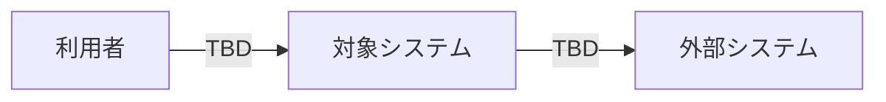
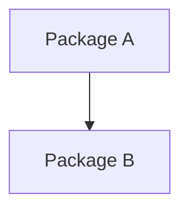
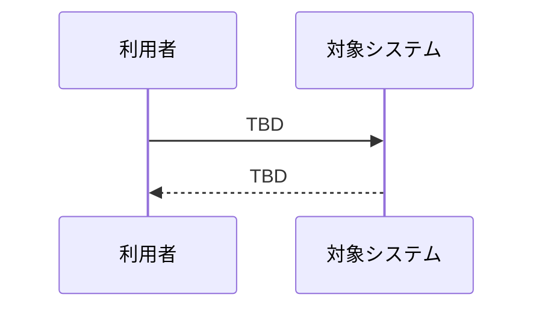
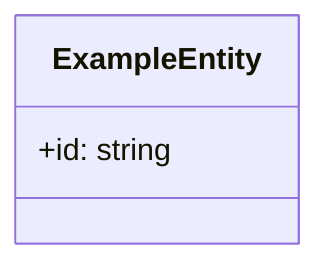
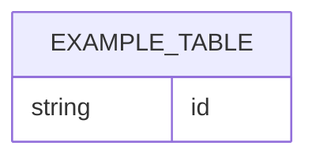
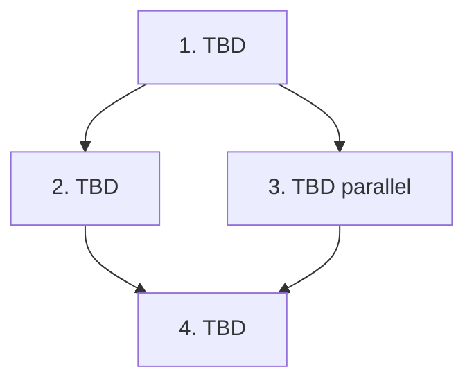

## Scope

<!-- This file explains HOW to implement approved specs. -->
<!-- English headings, section labels, and table column names are structural and should stay English. -->
<!-- All non-label prose, TODO replacements, table cell descriptions, and diagram labels MUST be written in Japanese, except code identifiers, paths, commands, API names, IDs, and protocol terms. -->
<!-- MUST NOT introduce new product requirements that are absent from spec.md. -->
<!-- MUST NOT replace tasks.md with a prose checklist. -->

### In Scope

- <!-- TODO: 対象に含める機能・要件を利用者視点で日本語記述する。必要に応じて Spec Unit / Requirement / Scenario ID を参照する。 -->

### Out of Scope

- <!-- TODO: 対象外の項目を日本語で明示する。後続対応の可能性がある場合は理由と代替案も記述する。 -->

## Assumptions / Dependencies

- <!-- TODO: 前提条件・依存関係を日本語で記述する。外部システム、既存 spec、feature flag、認可、migration、API contract などを含める。 -->

## Impacted Areas

- <!-- TODO: 影響範囲を日本語で記述する。module/component、API、DB、job、監視、security、performance などを含める。 -->

## Directory Tree

```text
directory
└─ <!-- TODO: 影響を受ける root directory / feature directory -->
   ├─ <!-- TODO: 作成または編集する file/dir -->
   └─ <!-- TODO: 作成または編集する file/dir -->
README.md
.gitignore
```

## New / Changed Files

| Type                                            | File           | Change                                                     |
| ----------------------------------------------- | -------------- | ---------------------------------------------------------- |
| <!-- TODO: 種別。例: Add/Update/Delete/Move --> | `path/to/file` | <!-- TODO: 何をなぜ変更するかを日本語で 1 行記述する。 --> |

## System Diagram



## Package Diagram



## Sequence Diagram



## UI Mockups

<!-- UI mockup images are generated per page with the `generate-image` skill (.opencode/skills/generate-image/SKILL.md). -->
<!-- When a wireframe exists, pass the matching `.wireframe.json` or `.wireframe.html` itself to `generate-image` with `--template ui-mockup --wireframe`. -->
<!-- Also pass a detailed prompt that summarizes the existing implementation design, design tokens, and shared UI components so the mockup stays visually consistent. -->
<!-- If image generation cannot produce a usable mockup, use `agent-browser` to open the wireframe HTML preview and capture a screenshot image as fallback. -->
<!-- Embed only image files in design.md. Do not embed wireframe HTML with `<iframe>`. -->
<!-- If no UI page or viewable screen is in scope, write: N/A。対象となる UI 画面はない。 -->

<!-- TODO: 各 page/screen ごとに、以下の例のような section を追加する。 -->

### <!-- TODO: 画面名 -->


- Source: <!-- TODO: `generate-image` mockup / `agent-browser` fallback screenshot のどちらかを記述する。 -->
- Input wireframe: <!-- TODO: 対応する `.wireframe.json` / `.wireframe.html` path。ない場合は N/A と理由を日本語で記述する。 -->
- Design basis: <!-- TODO: 参照した既存実装、design token、shared UI component などを日本語で記述する。 -->
- Notes: <!-- TODO: この mockup が示す layout / visual hierarchy / state を日本語で記述する。 -->

## Domain Model Diagram



## ER Diagram



## Package-Level Design

### Package List

| Package                                                             | Purpose / Responsibility                           | Public API                                   | Dependencies                   |
| ------------------------------------------------------------------- | -------------------------------------------------- | -------------------------------------------- | ------------------------------ |
| <!-- TODO: module/package name。例: frontend/app or frontend/ui --> | <!-- TODO: 目的・責務を日本語で 1 行記述する。 --> | <!-- TODO: 主要 public API / entry point --> | <!-- TODO: 主要 dependency --> |

### Details

#### <package-name>

- Purpose / Responsibility: <!-- TODO: この package が所有する責務・所有しない責務を日本語で記述する。 -->
- Public API: <!-- TODO: 外部へ公開する function / class / route / component を記述する。 -->
- Key Data Structures: <!-- TODO: 主要 type / DTO / domain object を記述する。 -->
- Key Flows: <!-- TODO: 主要 flow を input -> processing -> output の形で日本語記述する。 -->
- Dependencies: <!-- TODO: 依存する package / external interface と、その理由を日本語で記述する。 -->
- Error Handling: <!-- TODO: error taxonomy、user-facing message、logging、retry policy を日本語で記述する。 -->
- Testing Strategy: <!-- TODO: UT/IT/E2E で何を検証し、どの Scenario ID に対応するかを日本語で記述する。 -->
- Non-Functional: <!-- TODO: availability、ops、monitoring、metrics を日本語で記述する。 -->
- Performance: <!-- TODO: performance 要件、bottleneck、measurement/optimization plan を日本語で記述する。 -->
- Security: <!-- TODO: authz、validation、PII handling、audit log、threat model highlights を日本語で記述する。 -->

## Implementation Plan

<!-- dependency order が分かる design level に留め、tasks.md の checklist を重複させない。 -->



## Test Plan

<!-- The test plan maps specs to verification strategy. Do not use it as change history. -->
<!-- Keep headings and column names in English, but write all table cell descriptions in Japanese except IDs, categories, paths, commands, and code identifiers. -->

### User Acceptance Test (Manual)

| UAT ID                                   | Related Requirement                                  | Spec Summary                                       | Customer Problem Summary                                           | Steps                                                                   | Expected Behavior                                     |
| ---------------------------------------- | ---------------------------------------------------- | -------------------------------------------------- | ------------------------------------------------------------------ | ----------------------------------------------------------------------- | ----------------------------------------------------- |
| <!-- TODO: 例: UAT-USER-MGMT-HAP-001 --> | <!-- TODO: 例: USER-MGMT-R001 + requirement name --> | <!-- TODO: 仕様概要を日本語で 1-2 行記述する。 --> | <!-- TODO: Customer Context 由来の顧客課題を日本語で記述する。 --> | <!-- TODO: login / initial state からの詳細手順を日本語で記述する。 --> | <!-- TODO: 観測可能な期待挙動を日本語で記述する。 --> |

### E2E Test (Playwright)

| E2E ID                                   | Playwright Test Name                                       | Related Scenario                               | Category                                     | Summary                                      | Steps (Playwright)                                           | Expected Behavior                                     |
| ---------------------------------------- | ---------------------------------------------------------- | ---------------------------------------------- | -------------------------------------------- | -------------------------------------------- | ------------------------------------------------------------ | ----------------------------------------------------- |
| <!-- TODO: 例: E2E-USER-MGMT-HAP-001 --> | <!-- TODO: 例: [USER-MGMT-S001] ユーザー作成が成功する --> | <!-- TODO: Scenario ID。例: USER-MGMT-S001 --> | <!-- TODO: Category。例: HAP/ERR/BND/... --> | <!-- TODO: 概要を日本語で 1 行記述する。 --> | <!-- TODO: Playwright で実行する手順を日本語で記述する。 --> | <!-- TODO: 観測可能な期待挙動を日本語で記述する。 --> |

### Integration Test (Endpoint)

| IT ID                                   | Test Name                                                    | Genre                          | Category                                     | Summary                                      | Steps (Test)                                                         | Expected Behavior                                     |
| --------------------------------------- | ------------------------------------------------------------ | ------------------------------ | -------------------------------------------- | -------------------------------------------- | -------------------------------------------------------------------- | ----------------------------------------------------- |
| <!-- TODO: 例: IT-USER-MGMT-ERR-002 --> | <!-- TODO: 例: [USER-MGMT-S004] 重複 email は 400 を返す --> | <!-- TODO: endpoint/etc... --> | <!-- TODO: Category。例: HAP/ERR/BND/... --> | <!-- TODO: 概要を日本語で 1 行記述する。 --> | <!-- TODO: setup -> execute -> assert の流れを日本語で記述する。 --> | <!-- TODO: 観測可能な期待挙動を日本語で記述する。 --> |

### Unit/Component Test (UT)

| UT ID                                   | Test Name                                                            | Package                         | Category                                     | Summary                                      | Steps (Test)                                                       | Expected Behavior                                     |
| --------------------------------------- | -------------------------------------------------------------------- | ------------------------------- | -------------------------------------------- | -------------------------------------------- | ------------------------------------------------------------------ | ----------------------------------------------------- |
| <!-- TODO: 例: UT-USER-MGMT-BND-003 --> | <!-- TODO: 例: [USER-MGMT-S003] Email input は format を検証する --> | <!-- TODO: 例: frontend/app --> | <!-- TODO: Category。例: HAP/ERR/BND/... --> | <!-- TODO: 概要を日本語で 1 行記述する。 --> | <!-- TODO: Arrange -> Act -> Assert の要点を日本語で記述する。 --> | <!-- TODO: 観測可能な期待挙動を日本語で記述する。 --> |

## Rollback / Migration

- <!-- TODO: rollback / migration plan を日本語で記述する。data migration、feature flag、backward compatibility を含める。N/A の場合は理由を日本語で書く。 -->

## Release Procedure

- <!-- TODO: release steps を日本語で記述する。commands/order/verification を含む実行可能な runbook にする。 -->

## Acceptance Criteria

- <!-- TODO: acceptance criteria を日本語で記述する。UAT/E2E/IT/UT と non-functional requirements の条件を含める。 -->

## Open Issues

- <!-- TODO: 未解決の question / decision、owner、due date を日本語で記述する。 -->
