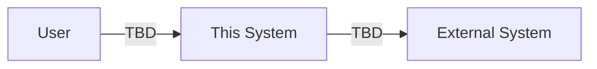
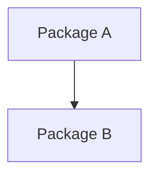
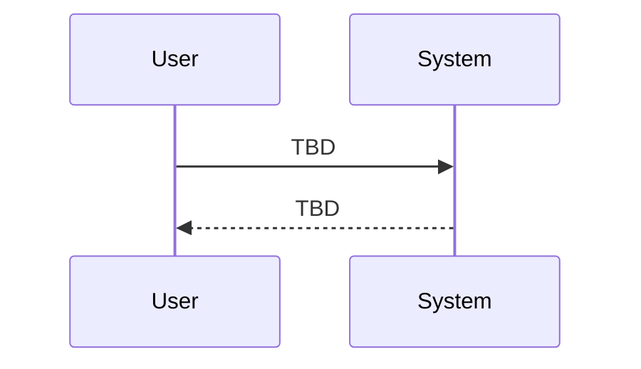
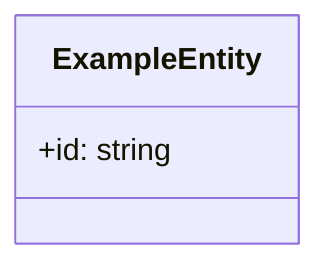
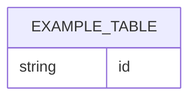
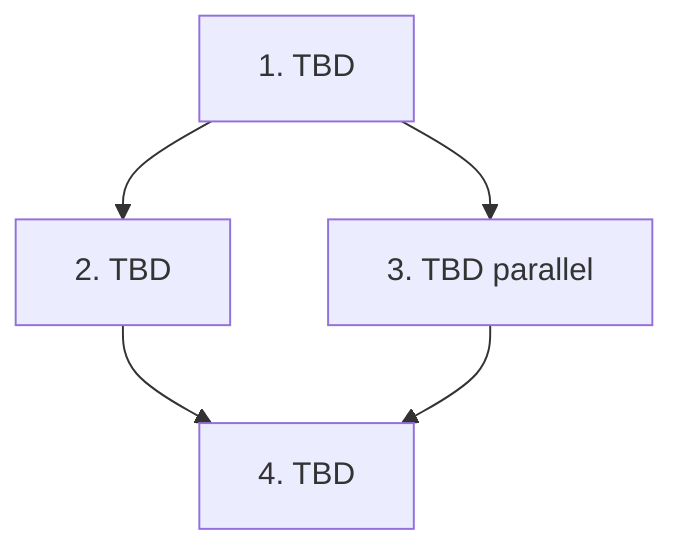

## Scope

<!-- This file explains HOW to implement approved specs. -->
<!-- MUST NOT introduce new product requirements that are absent from spec.md. -->
<!-- MUST NOT replace tasks.md with a prose checklist. -->

### In Scope

- <!-- TODO: Included features/requirements (user perspective). Reference Spec Units/Requirements/Scenario IDs when helpful. -->

### Out of Scope

- <!-- TODO: Explicitly excluded items. If likely later, include rationale and alternatives. -->

## Assumptions / Dependencies

- <!-- TODO: Preconditions/dependencies (external systems, existing specs, feature flags, authz, migrations, API contract, etc.). -->

## Impacted Areas

- <!-- TODO: Impacted areas (modules/components, APIs, DB, jobs, monitoring, security, performance). -->

## Directory Tree

```text
directory
└─ <!-- TODO: Root directory / feature directory impacted -->
   ├─ <!-- TODO: File/dir you will create or edit -->
   └─ <!-- TODO: File/dir you will create or edit -->
README.md
.gitignore
```

## New / Changed Files

| Type                                             | File           | Change                                          |
| ------------------------------------------------ | -------------- | ----------------------------------------------- |
| <!-- TODO: Type e.g., Add/Update/Delete/Move --> | `path/to/file` | <!-- TODO: What changes (one line) and why. --> |

## System Diagram



## Package Diagram



## Sequence Diagram



## UI Wireframes

<!-- Wireframes are generated separately with the `wireframe` skill (.opencode/skills/wireframe/SKILL.md). -->
<!-- The skill outputs `{name}.wireframe.html` files. Embed them below with relative-path iframes once generated. -->
<!-- If no wireframe files have been generated yet, write: N/A — wireframe not yet generated -->

<!-- TODO: For each generated wireframe HTML, add a section like the example below. -->

### <!-- TODO: Screen name -->

<iframe
  src="<!-- TODO: relative path to {name}.wireframe.html -->"
  title="<!-- TODO: Screen name -->"
  width="<!-- TODO: width in px -->"
  height="<!-- TODO: height in px -->"
></iframe>

## Domain Model Diagram



## ER Diagram



## Package-Level Design

### Package List

| Package                                                                | Purpose / Responsibility                       | Public API                                 | Dependencies                    |
| ---------------------------------------------------------------------- | ---------------------------------------------- | ------------------------------------------ | ------------------------------- |
| <!-- TODO: Module/package name (e.g., frontend/app or frontend/ui) --> | <!-- TODO: Purpose/responsibility (1 line) --> | <!-- TODO: Key public API/entry points --> | <!-- TODO: Key dependencies --> |

### Details

#### <package-name>

- Purpose / Responsibility: <!-- TODO: What this package owns/does not own. -->
- Public API: <!-- TODO: Externally exposed functions/classes/routes/components. -->
- Key Data Structures: <!-- TODO: Key types/DTOs/domain objects. -->
- Key Flows: <!-- TODO: Key flow(s) (input -> processing -> output). -->
- Dependencies: <!-- TODO: Packages/external interfaces depended on, and why. -->
- Error Handling: <!-- TODO: Error taxonomy, user-facing messages, logging, retry policy. -->
- Testing Strategy: <!-- TODO: What is covered by UT/IT/E2E and how it maps to Scenario IDs. -->
- Non-Functional: <!-- TODO: Availability/ops/monitoring/metrics. -->
- Performance: <!-- TODO: Performance requirements, bottlenecks, measurement/optimization plan. -->
- Security: <!-- TODO: Authz, validation, PII handling, audit logs, threat model highlights. -->

## Implementation Plan

<!-- Keep this at dependency-order design level, not a full task checklist. -->



## Test Plan

<!-- The test plan maps specs to verification strategy. Do not use it as change history. -->

### User Acceptance Test (Manual)

| UAT ID                                        | Related Requirement                                       | Spec Summary                            | Customer Problem Summary                                        | Steps                                                     | Expected Behavior                             |
| --------------------------------------------- | --------------------------------------------------------- | --------------------------------------- | --------------------------------------------------------------- | --------------------------------------------------------- | --------------------------------------------- |
| <!-- TODO: e.g., UAT-USER-MGMT-FE-HAP-001 --> | <!-- TODO: e.g., USER-MGMT-FE-R001 + requirement name --> | <!-- TODO: Spec summary (1-2 lines) --> | <!-- TODO: Customer problem summary (from Customer Context) --> | <!-- TODO: Steps (from login/initial state; detailed) --> | <!-- TODO: Expected behavior (observable) --> |

### E2E Test (Playwright)

| E2E ID                                        | Playwright Test Name                                          | Related Scenario                                   | Category                                      | Summary                         | Steps (Playwright)                                      | Expected Behavior                             |
| --------------------------------------------- | ------------------------------------------------------------- | -------------------------------------------------- | --------------------------------------------- | ------------------------------- | ------------------------------------------------------- | --------------------------------------------- |
| <!-- TODO: e.g., E2E-USER-MGMT-FE-HAP-001 --> | <!-- TODO: e.g., [USER-MGMT-FE-S001] Create user succeeds --> | <!-- TODO: Scenario ID e.g., USER-MGMT-FE-S001 --> | <!-- TODO: Category e.g., HAP/ERR/BND/... --> | <!-- TODO: Summary (1 line) --> | <!-- TODO: Steps performed in Playwright (sequence) --> | <!-- TODO: Expected behavior (observable) --> |

### Integration Test (Endpoint)

| IT ID                                        | Test Name                                                            | Genre                             | Category                                      | Summary                         | Steps (Test)                                         | Expected Behavior                             |
| -------------------------------------------- | -------------------------------------------------------------------- | --------------------------------- | --------------------------------------------- | ------------------------------- | ---------------------------------------------------- | --------------------------------------------- |
| <!-- TODO: e.g., IT-USER-MGMT-BE-ERR-002 --> | <!-- TODO: e.g., [USER-MGMT-BE-S004] Duplicate email returns 400 --> | <!-- TODO: fe/be/other/etc... --> | <!-- TODO: Category e.g., HAP/ERR/BND/... --> | <!-- TODO: Summary (1 line) --> | <!-- TODO: Setup -> execute -> assert (sequence) --> | <!-- TODO: Expected behavior (observable) --> |

### Unit/Component Test (UT)

| UT ID                                        | Test Name                                                             | Package                           | Category                                      | Summary                         | Steps (Test)                                       | Expected Behavior                             |
| -------------------------------------------- | --------------------------------------------------------------------- | --------------------------------- | --------------------------------------------- | ------------------------------- | -------------------------------------------------- | --------------------------------------------- |
| <!-- TODO: e.g., UT-USER-MGMT-FE-BND-003 --> | <!-- TODO: e.g., [USER-MGMT-FE-S003] Email input validates format --> | <!-- TODO: e.g., frontend/app --> | <!-- TODO: Category e.g., HAP/ERR/BND/... --> | <!-- TODO: Summary (1 line) --> | <!-- TODO: Arrange -> Act -> Assert highlights --> | <!-- TODO: Expected behavior (observable) --> |

## Rollback / Migration

- <!-- TODO: Rollback/migration plan. Data migration, feature flags, backward compatibility. If N/A, say why. -->

## Release Procedure

- <!-- TODO: Release steps. Write as an executable runbook (commands/order/verification). -->

## Acceptance Criteria

- <!-- TODO: Acceptance criteria. Conditions for UAT/E2E/IT/UT and non-functional requirements. -->

## Open Issues

- <!-- TODO: Open questions/decisions needed, owners, and due dates. -->
